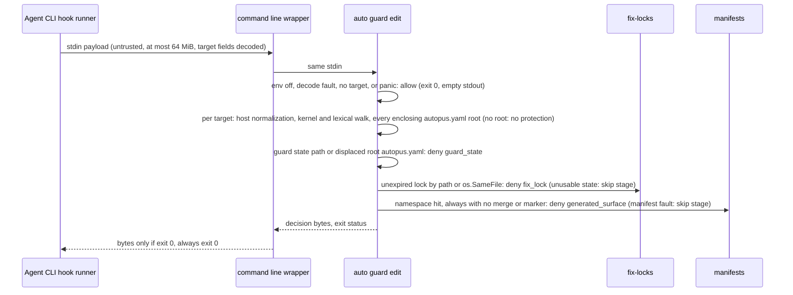
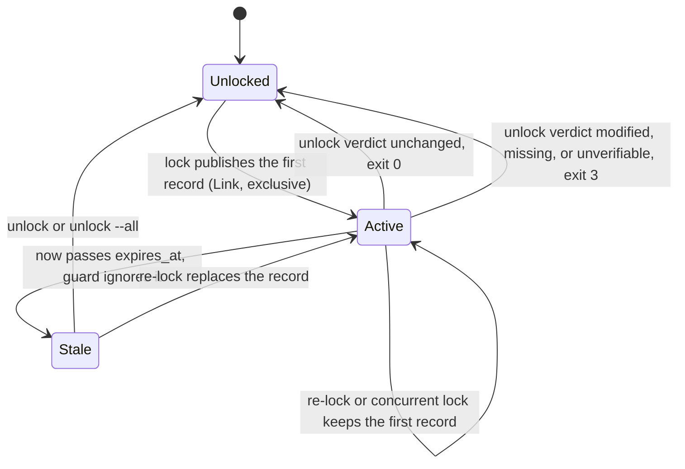

# SPEC-EDITGUARD-001 Implementation Plan

## Tasks

T0 runs first. T1 to T5 are platform-independent and can run alongside T0; T6 to T11 start after T0 records its verdicts.

- [ ] T0: Phase 1.9 probe gate on a throwaway spike, built in probe temp projects and never committed: a minimal guard binary (Claude and OpenCode encoders, one protected path from a temp manifest, a panic switch), a hand-written `.claude/settings.json` entry with the canonical command line, minimal v1 and v2 OpenCode spike plugins with the per-hook filter, payload synthesis, clean-exit deny, and host-native event capture, and a Codex logging stub. Run A1 to A3 against it and record PASS or FAIL with evidence refs. An A1 or A2 FAIL blocks completion until the spike is fixed and re-probed, or until the user explicitly re-approves the scope; only A3 and the T11 Gemini probe can turn a lane into `none`.
- [ ] T1: Unified surface table. [NEW] `pkg/workflow/surface_class.go` lists every member of the drift gate, `pkg/qualityloop`, and `internal/cli/status_hygiene.go` (`runtimeUnignoredExtraPrefixes`, `runtimeUnignoredExtraExactPaths`) with a category and consumer flags. Each consumer keeps its own matching rules and sources its members from the table; [NEW] four-consumer parity test (CD-6). REQ-EG-01.
- [ ] T2: Path resolution. [NEW] `pkg/editguard/resolve.go`: nearest `autopus.yaml` root, cleaning, symlink resolution of the deepest existing ancestor, per-root case-insensitivity detection, project-relative output. REQ-EG-05.
- [ ] T3: Manifest classification. [NEW] `pkg/editguard/classify.go`: namespace fast path, manifests read in lexical order, `always` with no `merge` or `marker` listing means generated, and any unreadable or corrupt manifest skips the manifest stage for that root. REQ-EG-03, 04, 18.
- [ ] T4: Lock store. [NEW] `pkg/editguard/lock.go`, `lock_store.go`: one exclusive store lock per mutating command through [NEW] `pkg/oslock` (the `lockSignedPairFile` and `unlockSignedPairFile` helpers moved out of `pkg/companionmanifest`), whole-batch pre-validation, complete temp file plus `os.Root.Link` publish, rollback of this invocation's records on a later failure, keep-first re-lock, verdict-first unlock with `unverifiable`, resumable removal, TTL, list. Containment through [NEW] `rulecond.OpenRuntimeStateDir` built from `openStateRoot` and `descendStateComponent`; test seams for publish faults, removal faults, and pauses. REQ-EG-06, 08, 09, 18, 21, 22.
- [ ] T5: Decision engine. [NEW] `pkg/editguard/decide.go`: stage order and precedence, call-level versus stage-level fault scope, reason texts GS-SRC, GS-CON, FL, FL-X, GST with display path and quoted argument, sanitizer, recover barrier, no goroutines on the decision path, one stdout write right before exit. REQ-EG-03, 07, 09, 10, 11, 17, 18.
- [ ] T6: Platform dialects. [NEW] `pkg/editguard/dialect.go`: Claude decode via `rulecond.ConditionSubject`, OpenCode `targets` decode, Claude and OpenCode encoders per spec.md Decision Output Contract; Codex and Gemini codecs only from probe evidence. REQ-EG-02, 11, 13, 14, 17.
- [ ] T7: CLI. [NEW] `internal/cli/guard.go` (`auto guard edit --platform`), [NEW] `internal/cli/fix_lock.go` (`auto fix lock`, `unlock`, `--all`, `--list`, `--json`, `--ttl`, exit 0, 1, 3), `AUTOPUS_EDIT_GUARD=off`. REQ-EG-02, 06, 08, 10, 20, 21.
- [ ] T8: Hook generation. `hooks.edit_guard` in `pkg/config/schema.go` and `defaults.go` (default true, assumed); guard `HookConfig` in `generateCLIHooks` with matcher `Edit|Write|MultiEdit`, timeout 5, and the canonical command line. Fixtures run that line through `sh -c` on macOS and Linux and through the Claude Code hook shell on the windows-runtime job. REQ-EG-11, 12.
- [ ] T9: Claude writer. Anchored prefix `out=$(auto guard edit ` in `managedClaudeHookCommandPrefixes`; `retractManagedHookEntries` removes managed handlers one at a time and drops an entry only when no handler is left; fixtures for 2x regeneration, a mixed user-plus-guard entry, and flag-off retraction. REQ-EG-12, 19.
- [ ] T10: OpenCode product implementation of the seam A2 verified on the T0 spike. Store A2's host-native event fixtures in [NEW] `pkg/adapter/opencode/testdata/`; per-hook tool filter with v1 `bash` and v2 `shell` hooks unchanged; synthesized payload with every target; throw only on a parsed deny from a guard that exited 0; node tests replay the fixtures with a payload-asserting stub and with the real guard binary. REQ-EG-13.
- [ ] T11: Codex and Gemini. Wire only lanes proven by A3 (Codex) and by a Gemini BeforeTool probe for `write_file` and `replace` run in this task. The Gemini probe stays out of the three-row table because its failure is safe: nothing is registered. REQ-EG-14.
- [ ] T12: Legacy writer. `WriteHookConfig` merges its own `auto worker validate` handler into `hooks.PreToolUse` in the current handler object format without replacing the `hooks` key; `RemoveHookConfig` removes only that handler. Setup and cleanup tests keep the guard, user handlers, and other Autopus handlers (CD-5). REQ-EG-19.
- [ ] T13: `/auto fix` workflow. Edit the four canonical templates, run `make generate-templates` and `auto update`; template parity tests and zero drift. REQ-EG-15.
- [ ] T14: Docs and doctor. [NEW] `docs/edit-guard.md` (matrix, limitations, rollback); `auto doctor` registration report. REQ-EG-16, 23.
- [ ] T15: Verification. Legitimate corpus 0 deny, protected corpus 100% deny, fault corpora (S7, S16) 100% as specified, S17 under `-race`, latency benchmark, coverage of changed packages at least 85%, 2x regeneration byte-identical. REQ-EG-24 and every Must.

## Implementation Strategy

Statement classes: `[RI]` requirement_invariant, `[IA]` implementation_assumption, `[VF]` verified_fact with its evidence ref in research.md `Claude Code Hook Contract Verification`.

- [RI] Only `guard_state`, `fix_lock`, and `generated_surface` deny; every other target is allowed (REQ-EG-03, 04, 07, 09).
- [RI] A call-level fault allows the call; a stage fault removes only that stage's protection; no fault yields a decision more restrictive than the guard without the faulty stage (REQ-EG-10, 18).
- [RI] Claude Code and OpenCode lanes are mandatory; only Codex and Gemini CLI are probe-conditional (REQ-EG-13, 14).
- [RI] Lock-store mutations are serializable: lock validation and publish are all-or-nothing, and an unlock interrupted by a removal I/O error is finished by a rerun (REQ-EG-06, 08).
- [VF V16] `pkg/companionmanifest` already takes a non-blocking exclusive OS file lock (`flock` on darwin and linux, `LockFileEx` on windows) that the OS releases when the holder dies, so the store lock needs no stale-lock timeout.
- [VF V1, V2] Claude Code reads stdout JSON only on exit 0, exit 2 blocks whatever the JSON says, and other non-zero exits do not block. So deny is JSON on exit 0 and allow is silence.
- [VF V3] A timed-out PreToolUse command hook does not block; the 5-second timeout keeps a hung guard fail-open.
- [VF V7] An unrecovered Go panic exits 2 and `sh -c` masking turns it into exit 0. The canonical command line also drops stdout of any non-zero exit, so deny bytes followed by a crash cannot block (REQ-EG-11).
- [VF V9] Manifests are untracked, so a fresh `.claude/worktrees/agent-*` checkout has none and resolves to allow.
- [VF V10, V14] `pkg/qualityloop` can import the table without a cycle, and `os.Root.Link` exists for exclusive publish.
- [VF V11, V12, V13] OpenCode v1 filters `bash` and v2 filters `shell`; `retractManagedHookEntries` drops a whole entry that holds any managed handler; `WriteHookConfig` replaces the `hooks` key and `RemoveHookConfig` deletes all of `PreToolUse`, with test-only callers today.
- [IA] Claude Code runs hook commands through a POSIX shell on every OS, Git Bash on Windows (T8 fixture). If not, the Windows Claude lane is a completion blocker, not a silent `none`.
- [IA] With a user hook returning `allow` in parallel, the guard deny still blocks (precedence undocumented, V4); A1 PASS requires it.
- [IA] OpenCode edit tool names and argument keys (A2), Codex `apply_patch` coverage (A3), Gemini BeforeTool deny semantics (T11).
- [IA] The namespace fast path keeps p95 at or below 150 ms (S14 measures it).
- Reuse order follows research.md `Minimality Decision Matrix`: one table replaces three member lists, existing helpers are reused, no new dependency.
- Generated surfaces change only through canonical sources and regeneration (T8 to T13); no task edits `.claude/**`, `.codex/**`, `.gemini/**`, `.opencode/**`, or `.agents/**` by hand.

## Visual Planning Brief

Hook payload to decision:



Lock lifecycle:



Generation command flow:

```text
autopus.yaml hooks.edit_guard -> pkg/content/hooks.go generateCLIHooks -> HookConfig PreToolUse Edit/Write/MultiEdit
  +-> claude adapter      -> .claude/settings.json              [enforced, A1 required]
  +-> opencode adapter    -> .opencode/plugins/*.js             [enforced, A2 required]
  +-> codex adapter       -> .codex/hooks.json                  [A3 gate]
  +-> antigravity adapter -> .gemini/settings.json BeforeTool   [T11 gate]
  |                       -> .agents/hooks.json                 [advisory-only, not registered]
  +-> omp adapter         -> SupportsHooks() false              [none]
```

## Feature Completion Scope

- The Primary SPEC closes the Outcome Lock alone: classifier (T1), guard and lock (T2 to T7), platform wiring (T8 to T11), writer compatibility (T9, T12), workflow (T13), docs and ops (T14), verification (T15).
- Approved sibling dependencies: none.
- Completion Debt CD-1, CD-3, CD-4, CD-5, CD-6 (research.md) close through T0 and T11, T14, T13, T12, T1. CD-2 is closed by the documentation check and re-confirmed live by A1. An A1 or A2 FAIL keeps CD-1 open.
- Size: 16 tasks and about 26 to 34 source files, below the 25-task and 40-file sibling thresholds.

## Risk-First Integration Probe

| assumption_id | class | risk | boundary | input | oracle | isolation | status | reason | evidence |
|---|---|---|---|---|---|---|---|---|---|
| A1 | implementation_assumption | high | Claude Code CLI to a throwaway .claude/settings.json entry with the canonical command line to the T0 spike guard on macOS | temp consumer project with that entry and a temp manifest; headless claude -p asked to edit .claude/skills/auto-fix/SKILL.md, once alone and once with a parallel user hook that returns allow; repeated with a stub that prints deny bytes and exits 2 | PASS only if both normal runs refuse the edit with the spike's deny reason and leave the file SHA-256 unchanged, and the exit-2 stub run lets the edit land; anything else is FAIL and blocks completion | temp dir and throwaway settings, no repo writes | PASS | Claude Code 2.1.289 with a loopback mock Messages API (scripted Read then Edit, no model call): both normal runs denied with the spike reason and kept SHA-256 in acceptEdits and bypassPermissions; the exit-2 stub run landed under bypassPermissions (under acceptEdits the host's own .claude/** write permission refused it independently) | evidence/t0-probes.txt A1 |
| A2 | implementation_assumption | high | real OpenCode host (v1 plugin API and v2 2.0.10) to the T0 spike plugin to the spike guard | temp project per host version with the spike plugin; the agent edits .claude/skills/auto-fix/SKILL.md, writes pkg/foo.go, applies a two-file patch whose second target is protected, and moves a file onto a protected path; the spike saves each host-native hook event (tool name and args, temp root replaced by a placeholder) as a fixture | PASS only if every protected call is refused with the spike's deny reason and file bytes stay unchanged, pkg/foo.go is written, the synthesized payload carries cwd, tool name, and every target, the shell hooks still fire, and the native-event fixtures are saved for T10; anything else is FAIL and blocks completion | temp dirs per host version, no network beyond the hosts | not-run | v1 host not run (no OpenCode 1.x runtime is installed locally); the v2 half PASSED every oracle item: OpenCode 2.0.10 with a loopback provider stub: native tools `edit`/`write` (key `path`) or, for GPT-family model keys, `patch` (`patchText` with move headers); every protected call refused with bytes unchanged, pkg/foo.go written, payload carried cwd, tool name, and every target, shell hooks still fired, fail-open on exit 2, panic, absent binary, and version skew | evidence/t0-probes.txt A2 |
| A3 | implementation_assumption | high | Codex CLI .codex/hooks.json PreToolUse to apply_patch edits | temp repo with a stub hook that logs stdin and denies; codex exec --ephemeral asked to append a line to one file and to move another | PASS if hook stdin names every patch target including the move destination and the deny leaves file bytes unchanged; FAIL makes the Codex lane none in the matrix | temp repo, --ignore-user-config, opt-in paid quota | PASS | Codex CLI 0.160.0 with a loopback mock Responses API (no paid quota): PreToolUse sees `apply_patch` with the full patch text in `tool_input.command`, move destination included; JSON deny on exit 0 and exit 2 both block with bytes unchanged; the canonical wrapper masks a guard panic; apply_patch is offered only for models with bundled metadata, and normal use needs persisted hook trust | evidence/t0-probes.txt A3 |

## Gate Applicability

Not self-declared. Before T0, run `auto spec gates` for this SPEC directory with `--change-class feature`, then copy each gate's `required`, `reusable`, `not_applicable`, or `blocked` value and its reason from `gate-applicability.json` into the phase handoff. `security`, `validation`, `data_loss`, and `deterministic_oracle` are never `not_applicable`. `accessibility` and `ux_verification` become `not_applicable` only through the classifier (this change set has no UI path).

## Scope Expansion Log

- REQ-EG-11 refines FR-10 from verified facts V1, V2, and V7: it narrows how fail-open is achieved and adds no deny case.
- Review round 1 (accepted, bounded): REQ-EG-19 makes handler-level ownership apply to existing managed hooks too, which fixes the whole-entry deletion of user handlers (V12). T12 rewrites the legacy worker hook into the current handler format with merge and remove semantics; it has no production caller (V13), so no shipped flow changes. REQ-EG-21 moves from Should to Must because the FL-X reason depends on `auto fix lock --list`.
- Review round 2 (accepted, bounded): T4 moves the existing OS file-lock helpers from `pkg/companionmanifest` into [NEW] `pkg/oslock` without behavior change (its tests must pass unchanged) instead of copying them; the T0 spike lives only in probe temp projects.
- A constraint an implementer adds beyond the requirements (a new ACL, a compatibility restriction, or a security restriction such as denying edits to merge-policy hook files) is a scope expansion. Log it here, keep it out of the requirements, and probe it on the existing runtime before fan-out.
