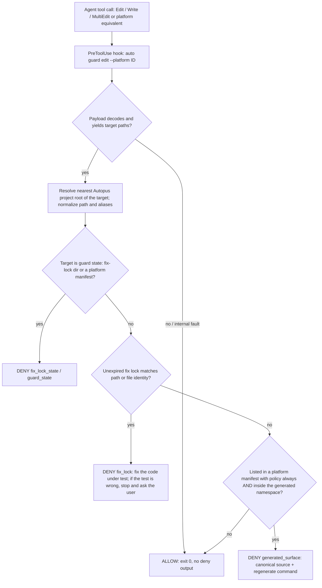
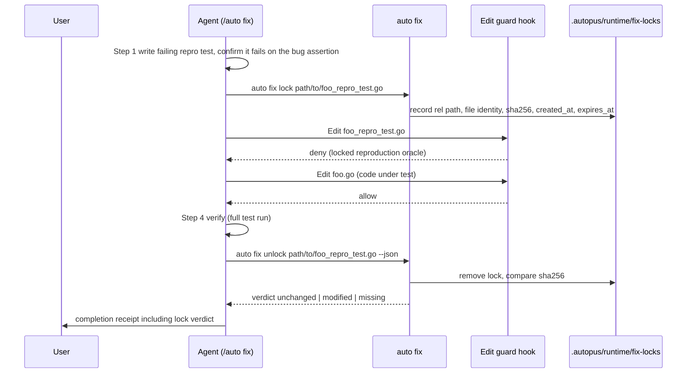

# PRD: Deterministic Blocking Edit Guard

> Product Requirements Document — Standard mode.

- **SPEC-ID**: SPEC-EDITGUARD-001 (Primary; no sibling)
- **Source**: `/auto plan` direct request + Plan Intent Ledger (no BS file); user decision D2 (2026-10-06)
- **Target module**: autopus-adk
- **Author**: Autopus planning workflow (planner)
- **Status**: Draft
- **Date**: 2026-10-06
- **Proposed change class**: `feature` with enforcement on every agent edit; it adds a new exported CLI command and a cross-platform hook contract, so `risk_tier: high` and a Risk-First Integration Probe are expected. The authoritative class is the `auto spec gates` receipt (`gate-applicability.json`), not this PRD.

**Overview.** Autopus currently only *advises* agents not to hand-edit generated harness files and not to weaken the reproduction test during `/auto fix`; no deterministic control sits between an agent's Edit/Write tool call and the write. This SPEC adds a dedicated, fail-open PreToolUse edit guard that denies (a) direct edits to Autopus-managed generated files and (b) edits to a reproduction test locked by `/auto fix`, each with an actionable reason. A new `auto fix lock|unlock` CLI owns the lock lifecycle and reports at unlock whether the locked test survived the fix unchanged.

### Request Analysis

| Dimension | Answer | Source |
|---|---|---|
| What | New hook command (working name `auto guard edit`) for Edit/Write/MultiEdit and platform equivalents + `auto fix lock|unlock` runtime lock + canonical `/auto fix` workflow update | ledger `goal`, feature request |
| Why | Skills are advisory; hooks are deterministic enforcement (AI-Native SDLC Playbook: block edits to generated files; bug-fix test written first and the agent cannot modify it) | ledger `goal`, playbook |
| Who | Agent-session users (Claude Code first), `/auto fix` users, ADK maintainers dogfooding in autopus-adk / autopus-workspace | evidence |
| When | No external deadline; first of the playbook-derived SPECs, independent of SPEC-HARNEVAL-001/002 and SPEC-SIGMABAND-001 | `assumed` |

---

## Discovery Q&A Checklist

Plan Intent Ledger rows are reused as evidence. No question was re-asked here.

- [x] **Problem** — answered (ledger `goal`, high): enforcement, not advice, for generated-surface edits and repro-test tampering.
- [x] **Target Users** — answered from evidence (Section 3).
- [x] **Success Metrics** — `assumed` (ledger `done_evidence`, medium): per-platform hook-contract tests with real stdin payload fixtures (Section 2).
- [x] **Constraints** — answered (ledger `constraints`, high): D2 deny with an actionable reason; internal errors fail OPEN; ≤300 lines per source file; 85% coverage; generated files change only through the canonical source + regenerate.
- [x] **Prior Art** — answered (exploration): drift gate, qualityloop safety list, SPEC-CONDRULE-001 dispatcher, SPEC-STICKYRULE-001 runtime state (Section 1).
- [x] **Scope Boundary** — `assumed` (ledger `scope_boundary`, medium): no Bash-command write detection in v1 (known gap); no user-configurable protected paths (Section 8).

| Ledger field | Status | PRD handoff |
|---|---|---|
| goal | answered | Outcome Lock |
| scope_boundary | assumed | Out of Scope, R4, Evolution Ideas |
| constraints | answered | NFRs, Technical Constraints, FR-10 |
| done_evidence | assumed | Goals table, Outcome Lock completion evidence, acceptance seeds |
| brownfield_impact | answered | Section 7 Brownfield Impact, Reviewer focus |

Question Audit (carried from Step 1.25): `question_transport=AskUserQuestion`, `question_count=1` (D2), `unresolved_fields=[scope_boundary, done_evidence]` (both `assumed`, neither blocks the Outcome Lock).

---

## Outcome Lock

**Final outcome.** On every platform whose native hook can block a tool call, an agent's file-editing tool call is denied deterministically when it targets (a) an Autopus-managed generated file or (b) a file locked as the reproduction oracle of an in-progress `/auto fix`. The deny reason tells the agent what to do instead. Every other edit is allowed, and so is every edit when the guard itself fails.

**Mandatory requirements.** FR-01 to FR-15 (P0, Section 5).

**Explicit non-goals.** Bash-command write detection. User-configurable protected paths. Native blocking on Antigravity (`.agents/hooks.json`) and OMP. Any change to `auto rules fire` semantics. A sandbox against a determined agent that has shell access.

**Completion evidence.**
1. Hook-contract tests for each enforcing platform, driven by real stdin payload fixtures. Each must show: generated path → deny, canonical/legitimate path → allow, locked test → deny, after unlock → allow, malformed stdin → allow.
2. Legitimate-write corpus → 0 denies. Protected corpus → 100% denies.
3. Internal-fault corpus → 100% allow.
4. `auto fix unlock` integrity-verdict fixtures: `unchanged`, `modified`, `missing`.
5. Regenerated platform surfaces are drift-clean. Existing drift-gate, qualityloop, and hook tests pass unchanged. Coverage of changed packages is ≥ 85%.
6. A published platform enforcement matrix (enforced / advisory-only / none) that names every limitation explicitly.

---

## Visual Brief

UX wireframe gate: **not applicable**. This is a CLI/hook surface with no screens, layout, or navigation. The diagrams explain the plan; they add no requirements.

**Guard decision (per target path)**



**`/auto fix` lock lifecycle**



**Generation data flow**

```text
autopus.yaml (hooks.edit_guard)                 canonical sources: content/, templates/, pkg/
        |                                                  |
        v                                                  v
pkg/content/hooks.go generateCLIHooks --> HookConfig{PreToolUse, edit matcher, "auto guard edit --platform ID"}
        | per-platform translation: event, matcher, payload dialect, deny format
        +--> claude adapter      -> .claude/settings.json               managed-entry predicate     [enforced]
        +--> opencode adapter    -> .opencode/plugins/autopus-hooks.js  per-hook tool filter,
        |                                                               stdin payload, guard fail-open [enforced]
        +--> codex adapter       -> .codex/hooks.json                   __autopus__ marker          [probe-gated]
        +--> antigravity adapter -> .gemini/settings.json (BeforeTool)  legacy Gemini CLI           [probe-gated]
        |                        -> .agents/hooks.json                  always-allow wrapper -> NOT registered [advisory-only]
        +--> omp adapter         -> SupportsHooks=false                 no native guard             [none]
```

---

## Feature Coverage Map

| Capability | Happy path | Error / recovery | Integration boundary | CLI / hook surface | Verification | Docs / ops |
|---|---|---|---|---|---|---|
| Generated-surface deny | FR-03 | FR-10: missing or corrupt manifest → allow | FR-05: nearest root (submodule, worktree) | FR-02 `auto guard edit` | protected corpus 100% deny | FR-03: reason names the source + regenerate command |
| Legitimate writes stay allowed | FR-04 | FR-20: env bypass | FR-01: unified classifier categories | — | legitimate corpus 0 deny | FR-15 |
| Repro-test lock | FR-06, FR-07 | FR-22: TTL/stale; FR-21: list | FR-05: alias matching; FR-09: containment | `auto fix lock` | lock + alias fixtures | FR-14 |
| Integrity verdict | FR-08 | `modified` / `missing` verdicts | detects Bash-channel tampering | `auto fix unlock --json` | tamper fixtures | completion receipt (FR-14) |
| Fail-open (D2) | FR-10 | panic, timeout, old binary, unknown command | per-platform semantics, FR-12(c) | exit 0 / plugin resolves | fault corpus 100% allow | — |
| Platform wiring | FR-11, FR-12, FR-13 | probe-negative lane → FR-15 limitation | adapter writers, managed-entry predicates | settings / hooks.json / plugin | real-payload contract tests; 2× regeneration byte-identical | FR-15 matrix, FR-23 doctor |
| `/auto fix` workflow | FR-14 | wrong test → stop and ask the user | canonical templates → regenerate | `/auto fix` | template parity tests, drift clean | — |
| Classifier unification | FR-01 | — | drift gate, qualityloop safety | — | behavior-preserving parity table | — |

---

## 1. Problem & Context

### Current Situation

- **Generated surfaces are protected only at commit time.** The release-hygiene drift gate blocks staged generated paths that have no source-of-truth change (`pkg/workflow/drift_gate.go:38-54`). It is registered as a PreToolUse **Bash** hook with `--warn-only` (`pkg/content/hooks.go:57-65`). An agent's Edit/Write to `.claude/**` succeeds. The change is then either lost on the next regeneration or caught late.
- **The only Edit/Write hook is advisory.** `auto rules fire` already receives `Edit|Write|MultiEdit` and reads `tool_input.file_path` (`pkg/rulecond/scope.go:16,79-95`). By contract it always exits 0 and only adds context (`pkg/rulecond/fire.go:24-82`). `auto check` never reads stdin and exits only with 1.
- **The repro-first rule in `/auto fix` is prose.** "Write a failing test first" appears in `templates/claude/commands/auto-workflows.md.tmpl:2302-2310`, `templates/codex/skills/auto-fix.md.tmpl:24-32,39-46`, and `templates/gemini/skills/auto-fix/SKILL.md.tmpl:28-36`. Nothing stops a later edit of that test, and the Pre-Completion checklist (`auto-workflows.md.tmpl:2339-2349`) cannot detect one.
- **Two divergent generated-surface lists exist.** `pkg/workflow/drift_gate.go:15-33` (release hygiene) and `pkg/qualityloop/safety.go:47-79` (candidate safety) have different members and purposes. qualityloop adds `.autopus/runtime/`, `.autopus/canary/`, `.autopus/design/imports/`, the whole `.agents/`, nested `/prefix` matching, and `/plugins/cache/`.

### Codebase Context (verified 2026-10-06 unless marked)

| Surface | Current behavior | Evidence |
|---|---|---|
| Hook source of truth | `GenerateProjectHookConfigs` → `generateCLIHooks` emits PreToolUse/Bash pre-commit, PostToolUse react, the Claude-only conditional dispatcher, and completion hooks | `pkg/content/hooks.go:22-35,51-97`; `pkg/content/hooks_conditional.go:46-63` |
| Event/matcher translation | Gemini → `BeforeTool`; Antigravity Bash → `run_command` | `pkg/content/hooks.go:123-142` |
| Antigravity PreToolUse | every command is wrapped as `cmd >&2 \|\| true; printf '{"decision":"allow"}'`, so any verdict is discarded | `pkg/content/hooks_antigravity.go:5-22` |
| Claude writer | strips Autopus-owned entries, then re-adds them; ownership is a command-prefix predicate | `pkg/adapter/claude/claude_settings.go:58-102`; `claude_settings_hooks.go:5-13,49-60`; anchored predicate precedent `claude_settings_sticky.go:24-30` |
| Codex writer | renders all hooks into `.codex/hooks.json`, stamps `__autopus__`, preserves user groups | `pkg/adapter/codex/codex_hooks.go:122-147`; `codex_hooks_schema.go:62-132` |
| Antigravity / legacy Gemini writer | `.agents/hooks.json` under an `autopus` key; `.gemini/settings.json` with BeforeTool | `pkg/adapter/antigravity/antigravity_hooks.go:17-79`; `antigravity_settings.go:61-74` |
| OpenCode plugin (v1, v2) | before-hooks run only for `bash` / `shell`; stdin is `ignore`; any non-zero exit **or timeout** throws, which blocks the tool | `pkg/adapter/opencode/opencode_plugin.go:81-133`; `opencode_plugin_v2.go:62-146` |
| OMP | `SupportsHooks()` returns false, so only Git hooks exist | `pkg/adapter/omp/omp.go:56` |
| Platform manifests | `.autopus/<platform>-manifest.json` lists each generated file with policy `always` / `merge` / `marker`. Here: claude 97/3/1, codex 68/3/0, antigravity 194/2/1, opencode 98/1/1, omp 81/0/0. 100% of files under `.claude .codex .gemini .opencode .agents .autopus/plugins .omp` (excluding worktrees) are manifested | computed from `.autopus/*-manifest.json` |
| Claude worktrees | Claude Code agent worktrees are full checkouts under `.claude/worktrees/agent-*`; 4 are live in this repo | `git worktree list` |
| Runtime-state precedent | `.autopus/runtime/sticky-rules` (gitignored), created via `os.Root` component-wise descent that refuses symlinks; exit-zero recover barrier | `pkg/rulecond/sticky.go:20,69-80`; `sticky_state_dir.go:41-91`; `.gitignore:29` |
| Brainstorm files | `.autopus/brainstorms/BS-*.md` are agent-authored by `/auto idea` (gitignored, `.gitignore:15`) yet sit on the drift-gate prefix list | `drift_gate.go:21`; `content/skills/idea.md` (plan-context) |
| Source-repo detection | `content/` + `templates/` + `cmd/generate-templates` identify the ADK source repo | `internal/cli/doctor_drift_source.go:18` |
| CLI namespace | no `auto fix`, `auto guard`, `lock`, or `unlock` command exists | grep `internal/cli` |
| Legacy worker hook template | writes PreToolUse `Bash\|Write\|Edit` in an old format and replaces the whole `hooks` key | `pkg/worker/security/hook_template.go:21-33,55-56` (plan-context; **not re-verified**) |

### Problem Statement

No deterministic enforcement point exists between an agent deciding to edit a file and the write happening. So the two most expensive misbehaviors are caught late (at commit or review) or not at all: hand-editing regenerated harness output, and weakening the reproduction test so a fix "passes". Reusing the drift-gate prefix list as-is would not fix this. Verified false positives would brick normal sessions: worktree agents, user-owned merge-policy files, `/auto idea` BS files, user-authored files under `.claude/`, and a consumer's root `config.toml`.

### Impact

- Edits to `always`-policy files are silently overwritten by the next `auto update`, or they surface as drift-gate failures several pipeline steps later.
- A fix that edits its own reproduction test can report green while the bug is still there. Today's completion checklist cannot detect this.
- There is no telemetry for these events, so frequency is unquantified (`assumed`). The playbook treats both as primary hook use cases.

### Change Motivation

The AI-Native SDLC Playbook separates advisory skills from deterministic hooks. The user chose D2 on 2026-10-06: deny with a reason plus an unlock command, and fail open on internal errors.

---

## 2. Goals & Success Metrics

| Goal | Success Metric | Target | Timeline |
|---|---|---|---|
| Enforce the generated-surface boundary | Deny rate on the protected corpus (`always`-policy files × enforcing platforms × tool variants) | 100% | SPEC completion |
| No false denies | Denies on the legitimate corpus (≥ 12 cases: BS file, worktree source edit, each merge/marker file, unmanifested file under a generated prefix, `.autopus/specs/**`, source code, new file, submodule path from workspace root, root `config.toml`) | exactly 0 | completion + every regression run |
| Lock the repro test during a fix | Deny rate for locked-file edits, including alias paths (absolute, `..`, symlink, hardlink, case variant on case-insensitive volumes); allow rate after unlock | 100% / 100% | completion |
| Detect tampering by any channel | Correct `modified` verdict on tamper fixtures and `unchanged` on untouched files | 100% correct | completion |
| Fail open (D2) | Allow rate on the internal-fault corpus (malformed / oversized / empty stdin, missing path, corrupt manifest, symlinked runtime dir, corrupt lock, expired lock, panic seam, timeout, unknown command / older binary) | 100% | completion |
| Low overhead | p95 guard wall time over 200 warm invocations on the ADK repo | ≤ 150 ms | completion |
| Actionable reasons | Deny messages containing the sanitized path, a stable class code, and the action command | 100% | completion |

### Anti-Goals

- Not a security sandbox against an agent with shell access (Bash writes and self-unlock are known gaps; see R4).
- Not a replacement for the commit-time drift gate, which stays as the backstop.
- Not a block on human editors or on CLI-driven regeneration (`auto update`, `make generate-templates`).
- Not more protected-path coverage at the cost of any false deny.

---

## 3. Target Users

| User Group | Role | Usage Frequency | Key Expectation |
|---|---|---|---|
| Agent-session users (Claude Code primary; OpenCode, Codex, Gemini CLI where enforceable) | Developer | Every edit, daily | Zero false denies; a clear redirect when touching generated output |
| `/auto fix` users | Developer | Per bug fix | The reproduction test cannot be silently weakened; a clear lock lifecycle and receipt |
| ADK maintainers (autopus-adk / autopus-workspace dogfooding) | Maintainer | Daily | Direct `.claude/**`, `.codex/**` edits are redirected to `content/` / `templates/` + regenerate |
| Platform adapter owners | Contributor | Per platform change | One guard contract with per-platform translation tests |
| Reviewers / CI | Reviewer | Per PR | Deterministic evidence: contract tests, integrity verdict |

**Primary User**: Claude Code users of Autopus-installed projects, including ADK maintainers.

---

## 4. User Stories / Job Stories

### Story 1: Redirect a generated-file edit (Job Story)

**When** an agent decides to fix behavior by editing `.claude/skills/auto-fix/SKILL.md`, **I want** the edit refused with the canonical source and the regenerate command, **so I can** land the change where it survives regeneration.

- Given an `always`-policy file in `.autopus/claude-code-manifest.json`, when a Claude Edit targets it, then the tool call is denied with class `generated_surface`, the path, and (in the ADK source repo) `content/` / `templates/claude/` + `make generate-templates` and `auto update`, or (in a consumer repo) `autopus.yaml` + `auto update`.
- Given `.claude/settings.json` (policy `merge`), when it is edited, then the edit is allowed.
- Given a user-created `.claude/commands/my-cmd.md` that no manifest lists, when it is written, then the write is allowed.
- Given `.claude/worktrees/agent-x/pkg/foo.go`, when it is edited, then the edit is allowed.

### Story 2: Keep `/auto idea` and other agent artifacts writable (User Story)

**As a** user running `/auto idea`, **I want** the BS file write to succeed, **so that** the guard never blocks sanctioned agent-authored artifacts.

- Given a Write to `.autopus/brainstorms/BS-123.md`, when the guard runs, then it allows the write (the path is classified as an agent-authored artifact, not managed-generated).
- Given a Write to `.autopus/specs/SPEC-X/spec.md`, when the guard runs, then it allows the write.
- INVEST: independent, testable by fixtures, small.

### Story 3: Lock the reproduction test (Job Story)

**When** I have written and confirmed a failing reproduction test during `/auto fix`, **I want** later edits to that test denied until the fix completes, **so I can** trust that the fix, not a weakened test, turned it green.

- Given `auto fix lock t_test.go` succeeded, when the agent edits `t_test.go` (by relative, absolute, `..`, or symlink alias path), then the edit is denied with class `fix_lock`. The reason says to fix the code under test and, if the test is wrong, to stop and ask the user (`auto fix unlock t_test.go`).
- Given the lock, when the agent edits the code under test, then the edit is allowed.
- Given `auto fix unlock t_test.go`, when the agent edits the test, then the edit is allowed.
- Given the test content changed through Bash during the lock, when `auto fix unlock --json` runs, then the verdict is `modified`. The workflow then reports the fix as not complete and asks the user.
- Given a lock older than its TTL, when the guard runs, then the lock is ignored (allow) and `auto fix lock --list` reports it as stale.

### Story 4: Never brick a session (Job Story)

**When** the guard cannot decide (bad payload, broken state, old binary, timeout), **I want** the tool call to proceed, **so I can** keep working. A guard defect is never worse than having no guard.

- Given malformed or empty stdin, then allow.
- Given a corrupt manifest or a symlinked `.autopus/runtime`, then allow, with at most a one-line stderr diagnostic.
- Given the OpenCode guard entry times out or exits with a code other than the deny code, then the tool proceeds.
- Given `AUTOPUS_EDIT_GUARD=off` in the agent CLI's environment, then every edit is allowed silently.

---

## 5. Functional Requirements

### P0 — Must Have

| ID | Requirement | Notes |
|---|---|---|
| FR-01 | WHEN any component classifies a project-relative path as generated, runtime state, or agent-authored artifact, THE SYSTEM SHALL answer from one canonical source of truth, and the drift gate (`pkg/workflow`) and candidate safety (`pkg/qualityloop`) SHALL derive their current effective sets from it without behavior change. | Unifies `drift_gate.go:15-33` and `safety.go:47-79`. A parity table test pins both current effective sets. Location is chosen in research (leaf package, no import cycle). |
| FR-02 | THE SYSTEM SHALL provide a dedicated hook command (working name `auto guard edit --platform <id>`) that reads the hook payload from stdin (bounded at 1 MiB), extracts every target path from the platform's file-editing tool input, and emits the platform-native deny or allow; it SHALL NOT reuse `auto rules fire`. | `--platform` is static generated text, never model input. Claude: `tool_input.file_path` for Edit/Write/MultiEdit (`scope.go:79-95`). Other dialects come from the probes. |
| FR-03 | WHEN a target is listed in a `.autopus/<platform>-manifest.json` with policy `always` AND lies inside the unified generated namespace, THE SYSTEM SHALL deny the call with class `generated_surface`, naming the file, the owning platform manifest, the canonical source location, and the regenerate command. | Intersecting with the namespace stops a forged or committed manifest from protecting arbitrary source. ADK source repo (`doctor_drift_source.go:18` markers) → `content/`, `templates/<platform>/`, `pkg/adapter/<platform>/` + `make generate-templates` / `auto update`. Consumer → `autopus.yaml` + `auto update`. |
| FR-04 | WHEN a target is not managed-generated per FR-03, THE SYSTEM SHALL allow it, explicitly including `.autopus/brainstorms/**`, manifest `merge`/`marker` files, unmanifested files under generated prefixes, `.claude/worktrees/**`, `.autopus/specs/**`, and new files. | Resolves the BS-file conflict: brainstorms are classified as agent-authored artifacts and stay on the drift-gate list for commit hygiene only. Covers merge files (`.claude/settings.json`, `.codex/config.toml`, `.codex/hooks.json`, `.agents/hooks.json`, `.gemini/settings.json`, `.mcp.json`, `opencode.json`) and markers (`CLAUDE.md`, `AGENTS.md`, `GEMINI.md`). |
| FR-05 | THE SYSTEM SHALL classify each target relative to the nearest Autopus project root that contains it (not the session cwd), after normalizing absolute/relative forms, `.`/`..`, duplicate and OS-specific separators, and case on case-insensitive volumes. | Covers workspace-root sessions editing submodule files, and worktrees. A root-resolution miss can only cause an allow, because manifests never list worktree paths. |
| FR-06 | WHEN `auto fix lock <path>...` runs for existing regular files inside the project root, THE SYSTEM SHALL record one lock per file under `.autopus/runtime/fix-locks/` containing the normalized relative path, file identity, SHA-256 of content, `created_at`, and `expires_at`; re-locking an already-locked file SHALL keep the original hash. | Keeping the original hash stops "modify via Bash, then re-lock" laundering. Paths outside the root, directories, and missing files are rejected with a non-zero exit. One file per lock with an atomic temp+rename write. |
| FR-07 | WHILE an unexpired lock exists for a target, matched by normalized path or by file identity, THE SYSTEM SHALL deny the edit with class `fix_lock` and a reason that says the file is the locked reproduction oracle, to fix the code under test, and, if the test itself is wrong, to stop and ask the user (`auto fix unlock <path>`). | File identity (`os.SameFile`) catches symlink, hardlink, and case aliases. A Write that recreates a deleted locked path is still denied by path. |
| FR-08 | WHEN `auto fix unlock <path>...` or `auto fix unlock --all` runs, THE SYSTEM SHALL remove the matching locks and report, per file and in machine-readable form, the integrity verdict `unchanged`, `modified`, or `missing` (current hash vs lock-time hash); subsequent edits SHALL be allowed. | Detects tampering through any channel, including the v1 Bash gap. Exit-code semantics for `modified` are an open question (Q8). |
| FR-09 | THE SYSTEM SHALL deny file-editing tool calls that target guard state (`.autopus/runtime/fix-locks/**` and `.autopus/*-manifest.json`), and SHALL create and read lock state only through the `os.Root` component-wise containment frame used by sticky-rules, treating a symlinked or non-directory component as "no locks". | Self-protection of the guard's own oracles. Containment precedent: `sticky_state_dir.go:41-91`. |
| FR-10 | WHEN the guard hits any internal fault (unreadable, oversized, empty, or malformed stdin; no target path; unresolvable root; missing or corrupt manifest; unusable or corrupt lock state; expired lock; panic; timeout), THE SYSTEM SHALL allow the call (Claude/Gemini: exit 0 with no deny output; OpenCode: the plugin resolves), writing at most a one-line stderr diagnostic. | D2. Recover barrier as in `StickyFire` (`sticky.go:69-80`). |
| FR-11 | WHERE `hooks.edit_guard` is enabled (assumed default `true`), THE SYSTEM SHALL register a Claude Code PreToolUse hook with matcher `Edit\|Write\|MultiEdit` (timeout ≤ 5 s) that the managed-entry predicate recognizes, so regeneration is idempotent and preserves user hooks; disabling the flag SHALL retract it. | Add the guard to `claude_settings_hooks.go:5-13` with an anchored word-boundary match (`claude_settings_sticky.go:24-30`). Coexists with the `auto rules fire` Edit dispatcher. |
| FR-12 | THE SYSTEM SHALL extend both generated OpenCode plugins so that (a) each before-hook carries its own tool filter, with existing Bash/shell hooks unchanged and the guard running only for file-editing tools; (b) the guard receives a synthesized JSON payload on stdin; and (c) only the guard's explicit deny signal blocks, while a timeout, spawn failure, or any other exit of the guard entry resolves as allow. | Today: filter `opencode_plugin.go:125` / `v2:133`; stdin ignored `:86` / `v2:68`; timeout and non-zero reject (block) `:98-111` / `v2:95-103`. |
| FR-13 | WHERE a Risk-First probe verifies that the platform's PreToolUse/BeforeTool hook fires for its file-editing tools and honors a deny, THE SYSTEM SHALL register the guard for Codex (`.codex/hooks.json`) and legacy Gemini CLI (`.gemini/settings.json`) and parse that platform's payload, checking every target of a multi-file patch including move destinations; WHERE verification fails, THE SYSTEM SHALL NOT register a no-op guard. | Codex edits arrive as `apply_patch`; whether hooks see them is unverified (Q1). Gemini matcher translation extends `translateHookMatcher` (`hooks.go:137-142`). |
| FR-14 | THE SYSTEM SHALL update the canonical `/auto fix` sources so that the workflow (a) runs `auto fix lock <test-path>` once the reproduction test compiles and fails on the bug's assertion; (b) forbids agent-initiated unlock before verification; (c) runs `auto fix unlock <test-path>` at completion; (d) requires verdict `unchanged` in Pre-Completion Verification, reporting `modified` as not complete and asking the user; and (e) records `lock: not applicable` when no test is possible. | Sources: `templates/claude/commands/auto-workflows.md.tmpl` (§fix 2271-2369), `templates/codex/skills/auto-fix.md.tmpl`, `templates/codex/prompts/auto-fix.md.tmpl` (OpenCode reuses both: `opencode_specs.go:48-51`), `templates/gemini/skills/auto-fix/SKILL.md.tmpl`. Recommend a dedicated repro test file. Regenerate; never edit generated output. |
| FR-15 | THE SYSTEM SHALL publish a platform enforcement matrix (enforced / advisory-only / none) in the canonical user-facing docs: Antigravity `.agents/hooks.json` advisory-only (the always-allow wrapper, `hooks_antigravity.go:5-22`), OMP none (`omp.go:56`), plus every probe-negative lane. | No silent omission. Users must not believe they are protected where they are not. |

### P1 — Should Have

| ID | Requirement | Notes |
|---|---|---|
| FR-20 | WHERE the hook process environment contains `AUTOPUS_EDIT_GUARD=off`, THE SYSTEM SHALL allow every edit silently. | Immediate escape hatch without regeneration. Hooks inherit the agent CLI's environment, so `export` inside an agent's Bash call does not reach them (`assumed`, verified in RFP-1). |
| FR-21 | WHEN `auto fix lock --list [--json]` runs, THE SYSTEM SHALL list active and stale locks with age, expiry, and current integrity. | Recovery and debugging. |
| FR-22 | THE SYSTEM SHALL apply a default lock TTL (assumed 24 h), overridable with `--ttl`; WHEN a lock has expired, THE SYSTEM SHALL ignore it in the guard and report it as stale. | Abandoned or crashed fixes do not brick later sessions. |
| FR-23 | WHEN `auto doctor` runs, THE SYSTEM SHALL report guard registration state and the matrix entry for each installed platform. | Ops visibility for FR-15. |

### P2 — Could Have

| ID | Requirement | Notes |
|---|---|---|
| FR-30 | WHERE the project is the ADK source repo, THE SYSTEM SHALL deny direct edits to generator-owned templates (`content.IsGeneratedTemplatePath`, `pkg/content/generate_ownership.go:12-36`) with a reason pointing to `content/` + `make generate-templates`. | Same failure class, existing classifier. |
| FR-31 | WHERE the Antigravity PreToolUse deny contract is verified and the guard can always print valid allow JSON on an internal fault, THE SYSTEM SHALL register the guard in `.agents/hooks.json` emitting its own decision instead of the always-allow wrapper. | Otherwise FR-15 keeps the advisory-only limitation. |
| FR-32 | WHEN Claude Code `NotebookEdit` targets a protected path (`notebook_path`), THE SYSTEM SHALL apply the same decision. | Low frequency for generated surfaces. |

---

## 6. Non-Functional Requirements

| Category | Requirement | Target |
|---|---|---|
| Performance | Guard wall time per invocation; manifests parsed only when the path is inside the generated namespace, lock state read only when locks exist | p95 ≤ 150 ms over 200 warm runs; hook timeout ≤ 5 s |
| Reliability | Internal faults never block; no panic escapes the recover barrier | 100% allow on the fault corpus |
| Precision | Deny only managed-generated, locked, or guard-state targets | 0 legitimate-corpus denies; 100% protected-corpus denies |
| Security | Stdin is bounded and never executed or interpolated; manifest entries outside the generated namespace are ignored; lock state is contained (no symlink following); the echoed path is sanitized (control chars stripped, length capped) and the reason is ≤ 1 KiB | Fixtures: oversized payload, forged manifest entry (`pkg/main.go`), symlinked `.autopus/runtime`, control characters in path |
| Compatibility | User hook entries preserved in every writer; regeneration idempotent; flag-off retracts the guard; existing hooks (pre-commit arch, react, conditional dispatcher, sticky, completion) still fire | 2× `auto update` byte-identical; user-hook fixtures per writer |
| Version skew | Generated config naming `auto guard edit` + an older `auto` binary (unknown command) never blocks | Fixture per enforcing platform |
| Data integrity | Lock writes are atomic, one file per lock; re-lock keeps the original hash | Concurrent lock/unlock fixtures leave no partial records |
| Portability | Path handling on macOS, Linux, Windows (separators, case-insensitivity) | Existing CI `macos-runtime` and `windows-runtime` jobs pass |
| Maintainability | Source size and coverage | ≤ 300 lines per source file; ≥ 85% coverage of changed packages |

---

## 7. Technical Constraints

### Technology Stack Constraints

- Brownfield Go module `github.com/insajin/autopus-adk` (`go 1.26`). Keep the current `go.mod` major versions. Stdlib only (`crypto/sha256`, `os.Root`, `encoding/json`, `path/filepath`). No new dependency.
- The hook shape lives in `pkg/content/hooks.go` (`generateCLIHooks`). Config gating follows the existing `hooks.*` flag pattern (`hooks.pre_commit_arch`, `pkg/config/defaults.go:84`, plan-context).
- Generated surfaces (`.claude/**`, `.codex/**`, `.gemini/**`, `.opencode/**`, `.agents/**`, `.autopus/plugins/**`) change only through canonical source + regeneration.
- `auto rules fire` semantics (always exit 0, advisory) stay unchanged.

### Technology Stack Decision

| Mode | Selected stack | Resolved versions | Source refs | Checked at | Rejected alternatives |
|---|---|---|---|---|---|
| brownfield | Go CLI subcommand in the existing `auto` binary; generated JS plugin with no npm deps | `go 1.26` (go.mod); OpenCode `@opencode/plugin` 2.0.10 hook signatures (`opencode_plugin_v2.go:36`) | `go.mod`, `pkg/content/hooks.go`, `pkg/rulecond`, adapter writers | 2026-10-06 | Extend `auto rules fire`: fail-open, always-allow by contract. Reuse `auto check`: no stdin, exit 1 only. Shell-script guard: JSON parsing and Windows portability. Guard logic inside the OpenCode JS: forks the decision per platform. |

### External Dependencies

| Dependency | Version / SLA | Risk if Unavailable |
|---|---|---|
| Claude Code PreToolUse contract (stdin JSON; `hookSpecificOutput.permissionDecision: "deny"` + reason, or exit 2 + stderr; timeout non-blocking) | current CLI; **assumed, to verify (RFP-1)** | Contract drift degrades to allow (fail-open); contract fixtures detect it |
| Codex hooks for `apply_patch` | unverified (RFP-3) | Lane becomes an advisory limitation (FR-13/15) |
| Gemini CLI BeforeTool for `write_file` / `replace` | unverified (RFP-4) | Lane becomes an advisory limitation |
| OpenCode plugin API v1 / v2 edit tool names and arg keys | unverified (RFP-2) | Lane becomes an advisory limitation |
| Antigravity hooks | always-allow wrapper | Advisory-only (FR-15), FR-31 optional |

### Compatibility Requirements

- Projects with `hooks.edit_guard: false` get no guard entry, and previously installed entries are retracted.
- Codex user groups (no `__autopus__`) and Claude user entries stay byte-semantically intact.
- Drift gate and qualityloop verdicts are identical before and after FR-01.

### Brownfield Impact (reviewer focus)

`pkg/content/hooks.go` (+ translation helpers), `pkg/config` (schema/defaults for `hooks.edit_guard`), `pkg/adapter/claude/claude_settings_hooks.go`, `pkg/adapter/codex/codex_hooks*.go`, `pkg/adapter/antigravity/antigravity_{hooks,settings}.go`, `pkg/adapter/opencode/opencode_plugin{,_v2}.go`, `pkg/workflow/drift_gate.go`, `pkg/qualityloop/safety.go`, `internal/cli` ([NEW] `guard` and `fix` command groups), the auto-fix templates listed in FR-14, generated-surface parity/drift tests (`templates/*_test.go`, `pkg/adapter/*parity*_test.go`), and the legacy `pkg/worker/security/hook_template.go` collision check.

### Infrastructure Constraints

- No new service. Hermetic tests run in the existing CI jobs. Live-CLI probes are opt-in evidence, not unit tests.

---

## 8. Out of Scope

- Detecting writes made by Bash commands (`sed -i`, redirects, `tee`, `cp`/`mv`, `git checkout --`). This is a known v1 gap, partially covered by the FR-08 integrity verdict for locks and by the commit-time drift gate for generated surfaces.
- User-configurable protected paths beyond managed-generated files, fix locks, and guard state.
- Native blocking on Antigravity `.agents/hooks.json` (advisory-only unless FR-31) and on OMP (no native hooks).
- Gating human editors or CLI regeneration.
- Any change to `auto rules fire` or `auto check` semantics.
- Exact per-file canonical-source mapping (manifests carry no `source` field).
- Locks that span checkouts or worktrees (each checkout has its own `.autopus/runtime/`).

### Deferred to Future Iterations

- Bash write-target detection for protected paths.
- Technically preventing agent-initiated unlock (human/TTY confirmation) once a non-agent completion path exists.

---

## 9. Risks & Open Questions

### Risks

| Risk | Severity | Probability | Mitigation Strategy |
|---|---|---|---|
| R1 False denies brick sessions (worktrees, merge files, BS files, user files, root `config.toml`) | High | Medium | Manifest-`always` ∩ namespace (FR-03/04), nearest-root (FR-05), legitimate-corpus gate, fail-open, env bypass (FR-20), config opt-out |
| R2 Platform deny contracts unverified or drifting (Claude JSON, Codex `apply_patch`, Gemini BeforeTool, OpenCode v2 tool names) | High | High | Probes before broad implementation; fixtures captured from real payloads; explicit limitation when a probe is negative |
| R3 OpenCode wrapper is fail-closed on timeout, crash, or unknown exit (verified), which would violate D2 | High | High if unaddressed | FR-12(c) guard-specific semantics; plugin executed under node in tests |
| R4 Agent bypass via self-unlock (`Bash(auto *)` is auto-approved, `hooks.go:176`) or Bash writes | Medium | Medium | Reason and workflow forbid agent unlock before completion; FR-08 verdict in the receipt; documented as not a sandbox |
| R5 Managed-entry ownership drift → duplicate or orphaned guard entries, or deleted user hooks | Medium | Medium | Anchored predicate; 2× regeneration + user-hook preservation fixtures for each writer |
| R6 FR-01 unification regresses the drift gate or qualityloop | Medium | Medium | Behavior-preserving parity table; existing tests untouched |
| R7 Legacy worker security template replaces the whole `hooks` key (plan-context evidence, not re-verified) | Medium | Low–Medium | Completion Debt CD-5 |
| R8 Stale locks block later sessions | Medium | Medium | TTL, expired = allow, `--list`, `unlock --all` |
| R9 Agent edits a merge-policy hook config to remove the guard | Medium | Low | Claude Code is believed to snapshot hooks at session start (verify in RFP-1); next `auto update` restores the entry; other platforms recorded |
| R10 Users assume protection on Antigravity or OMP | Medium | High | FR-15 matrix; no no-op registration |
| R11 Per-edit latency | Low | Medium | Namespace fast path; p95 budget with a benchmark |

### Open Questions

| # | Question | Owner | Due Date | Status |
|---|---|---|---|---|
| Q1 | Does Codex PreToolUse fire for `apply_patch` (tool name, payload shape, deny honored)? If only shell-level, is a narrow structured parse of an `apply_patch` invocation acceptable? | Codex adapter owner | RFP-3, before Codex wiring | Open; blocks the Codex lane only |
| Q2 | OpenCode v1/v2 file-edit tool names and arg keys? | OpenCode adapter owner | RFP-2 | Open |
| Q3 | Gemini CLI BeforeTool tool names and deny semantics (exit 2 vs JSON decision)? | Antigravity adapter owner | RFP-4 | Open |
| Q4 | Claude: JSON `permissionDecision` deny vs exit 2; timeout behavior; hook snapshot at session start | Planner / research | RFP-1 (CD-2) | Assumed: JSON deny on exit 0, fallback exit 2 |
| Q5 | Default lock TTL | Maintainer | SPEC review | Assumed 24 h |
| Q6 | `hooks.edit_guard` default | Maintainer | SPEC review | Assumed enabled; if wrong, opt-in lowers coverage but not correctness |
| Q7 | Command names | Maintainer | SPEC review | Assumed `auto guard edit` + `auto fix lock|unlock` (no collision in `internal/cli`) |
| Q8 | Should a `modified` verdict make `auto fix unlock` exit non-zero? | SPEC writer | spec.md | Deferred; a machine-readable verdict is required either way |
| Q9 | `NotebookEdit` coverage | SPEC writer | spec.md | Deferred (FR-32) |

### Risk-First Probe Seeds (handoff to plan.md, all `not-run`)

| assumption_id | class | boundary | oracle |
|---|---|---|---|
| RFP-1 | implementation_assumption | Claude Code live PreToolUse with the generated `settings.json` in a temp project | Edit of an `always` file is refused with the reason visible; file bytes unchanged; malformed-hook path proceeds |
| RFP-2 | implementation_assumption | Generated OpenCode v1 and v2 plugin executed under node with a fake ctx | Guard deny → throws; guard timeout or crash → resolves; Bash hooks do not run for edit tools |
| RFP-3 | implementation_assumption | Codex hooks with an `apply_patch` edit | Hook receives the patch payload and the deny blocks the patch, else lane = limitation |
| RFP-4 | implementation_assumption | Gemini CLI BeforeTool with `write_file` / `replace` | Exit-2 / JSON deny blocks the write, else lane = limitation |

---

## 10. Pre-mortem

| # | Failure Scenario | Probability | Impact | Preventive Action |
|---|---|---|---|---|
| 1 | The guard denies legitimate writes in a layout we never fixtured (consumer repo, nested module, Windows path), so users disable it | Medium | High | Legitimate corpus covering nested/worktree/Windows cases; env bypass; precise manifest-based classification |
| 2 | A platform silently changes its hook contract and deny becomes allow (or allow becomes block) | Medium | High | Real-payload contract fixtures; re-run probes on CLI version bumps (candidate input for the SPEC-HARNEVAL continuous evals) |
| 3 | Agents learn to run `auto fix unlock` whenever denied, so the lock becomes theater | Medium | Medium | Reason and workflow wording; integrity verdict in the completion receipt; reviewer focus; Evolution: human-confirmed unlock |
| 4 | The OpenCode plugin rewrite breaks existing Bash hooks (filter regression) | Low | High | Per-hook filter tests for the existing pre-commit and react hooks |
| 5 | FR-01 refactor silently changes the release-hygiene verdict | Low | High | Parity table test of both effective sets |

**Connection to Risks (Section 9)**: 1→R1, 2→R2, 3→R4, 4→R3/R5, 5→R6. No new risk was revealed.

---

## 11. Practitioner Q&A

**Q1: Why not deny everything under `GeneratedSurfacePrefixes`?**
A: That list is a commit-hygiene list, and applying it to edits produces verified false positives. `.claude/worktrees/agent-*` holds full checkouts used by worktree agents (4 live here). `merge`-policy files such as `.claude/settings.json` are user-owned. `.autopus/brainstorms/` is written by `/auto idea`. Root `config.toml` can be a consumer's own app config. Users may author files under `.claude/` themselves. The guard therefore keeps the prefix list as the namespace and uses the manifest `always` policy as the "this file is regenerated" oracle.

**Q2: How is the BS-file requirement satisfied explicitly?**
A: FR-01 classifies `.autopus/brainstorms/**` as agent-authored artifacts. FR-04 allows them, with a named fixture. The drift gate keeps listing them for commit hygiene, unchanged.

**Q3: What does a lock contain and where does it live?**
A: One file per lock under the gitignored `.autopus/runtime/fix-locks/`. Each holds the normalized relative path, file identity, SHA-256, `created_at`, and `expires_at`. Writes are atomic and go through the sticky-rules `os.Root` containment frame.

**Q4: How does "fix completion" release the lock?**
A: The canonical workflow's completion step runs `auto fix unlock <path> --json`, and the Pre-Completion checklist requires `unchanged`. A TTL covers abandoned fixes.

**Q5: What if the test itself is wrong after locking?**
A: The deny reason tells the agent to stop and ask the user, who can run `auto fix unlock`. To reduce this case, the workflow locks only after the test compiles and fails on the bug's assertion.

**Q6: What if the repro test sits in a file with other tests that must change?**
A: Locks are file-granular in v1. The workflow recommends a dedicated reproduction test file so the lock does not freeze unrelated tests.

**Q7: How is fail-open guaranteed per platform?**
A: Claude/Gemini: the guard exits 0 with no deny output on any fault, and non-zero non-deny exits (unknown command, older binary) are non-blocking by contract (to verify in RFP-1/RFP-4). OpenCode: the plugin treats only the guard's explicit deny code as blocking (FR-12c).

**Q8: Rollback plan?**
A: Immediately, start the agent CLI with `AUTOPUS_EDIT_GUARD=off`. Durably, set `hooks.edit_guard: false` and run `auto update`, which retracts the managed entries.

**Q9: Is a sibling SPEC required?**
A: No (see the Sibling SPEC Decision below).

---

## Sibling SPEC Decision

**Decision: no sibling.** SPEC-EDITGUARD-001 closes the Outcome Lock alone.

| Candidate split | Allowed reason? | Verdict |
|---|---|---|
| Platform wiring (Codex / Gemini / OpenCode) as a sibling | None: same module, same command contract, not independently user-visible | Rejected. Probe-gated lanes are handled by FR-13/FR-15 |
| Generated guard vs fix lock as separate SPECs | "Independent user outcome" is weak: they share the command, payload parsing, platform deny contracts, and fail-open behavior. Splitting duplicates the riskiest integration | Rejected |
| Classifier unification (FR-01) | None: a small, behavior-preserving prerequisite of FR-03 | Rejected |
| Size threshold | Estimated 12–16 tasks and 22–32 source files, below both 25 tasks and 40 files (confidence: medium) | Not met |

SPEC-HARNEVAL-001/002 and SPEC-SIGMABAND-001 are independent Primary SPECs with their own Outcome Locks, not siblings. Related completed SPECs (no conflict): SPEC-ADK-DRIFT-GATE-001 (origin of the prefix list; behavior preserved), SPEC-QALOOP-001 (safety list; behavior preserved), SPEC-CONDRULE-001 (shares the Edit matcher; both hooks coexist), SPEC-STICKYRULE-001 (state containment precedent).

## Completion Debt

All of these are part of Primary SPEC completion. None may be deferred to "later" or moved to Evolution Ideas.

- **CD-1**: Probes RFP-1..RFP-4 executed with evidence refs, and every lane marked enforced or recorded as a limitation.
- **CD-2**: The Claude Code hook contract (deny form, timeout, hook snapshot) verified against current official docs or context7, with source ref and `checked_at` recorded in research.md.
- **CD-3**: FR-15 enforcement matrix published.
- **CD-4**: Canonical auto-fix sources updated for Claude, Codex (+ OpenCode), and Gemini, then regenerated, with zero generated-surface drift.
- **CD-5**: Legacy `pkg/worker/security/hook_template.go` whole-`hooks`-key replacement verified against the managed Claude settings path, with a regression test or a documented non-overlap.
- **CD-6**: FR-01 parity table test for the drift-gate and qualityloop effective sets.

## Evolution Ideas (advisory, unscheduled — no SPEC, task, or acceptance IDs)

- Bash write-target detection for protected paths.
- A `source` field in platform manifests so the reason can name the exact canonical file.
- User-configurable protected paths (`hooks.edit_guard.protect`).
- Human-confirmed unlock (TTY or out-of-band) once completion no longer depends on an agent-run unlock.
- Deny telemetry as input to eval corpora (SPEC-HARNEVAL) or sigma-band monitoring (SPEC-SIGMABAND).
- Session-scoped locks keyed by the hook payload's session id.

---

## PRD Quality Checklist

### Structure (Standard mode)
- [x] All sections present and non-empty (11 standard sections plus Outcome Lock, Visual Brief, Feature Coverage Map, Sibling SPEC Decision, Completion Debt, Evolution Ideas)
- [x] Overview is ≤ 3 sentences

### Goals
- [x] At least 1 measurable success metric (0 false denies on a ≥12-case corpus, 100% fault-corpus allow, p95 ≤ 150 ms, 100% deny on the protected corpus)

### Requirements
- [x] At least 1 P0 requirement (FR-01..FR-15)
- [x] Requirements written in EARS format

### Scope
- [x] At least 1 Out of Scope item explicitly listed

### Consistency
- [x] No conflicts with existing SPECs (`.autopus/specs/` and the workspace root checked; DRIFT-GATE-001, QALOOP-001, CONDRULE-001, and STICKYRULE-001 behavior preserved)
- [x] Terminology matches codebase conventions (generated surface, manifest policy `always`/`merge`/`marker`, managed entry, runtime state, fail-open, reproduction test)
- [ ] Note: platform hook contracts for Codex, Gemini, and OpenCode tool names, plus the Claude deny form, are `assumed` until RFP-1..4 and CD-2 close. This is flagged, not failed.
