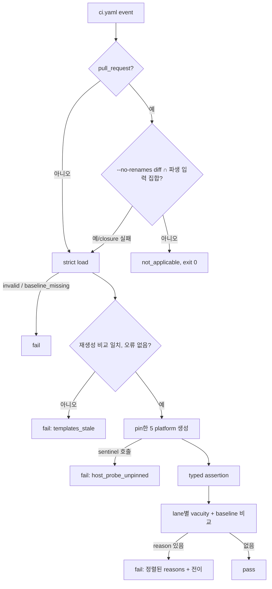
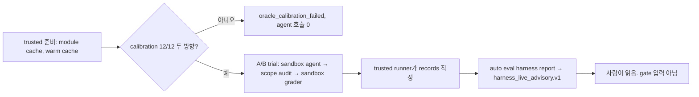

# SPEC-HARNEVAL-001 구현 계획

## Tasks

의존성 순서다. T1~T6은 SPEC-HARNEVAL-002가 참조하므로 번호와 범위를 유지한다. T14는 OPS-ONLY다. rev 4에서 서명·release·live workflow task는 SPEC-HARNEVAL-003으로 옮겼다.

- [x] T1: `[NEW] pkg/harneval/schema.go`, `load.go` — Wire Contracts 타입, strict loader, 경로 정규화·Lstat·symlink 거부, quarantine 거부, 정책 범위 검증, agent `expected_tests`, `baseline_missing` (REQ-HE-01).
- [x] T2: `[NEW] pkg/harneval/generate.go`, `sentinel.go`, `[NEW] codex.WithPluginBaseVersion` — 5 platform in-process 생성, version·project name·host probe pin, PATH/HOME sentinel (REQ-HE-02, CD-1).
- [x] T3: `[NEW] pkg/harneval/assert.go`, `jsonpath.go` — 8개 assertion kind, platform 유도, variant 평가 (REQ-HE-02).
- [x] T4: `[NEW] pkg/harneval/digest.go`, `compare.go`, `result.go` — expectation(corpus·`expected_tests` 포함)·set·agent set·surface digest, 전이, 결과 문서와 출력 채널 (REQ-HE-03, CD-7).
- [x] T5: `[NEW] pkg/content/regen_drift.go` — 오류를 반환하는 재생성 비교, `internal/cli` wrapper 이름 유지, lane별 vacuity (REQ-HE-04, CD-2, CD-8).
- [x] T6: `[NEW] internal/cli/eval_harness.go`, `eval_harness_run.go`, `eval_harness_baseline.go` — `auto eval harness run|baseline --update|--init|applicable|digest` (REQ-HE-03, REQ-HE-05, REQ-HE-06).
- [x] T7: `[NEW] evals/harness/**` — manifest, fixtures, surface task ≥20, agent task ≥12(`corpus_ref.file_sha256`, calibration으로 확인한 `expected_tests`), baseline, coverage test (REQ-HE-01, REQ-HE-13).
- [x] T8: `[NEW] pkg/harneval/mutation_test.go` — M1~M5와 committed mutation table (REQ-HE-12, CD-5).
- [x] T9: `.github/workflows/ci.yaml` `harness-eval` job(`--no-renames` diff, `fetch-depth: 0`), `[NEW] pkg/harneval/summary.go`, `[NEW] internal/cli/eval_harness_workflow_test.go`. 새 job은 기존 ci.yaml test 3개의 제약(40-hex `uses`, `version: latest` 금지·`timeout-minutes`, omp-native-smoke 구간 밖 배치)을 지킨다 (REQ-HE-05, REQ-HE-14).
- [x] T10: `[NEW] pkg/harneval/verdict.go`, `records.go`, `advisory.go`, `[NEW] internal/cli/eval_harness_report.go` — calibration 우선 판정, record·order 대조, `oracle.ran` 기반 vacuity, 정수 판정, verdict 우선순위(`vacuous` 최우선), 0 valid의 `pass_rate` `null`, unsigned `harness_live_advisory.v1` (REQ-HE-10, REQ-HE-11).
- [x] T11: `[NEW] scripts/benchmarks/harness/prepare_grader.py`, `grader.sb` — trusted module cache(`go mod download`, `go.sum` 검증, 읽기 전용)와 warm build cache, trial별 APFS clone, 두 방향 calibration과 세션 끝 재calibration, 거부 시 protocol·`calibration.json` 기록 (REQ-HE-08, REQ-HE-09).
- [x] T12: `[NEW] scripts/benchmarks/harness/golden.py`, `test_golden.py`, `run.py --mode golden` — workspace revision, 시작 전 거부, 신호 매핑, `sandbox-exec` grader, `env -i` 허용 목록, trusted parser(`expected_tests`, 1 MiB), 리터럴 `forbidden_construct`, credential을 codex 프로세스에만 전달, process group 종료, trusted runner만 record 작성 (REQ-HE-07, REQ-HE-08).
- [x] T13: `[NEW] scripts/benchmarks/harness/surface_driver/main.go`와 빌드 helper — `git archive` + `go build -trimpath` + version ldflags, v0.50.122 bootstrap test (REQ-HE-07).
- [ ] T14: OPS-ONLY. `harness-eval`을 main required status check로 등록하고 `gh api` 출력을 증거로 남긴다 (REQ-HE-05, CD-3).
- [x] T15: brownfield 회귀 검증(S15)과 coverage 85% 이상 확인 (CD-6).

## Implementation Strategy

- 공유 runner 하나: `pkg/harneval`이 load → stale 검사 → hermetic 생성 → assertion → 비교를 맡는다. CLI와 CI job이 같은 코드를 쓰고, SPEC-HARNEVAL-003이 이를 재사용한다.
- 재현성: 모든 표면 생성은 version·project name·host probe를 manifest 값으로 고정한다. 다른 revision의 표면은 그 revision에서 빌드한 driver로 만든다.
- live lane은 maintainer macOS host 전용 advisory다. agent와 grader는 Seatbelt sandbox 안에서만 돈다. grader가 빌드할 module과 cache는 trusted 단계가 미리 만들고, calibration이 oracle의 두 방향 동작을 증명한 뒤에만 trial을 시작한다.
- `pkg/evalregression`, allowlist, `release.yaml`은 바꾸지 않는다. pilot 모드(`harness_benchmark.v1`, `report.py`, `export.py`)는 기본 모드로 그대로 둔다.
- 파일당 300줄, 신규 package coverage 85%. generated root(`.claude/**`, `.codex/**` 등)는 직접 고치지 않는다.

## Visual Planning Brief

UI가 없는 CLI/CI 작업이다(wireframe intent: not applicable).





```text
PR lane  : auto eval harness applicable --event <e> --changed-files <f>; auto eval harness run --format json --output result.json
baseline : auto eval harness baseline --init | --update [--accept-regression GT-ID --reason "..."]
live     : python3 scripts/benchmarks/harness/run.py --mode golden --output <new-dir>   (maintainer macOS host)
report   : auto eval harness report --input <session-dir> --format json             (unsigned advisory)
```

## Feature Completion Scope

- Primary SPEC이 rev 4 Outcome Lock (a)(b)를 닫는다. (a)는 T1-T9와 T14, (b)는 T10-T13이 닫는다.
- 범위 분할(사용자 결정 2026-10-06): 서명, Environment custody, trusted protocol 재구성, binding digest, run 집계, release 차단은 SPEC-HARNEVAL-003이 소유한다. 그래서 task는 20개에서 15개로 줄었다. sibling은 002, 003 두 개로 한도에 닿았다.
- SPEC-HARNEVAL-002는 T1-T6에, SPEC-HARNEVAL-003은 T10-T13에 의존한다. 001의 완료는 둘 다에 의존하지 않는다.
- 남은 Completion Debt: CD-3(T14 required check 등록)이 끝나기 전에는 sync 완료가 아니다.

## Risk-First Integration Probe

| assumption_id | class | risk | boundary | input | oracle | isolation | status | reason | evidence |
|---------------|-------|------|----------|-------|--------|-----------|--------|--------|----------|
| A1 | verified_fact | critical | grader sandbox 안에서 corpus oracle 빌드·실행, 두 방향 calibration | `git archive HEAD` workspace, file proxy로 채운 뒤 읽기 전용으로 바꾼 module cache, warm build cache의 trial별 APFS clone, network 거부·grade 밖 쓰기 거부 profile, corpus 12개 task | 변형 전 exit 0과 pass 이벤트, 변형 후 비accept, 빈 module cache는 pass 0 | scratchpad tree, repo 파일 미수정 | PASS | 12/12 변형 전 exit 0, 12/12 mutation 탐지, 빈 cache는 exit 1·pass 0이었다. a04는 prefix 정규식(`^TestEvaluateGate_`, 통과 7개)이라 이름 목록을 뽑을 수 없어 `expected_tests` 고정을 요구사항에 넣었다 | 2026-10-06 `python3 oracle_probe.py`(2분 31초), `<session-scratchpad>/probes/oracle_probe.py` |
| A2 | verified_fact | high | pin한 표면 생성의 재현성: root·HOME·TZ, 따로 빌드한 binary, version 문자열, 이전 tag 빌드 | 같은 pin의 5 adapter, `git archive HEAD` 두 사본과 v0.50.122 사본의 driver를 version ldflags를 달리해 빌드 | bookkeeping 제외 digest가 같은 pin끼리 같고 version이 다르면 달라지며 v0.50.122 driver가 빌드·실행됨 | scratchpad 추출 tree | PASS | overlay 2회에서 545개 파일 digest 동일, sentinel 0회였다. 경로가 다른 두 binary는 `549ac6bc…`로 같았다. version만 `v0.50.123`이면 `a8952504…`가 나왔다. v0.50.122 driver는 정상 실행됐다 | 2026-10-06 overlay `TestHarnevalProbeA2`(probe-a2.log, probe-a2-refined.log), 4개 binary 실행, `<session-scratchpad>/probes/build/` |
| A3·A4 | verified_fact | high | agent가 고친 코드를 실행하는 grader의 격리(`sandbox-exec` + `env -i`). A4는 T12 scope expansion으로, 같은 sandbox 안에서 계정 credential 저장소 읽기를 거부한다 | A3: network 거부·grade 밖 쓰기 거부 SBPL, 밖 쓰기·localhost 연결·안 쓰기·환경 조회를 하는 `go test`, 부모 env의 canary. A4: `grader.sb`의 `ACCOUNT_HOME`·`CODEX_HOME_DIR` 파라미터, `$CODEX_HOME`·`~/.codex`·`~/.ssh`·`~/.config/gh`·`~/.aws`·`~/.claude`·`~/.claude.json`·`~/.omp`·`~/.gnupg`·`~/.docker`·`~/Library/Keychains`·`/Library/Keychains` file-read 거부와 Security server mach-lookup 거부 | A3: 밖 쓰기와 연결은 거부, 안 쓰기는 성공, canary 없음, 대조군은 쓰기·연결 성공. A4: 저장소 읽기는 `operation not permitted`, 계정 홈의 다른 파일은 읽힘, keychain 검색 실패, 파라미터가 없으면 exit 65, corpus 12개 calibration 불변 | A3: scratchpad module. A4: fixture 계정 홈. 실제 홈은 `ls` 종료 코드만 기록하고 내용은 읽지 않음 | PASS | A3: sandbox 실행은 `operation not permitted` 두 건과 안 쓰기 성공이었고, 대조군은 둘 다 성공했다(macOS 26.5.2). GitHub runner는 이 SPEC 범위가 아니다. A4: fixture 저장소 11곳 모두 거부, 일반 파일 허용, `security list-keychains` 실패(대조군 성공). 실제 홈 8곳 `ls` 거부(대조군 성공). 바꾼 profile에서 12/12 clean accept, 12/12 mutated reject. 이전 profile로 돌린 red check는 저장소 11곳을 모두 읽었고 keychain 검색도 됐다 | A3: 2026-10-06 `sandbox-exec -f grader.sb go test -count=1 -v ./...`, `<session-scratchpad>/probes/grade/`. A4: 2026-10-07 `test_grader_credentials.py`, `prepare_grader.py` CLI(3분 44초), `evidence/t12-golden.txt` |

## Plan Statement Classification

| Statement | Class | Evidence |
|-----------|-------|----------|
| live lane은 서명하지 않고 어떤 gate의 입력도 아니다 | requirement_invariant | REQ-HE-11 |
| oracle이 빌드·실행되지 않은 세션은 `ok`가 될 수 없다 | requirement_invariant | REQ-HE-09, REQ-HE-10 |
| 읽기 전용 module cache와 trial별 build cache clone으로 corpus 12개 oracle을 sandbox에서 빌드할 수 있다 | verified_fact | A1 |
| corpus mutation 12개는 모두 oracle에 걸린다 | verified_fact | A1 |
| version pin이 같으면 따로 빌드한 binary의 표면 digest가 같고, version 문자열은 digest를 바꾼다 | verified_fact | A2 |
| v0.50.122에서 surface driver를 빌드할 수 있다 | verified_fact | A2 |
| grader profile은 sandbox 밖 쓰기와 network를 막는다 | verified_fact | A3 |
| in-process `WithPluginBaseVersion` pin과 ldflags pin이 같은 표면을 만든다 | implementation_assumption | T2, T13 test |
| ubuntu와 macOS의 PR lane 결과가 같다 | implementation_assumption | S2를 CI에서 실행 |
| codex가 shell environment 상속을 끌 수 있다 | implementation_assumption | T12에서 설치 버전 문서로 key 확인, S11 canary 검사 |
| GitHub required check 등록과 무관 PR의 check 보고 | implementation_assumption | T14 `gh api` 증거 |

## Gate Applicability

- `{SPEC_DIR}/gate-applicability.json`은 아직 없다. 구현 handoff에서 `auto spec gates`가 쓴 값만 쓴다. 비신뢰 agent 출력을 sandbox에서 실행하므로 classifier가 `security_or_data`로 분류할 것으로 예상하며, 이 예상은 판정이 아니다.
- security, validation, data_loss, deterministic_oracle gate는 `not_applicable`이 될 수 없다. UI 경로가 없으므로 accessibility와 ux_verification 판단은 classifier에 맡긴다.
- scope expansion 규칙: 구현자가 요구사항보다 넓은 제약(예: macOS 밖 OS 거부 이외의 추가 제한, 추가 ACL)을 넣으려면 요구사항으로 올리지 않고 scope expansion으로 표시한 뒤 fan-out 전에 이 표에 probe 행을 추가한다(표 전체가 1-3행이므로, 넘치면 같은 경계의 기존 행과 합친다. A4는 A3과 합쳤다).
