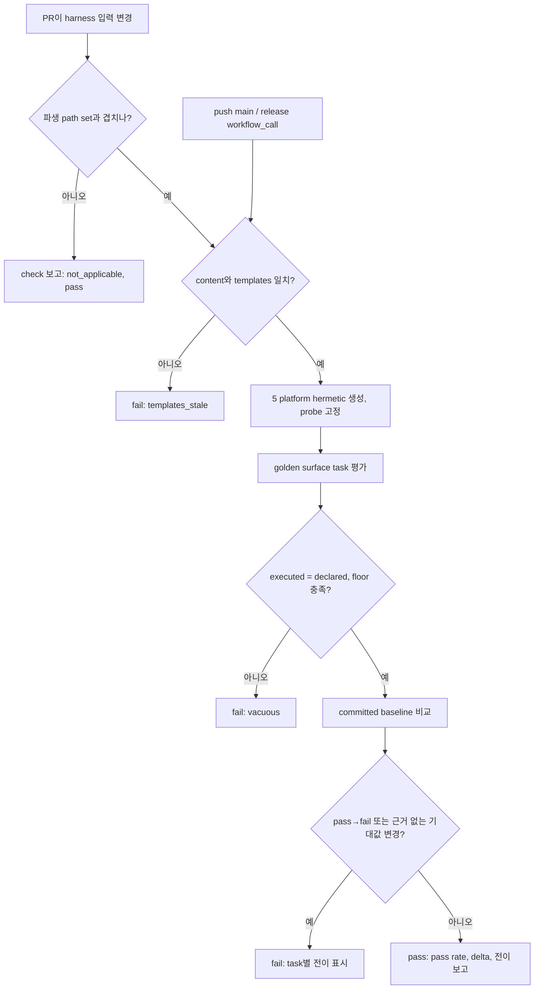
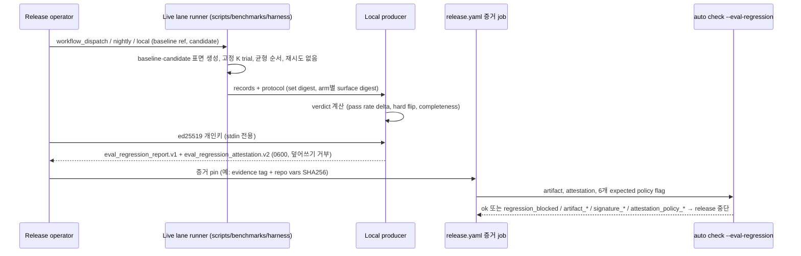

# PRD: Harness 변경 Golden-Task Eval 게이트

- **SPEC-ID**: SPEC-HARNEVAL-001
- **Sibling SPEC**: SPEC-HARNEVAL-002 (approved, 이 SPEC의 golden-task 형식에 의존)
- **Author**: Autopus-ADK planner agent
- **Status**: Draft
- **Date**: 2026-10-06
- **Mode**: Standard (11 sections)
- **Target module**: autopus-adk

## Overview

canonical harness source(`content/`, `templates/`, `pkg/content`, `pkg/adapter`와 그 생성 의존성)가 바뀌면 버전 관리되는 golden-task 세트로 생성 표면의 행동을 평가하고, 회귀가 있으면 병합과 release를 막는다. PR lane은 LLM 없이 결정적으로 도는 required CI check이고, live lane은 실제 agent로 baseline harness와 candidate harness를 짝지어 실행해 서명된 `eval_regression_report.v1` 증거를 만들며, 기존 `auto check --eval-regression`이 이를 검증해 release를 차단한다. 사고(incident)를 golden-task 후보로 승격하는 흐름은 sibling SPEC-HARNEVAL-002가 이 SPEC의 형식 위에서 담당한다.

## Discovery Q&A Checklist

Plan Intent Ledger의 answered 행은 재질문하지 않고 근거로 재사용했다. assumed 행은 §9 Open Questions에 남겼다.

- [x] **Problem** (ledger `goal`, answered/high): harness 설정 변경이 agent 행동을 조용히 회귀시킬 수 있고, 사고가 영구 eval로 남지 않는다. 근거: CI에 eval job이 없다(`.github/workflows/ci.yaml`은 `scripts/benchmarks/harness`의 Python unit test만 실행). 기존 benchmark는 "No automated winner or configuration promotion"을 명시한다(`scripts/benchmarks/harness/README.md`).
- [x] **Target Users** (evidence): harness source를 바꾸는 ADK maintainer/contributor, release operator, PR reviewer. ADK를 설치하는 하위 사용자는 간접 수혜자다.
- [ ] **Success Metrics** (ledger `done_evidence`, assumed/medium): seeded template 회귀에서 CI job이 실패하고 baseline에서는 통과한다. live lane 산출물은 `auto check --eval-regression`으로 검증한다. 정량 목표는 §2, 미확정 값은 §9 Q3/Q5에 있다.
- [x] **Constraints** (ledger `constraints`, answered/high): 파일당 최대 300줄, CI coverage 85%, PR lane은 결정적·no-LLM, live lane은 유료 quota이므로 manual/nightly로만 실행한다.
- [x] **Prior Art** (evidence): SPEC-HARNESS-BENCH-001(12-task seeded-regression pilot), SPEC-HARNESS-EFFICIENCY-001(`CompareHarness` observational), `pkg/evalregression`(코드 주석의 SPEC-EVAL-REGRESSION-PROV/CI/GATE-LIVE-001, spec 디렉터리는 workspace에서 발견되지 않음), release.yaml의 OMP context pinned-evidence 패턴, SPEC-ADK-DRIFT-GATE-001(template regen drift advisory).
- [ ] **Scope Boundary** (ledger `scope_boundary`, assumed/medium): sibling repo Autopus/backend producer는 바꾸지 않는다. 후보 자동 승격도, PR마다 live LLM 실행도 하지 않는다. 이 가정이 틀리면 gate에 backend 변경이 필요하다(§9 Q8).

### Plan Intent Ledger 재사용

| Field | Status | PRD 반영 위치 |
|---|---|---|
| goal | answered | Outcome Lock, §1 |
| scope_boundary | assumed | §8 Out of Scope, §9 Q8 |
| constraints | answered | §6 NFR, §7 |
| done_evidence | assumed | Outcome Lock Done Evidence, §2, §9 Q3 |
| brownfield_impact | answered | §7 Compatibility, reviewer focus. pkg/learn schema/prune은 SPEC-HARNEVAL-002 소유 |

Question Audit: 이 SPEC에 쓰인 질문은 D1(HYBRID) 1회다. 추가 질문은 하지 않았다. Outcome Lock을 막는 미해결 항목은 없고, 나머지는 assumed/deferred로 기록했다.

## Outcome Lock

- **User-visible outcome**:
  (a) canonical harness 입력을 바꾸는 PR에서 `harness-eval` CI check가 결정적 golden-task eval을 실행한다. committed baseline 대비 pass rate, regression delta, task별 전이를 보고한다. pass→fail 전이, vacuous 실행, stale templates, 근거 없는 기대값 변경이 있으면 실패한다.
  (b) live lane이 실제 agent로 baseline harness와 candidate harness의 golden task를 같은 세션에서 실행해, 서명된 `eval_regression_report.v1` + `eval_regression_attestation.v2`를 만든다. 기존 strict 경로의 `auto check --eval-regression`이 이를 수정 없이 검증한다.
  (c) release workflow는 이 증거가 없거나 stale/invalid/blocked이면 release를 중단한다.
- **Mandatory requirements**: FR-01 ~ FR-13 (§5 P0).
- **Explicit non-goals**: §8. Autopus/backend producer와 Autopus gate 변경, unsigned-accept 경로, PR마다 live LLM 실행, 후보 자동 승격, 기존 82개 contract test의 대체·삭제, incident→golden 승격(SPEC-HARNEVAL-002)은 이번 범위가 아니다.
- **Done evidence (acceptance seeds)**:
  1. 고정된 seeded harness mutation(≥5종)은 각각 PR lane을 실패시키고, 무변경 tree는 통과한다. 같은 커밋을 2회 실행한 결과 JSON은 `produced_at`을 빼고 byte-identical이다.
  2. test key로 서명한 control pair를 같은 strict policy로 검증하면 known-good은 `eval-regression: ok`, seeded-regression은 `regression_blocked`가 된다. 1바이트를 변조하면 `signature_invalid`, 다른 trust lane policy로 검증하면 `attestation_policy_mismatch`가 된다.
  3. release.yaml static contract test가 세 가지를 단언한다. `release` job이 harness eval 증거 job을 `needs`로 의존한다. 그 job이 여섯 개 expected policy flag를 모두 지정한 `auto check --eval-regression`을 실행한다. `--warn-only`가 없다.
  4. 기존 `scripts/benchmarks/harness` unit test, `CompareHarness` test, `pkg/evalregression`·`internal/cli` eval-regression test(`TestEvalRegressionADKWorkflowIsRetired` 포함)가 수정 없이 통과한다.

## Feature Coverage Map

| # | Capability | Lane | Requirement | Acceptance seed | Priority |
|---|---|---|---|---|---|
| C1 | 버전 관리되는 golden-task 형식(surface/agent 2종, provenance, status) | 공통 | FR-01 | strict decode, unknown field 거부, retired tombstone | Must |
| C2 | 초기 golden set (surface ≥20, agent ≥12) | 공통 | FR-13 | category × platform coverage 검사 | Must |
| C3 | hermetic 결정적 runner (5 platform, host probe 고정) | PR | FR-02 | 2회·2 host 결과 동일 | Must |
| C4 | baseline + regression delta + 전이 보고, 명시적 baseline 갱신 | PR | FR-03, FR-06 | pass→fail 실패, fail→pass `improved` | Must |
| C5 | vacuity/staleness 방어 | PR | FR-04 | floor 미달, executed≠declared, `templates_stale` 실패 | Must |
| C6 | seeded-mutation self-test (oracle 강도) | PR | FR-12 | mutation ≥5 전부 탐지 | Must |
| C7 | CI job (항상 보고, 파생 path set, main/release 무조건 실행) | PR | FR-05 | actionlint + workflow static contract | Must |
| C8 | live lane A/B (baseline vs candidate, 고정 K) | Live | FR-07 | protocol에 set/surface digest·K·order 동결 | Must |
| C9 | local producer + v2 서명 (stdin key) | Live | FR-08 | test-key round-trip이 strict verify 통과 | Must |
| C10 | trust lane 분리 (key_id, trust_lane, workflow 이름) | Live | FR-09 | 양방향 cross-lane negative | Must |
| C11 | release 차단 연결 | Release | FR-10 | release.yaml static contract, fail-closed reason | Must |
| C12 | live workflow (dispatch/nightly, protected Environment) | Live | FR-11 | `pull_request(_target)` 트리거 0, secret 범위 검사 | Must |
| C13 | job summary 카테고리별 표 | PR | FR-20 | summary snapshot | Should |
| C14 | live completeness floor → `incomplete` | Live | FR-21 | 운영 오류 주입 fixture | Should |
| C15 | `auto doctor` live evidence 나이 advisory | 공통 | FR-30 | advisory만, `overall_ok` 불변 | Could |

## Completion Debt

Outcome Lock이나 보안·무결성을 닫으려면 이 SPEC 안에서 끝내야 하는 작업이다. `나중에`나 Evolution으로 내리지 않는다.

- **CD-1 Host probe 고정**: codex 모델 카탈로그·CLI 버전, opencode CLI 버전처럼 호스트를 probe하는 생성 입력은 전부 fixture로 고정한다. 근거: 2026-10-06 로컬에서 `TestLatestCLIContract_MixedInstall`이 `Codex 카탈로그가 관리형 native balanced 프로필을 지원하지 않음: gpt-6-astra/max`로 실패했다. 고정 수단은 이미 있다(`codex.WithModelCatalog`/`WithCLIVersion` pkg/adapter/codex/codex.go:40,50, `opencode.WithCLIVersion` pkg/adapter/opencode/opencode_version.go:22).
- **CD-2 Vacuity guard**: 선언 task 수 floor, executed set = declared active set, skip 0을 강제한다. CI가 live smoke마다 `go test -list` floor를 검증하는 것과 같은 원칙이다.
- **CD-3 Release 연결 + 운영 runbook**: 키 생성과 Environment secret 등록은 OPS-ONLY 선행 조건이다. release.yaml 연결은 마지막 task로 두고, 키가 없으면 advisory로 낮추지 않은 채 blocked로 남긴다.
- **CD-4 Trust lane 분리 증명**: cross-lane negative test를 양방향으로 둔다. `TestEvalRegressionADKWorkflowIsRetired`는 green을 유지한다. `.github/EVAL_REGRESSION_REQUIRED_CHECK.md`에 adk-harness lane 절을 추가하되 `TestEvalRegressionRequiredCheckRunbookExists`가 요구하는 문자열은 보존한다.
- **CD-5 Oracle 강도 증명**: seeded-mutation self-test(FR-12).
- **CD-6 Brownfield 호환**: `harness_benchmark.v1` pilot 모드, `export.py`→`auto telemetry harness`, `CompareHarness`("never a promotion or winner")의 의미를 바꾸지 않는다.
- **CD-7 Baseline 갱신의 명시성**: pass→fail은 `--accept-regression <task-id> --reason`으로만 기록한다. 기대값 digest가 바뀌면 `expectation_changed`로 드러나야 한다.
- **CD-8 Stale template 전제조건**: `content/`와 committed `templates/`가 어긋나면 eval 전에 `templates_stale`로 실패한다. 재생성 비교는 `detectTemplateRegenDrift`(internal/cli/doctor_drift_source.go:70)를 공유 위치로 추출해 재사용한다. 지금은 doctor advisory로만 관측되고 CI는 막지 않는다.

## Evolution Ideas

Outcome Lock을 만족한 뒤에 고를 수 있는 개선이다. follow-up SPEC, sibling SPEC, REQUEST_CHANGES의 근거가 되지 않는다.

- EI-1 live lane을 다른 provider(claude, gemini, opencode)로 확장한다.
- EI-2 live pass-rate 이력을 SPEC-SIGMABAND-001의 σ-band 탐지 입력으로 제공한다.
- EI-3 golden set과 baseline 파일에 CODEOWNERS/org ruleset을 건다(OPS).
- EI-4 파생 path set이 취약하다고 드러나면 path filter 없이 모든 PR에서 실행한다. 비용은 수 초 수준이다.
- EI-5 K를 늘리고 신뢰구간 기반 판정으로 반복성을 통계적으로 강화한다.
- EI-6 FR-30 doctor advisory.

## Sibling SPEC Decision

| 항목 | 결정 |
|---|---|
| Sibling | SPEC-HARNEVAL-002. pkg/learn lesson/incident를 golden-task 후보(fingerprint, expected/actual, repro command)로 만들고, quarantine을 거쳐 사람 승인으로 promote한다(`pkg/qa/promote` 또는 `pkg/skillevolve` 패턴). prune은 promoted/linked entry를 지우지 않는다 |
| 허용 사유 | 독립된 사용자 결과(사고 이후 영구 eval로 만드는 별도 워크플로)이고, 순서 의존이 있다(002는 001의 `harness_golden_task.v1` 형식이 필요) |
| 한도 | sibling은 총 1개로 최대 2개 한도 안이다. 002에서 다시 sibling을 만들지 않는다(재귀 금지) |
| 001→002 인터페이스 | 001이 소유: schema의 `provenance{kind: manual\|benchmark\|incident, ref, fingerprint}`와 `status{active\|retired, reason}` 필드, manifest의 active set 경로 선언. runner는 manifest가 선언한 active set만 로드하고, 그 밖의 디렉터리(향후 candidates 포함)는 절대 평가하지 않는다. 002가 소유: fingerprint 알고리즘, 후보 생성, learn schema 확장, prune 예외 |
| 공급 리스크 | 이 repo의 `.autopus/learnings/pipeline.jsonl`에는 entry가 3개뿐이다. 001의 초기 set은 수동 seed와 기존 corpus import로 채우고, 002의 intake에 의존하지 않는다 |

## Visual Brief

UI 표면이 없는 CLI/CI/release 작업이다(wireframe intent: not applicable). 아래 시각 자료는 설명 보조용이며, Outcome Lock에 연결되지 않은 요소를 요구사항으로 올리지 않는다.





```text
command flow (이름은 후보이며 spec에서 확정한다)
PR lane  : auto eval harness run --lane deterministic --format json        -> harness_eval_result.v1
baseline : auto eval harness baseline --update [--accept-regression GT-ID --reason "..."]
live     : python3 scripts/benchmarks/harness/run.py --mode golden --baseline-ref <tag> ...
producer : auto eval harness export --input <results> --output <new-dir>  < private key on stdin
verify   : auto check --eval-regression --eval-regression-artifact <dir>/eval_regression_report.json \
             --eval-regression-expected-{key-id,trust-lane,source-environment,target-environment,source-revision,workspace-scope} ...
```

---

## 1. Problem & Context

**Current Situation**

- 지금 harness 변경을 검증하는 수단은 tracked `*contract*_test.go` 82개(22개 디렉터리)다. 대부분 `templates.FS`나 content FS, 생성 fixture에 대해 `require.Contains`로 부분 문자열을 단언한다(예: `pkg/content/task_route_contract_test.go`, `pkg/adapter/latest_cli_platform_contract_test.go`). 결과는 단언별 pass/fail뿐이고, 집계 pass rate나 baseline, 회귀 delta는 없다.
- 일부 contract test는 호스트에 의존한다. `TestLatestCLIContract_MixedInstall`은 로컬 Codex 카탈로그 probe 때문에 실패한다(2026-10-06 관측).
- 실제 agent runner는 `scripts/benchmarks/harness/` 하나다. 구성: seeded-regression task 12개(corpus_a/b 각 6개), arm native/reduced/current, `harness_benchmark.v1` schema, `codex exec --ephemeral --ignore-user-config --json -`(run.py). task/arm당 trial은 1회만 허용한다(report.py: "one trial per task/arm is supported"). CI는 이 디렉터리의 Python unit test만 실행한다.
- `pkg/evalregression`은 `eval_regression_report.v1`을 읽기만 하는 verifier다. `auto check --eval-regression`은 v2 strict 경로만 쓰고, 여섯 개 policy flag를 모두 요구하며, 커밋된 allowlist 키만 신뢰한다(internal/cli/check.go `runChecks` → `checkEvalRegressionStrict`, `CommittedEvalRegressionPublicKeys()`).
  - allowlist에는 키가 하나뿐이다. `autopus-eval-staging-to-main-2026-07`이고, Autopus main-promotion GitHub Environment에서만 서명된다.
  - 코드는 "There is no unsigned-accept path"를 보안 불변식으로 명시한다(pkg/evalregression/attestation.go).
- template regen drift는 `auto doctor`에서 advisory로만 관측되고 CI는 막지 않는다(SPEC-ADK-DRIFT-GATE-001).

**Problem Statement**

canonical harness source를 바꾼 PR이 agent가 실제로 받는 생성 표면의 행동(routing, hook/settings의 포함·누락, 플랫폼 간 prompt 계약)을 회귀시킬 수 있다. 그런데 이를 task 단위의 기대 결과와 baseline 대비 delta로 판정해 병합이나 release를 막는 게이트가 없다. 실제 agent 행동 측정도 관측용 pilot에 머물러 release 판단에 연결되지 않는다.

**Impact**

harness 회귀는 ADK를 설치하는 모든 하위 프로젝트의 5개 플랫폼 표면에 한꺼번에 배포된다. 지금은 contract test를 같은 diff에서 약화하거나 삭제해도 집계 신호가 남지 않는다. 호스트에 의존하는 test는 환경마다 결과가 달라 신뢰를 떨어뜨린다.

**Change Motivation**

Anthropic "AI-Native SDLC Playbook"(plan-context 근거)은 다음을 권한다.
- 실제 task 20~50개와 기대 결과로 eval을 만든다.
- CLAUDE.md/skills/hooks가 바뀔 때 eval을 실행하고, pass rate가 떨어지면 설정 변경을 막는다.
- production incident는 영구 eval로 남긴다.

사용자는 D1에서 HYBRID(결정적 PR lane + live release lane)를 선택했다.

**Value beyond the 82 contract tests** (중복이 아닌 이유)

| 측면 | 기존 contract test | Golden-task eval |
|---|---|---|
| 단위 | SPEC별 불변식 단언, 22개 디렉터리에 분산 | 중앙 versioned set의 사용자 task 형태 case(`intent` → 기대 `outcome`) |
| 판정 | 개별 test fail | 집계 pass rate, committed baseline, task별 전이(regression/improved/new/retired/expectation_changed) |
| 변조 가시성 | 같은 diff에서 단언을 조용히 삭제·약화할 수 있음 | 기대값 digest와 tombstone, pass→fail은 명시적 accept와 사유가 있어야 기록 |
| 입력 행렬 | 대개 기본 config 하나, 플랫폼별 | config variant(예: `hooks.pre_commit_arch` on/off) × 5 platform을 한 case로 정의 |
| 환경 | 일부가 호스트 probe에 의존(실패 관측) | 모든 probe 고정, byte-identical 결과 |
| live 연결 | 없음 | live lane이 같은 task id 체계를 공유해 결정적 결과와 실제 행동을 task 단위로 대조 |
| 사고 intake | 없음 | SPEC-HARNEVAL-002가 provenance 필드로 후보를 승격 |

기존 contract test는 그대로 둔다. 기존 단언 하나를 다시 적은 것에 불과한 golden task는 받지 않는다(review rule, FR-01 Notes).

## 2. Goals & Success Metrics

| Goal | Success Metric | Target | Timeline |
|---|---|---|---|
| 회귀 탐지력 | seeded harness mutation 탐지율(PR lane self-test) | 100%(≥5종 모두 fail), 무변경 tree false positive 0 | 구현 완료 시 |
| 결정성 | 같은 커밋 2회 실행, CI와 maintainer 호스트 간 결과 JSON 동일성(`produced_at` 제외) | 100% byte-identical | 구현 완료 시 |
| PR 비용 | `harness-eval` eval step 실행 시간(ubuntu-latest) | ≤ 60 s, job 전체 ≤ 5 min | 구현 완료 시 |
| Set 범위 | 초기 surface task 수, platform·category 커버리지 | ≥20 task, 5/5 platform, ≥4 category, task의 ≥60%가 ≥2 platform 또는 ≥2 surface를 단언 | 구현 완료 시 |
| Live 증거 검증 | control pair에 대한 `auto check --eval-regression` 판정 | known-good `ok`, seeded `regression_blocked`(2/2), 변조 `signature_invalid`, cross-lane `attestation_policy_mismatch` | 구현 완료 시 |
| Release 차단 | 증거가 없거나 stale/invalid/blocked일 때 release job 결과 | 100% 실패(static contract + hermetic fixture) | 구현 완료 시 |
| Brownfield 무회귀 | 기존 benchmark/CompareHarness/evalregression test | 수정 없이 100% pass, CI coverage ≥ 85% 유지 | 구현 완료 시 |

**Anti-Goals**

- live lane pass rate를 일반적인 개발 생산성이나 통계적 유의성의 증거로 주장하지 않는다(SPEC-HARNESS-BENCH-001의 한계 진술 유지).
- golden task 수를 채우려고 contract test를 옮기거나 복제하지 않는다.
- token이나 비용 절감을 품질 판정의 대체 지표로 쓰지 않는다.

## 3. Target Users

| User Group | Role | Usage Frequency | Key Expectation |
|---|---|---|---|
| Harness contributor | `content/`, `templates/`, 생성기 Go 코드 변경 | PR마다 | 회귀가 task 이름과 전이로 바로 보이고, 무관한 PR에는 비용이 들지 않음 |
| PR reviewer | 변경 승인 | PR마다 | baseline 갱신과 기대값 변경이 diff와 job summary에 명시적으로 드러남 |
| Release operator | live lane 실행, 키·Environment 관리, release tag | release마다 / nightly | 서명된 증거 하나로 release 가부가 정해지고, fail-closed 사유를 기계가 읽을 수 있음 |
| ADK 하위 사용자 | ADK 설치·업데이트 | 간접 | 회귀된 harness 표면이 배포되지 않음 |
| SPEC-HARNEVAL-002 | 형식 소비자 | 구현 시 | 안정된 schema와 provenance/status 계약 |

**Primary User**: harness contributor(PR lane)와 release operator(live lane). MVP의 판정 기준은 PR lane의 seeded-mutation 탐지와 release 차단이다.

## 4. User Stories / Job Stories

### Story 1: 템플릿 변경의 회귀를 즉시 탐지 (Job Story)

**When** `templates/`나 `pkg/adapter`를 바꾼 PR을 열 때,
**I want to** 결정적 golden-task eval이 5개 플랫폼 표면의 task별 결과와 baseline 대비 전이를 보여 주기를 원한다,
**so I can** 리뷰 전에 회귀를 고치고, 무엇이 왜 실패했는지 task 이름으로 알 수 있다.

**Acceptance Criteria**

- Given `hooks.pre_commit_arch=true` variant의 golden task가 baseline에서 pass일 때, when PR이 `.claude/settings.json` 생성에서 해당 PreToolUse 항목을 빠뜨리면, then check가 실패하고 그 task가 `regression(pass→fail)`로 보고된다.
- Given 무관한 파일만 바꾼 PR일 때, when check가 실행되면, then `not_applicable`로 통과하고 check context는 항상 보고된다.
- Given `content/`만 바꾸고 `templates/`를 재생성하지 않은 PR일 때, when check가 실행되면, then `templates_stale`로 실패한다.
- Given 같은 커밋일 때, when CI와 로컬에서 각각 실행하면, then 결과 JSON이 `produced_at`을 빼고 같다.

### Story 2: 기대값 변경을 드러내기 (User Story)

**As a** PR reviewer,
**I want** golden task의 기대값 변경, task 삭제, baseline 하향이 명시적 기록 없이는 통과하지 않기를 원한다,
**so that** 템플릿 변경과 함께 기대값을 조용히 약화하는 일을 막을 수 있다.

**Acceptance Criteria**

- Given 기대값을 고쳤지만 baseline은 갱신하지 않은 PR일 때, when check가 실행되면, then `expectation_changed`로 실패한다.
- Given task 파일을 지웠지만 `retired` tombstone이 없을 때, when check가 실행되면, then `task_missing`으로 실패한다.
- Given baseline 갱신이 pass→fail을 기록하려 할 때, when `--accept-regression <id> --reason`이 없으면, then 갱신이 거부된다.
- Given fail→pass 개선일 때, when check가 실행되면, then 통과하면서 `improved`로 보고하고 baseline 고정을 안내한다.

**INVEST Check**: Independent(Story 1 runner를 쓰지만 별도로 검증 가능) / Negotiable / Valuable / Estimable / Small / Testable.

### Story 3: 서명된 live 증거로 release 차단 (Job Story)

**When** release 후보를 준비할 때,
**I want to** baseline harness(직전 release)와 candidate harness를 실제 agent로 같은 세션에서 짝지어 실행한 서명 증거로 release 가부를 정하기를 원한다,
**so I can** 모델 drift가 아니라 harness 변경 때문에 생긴 행동 회귀만 release를 막게 할 수 있다.

**Acceptance Criteria**

- Given 고정 K와 균형 순서로 protocol이 동결됐을 때, when live lane을 실행하면, then 결과와 상관없이 재시도 없이 모든 시도가 기록된다.
- Given candidate pass rate가 threshold보다 크게 떨어지거나 hard flip이 있을 때, when producer가 verdict를 계산하면, then `blocked=true`인 report가 생성된다.
- Given 개인키를 stdin으로 넘길 때, when producer가 서명하면, then report와 attestation이 0600으로 새로 생성되고 기존 파일은 덮어쓰지 않는다.
- Given 증거가 없거나 stale이거나 변조됐거나 blocked이거나 다른 lane 키로 서명됐을 때, when release job이 `auto check --eval-regression`을 실행하면, then release가 중단된다.

### Story 4: Golden task 추가 (User Story)

**As a** harness contributor,
**I want** 새 golden task를 schema에 맞춰 추가하고 baseline에 고정하는 절차가 하나로 정해져 있기를 원한다,
**so that** 사고 재발 방지 case(SPEC-HARNEVAL-002 승격분 포함)가 영구 eval이 된다.

**Acceptance Criteria**

- Given unknown field가 있거나 assertion이 0개인 task일 때, when 로드하면, then `invalid`로 거부된다.
- Given 새 task가 pass일 때, when baseline을 갱신하면, then 다음 PR부터 regression 판정 대상이 된다.
- Given manifest가 선언하지 않은 디렉터리(후보 디렉터리 포함)의 파일일 때, when runner가 실행되면, then 절대 평가되지 않는다.

## 5. Functional Requirements

### P0 — Must Have

| ID | Requirement (EARS) | Notes |
|---|---|---|
| FR-01 | THE SYSTEM SHALL `harness_golden_task.v1` task와 `harness_golden_set.v1` manifest(set version, active set 경로, frozen digest, floor, live threshold·K)를 strict decode한다(unknown field·trailing data 거부). 각 task는 `kind: surface\|agent`, `intent`, `outcome`, assertion ≥1개, `provenance{kind: manual\|benchmark\|incident, ref, fingerprint?}`, `status{active\|retired, reason}`를 갖는다. | 저장 위치는 tracked·비생성·비설치 경로(예: `evals/harness/`). `content/`와 generated root는 금지. 기존 단언 하나를 다시 적은 task는 review에서 거부 |
| FR-02 | WHEN PR lane이 실행되면, THE SYSTEM SHALL task가 선언한 config variant와 platform마다 temp root에 in-process로 표면을 생성한다. 이때 모든 host probe 입력(CLI 버전, 모델 카탈로그)을 fixture로 고정하고, network·LLM·temp 밖 쓰기 없이 typed assertion(exists/absent, contains/not_contains, JSON path present/absent, route→detail, 플랫폼 간 section parity)을 평가한다. | `generator.Generate(ctx, cfg)` 패턴 재사용(pkg/adapter/latest_cli_contract_test.go). 고정되지 않은 probe 시도는 `host_probe_unpinned`로 실패. 탐지 수단(PATH sentinel 등)은 spec에서 정의 |
| FR-03 | WHEN 평가가 끝나면, THE SYSTEM SHALL committed `harness_eval_baseline.v1`(task별 outcome, 기대값 digest, set digest)과 비교한 `harness_eval_result.v1`(pass rate, regression_delta, task별 전이)을 내보낸다. pass→fail 전이, tombstone 없는 task 누락, baseline 미갱신 기대값 변경, set digest 불일치 중 하나라도 있으면 non-zero로 종료한다. | fail→pass는 `improved`로 보고하고 통과 |
| FR-04 | IF executed set ≠ declared active set이거나, active task 수 < floor이거나, 알 수 없는 assertion kind나 assertion 0개 task가 있거나, `content/`↔committed `templates/` 재생성 결과가 다르면, THEN THE SYSTEM SHALL 평가를 통과로 보고하지 않고 `vacuous`/`invalid`/`templates_stale` 사유로 실패한다. | regen 비교는 `detectTemplateRegenDrift`(internal/cli/doctor_drift_source.go:70)를 공유 위치로 추출해 재사용. doctor advisory 의미는 불변 |
| FR-05 | THE SYSTEM SHALL `ci.yaml`에 check context를 항상 보고하는 `harness-eval` job을 둔다. WHEN PR diff가 파생 harness 입력 집합(`content/**`, `templates/**`, 생성 진입점의 in-module Go 의존성 closure, golden set, runner, `go.mod`/`go.sum`)과 겹치면 평가하고, 겹치지 않으면 `not_applicable`로 통과한다. push to main과 `workflow_call`(release)에서는 무조건 평가한다. | workflow 수준 `paths` filter는 쓰지 않음(§9 R6 가정). path 집합은 손으로 유지하지 않고 `go list -deps`로 파생 |
| FR-06 | WHEN baseline 갱신 명령이 실행되면, THE SYSTEM SHALL 현재 결과로 baseline을 다시 쓴다. 단, pass→fail 전이는 `--accept-regression <task-id> --reason <text>`가 있을 때만 사유와 함께 기록하고, 없으면 거부한다. | 사유가 baseline 파일에 남아 reviewer diff에 보임 |
| FR-07 | WHERE live lane이 golden 모드로 실행되면, THE SYSTEM SHALL `kind: agent` task를 `baseline` arm(baseline ref에서 생성한 표면)과 `candidate` arm(평가 대상 revision의 표면)으로 같은 세션에서 실행한다. 사전 선언한 고정 K trial과 균형 순서를 protocol에 동결하고, 결과에 따른 재시도는 하지 않는다. | 기존 `harness_benchmark.v1` pilot 모드, corpus 파일, `export.py` 계약은 그대로 두고 추가만 함. agent task는 corpus를 digest 고정 참조로 import |
| FR-08 | WHEN live 결과가 완료되면, THE SYSTEM SHALL verdict(arm별 pass rate, `regression_delta = candidate − baseline`, hard flip, completeness)를 계산해 `eval_regression_report.v1`의 모든 필드를 채운다(`raw_payload_present=false`, body-free). 이어서 stdin으로만 받은 ed25519 개인키로 `eval_regression_attestation.v2`를 서명하고, 두 파일을 0600으로 새로 생성한다. 기존 파일은 덮어쓰지 않는다. | stdin key 선례: `auto companion omp-context-promotion-attestation`(internal/cli/companion_omp_context_promotion_attestation.go), `readPrivateKey`(internal/cli/companion_manifest.go:167). 개인키를 argv, env 파일, log에 두는 것은 금지 |
| FR-09 | THE SYSTEM SHALL 전용 key_id와 trust_lane(가정: `adk-harness-eval`)을 쓰고, allowlist(`evalRegressionPublicKeys`)에는 공개키만 추가하며, unsigned-accept 경로를 추가하지 않는다. harness lane 증거가 Autopus lane policy에서 `attestation_policy_mismatch`가 되고 그 역도 성립함을 test로 증명한다. | `TestEvalRegressionADKWorkflowIsRetired` 유지(새 workflow 이름 ≠ `eval-regression-gate.yml`). runbook에 lane 절 추가 |
| FR-10 | WHEN release workflow가 실행되면, THE SYSTEM SHALL `release` job이 `needs`로 의존하는 harness eval 증거 job에서 release source에 고정된 live 증거를 얻고, 여섯 개 expected policy flag를 모두 지정한 `auto check --eval-regression`을 `--warn-only` 없이 실행한다. 증거가 missing/stale/invalid/unsafe/blocked이면 release를 중단한다. | 증거 전달 방식은 §9 Q4. 선례: release.yaml `omp-production-evidence` job(repo vars로 report/attestation SHA256 고정, `release: needs: [ci, security, omp-production-evidence]`) |
| FR-11 | THE SYSTEM SHALL live lane을 `workflow_dispatch`(+선택적 `schedule`) workflow나 maintainer 로컬 명령으로만 실행한다. `pull_request`/`pull_request_target` 트리거는 두지 않고, Codex credential과 서명키는 protected GitHub Environment에서만 노출한다. | 두 실행 경로는 같은 산출물 schema를 냄 |
| FR-12 | THE SYSTEM SHALL 고정된 seeded harness mutation(≥5종: hook 항목 제거, router detail 매핑 파괴, 한 플랫폼에서 prompt 계약 구문 제거, config flag 반전 무시, skill 노출 누락)을 적용한 tree마다 PR lane이 실패하고 무변경 tree는 통과함을 self-test로 증명한다. | oracle 강도의 증거(ledger `done_evidence`의 "weak oracle" 리스크 대응) |
| FR-13 | THE SYSTEM SHALL 초기 golden set을 제공한다. surface task는 ≥20개이며 5개 platform 모두를 덮고, category ≥4개(routing, hooks/settings, 플랫폼 간 prompt 계약, agent/skill 노출, generated-root hygiene)를 포함하며, task의 ≥60%가 다중 platform 또는 다중 surface를 단언한다. agent task는 ≥12개(기존 corpus import)다. | floor는 manifest에 선언하고 FR-04가 강제 |

### P1 — Should Have

| ID | Requirement (EARS) | Notes |
|---|---|---|
| FR-20 | WHEN PR lane이 CI에서 실행되면, THE SYSTEM SHALL `$GITHUB_STEP_SUMMARY`에 category별 pass rate, delta, 전이 표를 쓰고 결과 JSON을 artifact로 올린다. | body-free |
| FR-21 | WHEN live 결과의 completeness(운영 오류가 아닌 trial 비율)가 선언된 floor보다 낮으면, THE SYSTEM SHALL report를 `blocked=true`, reason `incomplete`로 만든다. | fail-closed, 운영 오류와 회귀를 구분 |

### P2 — Could Have

| ID | Requirement (EARS) | Notes |
|---|---|---|
| FR-30 | WHERE 소스 repo에서 `auto doctor`가 실행되면, THE SYSTEM SHALL 마지막 live 증거의 나이와 set version을 advisory로 표시한다. | `overall_ok` 불변, Outcome Lock 밖 |

## 6. Non-Functional Requirements

| Category | Requirement | Target |
|---|---|---|
| Determinism | PR lane 결과가 호스트와 반복 실행에 무관할 것 | `produced_at` 제외 byte-identical, host probe 0회(전부 fixture) |
| Performance | PR lane eval step | ≤ 60 s(ubuntu-latest), job ≤ 5 min. 5-platform 전체 생성 시간은 아직 측정하지 못함(로컬 측정은 codex probe 실패로 0.37 s에 중단), CI에서 검증 |
| Cost | live lane 1회 상한 | tasks × K × 2 arms를 manifest에 선언(가정: agent run ≤ 96회, trial당 ≤ 180 s). PR에서는 0회 |
| Security | 서명키 취급 | stdin 전용. repo/argv/log/artifact에 private material 0, 출력 0600, PR-head 코드는 secret을 받지 않음 |
| Security | 신뢰 경계 | unsigned-accept 경로 0, lane 간 교차 수용 0(양방향 test) |
| Privacy | 산출물 body | prompt, transcript, raw payload 미포함(`raw_payload_present=false`, `redaction_status` 명시) |
| Quality | coverage, 파일 크기 | CI total ≥ 85% 유지, 신규 Go package ≥ 85%, 소스 파일 ≤ 300줄(`architecture.max_file_lines`) |
| Compatibility | 기존 계약 | `harness_benchmark.v1`, `CompareHarness` observational, `pkg/evalregression` reason code와 v1/v2 verifier, `auto check --eval-regression` flag 불변 |
| Auditability | protocol 동결 | set digest, arm별 surface digest, K, order, threshold를 trial 전에 기록하고 덮어쓰기 거부 |

## 7. Technical Constraints

**Technology Stack Constraints**

- 기존 brownfield Go module(`go 1.26`, `github.com/insajin/autopus-adk`)과 Python 3 stdlib benchmark script를 그대로 쓰고, 새 language runtime이나 외부 dependency는 추가하지 않는다.
- GitHub Actions `uses:`는 기존 관례대로 40-hex SHA로 고정하고, `actionlint`(static-contracts job)를 통과해야 한다.
- generated root(`.claude/**`, `.codex/**`, `.gemini/**`, `.opencode/**`, `.autopus/plugins/**`)는 직접 편집하지 않는다. golden set은 `content/`(embed되어 설치될 수 있음)나 generated root 아래에 두지 않는다.
- `pkg/evalregression`의 검증 의미(평가 순서, reason literal, strict decode)는 바꾸지 않는다. 변경은 allowlist에 공개키 항목을 추가하는 것과 (§11 Q2에서 결정하면) v2 signer를 추가하는 것으로 한정한다.

**Technology Stack Decision**

| Mode | Selected stack | Resolved versions | Source refs | Checked at | Rejected alternatives |
|---|---|---|---|---|---|
| brownfield | Go(runner, producer, CLI) + 기존 Python benchmark 확장 + GitHub Actions | `go.mod`의 `go 1.26`. Codex CLI는 live protocol에 실측 버전을 기록(pilot은 0.155.1) | `go.mod`, `scripts/benchmarks/harness/run.py`, `.github/workflows/ci.yaml`, `.github/workflows/release.yaml` | 2026-10-06 | 결정적 lane을 Python으로 작성(adapter를 in-process로 호출할 수 없음), snapshot-diff 전용 golden(의도 없는 diff 노이즈), unsigned 로컬 schema(보안 불변식 위반) |

**External Dependencies**

| Dependency | Version / SLA | Risk if Unavailable |
|---|---|---|
| Codex CLI + 계정 quota (live) | protocol에 버전 기록, 유료 quota | live 증거를 만들 수 없음 → release fail-closed |
| ed25519 서명키 + protected GitHub Environment (OPS) | 운영자가 발급하고 공개키만 커밋 | release fail-closed(`signature_key_unknown` / `artifact_unsigned`) |
| GitHub Actions runner | ubuntu-latest | PR lane이 돌지 않아 required check가 보고되지 않음 |

**Compatibility Requirements**

- `scripts/benchmarks/harness`의 기존 pilot 재현 명령, corpus 파일, `export.py`→`auto telemetry harness --evidence-json` 경로가 그대로 동작해야 한다.
- adk에는 `.github/workflows/eval-regression-gate.yml`이 계속 없어야 한다(`TestEvalRegressionADKWorkflowIsRetired`).
- `.github/EVAL_REGRESSION_REQUIRED_CHECK.md`의 기존 Autopus lane 문구(`TestEvalRegressionRequiredCheckRunbookExists`가 요구하는 문자열)는 보존하고, adk-harness lane 절만 추가한다.
- release.yaml의 기존 `needs: [ci, security, omp-production-evidence]` 의미는 유지한 채 의존성만 추가한다.

**Infrastructure Constraints**

- branch protection의 required check 등록, 키 생성, Environment secret 설정은 OPS-ONLY 작업이다. 구현 범위는 runbook과 static contract test까지이며, 권한이 필요한 작업은 수행하지 않는다.
- sibling repo `Autopus`(backend producer 포함)는 바꾸지 않는다.

## 8. Out of Scope

The following are out of scope for this release:

- sibling repo Autopus/backend producer, Autopus `eval-regression-gate.yml`/`eval-regression-producer.yml` 변경
- `pkg/evalregression`에 unsigned-accept 경로를 두거나 검증 의미를 완화하는 변경
- PR마다 live LLM을 실행하는 것, `pull_request(_target)` 트리거를 가진 live workflow
- golden-task 후보 자동 승격, pkg/learn schema/prune 변경, incident→candidate 생성(SPEC-HARNEVAL-002 소유)
- 기존 82개 contract test의 이동·삭제·대체
- 생성 표면에 대한 blocking edit guard(SPEC-EDITGUARD-001), σ-band 모니터링(SPEC-SIGMABAND-001)
- live 결과로 일반 개발 효과나 통계적 유의성을 주장하는 보고
- branch protection 등록, 키 생성, secret 등록 같은 권한 작업의 자동 수행

**Deferred to Future Iterations**

- 다중 provider live lane과 pass-rate 이력·σ 연계는 Evolution Ideas(EI-1, EI-2)로 남긴다. Outcome Lock에는 필요하지 않다.

## 9. Risks & Open Questions

### Risks

| Risk | Severity | Probability | Mitigation Strategy |
|---|---|---|---|
| R1 서명키가 발급되지 않으면 release가 계속 막힘(fail-closed) | High | High | release.yaml 연결을 마지막 task로 두고 공개키 커밋을 선행 조건으로 명시한다. runbook과 control pair(good/blocked)로 cutover하며, advisory로 낮추지 않는다 |
| R2 LLM 비결정성 때문에 release가 잘못 차단됨 | High | Medium | 같은 세션 A/B, 고정 K, 사전 선언 threshold, hard-flip 규칙을 쓰고 운영 오류는 `incomplete`로 분리한다. 판정 부담의 대부분은 결정적 PR lane이 진다 |
| R3 provider 모델 drift가 harness 귀속을 흐림 | Medium | High | 저장된 과거 결과가 아니라 같은 세션의 baseline arm과 비교한다. protocol에 CLI 버전과 alias 한계를 기록한다 |
| R4 host probe 때문에 PR lane 결과가 비결정적이 됨 | High | High (관측됨) | 모든 probe를 fixture로 고정하고, 미고정 probe는 `host_probe_unpinned`로 실패시킨다. 2-host 동일성 test를 둔다 |
| R5 파생 path set 누락으로 인한 false negative | Medium | Medium | `go list -deps` closure로 파생하고, main push와 release에서는 무조건 실행한다(EI-4) |
| R6 workflow 수준 `paths` filter 때문에 required check가 pending에 고착 | Medium | Medium | 가정: GitHub는 workflow 수준 filter로 skip된 required check를 pending으로 두고, job `if:` skip은 성공으로 취급한다. 이 세션에서는 검증하지 못했다(docs URL 404). 설계는 job을 항상 실행하고 적용 여부를 job 안에서 판단하므로, GitHub가 어느 쪽으로 동작해도 안전하다 |
| R7 golden set이 contract test 중복으로 전락 | Medium | Medium | `intent`/`outcome` 필수, 다중 platform·variant 비율 목표, 단언 재진술 거부 review rule, mutation self-test |
| R8 같은 PR에서 기대값을 약화하는 baseline gaming | Medium | Medium | 기대값 digest, tombstone, `--accept-regression` 사유 기록, summary 전이 표시. CODEOWNERS는 EI-3 |
| R9 adk 안의 eval gate가 "dormant duplicate gate"로 오인되거나 lane이 혼동됨 | Medium | Medium | workflow 이름·key_id·trust_lane·comparison_scope를 따로 두고, 양방향 cross-lane test와 runbook lane 절을 추가한다 |
| R10 live lane 비용 폭증 | Medium | Low | manifest에 run 상한을 두고 넘으면 시작을 거부한다. manual/nightly로만 실행한다 |
| R11 evaluated revision ≠ release tag commit이라 증거가 무효가 됨 | Medium | High | Q2 참고. 권장안은 `source_revision`을 harness surface digest에 binding하는 것이다. 그러면 좌표 bump 커밋에도 증거가 유효하고, harness가 바뀌면 무효가 된다 |
| R12 CI에서 Codex credential 관리 | Medium | Medium | protected Environment에만 둔다. 대안인 maintainer 로컬 실행도 같은 산출물을 낸다 |

### Open Questions

| # | Question | Owner | Due Date | Status |
|---|---|---|---|---|
| Q1 | live lane 기본 실행 위치는 GitHub-hosted(Codex credential secret 필요)와 maintainer 로컬 중 어느 쪽인가 | release operator | spec 승인 전 | deferred(두 경로 모두 같은 schema 지원) |
| Q2 | `source_revision`을 정확한 commit SHA와 harness surface digest(64-hex, `attributed_version` shape 호환) 중 어디에 binding할 것인가 | spec-writer + reviewer | spec 승인 전 | assumed: surface digest |
| Q3 | live K와 threshold 기본값 | spec-writer | spec 승인 전 | assumed: K=2. `regression_delta < −0.10`이거나 hard flip ≥1이면 blocked. completeness floor 90% |
| Q4 | release 증거를 orphan evidence tag + repo vars(OMP 선례)로 전달할 것인가, trusted workflow-run artifact 선택(Autopus gate 선례)으로 전달할 것인가 | spec-writer | spec 승인 전 | assumed: 로컬 producer와 호환되는 OMP 선례 |
| Q5 | release freshness window(`--eval-regression-max-age`, 기본 24h) | release operator | spec 승인 전 | assumed: 72h |
| Q6 | CLI 이름과 golden set 위치(`auto eval harness`, `evals/harness/`) | spec-writer | spec 작성 시 | assumed. 현재 `auto eval` 명령이 없어 충돌 없음 확인 |
| Q7 | adk branch protection에 `harness-eval`을 required로 등록 | repo admin | 구현 후 | OPS-ONLY, 절차는 runbook에 기록 |
| Q8 | scope_boundary 가정 검증: backend 변경이 정말 필요 없는가 | planner | spec review | assumed: 기존 strict verifier만으로 충분(FR-09 test로 증명) |

## 10. Pre-mortem

| # | Failure Scenario | Probability | Impact | Preventive Action |
|---|---|---|---|---|
| 1 | flaky live 판정이 release를 반복해서 막자 팀이 gate를 끄거나 우회한다 | Medium | High | 같은 세션 A/B, 고정 K, 사전 threshold, `incomplete` 분리, 차단 사유를 task 단위로 설명. 판정의 대부분은 결정적 lane이 맡음 |
| 2 | golden set이 초기 20여 개에서 늘지 않아 실제 회귀를 놓친다 | Medium | Medium | floor 강제, SPEC-HARNEVAL-002 intake, 새 harness 기능마다 task 추가를 리뷰에서 안내 |
| 3 | 키가 발급되지 않아 몇 주 동안 release가 막힌다 | Medium | High | 연결 task 순서화, 공개키 커밋을 선행 조건으로 둠, owner 지정(Q1/Q7), control pair cutover |
| 4 | path filter 누락이나 host 차이로 eval은 통과했는데 회귀가 배포된다 | Low | High | 파생 closure, main/release 무조건 실행, probe 고정, seeded-mutation self-test |
| 5 | 작성자가 템플릿과 기대값을 같은 PR에서 함께 낮춘다 | Medium | Medium | digest, tombstone, accept 사유, summary 전이 표시, EI-3 CODEOWNERS |

**Connection to Risks (Section 9)**

1→R2/R3, 2→R7, 3→R1/R12, 4→R4/R5/R6, 5→R8. 시나리오 2에서는 새 공급 리스크도 드러났다. learnings가 3건뿐이라는 점이며, Sibling SPEC Decision에 기록했다.

## 11. Practitioner Q&A

**Q1: 로컬 producer가 기존 verifier가 받아들이는 증거에 서명할 수 있는가?**
A: 지금 allowlist에 있는 키로는 서명할 수 없다. 그 키는 Autopus main-promotion Environment에서만 서명한다(pkg/evalregression/attestation.go).
- 그래서 전용 key_id를 새로 발급해 공개키만 커밋하고, 개인키는 stdin으로 받는다.
- unsigned 변형은 기각했다. "There is no unsigned-accept path" 불변식과 CLI의 v2 strict 강제를 모두 깨기 때문이다.
- 키를 추가해도 Autopus gate의 신뢰는 넓어지지 않는다. strict policy가 key_id와 trust_lane의 정확한 일치를 요구하기 때문이다(pkg/evalregression/verify_v2.go `matchesEvalRegressionAttestationPolicyV2`).
- v1 API(`VerifyEvalRegressionArtifact`)는 policy 없이 allowlist 전체를 신뢰한다. 다만 test가 아닌 production 호출자는 없음을 확인했다. 이 점은 reviewer focus로 둔다.

**Q2: v2 signer는 어디에 두는가?**
A: 권장안은 `pkg/evalregression` 안에 v2 signer를 두는 것이다. 그러면 unexported domain prefix와 statement builder를 verifier와 공유하므로 byte layout drift가 원천적으로 생기지 않는다. 대안은 별도 package에 builder를 복제하고 round-trip test로 parity를 보장하는 방식이다. 어느 쪽이든 패키지 doc을 "Autopus lane producer는 backend, adk-harness lane signer는 adk"로 갱신하며, 최종 결정은 spec에서 한다.

**Q3: PR lane은 go test인가, CLI인가?**
A: 권장안은 `pkg/harneval`(loader, assertion, baseline, 비교)과 CLI(`auto eval harness ...`, 후보 이름)를 함께 두는 것이다. 같은 runner를 CI, maintainer 로컬, live lane의 surface digest 계산이 공유하고, coverage는 package test로 확보한다.

**Q4: 결정적 lane에도 "pass-rate baseline"이 왜 필요한가?**
A: active task는 대부분 pass다. 그래도 baseline이 task별 outcome과 기대값 digest를 고정하므로 네 가지 경우를 구분해 보고할 수 있다.
- pass→fail은 차단한다.
- fail→pass는 개선으로 고정한다.
- 기대값 변경과 task 삭제는 각각 별도로 표시한다.

또 live lane과 같은 task id 체계를 쓰므로, 결정적 결과와 실제 행동을 task 단위로 대조할 수 있다.

**Q5: live lane의 baseline은 무엇인가?**
A: 직전 release tag(`baseline_ref`)에서 생성한 harness 표면이다. 저장된 과거 결과는 모델 drift가 섞이므로 쓰지 않고, 같은 세션에서 baseline arm을 다시 실행한다. 비용은 2배지만 회귀를 harness 변경에 정확히 귀속할 수 있다.

**Q6: path filter가 required check를 막지 않게 하려면?**
A: workflow 수준 `paths`를 쓰지 않는다. job은 항상 실행해 check를 보고하고, job 안에서 diff를 파생 입력 집합과 비교해 `not_applicable`로 끝낼지 평가할지 정한다. push main과 `workflow_call`에서는 무조건 평가한다.

**Q7: rollout과 rollback은?**
A: rollout 순서는 다음과 같다.
1. PR lane(결정적)
2. live runner와 producer(test key)
3. 운영자의 키 발급과 공개키 커밋
4. control pair 검증
5. release.yaml 연결

rollback은 release.yaml의 해당 `needs` 항목을 되돌리는 별도 PR로 한다. advisory 플래그로 조용히 끄는 경로는 두지 않는다.

**Q8: 기존 pilot과 telemetry 사용자는 영향을 받는가?**
A: 받지 않는다. golden 모드는 추가 모드다. `harness_benchmark.v1` schema, 3-arm pilot, `report.py`의 1-trial 검증, `export.py` 출력, `CompareHarness`의 observational 의미를 모두 그대로 둔다. 새 모드는 별도 protocol/record schema를 쓴다.

**Q9: Risk-First Integration Probe 후보는?**
A: 두 가지다. 둘 다 대규모 구현보다 먼저 배치한다.
1. test key로 v2 서명한 report를 `auto check --eval-regression` strict 경로로 검증하는 round-trip(ok와 regression_blocked), 그리고 cross-lane mismatch.
2. probe를 고정한 5-platform 생성을 두 환경에서 돌려 결과가 같은지 확인.

---

## PRD Quality Checklist

- [x] Structure: 11개 섹션이 모두 있고 비어 있지 않음(Discovery, Outcome Lock, Coverage Map, Completion Debt, Evolution Ideas, Sibling Decision, Visual Brief 추가)
- [x] Overview ≤ 3문장
- [x] 측정 가능한 지표 ≥1(탐지율 100%, ≤60 s, byte-identical, control pair 2/2)
- [x] P0 요구사항 ≥1(FR-01~FR-13), EARS 형식
- [x] Out of Scope 항목 ≥1
- [x] 기존 SPEC과 충돌 없음
  - SPEC-HARNESS-BENCH-001: pilot 불변
  - SPEC-HARNESS-EFFICIENCY-001: observational 불변
  - pkg/evalregression 계열: verifier 의미 불변, retired workflow 유지
  - SPEC-ADK-DRIFT-GATE-001: doctor advisory 불변, 로직 재사용만
  - SPEC-LEARN-001/LEARNWIRE-002/ADK-EVIDENCE-LOOPS-001: SPEC-HARNEVAL-002 소유
  - autopus/SPEC-HARNESS-SIMPLIFY-001: 다른 모듈, completed
  - workspace 전체에 HARNEVAL ID 중복 없음
- [x] 용어가 codebase와 일치(`eval_regression_report.v1`, `eval_regression_attestation.v2`, trust_lane, key_id, `harness_benchmark.v1`, arm, corpus, generated root)
