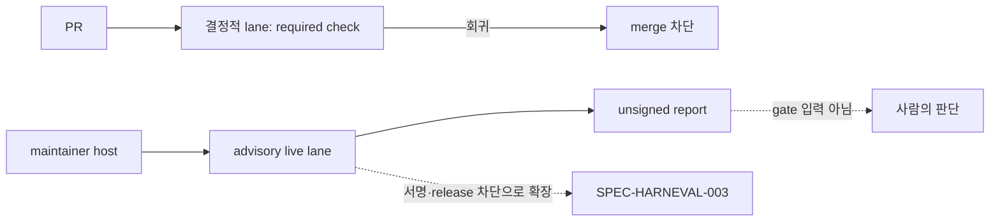

# SPEC-HARNEVAL-001 리서치

## 기존 코드 분석

- 검증 수단은 tracked `*contract*_test.go` 82개다. 집계 pass rate, baseline, delta가 없다. `TestLatestCLIContract_MixedInstall`은 호스트 Codex catalog probe 때문에 로컬에서 실패한다(PRD 관측).
- 생성 표면은 binary에 의존한다. `codex_plugin_manifest.go::codexPluginVersion`이 `version.Version()`(ldflags → BuildInfo → `dev`)을 읽고, template은 binary에 embed된다. host probe 위치는 `codex.go:82`, `opencode_version.go:36`, `antigravity_readiness.go:184-188`, `omp_model_probe_process.go:36-54`다.
- pilot(`scripts/benchmarks/harness/run.py`)의 구조:
  - `execute()`는 `os.environ`을 통째로 상속하고 Seatbelt profile은 codex 명령에만 붙는다(`run.py:97`). oracle은 profile 없이 실행된다(`run.py:105`).
  - 채점은 `copy_candidate`와 `audit` 다음에 oracle을 돌리는 순서다.
  - corpus oracle은 `go test -p 1 ./pkg/<pkg> -run … -count=1` 형식이다. 12개 중 10개 package가 testify, yaml.v3, x/sys 같은 외부 module을 쓰고 `vendor/`는 없다. a04는 prefix 정규식을 쓴다. `apply_mutation`은 `before`가 정확히 1회 일치해야 한다.
- `pkg/evalregression`은 Autopus lane 키만 신뢰하는 strict verifier다. 이 SPEC은 이를 바꾸지 않는다. 서명 경로 분석은 SPEC-HARNEVAL-003 research에 있다.

## Plan Intent Ledger

출처: `prd.md` `### Plan Intent Ledger 재사용`(direct `auto plan`)과 2026-10-06 사용자 결정. 셀은 근거로만 요약했다.

| Field | Status | Source | SPEC 반영 |
|-------|--------|--------|-----------|
| goal | answered | 사용자 D1 + PRD Problem | Outcome Lock, REQ-HE-01~14 |
| scope_split | answered | 사용자 결정(AskUserQuestion, 2026-10-06): 001은 PR lane과 unsigned advisory live lane, 서명·release 차단은 003 | Outcome Boundary, REQ-HE-11 |
| scope_boundary | assumed | PRD Scope Boundary | non-goals. 틀리면 gate에 backend 변경 필요 |
| constraints | answered | autopus.yaml, PRD | 300줄, coverage 85%, PR lane no-LLM |
| done_evidence | assumed | PRD Done Evidence | S1-S15. 틀리면 OPS cutover 기준이 바뀜(CD-3) |
| brownfield_impact | answered | PRD Compatibility | S15, CD-6. pkg/learn은 002 소유 |

## Question Audit

- question_transport: AskUserQuestion
- question_count: 2 (D1 HYBRID, 2026-10-06 범위 분할 결정)
- unresolved_fields: [scope_boundary, done_evidence] — 둘 다 assumed로 남기고 리스크와 Completion Debt로 추적한다.

## Outcome Lock

- User-visible outcome: harness 입력을 바꾸는 PR은 required check `harness-eval`로 결정적 golden-task eval을 받는다. 회귀는 task 이름과 전이로 보인다. maintainer는 macOS host에서 실제 agent A/B를 실행해 unsigned advisory report를 받는다. oracle이 실제로 돌지 않은 세션은 `ok`로 보이지 않는다.
- Mandatory requirements: REQ-HE-01 ~ REQ-HE-13.
- Explicit non-goals: `spec.md` `## Outcome Boundary`의 목록과 같다.
- Completion evidence: S1-S15 PASS, T14 OPS 증거(required check), `auto spec validate --strict` 통과.

## Visual Planning Brief

전체 흐름도는 `plan.md`에 있다. 두 lane의 관계는 다음과 같다.

## 설계 결정

| 결정 | 선택 | 기각한 대안 | 근거와 trade-off |
|------|------|-------------|------------------|
| 범위 분할 (rev 4, 사용자 결정) | 001은 PR lane과 advisory live lane | 한 SPEC에 서명·release까지 | revision 한도를 넘었다. 보안 경계(키, Environment, release)를 별도 SPEC에서 독립적으로 review한다 |
| grader 빌드 환경 | trusted 준비가 읽기 전용 `GOMODCACHE`를 만들고 build cache는 trial마다 APFS clone | grade 안의 빈 module cache, 공유 쓰기 cache, vendoring | probe A1에서 12/12 빌드됐다. 공유 쓰기 cache는 trial 간 오염 경로다. vendoring은 corpus·repo 변경이 필요하다 |
| oracle 판정 이름 | task에 `expected_tests` 고정 | `-run` 정규식에서 추출 | a04 prefix 정규식 때문에 추출할 수 없다 |
| vacuity | calibration 필수, `vacuous`가 최우선 verdict | 결과만으로 판정 | 빌드 실패로 모든 trial이 같이 실패하면 delta 0으로 `ok`처럼 보인다 |
| live 실행 위치 | maintainer macOS host 전용 | GitHub workflow | 001에는 secret이 없다. workflow와 Environment는 003이 소유한다 |
| error 분류 | arm 표면을 넣기 전 실패만 error | pilot 신호 그대로 | candidate가 자기 실패를 분모에서 지울 수 없다 |
| source digest | 기본 config × 5 platform, bookkeeping 제외, version pin | 전체 tree | probe A2에서 bookkeeping만 비결정적이었다 |
| K/threshold | manifest 단일 출처, 초기 K=2, `threshold_bp` −1000, completeness 0.90 | 상수 고정 | 정책이 protocol과 report에 기록된다 |
| 형식 | JSON + strict decode | YAML | stdlib만 쓰고 기존 evalregression 관례와 같다 |

## Minimality Decision Matrix

| Ladder step | Evidence | Decision | Receipt item |
|-------------|----------|----------|--------------|
| actual need | Outcome Lock (a)(b). `ci.yaml`에 eval job이 없고, benchmark는 관측용이며, pilot oracle은 격리되지 않는다 | proceed | PR lane, 격리 advisory live lane |
| existing code/helper/pattern | `Generate` fixture 패턴, `detectTemplateRegenDrift`, pilot 채점(`copy_candidate`, `audit`, `apply_mutation`), `generate.go`, `permissions.py` | reuse | 재생성 비교 추출, pilot 채점·mutation 재사용 |
| stdlib/native | `encoding/json` strict decode, `crypto/sha256`, `os.Lstat`, Python stdlib, `git archive`, `sandbox-exec`, `cp -c` | use | 새 library 없음 |
| existing dependency | cobra, testify, actionlint(`go run`), `go list -deps`, `go mod download` | reuse | 신규 module 의존성 0 |
| new dependency or new abstraction | `[NEW] pkg/harneval`(공유 runner, `pkg/experiment`는 observational 유지 대상), surface driver, grader 준비 script, JSON schema 7종 | accepted | 외부 dependency 0, 새 package 1개 |
| minimum sufficient verification | `go test ./pkg/harneval/... ./internal/cli -run 'EvalHarness'`, Python unittest, actionlint, binary 2개 결정성, mutation self-test, calibration, coverage ≥85% | required checks | 보안(sandbox, env 허용 목록), validation, deterministic-oracle, generated-surface hygiene 유지 |

## Semantic Invariant Inventory

| ID | source clause | invariant type | affected outputs | acceptance IDs |
|----|---------------|----------------|------------------|----------------|
| INV-HE-01 | "pass rate, regression delta를 보고" | numeric formula | result `pass_rate`, `baseline_pass_rate`, `regression_delta` | S3 |
| INV-HE-02 | "task별 전이" | grouping, ordering | `transitions`, `failure_reasons`, summary 행 | S3, S13, S16 |
| INV-HE-03 | "근거 없는 기대값 변경이 있으면 실패" | digest, deduplication | `expectation_digest`, `set_digest` | S4 |
| INV-HE-04 | "produced_at을 빼고 byte-identical" | determinism | result JSON, `surface_digest`, sentinel log | S2 |
| INV-HE-05 | "vacuous 실행, stale templates면 실패" | parser, state ordering | `status`, `failure_reasons`, detail | S1, S5 |
| INV-HE-06 | "파생 path set, main 무조건 실행" | set membership | applicable stdout, matched 목록 | S6 |
| INV-HE-07 | "pass→fail은 --accept-regression과 사유로만" | state transition | baseline 행 | S7 |
| INV-HE-08 | "고정 K trial과 균형 순서, 재시도 없음" | ordering | protocol `order`, record 수, 시작 전 거부 | S8 |
| INV-HE-09 | "pass rate delta, hard flip, completeness로 verdict" | numeric formula, priority | report `regression_delta`, `verdict`, `reason` | S9, S12 |
| INV-HE-10 | review F-002 "oracle 빌드 불가, vacuous ok" | calibration, vacuity | `calibration.status`, 거부 reason, verdict | S10 |
| INV-HE-11 | "surface ≥20, 5 platform, ≥4 category, ≥60% 다중" | numeric formula | coverage test 출력 | S14 |
| INV-HE-12 | review A-F-001/A-F-005 "분모 조작, 비격리 채점" | classification, isolation | record `outcome`, `signal`, grader 쓰기·network 결과, 환경 key 집합 | S11 |

## Feature Coverage Map

| Outcome slice | Covered by | Status |
|---------------|------------|--------|
| happy path: PR eval, baseline 고정, live 세션, advisory report | REQ-HE-01~10 / S3, S9, S12 | covered |
| error/recovery: invalid, stale, unpinned, vacuous, tombstone, 시작 전 거부, calibration 실패, record 불일치, incomplete | REQ-HE-04, 06, 07, 09, 10 / S1, S5, S7, S8, S10 | covered |
| integration boundary: adapter 생성, per-revision driver, grader sandbox와 module cache, GitHub required check | REQ-HE-02, 05, 07, 08, 09 / S2, S6, S8, S10, S11 | covered |
| security: sandbox, env 허용 목록, credential 범위, advisory 경계 | REQ-HE-08, 11 / S11, S12 | covered |
| CLI surface: `auto eval harness run/baseline/applicable/digest/report` | REQ-HE-03, 05, 06, 10 | covered |
| docs/ops: required check 등록 | REQ-HE-05 / T14 | covered (OPS는 completion-debt) |
| 서명된 live 증거와 release 차단 | SPEC-HARNEVAL-003 | approved-sibling |
| incident→golden 승격 | SPEC-HARNEVAL-002 | approved-sibling |

## Completion Debt

| Item | Blocks | Required resolution |
|------|--------|---------------------|
| CD-3 OPS: `harness-eval` required check 등록 | Outcome Lock (a)의 merge 차단 | T14. 증거는 `gh api` 출력이다 |
| CD-1 host probe와 version 전부 고정 | Outcome Lock (a) 결정성 | T2, T13. sentinel이나 S2가 잡는 입력에 pin이 없으면 이 SPEC 안에서 추가한다 |

나머지 PRD Completion Debt(CD-2, CD-5~CD-8)는 T4, T5, T8, T15가 닫는다. 닫히지 않으면 sync 완료를 막는다. advisory lane의 수용한 잔여 위험(A-F-017, A-F-001, F-004)은 debt가 아니다. 근거는 `spec.md` REQ-HE-11에 있고, 차단 lane의 해소는 SPEC-HARNEVAL-003의 must-resolve 항목이다.

## Evolution Ideas

These are optional improvements and do not block sync completion.

| Idea | Why not required now | Promotion trigger |
|------|----------------------|-------------------|
| claude, gemini, opencode로 live lane 확장 | codex lane으로 Outcome Lock을 충족한다 | 사용자가 provider 확장을 요청 |
| live pass-rate 이력을 σ-band 모니터링 입력으로 제공 | 모니터링은 이 gate의 완료 조건이 아니다 | σ-band 작업이 입력을 요구 |
| golden set과 baseline에 CODEOWNERS나 ruleset 적용 | OPS 정책 결정이다 | 운영자가 요청 |
| K 증가와 신뢰구간 기반 판정 | K=2로 Outcome Lock을 충족한다 | advisory 결과의 흔들림이 관측됨 |
| `auto doctor`에 최근 advisory report 표시 (PRD FR-30) | Could 등급이고 Outcome Lock 밖이다 | 사용자가 요청 |

## Sibling SPEC Decision

| Decision | Reason | Sibling SPEC IDs |
|----------|--------|------------------|
| sibling 2개 승인(한도 도달) | 002: 독립된 사용자 결과(사고 → 영구 eval)이고 순서 의존이 있다. 003: 보안·컴플라이언스 경계(서명키, protected Environment, release 차단)이고 사용자가 2026-10-06에 분할을 결정했다. 둘 다 sibling을 만들지 않는다 | SPEC-HARNEVAL-002, SPEC-HARNEVAL-003 |

## Reference Discipline

| Reference | Type | Verification |
|-----------|------|--------------|
| `internal/cli/doctor_drift_source.go::detectTemplateRegenDrift` L70, `diffRegeneratedTemplates` | existing | Read, grep |
| `pkg/adapter/codex/codex_plugin_manifest.go::codexPluginVersion` L115, `pkg/version/version.go` L13-65, `codex.go` `WithModelCatalog` L40·`WithCLIVersion` L50, `opencode_version.go::WithCLIVersion` L22, `pkg/config/defaults.go:84` | existing | grep, probe A2 실행 |
| `pkg/adapter/latest_cli_contract_test.go::generateLatestCLIFixture` | existing | Read |
| `scripts/benchmarks/harness/run.py` `execute` L28·`copy_candidate` L43·L97·L105, `workspace.py::apply_mutation` L57, `permissions.py` L23, `generate.go`, `corpus_a.json`, `corpus_b.json` | existing | grep, Read, probe A1 실행 |
| `.github/workflows/ci.yaml`, tag `v0.50.122`, `/usr/bin/sandbox-exec` | existing | Read, `git tag`, probe A2·A3 실행 |
| `internal/cli/eval_regression_workflow_test.go::TestEvalRegressionADKWorkflowIsRetired` L51 | existing | grep |
| `pkg/harneval/**`, `internal/cli/eval_harness*.go`, `codex.WithPluginBaseVersion`, `pkg/content/regen_drift.go`, `evals/harness/**`, `golden.py`, `surface_driver/main.go`, `grader.sb`, `prepare_grader.py`, `auto eval harness` | [NEW] planned addition | 부재 확인(ls, `Use: "eval` grep 0건) |
| `.claude/**`, `.codex/**`, `.gemini/**`, `.opencode/**`, `.autopus/plugins/**` | generated surface | 편집 대상 아님. source of truth는 `content/`, `templates/`, `pkg/` |

## Reviewer Brief

- Intended scope: rev 4 Outcome Lock (a)(b). 결정적 PR lane과, maintainer host에서 도는 격리된 unsigned advisory live lane이다.
- Explicit non-goals: 서명, release 차단, Environment·secret, live workflow(모두 SPEC-HARNEVAL-003), Autopus/backend 변경, PR마다 LLM, 후보 intake(002), contract test 이동.
- Self-verified: rev 4 처리(`spec.md` Review Resolution), Traceability Matrix, invariant 12개와 oracle, existing/[NEW] 구분, probe A1~A3 실행, 실제 parser EARS 검증.
- Reviewer should focus on: grader 빌드 환경과 calibration(S10), `vacuous` 우선 verdict, advisory 경계와 수용한 잔여 위험의 근거(REQ-HE-11), `expected_tests` 계약, Completion Debt only.

## Self-Verify Summary

- Q-CORR-01 | status: PASS | attempt: 4 | files: spec.md, research.md | reason: 남긴 기존 참조를 다시 확인했고 서명 관련 참조는 003으로 옮겼다
- Q-CORR-03 | status: PASS | attempt: 4 | files: spec.md | reason: 실제 `pkg/spec` parser overlay로 선언 EARS type 일치와 경고 0건을 확인했다
- Q-CORR-04 | status: PASS | attempt: 4 | files: research.md, spec.md, plan.md | reason: 신규 항목은 [NEW], 기존 항목은 Read/grep/실행으로 확인했다
- Q-COMP-01 | status: PASS | attempt: 5 | files: spec.md | reason: `expected_tests`가 digest 공식에 들어가고, record `oracle` 관측과 `calibration.json`이 vacuity 입력으로 정의되며, valid 0의 `pass_rate`는 `null`이다
- Q-COMP-04 | status: PASS | attempt: 4 | files: spec.md, acceptance.md, plan.md | reason: (a)는 S1-S7과 T14가, (b)는 S8-S12가 닫는다. 범위 밖은 003으로 명시했다
- Q-COMP-05 | status: PASS | attempt: 4 | files: research.md, spec.md, plan.md, acceptance.md | reason: INV-HE-01~12가 REQ, T, Must S에 연결되고 calibration·vacuous oracle을 가진다
- Q-COMP-06 | status: PASS | attempt: 4 | files: spec.md, research.md | reason: Traceability Matrix가 14개 REQ를 모두 잇고 Reviewer Brief가 범위를 제한한다
- Q-COMP-07 | status: PASS | attempt: 4 | files: research.md | reason: Completion Debt와 Evolution Ideas를 분리했고 수용한 잔여 위험은 근거와 함께 따로 적었다
- Q-COMP-08 | status: PASS | attempt: 4 | files: plan.md | reason: A1~A3 모두 이번 세션의 실제 실행 증거로 PASS다
- Q-FEAS-03 | status: PASS | attempt: 4 | files: spec.md, plan.md | reason: grader 빌드를 corpus 12개로 실제 실행해 확인했고 기존 test 변경은 0건이다
- Q-SEC-01 | status: PASS | attempt: 4 | files: spec.md, acceptance.md | reason: agent와 grader가 sandbox에서 돌고, report는 어떤 gate 입력도 아니다(S11, S12)
- Q-SEC-02 | status: PASS | attempt: 4 | files: spec.md | reason: 서명키와 GitHub secret을 다루지 않고, Codex credential은 codex 프로세스 환경에만 둔다
