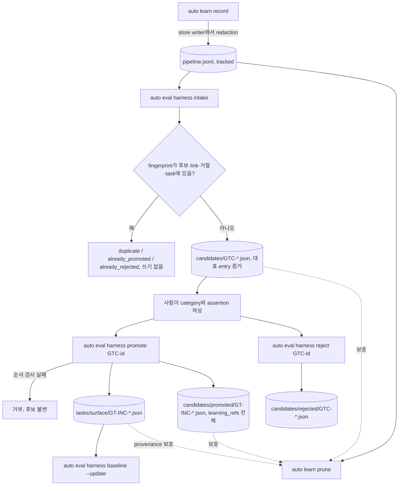

# SPEC-HARNEVAL-002 구현 계획

## Tasks

선행 조건: SPEC-HARNEVAL-001 rev 3의 T1(loader, manifest), T2(hermetic 생성·sentinel), T3(assertion), T4(digest·비교), T5(stale templates), T6(`auto eval harness` 골격)이 merge되어 있어야 한다. T1-T3은 001 없이 시작할 수 있다.

- [ ] T1: `pkg/learn/types.go`, `record.go`, `internal/cli/learn_record.go` — `expected`/`actual`/`repro` 필드와 flag, cap·제어 문자 검증 (REQ-HC-01).
- [ ] T2: `[NEW] pkg/secretscan`. qa detector 14개와 worker 기본 패턴 11개를 원문에 모두 실행해 span을 모으고 병합한 뒤 한 번만 가리는 `Redact`를 만든다. `[NEW] evidence.SecretDetectorSources()`·`security.DefaultPatternSources()` accessor와 출처 일치 drift test, superset·조각 잔존 test를 둔다. `pkg/learn` 쓰기 함수의 일곱 field redaction, `rewriteStore`의 skip 줄 redaction, `learn_record.go` 출력 가림, `auto-workflows.md.tmpl` L2359 직접 append fallback 제거, L2671-2674 Sync Target 4.5를 `--days 90`과 직접 수정 금지로 교체, static test. template 줄을 단언하는 기존 test가 없는지 grep으로 확인 (REQ-HC-01).
- [ ] T3: `[NEW] pkg/harneval/intake/fingerprint.go` — 고정 순서 정규화, `v` 1, scanner 미사용 (REQ-HC-02).
- [ ] T4: `[NEW] pkg/harneval/intake/candidate.go`, `intake.go` — 선택·숫자 순서·grouping·대표 규칙·eligible·중복(후보, link, 거절, task)·충돌·재검증·재redaction·canonical encoding·행 결과와 종료 코드 (REQ-HC-03, REQ-HC-04, REQ-HC-05).
- [ ] T5: `[NEW] pkg/harneval/intake/safepath.go`, `safepath_unix.go`, `safepath_windows.go` — id 형식, `os.Root`와 `Root.Lstat` 구성 요소 검사, regular file, `O_EXCL` 생성, unix 디렉터리 fsync, Windows 쓰기 `platform_unsupported`, windows build tag test. 모든 intake 영역 입출력이 이 helper를 지난다 (REQ-HC-11).
- [ ] T6: `[NEW] internal/cli/eval_harness_intake.go`와 `internal/cli/eval_harness.go` 등록 줄 — flag 조합 검사, JSON stdout·안내 stderr (REQ-HC-03, REQ-HC-04, REQ-HC-05).
- [ ] T7: `[NEW] pkg/harneval/intake/promote.go`, `publish.go`, `[NEW] internal/cli/eval_harness_promote.go` — 1~9 검사(게시 전 `active_set_invalid` 포함), 10 task 게시(temp 이름 규칙, `Root.OpenFile`·`Root.Link`·`Root.Remove`, fsync), 11 사후 검사와 task만 지우는 rollback, 12 link 게시, 13 후보 삭제, 중단 지점별 재실행, `current_outcome` (REQ-HC-06).
- [ ] T8: `[NEW] pkg/harneval/intake/reject.go`, `[NEW] internal/cli/eval_harness_reject.go` — 거절 record 게시와 후보 삭제 (REQ-HC-10).
- [ ] T9: `[NEW] pkg/harneval/intake/links.go`, `pkg/learn/prune.go::PruneExcept`, `internal/cli/learn_prune.go` — lock 안 callback, 파일 범위, 관대한 task 읽기, fail-closed, K 출력 (REQ-HC-07).
- [ ] T10: `[NEW] pkg/harneval/intake/isolation_test.go` — 001 run 결과 동일성과 `go list -deps ./pkg/harneval` closure 검사 (REQ-HC-08).
- [ ] T11: `evals/harness/README.md` intake 절과 세 명령 help text (REQ-HC-09).
- [ ] T13: `.github/workflows/ci.yaml`. ubuntu `test` job에 `GOOS=windows GOARCH=amd64 go vet ./pkg/harneval/intake/`를 더한다. 기존 `windows-runtime` job에는 `go test ./pkg/harneval/intake/ -run 'PlatformUnsupported' -count=1`을 더한다. 새 action과 `version: latest`가 없고 omp-native-smoke 구간 밖이며, ci.yaml을 읽는 기존 test 8개가 수정 없이 통과한다 (REQ-HC-11).
- [ ] T12: 회귀 검증. `go test ./pkg/learn/... ./pkg/secretscan/... ./pkg/qa/evidence/... ./pkg/worker/security/... ./pkg/harneval/...`는 필터 없이 전체를 돌린다. 여기에 `go test ./internal/cli -run 'Learn|EvalHarness'`, `GOOS=windows GOARCH=amd64 go build ./...`, `GOOS=windows go test -c ./pkg/harneval/intake/`를 더한다. 기존 test 변경 0건과 coverage 85% 이상을 확인한다.

## Implementation Strategy

- secret은 처음 쓰는 곳에서 가린다. store writer가 유일한 Go 쓰기 경계(`record.go`의 `AppendAtomic`)다. 문서상의 직접 append 경로(template)는 없앤다. detector는 두 기존 detector의 정규식 전체를 원문 기준 span 병합으로 합성한다. 두 package는 옮기지 않고 출처 accessor만 더한다.
- eval 쪽 로직은 subpackage `pkg/harneval/intake`에 모은다. 001 closure에 `pkg/learn`이 들어가지 않고, `pkg/learn`도 eval 파일을 읽지 않는다. prune 보호는 callback으로 넘긴다.
- intake 영역은 001이 이미 예약한 `evals/harness/candidates/` 아래에 둔다(열린 후보, `promoted/`, `rejected/`). 001을 고치지 않고도 평가에서 빠진다.
- 열린 후보는 사람만 편집하고, intake는 새 파일만 만든다. 승격과 거절은 후보 하나를 받아 영구 record로 옮긴다. 근거 entry 목록은 그 record가 계속 보관한다.
- 게시는 모두 `os.Root` 메서드로 temp → fsync → `Root.Link` → 디렉터리 fsync 순서다. 같은 bytes를 만나면 이어서 진행하므로 중단 뒤 재실행이 수렴한다.

## Visual Planning Brief

UI가 없는 CLI 작업이다(wireframe intent: not applicable).



```text
record  : auto learn record --type <t> --pattern <p> --expected <e> --actual <a> --repro <cmd>
intake  : auto eval harness intake --all-eligible | --learning L-NNN[,L-MMM] [--expected e --actual a] --format json
promote : auto eval harness promote GTC-<12hex> --format json
reject  : auto eval harness reject GTC-<12hex> --reason "<text>"
pin     : auto eval harness baseline --update        (SPEC-HARNEVAL-001)
prune   : auto learn prune --days N                   (intake 영역이나 manifest가 있으면 연결 entry 보존)
```

## Feature Completion Scope

- 이 SPEC 하나가 자기 Outcome Lock(redaction → 후보 → 사람 승인·거절 → 영구 eval과 link → prune 보존)을 닫는다. T1-T9가 흐름을, T10-T12가 격리·문서·회귀를 닫는다.
- 범위 증가 고지: review 반영으로 task가 9개에서 12개로 늘었다(secret detector, 경로 helper, 거절 명령), rev 5에서 CI task T13이 더해져 13개다. 모두 review의 보안·정확성 finding에서 왔다. sibling은 만들지 않는다.
- SPEC-HARNEVAL-001에 의존한다. 001의 완료 조건에는 영향을 주지 않는다. 001 선행 task가 merge되기 전에는 T4 이후 중 001 loader가 필요한 부분(T7 사후 검사, `current_outcome`, S6, S8)을 닫을 수 없다(CD-HC-1).

## Risk-First Integration Probe

| assumption_id | class | risk | boundary | input | oracle | isolation | status | reason | evidence |
|---------------|-------|------|----------|-------|--------|-----------|--------|--------|----------|
| A1 | verified_fact | high | span 병합 union detector의 형식 범위, 겹침 처리, 멱등성, 조각 잔존 | 실행 중 만든 fixture 31개(형식별 19, worker 전용 6, 겹침 2, qa 전용 할당, legacy 문구, 오탐 문장, 일반 문장) | 모든 secret fixture가 가려지고, 다시 적용해도 같으며, 출력에 placeholder 밖 span 0개, 8자 이상 조각 0건 | scratch 프로그램과 `go test -overlay`, repo 파일 미수정 | PASS | 31개 모두 기대대로였다. 같은 겹침 fixture에서 rev 4 순차 합성(`RedactText` overlay 다음 worker 패턴)은 40자 값을 남겼다 | 2026-10-06 `go run <session-scratchpad>/probes/spanmerge/main.go`, `go test -overlay overlay_union.json ./pkg/qa/evidence -run TestHarnevalProbeUnion` |
| A2 | verified_fact | high | 현재 `learn.Prune` rewrite가 struct에 없는 field를 보존하는지 | `expected`, `actual`을 가진 JSONL 2줄(오래된 1, 최근 1), `Prune(store, 30)` | 최근 entry가 남는지, 새 field가 보존되는지 관측 | `go test -overlay` scratch test | PASS | removed=1이었고 남은 entry에서 `expected`와 `actual`이 사라졌다. 이 SPEC 이전 binary의 prune은 새 field를 지운다는 뜻이다. 그래서 link record와 후보가 사본을 갖게 하고 README에 적는다(REQ-HC-07, REQ-HC-09) | 2026-10-06 `go test -overlay overlay_hc.json ./pkg/learn -run TestHarnevalProbeHC -count=1 -v` ok, `<session-scratchpad>/probes/probe-hc.log` |
| A3 | implementation_assumption | medium | SPEC-HARNEVAL-001 loader·evaluator로 초안을 검증하고 단일 task를 평가하는 경계 | 001 T1-T6 이후의 loader, evaluator, manifest | promote의 6·10단계가 001 detail을 그대로 전달하고, `current_outcome`이 001 평가와 같음 | 001 merge 뒤 package test | not-run | 001 loader와 evaluator가 아직 없다. 001 선행 task merge 뒤 Phase 1.9에서 실행한다(CD-HC-1) | - |

## Plan Statement Classification

| Statement | Class | Evidence |
|-----------|-------|----------|
| 자동 승격은 없다. promote와 reject는 후보 하나만 받는다 | requirement_invariant | REQ-HC-06, REQ-HC-10, PRD non-goal |
| `repro`는 어떤 경로에서도 실행하지 않는다 | requirement_invariant | REQ-HC-05, S5 |
| `pkg/worker/security`는 `pkg/adapter`, `pkg/config`, `pkg/detect`, `pkg/processprobe`에 의존한다 | verified_fact | `go list -deps ./pkg/worker/security` 실행(2026-10-06) |
| `pkg/qa/evidence`의 in-module 의존은 `pkg/qa/desktopobserve` 하나다 | verified_fact | `go list -deps ./pkg/qa/evidence`(2026-10-06) |
| 기존 learn test에는 새 detector 패턴에 걸리는 문자열이 없다 | verified_fact | 할당·경로·Bearer·URL 패턴 grep 0건(2026-10-06) |
| Go 코드의 learn store writer는 `AppendAtomic` 하나이고, template 하나가 store 직접 append를 지시한다 | verified_fact | `AppendAtomic(` grep, `auto-workflows.md.tmpl:2359` grep(2026-10-06) |
| 현재 learnings 3건은 새 detector로 바뀌지 않는다 | verified_fact | A1 |
| 이전 binary의 prune rewrite는 새 field를 지운다 | verified_fact | A2 |
| `os.Root`가 Windows에서도 root 밖 이탈을 막는다 | implementation_assumption | repo 선례 `codex_hooks_io.go:20`, Go 문서. Windows 쓰기는 `platform_unsupported`라 영향이 읽기 scan으로 한정된다 |
| learn store에는 프로세스 간 잠금이 없다 | implementation_assumption | `store.go`의 `sync.Mutex` 판독. 이 SPEC은 in-process 보장만 약속한다 |
| go1.26.6 toolchain에 `(*os.Root).Link`가 있다 | verified_fact | `go doc os.Root.Link`(2026-10-06), `go.mod` toolchain go1.26.6 |
| `Root.Link`는 대상이 있으면 EEXIST로 실패하고 root 밖에 link를 만들지 않는다 | implementation_assumption | Go 문서. S6 중단 재실행과 S10 oracle이 확인 |
| 001 loader·evaluator가 초안 검증과 단일 task 평가에 그대로 쓰인다 | implementation_assumption | A3 |

## Gate Applicability

- `{SPEC_DIR}/gate-applicability.json`은 아직 없다. 구현 handoff에서 `auto spec gates`가 쓴 값만 쓴다. learning 데이터 삭제(prune), secret 처리, 경로 confinement를 다루므로 classifier가 `security_or_data`로 분류할 것으로 예상하며, 이 예상은 판정이 아니다.
- security, validation, data_loss, deterministic_oracle gate는 `not_applicable`이 될 수 없다. UI 경로가 없으므로 accessibility와 ux_verification은 classifier에 맡긴다.
- scope expansion 규칙: 요구사항보다 넓은 제약(예: 후보 자동 만료, learn store 암호화, 추가 승인자)은 요구사항으로 올리지 않고 scope expansion으로 표시한 뒤 fan-out 전에 probe 행을 추가한다(최대 3행).
