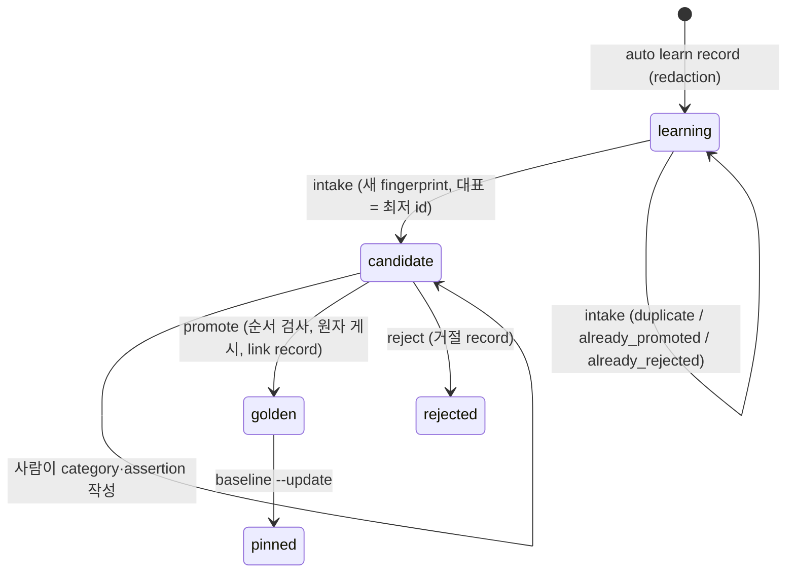

# SPEC-HARNEVAL-002 리서치

## 기존 코드 분석

- `pkg/learn/types.go::LearningEntry`의 필드는 `id`(`^L-\d{3,}$`), `timestamp`, `type`, `phase`, `spec_id`, `files`, `packages`, `pattern`, `resolution`, `severity`, `reuse_count`다. expected/actual, 재현 명령, fingerprint, status가 없다.
- `pkg/learn/store.go`: `.autopus/learnings/pipeline.jsonl`(tracked, 3줄), in-process `sync.Mutex`, `ReadTolerant`는 `json.Unmarshal`로 읽고 깨진 줄은 `SkipRecord`로 보존한다. writer는 `record.go`의 `AppendAtomic` 하나다. `prune.go::Prune(store, days)`는 나이만 보고, `rewrite.go::rewriteStore`가 줄 순서대로 다시 쓰면서 struct에 없는 field를 지운다(probe A2).
- CLI: `auto learn record|query|prune|summary`. prune 출력은 `internal/cli/learn_prune.go:43`의 `Removed %d entries older than %d days.`다. `--files`는 `StringSliceVar`라 쉼표 뒤 공백이 남는다.
- secret 처리: `pkg/worker/security/secret_scanner.go`는 sk-proj-·sk-ant-·github_pat_·ghu_ 등을 놓친다. package 전체는 `pkg/adapter` 등에 의존하고, 내부 test가 비공개 `redactedPlaceholder`를 쓴다. `pkg/qa/evidence/redaction.go::RedactText`(L22-31)는 repo에서 가장 넓은 detector이고, in-module 의존은 `pkg/qa/desktopobserve` 하나다. `learn_record.go:68`은 원문 pattern을 stdout에 쓴다. `templates/claude/commands/auto-workflows.md.tmpl`의 L2359는 실패 시 store 직접 append를 지시한다. L2671-2674(Sync Target 4.5)는 항상 실패하는 `--max-age 90d`와 직접 삭제 fallback을 쓴다. `--max-age`는 `IntVar`다(`learn_prune.go:49`). `content/`에는 이 문구가 없다.
- 후보 선례: `pkg/qa/promote::Promote`(다른 내용의 active 파일을 덮어쓰지 않음, `activeScenarioIDs` 가드), `pkg/skillevolve::GenerateCandidates`(fingerprint별 quarantine).
- SPEC-HARNEVAL-001 rev 3: `harness_golden_task.v1` 필드, detail code 목록, quarantine 경로(`evals/harness/candidates` 이하) active 선언 거부, `## Existing Test Changes`. 기본 full config 생성 결과에 `.codex/hooks.json`이 있다(001 probe A2 tree).

## Plan Intent Ledger

출처: `../SPEC-HARNEVAL-001/prd.md` `### Plan Intent Ledger 재사용`(direct `auto plan`). 셀은 근거로만 요약했다.

| Field | Status | Source | SPEC 반영 |
|-------|--------|--------|-----------|
| goal | answered | PRD 동기("production incident는 영구 eval") | Outcome Lock, REQ-HC-03, REQ-HC-06 |
| scope_boundary | assumed | PRD Scope Boundary | 자동 승격 금지, backend 불변. 틀리면 intake 정책 재설계 |
| constraints | answered | autopus.yaml | 300줄, coverage 85% |
| done_evidence | assumed | PRD Done Evidence | S1-S8, S10, S11. 틀리면 승격 완료 기준이 바뀜 |
| brownfield_impact | answered | PRD `brownfield_impact` 행 | pkg/learn schema·쓰기 경계·prune은 이 SPEC 소유, S1, S7 |

## Question Audit

- question_transport: AskUserQuestion
- question_count: 1 (plan 세션의 D1 HYBRID를 공유, 이 SPEC 전용 질문 없음, 세션 전체 3회)
- unresolved_fields: [scope_boundary, done_evidence]

## Outcome Lock

- User-visible outcome: maintainer가 사고를 기록하면 secret이 가려진 채 저장된다. 한 명령으로 quarantine 후보가 생기고, assertion을 쓴 뒤 한 명령으로 영구 golden task가 되거나 거절된다. 그 그룹의 모든 근거 entry는 manifest 유무와 관계없이 prune에서 지워지지 않는다.
- Mandatory requirements: REQ-HC-01 ~ REQ-HC-08, REQ-HC-10, REQ-HC-11.
- Explicit non-goals: `spec.md` `## Outcome Boundary`의 목록과 같다.
- Completion evidence: S1-S8, S10, S11 PASS, SPEC-HARNEVAL-001 선행 task merge, `auto spec validate --strict` 통과.

## Visual Planning Brief

전체 흐름도는 `plan.md`에 있다. 상태 전이는 다음과 같다.

## 설계 결정

| 결정 | 선택 | 기각한 대안 | 근거와 trade-off |
|------|------|-------------|------------------|
| secret 처리 위치 | store writer(첫 쓰기 경계)에서 span 병합 detector로 redaction | 후보에서만 가림, raw를 untracked quarantine에 0600 보관 | tracked store에 원문이 남지 않는다. 단점: 오탐 문구도 가려진다 |
| detector (rev 5) | `pkg/secretscan.Redact` = qa 14개와 worker 11개를 원문에 모두 실행해 span 병합 뒤 한 번 치환 | 순차 적용(rev 4), qa detector + 3종, worker scanner 이동 | 어느 쪽 detector의 coverage도 잃지 않는다(probe A1). 단점: worker 패턴 때문에 오탐이 는다. worker scanner를 옮기지 않으므로 내부 test가 그대로다 |
| 게시·rollback (rev 3) | 게시 전 active set 검사, task 게시 → 사후 검사(실패 시 task만 삭제) → link → 후보 삭제 | 후보를 먼저 지우는 순서 | rollback이 사람이 쓴 assertion을 잃지 않는다 |
| Windows (rev 3) | `os.Root` 공통, 쓰기는 unix 전용, Windows 쓰기 `platform_unsupported` | `O_NOFOLLOW` 공통 사용 | Windows build를 깨지 않고 의미를 명시한다 |
| fingerprint 입력 | v 1 + type + 정규화 pattern + files + packages, scanner 미사용 | redaction 후 hash, phase 포함 | scanner 패턴 변화로 기존 fingerprint가 흔들리지 않는다. 단점: 다른 phase의 같은 문구가 묶인다 |
| 그룹 증거 | 최저 id 대표 entry에서만 가져옴 | member 병합 | 결정적이고 검증할 수 있다. 다른 member 문구는 store에 보호된 채 남는다 |
| 승격 뒤 보존 | 영구 link record(`promoted/`)에 `learning_refs`와 사본 | 001 task에 field 추가 | 001 strict schema를 바꾸지 않는다 |
| intake 영역 | 001이 예약한 `candidates/` 아래 | 새 최상위 디렉터리 | 001 수정 없이 평가에서 빠진다 |
| 거절 | `reject` 명령과 거절 record | 파일 삭제 | 삭제는 다음 intake에서 같은 후보를 다시 만든다 |
| 게시 (rev 4) | `os.Root` 메서드만으로 temp + fsync + `Root.Link` + 디렉터리 fsync | 경로 기반 `os.Link`, 대상에 직접 O_EXCL 쓰기 | 부분 파일이 생기지 않고, 재실행이 수렴하며, root 밖으로 나가지 않는다 |
| 중복 처리 | 기존 파일 무수정, 나중 중복은 미연결 | 후보에 ref 추가 | 사람이 편집 중인 후보를 건드리지 않는다. 단점: 나중 중복 entry는 보호받지 않는다 |
| `--kind` | surface만 | agent 허용 | agent task는 corpus mutation과 oracle이 필요하고 PR lane에서 평가할 수 없다 |

## Minimality Decision Matrix

| Ladder step | Evidence | Decision | Receipt item |
|-------------|----------|----------|--------------|
| actual need | 사고가 영구 eval이 되지 못하고, prune이 근거를 지우며, tracked store에 secret이 남을 수 있다 | proceed | redaction, intake, promote, reject, prune 보호 |
| existing code/helper/pattern | `AppendAtomic`, `ReadTolerant`, `rewriteStore`, `pkg/qa/promote`의 덮어쓰기 금지와 id 가드, skill-evolve quarantine, `pkg/qa/evidence.RedactText`, `os.OpenRoot` 선례 | reuse | store·rewrite·detector 재사용, promote 가드 차용 |
| stdlib/native | `crypto/sha256`, `encoding/json`, `path.Clean`, `strings.Fields`, `os.OpenRoot`·`Root.Lstat`·`Root.Link`·`Root.Remove`, `O_EXCL`, `File.Sync`(unix) | use | 새 library 없음 |
| existing dependency | cobra, testify, SPEC-HARNEVAL-001 loader·evaluator | reuse | 신규 module 의존성 0 |
| new dependency or new abstraction | `[NEW] pkg/secretscan`(두 detector의 span 병합 합성), `[NEW] pkg/harneval/intake`, record schema 3종, `learn.PruneExcept` | accepted | 합성 package 1개, 출처 accessor 2개, subpackage 1개, 함수 1개 |
| minimum sufficient verification | `go test ./pkg/learn/... ./pkg/secretscan/... ./pkg/worker/security/... ./pkg/harneval/...`(필터 없음), `go test ./internal/cli -run 'Learn\|EvalHarness'`, coverage ≥85% | required checks | data-loss(prune fail-closed, 원자 게시), security(redaction, 경로 confinement, repro 미실행), deterministic-oracle(SHA-256 값) 유지 |

## Semantic Invariant Inventory

| ID | source clause | invariant type | affected outputs | acceptance IDs |
|----|---------------|----------------|------------------|----------------|
| INV-HC-01 | "fingerprint" (PRD Sibling 결정) | normalization, digest | `fingerprint`, 후보 id | S2 |
| INV-HC-02 | "lesson/incident를 golden-task 후보로" | ordering, grouping, representative | 행 순서, `learning_refs`, 대표 증거 | S3 |
| INV-HC-03 | "중복 제거", review F-008 "거절 재생성" | deduplication | 행 결과, 후보 SHA-256 | S4 |
| INV-HC-04 | 보안 NFR "private material 0" | redaction mapping, span merge | store bytes, 후보 문구, `redacted_fields`, detector 출력 | S1, S5, S11 |
| INV-HC-05 | "quarantine을 거쳐 사람 승인으로 promote" | state transition, ordering | task·link 파일, reason detail | S6 |
| INV-HC-06 | "prune은 promoted/linked entry를 지우지 않는다" | set membership, fail-closed | 남은 id, stdout, store SHA-256 | S7 |
| INV-HC-07 | "candidates는 절대 평가하지 않는다" | isolation | 001 result JSON, `set_digest`, closure | S8 |
| INV-HC-08 | brownfield 호환 | schema compatibility | JSONL key 집합 | S1 |
| INV-HC-09 | review HC-003 "경로 이탈" | path confinement | 종료 코드, 바깥 파일 SHA-256 | S10 |
| INV-HC-10 | review HC-009 "성공 승격의 repro 미실행" | non-execution | sentinel 로그 | S5 |

## Feature Coverage Map

| Outcome slice | Covered by | Status |
|---------------|------------|--------|
| happy path: record → intake → assertion → promote → baseline | REQ-HC-01, 03, 06 / S1, S3, S6 | covered |
| error/recovery: 누락, 중복, 충돌, 거절, 제어 문자, 검사 실패, 중단 재실행, 읽기 실패 | REQ-HC-03~07, 10 / S3-S7 | covered |
| integration boundary: learn store writer, 001 loader·evaluator·manifest, secret detector | REQ-HC-01, 06, 07, 08 / S1, S6, S7, S8 | covered (001 경계는 CD-HC-1) |
| security: 첫 쓰기 redaction, 경로 confinement, repro 미실행 | REQ-HC-01, 05, 11 / S1, S5, S10 | covered |
| CLI surface: `learn record` flag, `eval harness intake/promote/reject`, `learn prune` 출력 | REQ-HC-01, 03, 06, 07, 10 | covered |
| docs/ops: README 흐름과 주의 3종 | REQ-HC-09 / S9 | covered |
| golden-task 형식, runner, baseline | SPEC-HARNEVAL-001 | approved-sibling |

## Completion Debt

| Item | Blocks | Required resolution |
|------|--------|---------------------|
| CD-HC-1 SPEC-HARNEVAL-001 선행 task(T1-T6) 미구현 | REQ-HC-06의 사후 검사와 `current_outcome`, S6, S8, probe A3 | 001 선행 task merge 뒤 T7, T10을 닫고 A3를 실행한다. 그 전에는 sync 완료가 아니다 |

잔여 위험(debt 아님, 이 SPEC으로 고칠 수 없음): 이 SPEC 이전 binary의 prune은 보호 집합을 모르고 새 field를 지운다. 영구 record의 사본과 README 주의로 완화한다.

## Evolution Ideas

These are optional improvements and do not block sync completion.

| Idea | Why not required now | Promotion trigger |
|------|----------------------|-------------------|
| CI 실패 hook이 learning을 자동 기록 | Outcome Lock은 수동 기록으로 충족한다 | 사용자가 자동 수집을 요청 |
| 나중 중복 entry를 영구 link record에 명시적으로 연결하는 명령 | 그룹 형성 시점의 근거로 Outcome Lock을 충족한다 | 중복 entry 보존 요구가 관측됨 |
| 반복 횟수 기반 우선순위 표시 | 사고 한 건도 후보가 되어야 한다 | 후보 과다 |
| 셸 history를 피하는 stdin 입력 flag | README 주의로 충분하다 | 운영자가 요청 |

## Sibling SPEC Decision

| Decision | Reason | Sibling SPEC IDs |
|----------|--------|------------------|
| 이 SPEC은 승인된 sibling이며 새 sibling을 만들지 않는다 | Primary SPEC-HARNEVAL-001이 형식을 소유하고, 이 SPEC은 독립된 사고 → 영구 eval 결과를 소유한다. 재귀 sibling 금지 | SPEC-HARNEVAL-001 |

## Reference Discipline

| Reference | Type | Verification |
|-----------|------|--------------|
| `pkg/learn/types.go`, `store.go`(`sync.Mutex` L18, `ReadTolerant` L65, `AppendAtomic` L130), `record.go` L14, `prune.go` L7, `rewrite.go` L19 | existing | Read, grep |
| `internal/cli/learn_record.go` flag L73-80, `internal/cli/learn_prune.go` 출력 L43 | existing | grep |
| `pkg/worker/security/secret_scanner.go` `NewSecretScanner` L51, `Scan` L70, `ContainsSecret` L79, 내부 test의 `redactedPlaceholder` | existing | grep, `go list -deps` |
| `pkg/qa/evidence/redaction.go::RedactText` L22-31, `learn_record.go:68`, `learn_subcmd_test.go:80,113`, `auto-workflows.md.tmpl:2359`, `os.OpenRoot` 선례 `codex_hooks_io.go:20`·`signed_pair_io.go:43` | existing | grep, Read, probe A1 실행 |
| `pkg/qa/promote/promote.go::Promote` L112, `activeScenarioIDs` L201; `pkg/skillevolve/generator.go::GenerateCandidates` | existing | Read |
| `.autopus/learnings/pipeline.jsonl` (tracked, 3줄) | existing | `git ls-files`, `wc -l` |
| `pkg/secretscan`, `pkg/harneval/intake/**`, `learn.PruneExcept`, `internal/cli/eval_harness_{intake,promote,reject}.go`, record schema 3종, `candidates/promoted`, `candidates/rejected` | [NEW] planned addition | 부재 확인(ls) |
| `pkg/harneval`, `internal/cli/eval_harness.go`, `evals/harness/**`, `auto eval harness run/baseline` | [NEW] SPEC-HARNEVAL-001 planned addition | 001 rev 3 문서 |

## Reviewer Brief

- Intended scope: 첫 쓰기 redaction, learning → 후보 → 승인·거절 → 영구 eval과 link → prune 보존, 경로 confinement. task 9→12개 증가 근거는 `plan.md`에 있다.
- Explicit non-goals: 자동 승격, assertion 자동 생성, agent kind 사고, repro 실행, 001 형식 변경, 이전 binary 동작, 프로세스 간 동시성, backend.
- Self-verified: 17개 finding 처리(`spec.md` Review Resolution), Traceability Matrix, invariant 10개와 SHA-256 oracle, 실제 parser EARS 검증, probe 2건 실행.
- Reviewer should focus on: 쓰기 경계 redaction의 완전성, 경로 confinement, promote 순서와 원자 게시, 그룹 보존과 prune fail-closed, Completion Debt only.

## Self-Verify Summary

- Q-CORR-01 | status: PASS | attempt: 2 | files: research.md, spec.md | reason: 기존 참조를 다시 확인했고 prune 출력 줄을 L43으로 고쳤다
- Q-CORR-02 | status: PASS | attempt: 2 | files: spec.md, plan.md | reason: 신규 package, 명령, record, 디렉터리를 모두 [NEW]로 표시했다
- Q-CORR-03 | status: PASS | attempt: 2 | files: spec.md | reason: EventDriven 문장을 `WHEN …, THEN THE SYSTEM SHALL`로 고쳤고 실제 parser overlay로 선언 type 일치를 확인했다
- Q-CORR-04 | status: PASS | attempt: 2 | files: research.md | reason: Reference Discipline이 existing과 [NEW], 001 계획 항목을 구분한다
- Q-COMP-01 | status: PASS | attempt: 2 | files: spec.md, plan.md, acceptance.md, research.md | reason: 네 문서가 계약, 계획, oracle, 근거를 나눠 맡는다
- Q-COMP-02 | status: PASS | attempt: 2 | files: spec.md, acceptance.md | reason: 11개 REQ가 T와 S에 모두 연결되고 성공 승격 비실행과 closure 검사가 S5, S8에 있다
- Q-COMP-03 | status: PASS | attempt: 2 | files: spec.md | reason: 행 결과 형식, 종료 코드 0/2/1, `current_outcome` 값, 출력 채널을 정의했다
- Q-COMP-04 | status: PASS | attempt: 2 | files: spec.md, acceptance.md | reason: link record로 대표가 아닌 ref와 flag 사본이 승격 뒤에도 보존되고 manifest 없는 project도 보호한다(S6, S7)
- Q-COMP-05 | status: PASS | attempt: 4 | files: research.md, acceptance.md | reason: 형식별 detector oracle(S11), prune 전후 fingerprint·store 불변, `promote_rolled_back`, 중단 지점별 재실행, active task 읽기 실패 oracle을 추가했다
- Q-COMP-06 | status: PASS | attempt: 2 | files: spec.md, research.md | reason: Traceability Matrix와 Reviewer Brief가 범위를 제한한다
- Q-COMP-07 | status: PASS | attempt: 2 | files: research.md | reason: Completion Debt에 001 선행 의존을 정직하게 남겼고 Evolution Ideas에는 ID가 없다
- Q-COMP-08 | status: PASS | attempt: 2 | files: plan.md | reason: A1·A2는 실행 증거로 PASS, A3는 001이 없어 not-run이며 이유를 남겼다
- Q-FEAS-01 | status: PASS | attempt: 2 | files: spec.md | reason: 변경은 Go 코드와 CLI이고 문서만으로 약속하는 동작이 없다
- Q-FEAS-02 | status: PASS | attempt: 3 | files: spec.md | reason: scanner를 옮기지 않아 내부 test가 그대로이고, Windows는 build tag로 분리하며, 001 소유 파일은 등록 줄만 고친다
- Q-FEAS-03 | status: PASS | attempt: 3 | files: plan.md, research.md | reason: 검증 명령이 관련 package 전체 test, Windows build, windows test 컴파일을 포함한다
- Q-STYLE-01 | status: PASS | attempt: 2 | files: spec.md | reason: 실제 parser 검사에서 모호어 경고 0건이었다
- Q-STYLE-02 | status: PASS | attempt: 2 | files: spec.md, acceptance.md | reason: Priority는 Must/Should만 쓰고 EARS type과 분리했다
- Q-STYLE-03 | status: PASS | attempt: 2 | files: acceptance.md | reason: 시나리오는 bare Given/When/Then/And 형식이다
- Q-SEC-01 | status: PASS | attempt: 3 | files: spec.md | reason: 첫 저장 경계가 Go writer, CLI 출력, template 경로를 모두 덮고 intake 영역 접근은 `os.Root`로 제한한다
- Q-SEC-02 | status: PASS | attempt: 5 | files: spec.md, acceptance.md | reason: 두 기존 detector의 union과 잃었던 형식별 oracle(S11), 일곱 field와 stdout redaction(S1), sync prune 직접 수정 제거, `os.Root` 게시(S10)
- Q-SEC-03 | status: PASS | attempt: 3 | files: spec.md | reason: tracked artifact와 CLI 출력이 모두 가려진 데이터만 담고, skip 줄도 rewrite 때 가린다
- Q-COH-01 | status: PASS | attempt: 2 | files: spec.md | reason: 사고를 영구 eval로 만드는 한 흐름에 수렴한다
- Q-COH-02 | status: PASS | attempt: 2 | files: research.md | reason: Outcome Lock을 막는 001 의존은 Completion Debt로 남겨 sync를 막는다
- Q-COH-03 | status: PASS | attempt: 2 | files: research.md | reason: sibling 결정은 001과 이 SPEC 두 개로 끝나고 재귀가 없다
