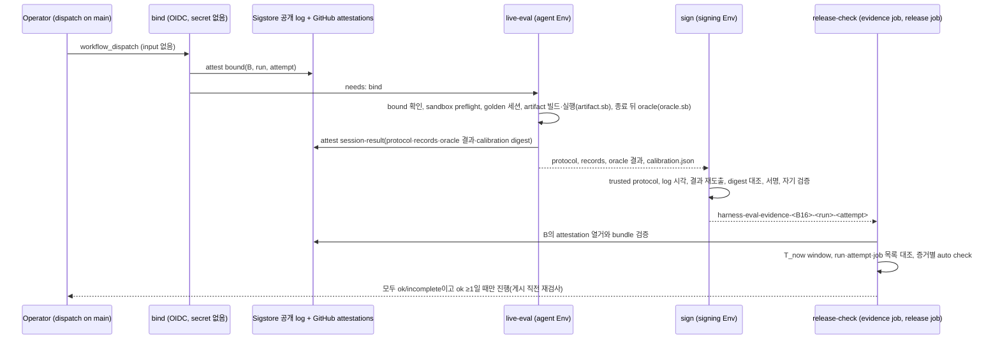

# SPEC-HARNEVAL-003 구현 계획

## Tasks

선행 조건: SPEC-HARNEVAL-001 rev 4의 T1-T13이 merge되어 있어야 한다. T8은 probe A2, T9·T13·T15는 probe A3(black-box calibration과 읽기 거부) 결과로 고정한 뒤 fan-out한다. T7의 merge는 A2 PASS가 조건이다. A2 FAIL이면 T7을 merge하지 않고 SPEC을 개정한다(REQ-HR-07 분기).

- [ ] T1: `[NEW] pkg/evalregression/sign_v2.go`와 상수 `ADKHarnessEvalKeyID`, `ADKHarnessEvalTrustLane` — 기존 statement builder로 서명, round-trip test (REQ-HR-03, REQ-HR-05).
- [ ] T2: `[NEW] pkg/harneval/protocol_trust.go`, `derive.go`와 001 `records.go` decoder 확장 — trusted protocol 재구성, `--run-meta`, 검증된 log 시각 범위, attest된 records·oracle 결과 bytes로 REQ-HR-08 판정표 재적용, `calibration.json`의 digest·session·task 집합·status 일관성 확인, attestation digest 대조(누락 포함), 정책 한도 (REQ-HR-02, REQ-HR-09).
- [ ] T3: `[NEW] pkg/harneval/report_v1.go`, `[NEW] internal/cli/eval_harness_export.go` — 변환 표, stdin key 순서(`private_key_missing` 먼저), 새 출력 디렉터리, 허용 목록 자식 환경 (REQ-HR-03).
- [ ] T4: `[NEW] pkg/harneval/binding.go`, `[NEW] internal/cli/eval_harness_policy.go` — `runner_tree_digest`, `model`, `baseline_commit`을 포함한 binding (REQ-HR-04).
- [ ] T5: `[NEW] .github/workflows/harness-eval-live.yml` — bind·live-eval·sign, pinned `actions/attest`, 권한 집합, `attempt_unbound` 검사, `env -u`, static contract test (REQ-HR-01).
- [ ] T6: `[NEW] internal/cli/eval_harness_lane_test.go`. 다룰 것: Autopus 실제 값으로 양방향 cross-lane, 자기 검증, runbook lane 절과 키 회전(진행 중 run 취소 포함), `internal/cli/eval_regression.go`의 v1 helper 두 개를 test 전용 파일로 이동, v1 non-test 호출자 0 static test, `verify_e2e_test.go` L120·L138 변경 (REQ-HR-05).
- [ ] T7: `[NEW] pkg/harneval/releasecheck.go`, `[NEW] internal/cli/eval_harness_releasecheck.go`, `.github/workflows/release.yaml`. 다룰 것: job permissions(`actions: read`, `attestations: read`), 두 출처 공통의 bound log 시각 window와 닫힌 경계, step 안에서 읽는 `T_now`, 두 검사 step의 `timeout-minutes: 15`, run key 귀속과 golden 세션 step 시작 여부(`run_not_ok`보다 먼저), 두 출처 대조, 검증된 `regression_blocked` 뒤의 reason 판독, `harness-eval-evidence` job과 `release` job 재검증 step, `release_contract_test.go` L15 변경. merge는 A2 PASS 뒤다 (REQ-HR-06).
- [ ] T8: attestation 기록과 열거. probe A2로 삭제 권한, bundle 검증 경로, timestamp 출처를 확인한 뒤 bind·session-result attestation과 release 쪽 열거·검증을 구현한다. 시각은 검증된 timestamp만 쓰고 없으면 `attestation_timestamp_missing`이다. session-result predicate에는 `calibration_sha256`이 들어간다 (REQ-HR-07, CD-HR-1).
- [ ] T9: `[NEW] cmd/harneval-oracle/`와 `artifact.sb`·`oracle.sb` — trusted oracle harness, 결과 JSON(`output_check` 포함), 10행 판정표와 `oracle{…}` 채우기, stdin으로 받는 기대 출력, 출력 열기 규칙(`os.Root`, 고정 상대 경로, Lstat·SameFile·link 수·파일 종류, 1 MiB 상한), 읽기 허용 목록 `artifact.sb`(빌드·실행 모드), 기대 출력 파일을 읽지 못하는 `oracle.sb`. 중첩 sandbox 없이 runner가 띄우는 구조다 (REQ-HR-08, CD-HR-2).
- [ ] T10: OPS-ONLY. 다룰 것: Environment 두 개와 보호 규칙, 키 발급과 공개키 커밋, 운영 키 control pair, main의 hosted control run과 trial 소요 측정. 증거는 `gh api` 출력과 run URL이다 (REQ-HR-01, REQ-HR-05, REQ-HR-06, REQ-HR-10, CD-HR-3, CD-HR-4).
- [ ] T11: `[NEW] internal/cli/eval_harness_e2e_test.go`(`//go:build darwin`)와 `.github/workflows/ci.yaml` macOS job step — S5 사슬, `go test -list` floor와 PASS 집합 비교 (REQ-HR-04, REQ-HR-10).
- [ ] T12: 001 교차 변경 — 001 S12 test 단언 축소와 001 문서 개정 요청(REQ-HE-11, S12, REQ-HE-10의 reason 표) (CD-HR-5).
- [ ] T13: 001 `scripts/benchmarks/harness/golden.py` 변경. 다룰 것: protocol 필드 다섯 개, agent workspace에서 `evals/harness/**` 제외, black-box task의 준비·빌드·실행·판정을 형제 process로 차례대로 실행, stdout 1 MiB 상한, artifact 뒤 남은 process 확인과 `observation_failed`, 기대 출력의 stdin 전달, `oracle_result_sha256`·`stage_reached`·정규화한 `agent_termination` 기록, black-box calibration의 `calibration.json` 기록, black-box trial의 리터럴 검사 생략 (REQ-HR-08).
- [ ] T15: black-box oracle 작성과 calibration. `research.md` 분류표의 확인된 5개부터 `black_box_oracle`을 쓰고, 변형 전 통과·mutation 실패를 확인한다. 001 개정이 필요하다(CD-HR-5): task schema의 `oracle_mode`·`black_box_oracle`, manifest `floors.signed_agent_tasks`, `expectation_digest` 공식 확장, record signal 목록 (REQ-HR-08).
- [ ] T14: live-eval의 hosted sandbox preflight step과 `sandbox_preflight_failed`. 쓰기·network 거부에 `artifact.sb`의 기대 출력 읽기·hard link 생성 거부와 oracle harness의 출력 열기 자체 검사를 더한다 (REQ-HR-10).

## Implementation Strategy

- 001 세션 데이터와 verdict 위에 서명 경로를 더한다. advisory report와 signed report는 같은 verdict 함수에서 나온다.
- 기록: 세션마다 bound와 session-result attestation을 공개 transparency log에 남긴다. release는 그 기록과 run 목록을 함께 세어 어긋남을 차단한다.
- 진위: 서명 lane은 black-box oracle만 쓴다. agent 코드는 artifact의 빌드와 실행 안에만 있고, 그 process는 기대 출력을 읽을 수 없다. main에서 빌드한 oracle harness가 artifact가 끝난 뒤 별도 process에서 출력만 비교한다. signer는 attest된 records bytes와 oracle 결과 bytes에서 결과를 다시 도출한다.
- verifier는 바꾸지 않는다. `pkg/evalregression` 변경은 signer, 상수 2개, 공개키 한 항목, package doc으로 한정한다.

## Visual Planning Brief

UI가 없는 CI/release 작업이다(wireframe intent: not applicable).



```text
artifact: sandbox-exec -f artifact.sb <artifact> < <trial-input>      (runner가 직접 띄운다. stdout·종료 상태는 runner가 기록)
oracle  : sandbox-exec -f oracle.sb harneval-oracle --task <id> --outputs <artifact-out> --result <dir> < <runner-bundle>   (정리 확인 뒤. 기대 출력·task 정의·stdout·종료 상태는 stdin. 중첩 없음)
sign    : printf '%s' "$HARNESS_EVAL_SIGNING_KEY" | env -u HARNESS_EVAL_SIGNING_KEY auto eval harness export --input <a> --run-meta <m> --output <new-dir>
check   : env -i PATH="$PATH" HOME="$HOME" GH_TOKEN="$GH_TOKEN" auto eval harness release-check --binding <B> --now-file <f>
```

## Feature Completion Scope

- 이 SPEC이 Outcome Lock (b)(c)를 닫는다. (b)는 T1-T5, T9, T13, T14가, (c)는 T6-T8, T10-T12가 닫는다.
- 범위 증가 고지: review 반영으로 task가 11개에서 15개로 늘었다(001 교차 변경, golden.py 변경, hosted preflight, black-box oracle 작성). AST gate와 sentinel은 없앴다. 001이 소유한 파일을 바꾸므로 `spec.md` Cross-SPEC Changes에 열거했다. sibling은 만들지 않는다.
- 남은 Completion Debt: CD-HR-1~CD-HR-5. 모두 해소되기 전에는 sync 완료가 아니다.

## Risk-First Integration Probe

| assumption_id | class | risk | boundary | input | oracle | isolation | status | reason | evidence |
|---------------|-------|------|----------|-------|--------|-----------|--------|--------|----------|
| A1 | verified_fact | high | test key v2 attestation → `checkEvalRegressionStrict` | statement layout을 복제한 test key control pair, harness policy와 Autopus key policy | S1 출력 문자열과 stale·unknown key 사례가 정확히 일치 | `go test -overlay` scratch test, repo 파일 미수정 | PASS | 8개 사례 모두 예상과 같았다. ok·regression_blocked는 `(version=<64-hex>)`, 변조는 signature_invalid, 양방향 cross-lane과 produced_at 1초 차이는 attestation_policy_mismatch, 빈 trusted map은 signature_key_unknown, 73h는 artifact_stale였다 | 2026-10-06 `go test -overlay overlay_a1.json ./internal/cli -run TestHarnevalProbeA1 -count=1 -v` ok, `<session-scratchpad>/probes/probe-a1.log` |
| A2 | implementation_assumption | high | attestation 기록의 생성·열거·검증, timestamp 출처, 삭제 권한 | 이 repo에서 `actions/attest`로 subject `sha256:<B>`와 run key를 가진 attestation을 만들고, write 권한이 쓸 수 있는 자격 증명 유형마다, 그리고 admin 권한으로 삭제를 시도 | 두 subject로 모두 조회된다. `gh attestation verify --bundle`이 workflow 신원, log 증명, 검증된 timestamp와 그 출처(Rekor v1 integrated time 또는 TSA)를 보고한다. 삭제가 write 권한으로 되는지 admin 권한에서만 되는지 관측하고, 삭제된 attestation의 log entry가 남는지 확인한다 | 실제 public repo와 OIDC 권한 필요 | not-run | GitHub repo, Environment, OIDC 권한이 있어야 한다. Rekor hash 검색은 v1 best-effort이고 v2에서 제거되어 열거에 쓰지 않는다(research 출처). 결과가 분기를 정한다. PASS(admin만 삭제)면 T7 merge, FAIL이면 T7 미merge와 SPEC 개정이다(REQ-HR-07, CD-HR-1) | - |
| A3 | implementation_assumption | high | black-box oracle의 calibration과 격리: 확인된 5개 task(a06, b03, b04, b05, b06)의 CLI 경로 | 정상 수정 artifact, mutation artifact, 기대 출력을 읽거나 그 파일로 link를 만들려는 artifact, 출력 구조 위협 유형(링크, link 수 2, FIFO, root 이탈, 상한 초과)을 가진 출력 root, `artifact.sb`(빌드·실행 모드)와 `oracle.sb`, macOS host | 정상 수정은 `accepted`, mutation은 `expectation_mismatch`. artifact의 기대 출력 읽기, hard link 생성, scratch 밖 쓰기는 `Operation not permitted`. 출력 구조 위협 유형은 모두 `link_rejected`나 `too_large`이고, `oracle.sb` 안의 harness도 기대 출력 파일을 읽지 못한다. Go 빌드가 `artifact.sb` 빌드 모드에서 성공하고, runner가 두 profile을 형제 process로 적용한다 | macOS host, scratch tree | not-run | black-box oracle과 harness가 아직 없다. T15 전에 5개 task의 입력·기대 출력을 이 probe로 고정한다. 통과 task 수가 floor 5보다 적으면 floor와 coverage를 다시 정한다(CD-HR-2) | - |

## Plan Statement Classification

| Statement | Class | Evidence |
|-----------|-------|----------|
| verifier 의미와 unsigned-accept 부재는 바꾸지 않는다 | requirement_invariant | REQ-HR-05 |
| signer는 artifact 안의 코드를 실행하지 않고 결과를 attest된 records bytes와 oracle 결과 bytes에서 다시 도출한다 | requirement_invariant | REQ-HR-02 |
| 72시간 window와 flaky 차단 trade-off | requirement_invariant | 사용자 수락(2026-10-06) |
| report와 attestation의 `produced_at` 문자열이 같아야 검증된다 | verified_fact | A1 |
| 양방향 cross-lane 거부는 key_id 차이만으로 성립한다 | verified_fact | A1 |
| release.yaml을 읽는 test는 23개이고 그중 5개가 모든 job을 제약한다 | verified_fact | helper 호출까지 따라간 grep(2026-10-06) |
| 같은 process 안에서는 결과 진위를 증명할 수 없다 | requirement_invariant | review HR-F-002. 그래서 black-box oracle만 서명 lane에 쓴다 |
| corpus 12개 중 11개는 CLI import 경로가 있고 b02만 없다 | verified_fact | `internal/cli` import grep(2026-10-06) |
| Rekor hash 검색은 v1 best-effort이고 v2에서 제거되었다 | implementation_assumption | Sigstore blog의 Rekor v2 GA 공지(research 출처) |
| GitHub attestation 저장소에 삭제 API가 있다 | implementation_assumption | GitHub REST 문서(research 출처). 필요 권한은 A2에서 확인 |
| hosted `macos-15`의 sandbox-exec 거부가 로컬과 같다 | implementation_assumption | 001 probe A3는 로컬 결과. T14 preflight와 S11이 확인 |
| 제한이 있는 sandbox 안의 process는 다른 profile로 `sandbox-exec`를 다시 실행할 수 없다 | verified_fact | 2026-10-06 로컬 macOS 26.5.2: 바깥 allow-default·안쪽 read-deny, 바깥 write-deny·안쪽 allow-default 둘 다 `sandbox_apply: Operation not permitted`, exit 71. 한 겹 read-deny는 적용되어 `cat`이 EPERM. hosted 동작은 A3가 확인 |
| `os.Root`는 root 이탈은 막지만 root 안 symlink(`O_NOFOLLOW`를 줘도)와 hard link는 막지 않고, FIFO는 `O_NONBLOCK`이면 막히지 않고 열린다 | verified_fact | 2026-10-06 로컬 go1.26.6 scratch probe: escape 세 경우 `path escapes from parent`, root 안 symlink는 SameFile 거짓, hard link는 link 수 2로 바깥 내용을 읽음, FIFO는 일반 파일 아님 |
| 로컬 Seatbelt는 읽기가 거부된 파일로의 hard link 생성을 거부한다 | verified_fact | 2026-10-06 로컬 macOS 26.5.2 scratch probe, `ln`이 `Operation not permitted`. 대조군인 sandbox 밖 `ln`은 link 수 2. hosted 동작은 A3·preflight가 확인 |
| Rekor v2 entry에는 서명된 integrated time이 없고 TSA timestamp를 쓴다 | implementation_assumption | Sigstore blog Rekor v2 GA 공지(research 출처). 실제 bundle의 timestamp 출처는 A2가 관측 |

## Gate Applicability

- `{SPEC_DIR}/gate-applicability.json`은 아직 없다. 구현 handoff에서 `auto spec gates`가 쓴 값만 쓴다. 서명키, Environment, OIDC, release 차단을 다루므로 classifier가 `security_or_data`로 분류할 것으로 예상하며, 이 예상은 판정이 아니다.
- security, validation, data_loss, deterministic_oracle gate는 `not_applicable`이 될 수 없다. UI 경로가 없으므로 accessibility와 ux_verification은 classifier에 맡긴다.
- scope expansion 규칙: 요구사항보다 넓은 제약(예: 추가 승인자, Linux runner, 별도 KMS, black-box oracle 전환)은 요구사항으로 올리지 않고 scope expansion으로 표시한 뒤 fan-out 전에 probe 행을 추가한다(최대 3행).
