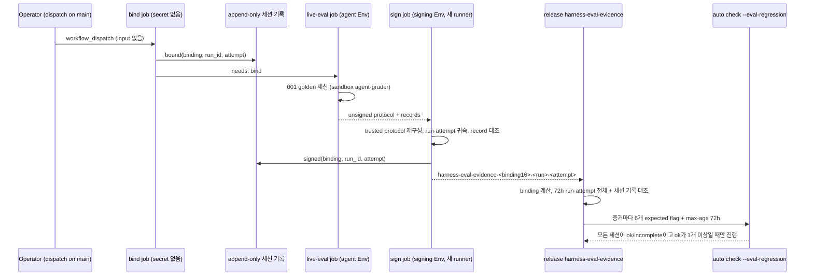

# SPEC-HARNEVAL-003 구현 계획

## Tasks

선행 조건: SPEC-HARNEVAL-001 rev 4의 T10(verdict·advisory), T11(grader 준비·calibration), T12(golden runner), T13(surface driver)가 merge되어 있어야 한다. T8, T9는 설계 결정(probe A2, A3)을 먼저 끝낸다.

- [ ] T1: `[NEW] pkg/evalregression/sign_v2.go`와 상수 `ADKHarnessEvalKeyID`, `ADKHarnessEvalTrustLane` — 기존 statement builder로 서명, verify round-trip test (REQ-HR-03, REQ-HR-05).
- [ ] T2: `[NEW] pkg/harneval/protocol_trust.go` — main에서 trusted protocol 재구성, 필드 단위 대조, run_id·run_attempt·started_at 검사, record·order 대조, 정책의 6시간 한도 검증 (REQ-HR-02).
- [ ] T3: `[NEW] pkg/harneval/report_v1.go`, `[NEW] internal/cli/eval_harness_export.go` — 001 verdict 변환, stdin key, 0600, O_EXCL (REQ-HR-03).
- [ ] T4: `[NEW] pkg/harneval/binding.go`, `[NEW] internal/cli/eval_harness_policy.go` — runner·profile digest를 포함한 binding, `digest --binding`, `policy --format env` (REQ-HR-04).
- [ ] T5: `[NEW] .github/workflows/harness-eval-live.yml` — `bind` → `live-eval` → `sign`, Environment 분리, input 없음, 보간 금지, static contract test (REQ-HR-01).
- [ ] T6: `[NEW] internal/cli/eval_harness_lane_test.go` — Autopus 실제 값으로 양방향 cross-lane, runbook lane 절과 키 회전, package doc, `verify_e2e_test.go` L120·L138 단언 변경 (REQ-HR-05).
- [ ] T7: `.github/workflows/release.yaml` `harness-eval-evidence` job과 `needs`, attempt 단위 판정, `total_count` 잘림 검사, `release_contract_test.go` L15 리터럴 갱신, static·hermetic test (REQ-HR-06).
- [ ] T8: append-only 세션 기록. probe A2로 선택지를 고르고, bind job 기록과 release 판정을 구현한다 (REQ-HR-07, CD-HR-1).
- [ ] T9: `[NEW] pkg/harneval/astgate/` — `go/parser`·`go/types` 기반 diff gate와 parser 모순 규칙. corpus 12개 정상 수정에서 오탐 0을 확인한다 (REQ-HR-08, CD-HR-2, CD-HR-3).
- [ ] T10: OPS-ONLY. 증거는 `gh api` 출력이다. Environment 두 개와 보호 규칙(branch `main`, 서명 쪽 reviewer ≥1, self-review 금지)을 만든다. 키를 일회용 셸에서 만들어 `gh secret set --env`에 stdin으로 넣고 로컬 사본을 지운다. 공개키 allowlist 항목을 커밋하고 운영 키 control pair를 검증한다 (REQ-HR-01, REQ-HR-05, REQ-HR-06, CD-HR-4).
- [ ] T11: `[NEW] internal/cli/eval_harness_e2e_test.go` — golden → export → 별도 binary digest → strict 검증 사슬과 입력 변경 무효화 (REQ-HR-04, S5).

## Implementation Strategy

- 001의 세션 데이터와 verdict를 그대로 쓰고 서명 경로만 더한다. advisory report와 signed report는 같은 verdict 함수에서 나온다.
- 신뢰 경계: agent는 권한 없는 `live-eval` job의 sandbox에서만 돈다. signer는 새 runner에서 main 코드로 데이터만 검증하고 서명한다. release는 attempt 단위로 모든 세션을 센다.
- verifier는 바꾸지 않는다. `pkg/evalregression` 변경은 signer, 상수 2개, 공개키 한 항목, package doc으로 한정한다.
- must-resolve 세 항목(T8, T9)은 구현 fan-out 전에 probe로 설계를 고정한다. 결정 전에는 T7의 판정에서 세션 기록 부분을 fail-closed(`session_log_unavailable`)로 둔다.

## Visual Planning Brief

UI가 없는 CI/release 작업이다(wireframe intent: not applicable).



```text
binding : auto eval harness digest --binding; auto eval harness policy --format env
sign    : auto eval harness export --input <artifact> --output <new-dir>   (개인키는 Environment secret에서 stdin)
verify  : auto check --eval-regression --eval-regression-artifact <dir>/eval_regression_report.json --eval-regression-expected-… --eval-regression-max-age 72h
```

## Feature Completion Scope

- 이 SPEC이 서명된 live 증거와 release 차단 Outcome Lock (b)(c)를 닫는다. (b)는 T1-T5와 T9, (c)는 T6-T8, T10, T11이 닫는다.
- 001의 advisory lane을 바꾸지 않는다. 001이 수용한 잔여 위험 세 가지(A-F-017, A-F-001, F-004)는 여기서 REQ-HR-07, REQ-HR-08, REQ-HR-04로 해소한다.
- 남은 Completion Debt: CD-HR-1~CD-HR-4. 모두 해소되기 전에는 sync 완료가 아니다. 이 SPEC은 sibling을 만들지 않는다.

## Risk-First Integration Probe

| assumption_id | class | risk | boundary | input | oracle | isolation | status | reason | evidence |
|---------------|-------|------|----------|-------|--------|-----------|--------|--------|----------|
| A1 | verified_fact | high | test key v2 attestation → `checkEvalRegressionStrict` (v2 strict와 CLI 출력) | statement layout을 복제한 test key control pair, harness policy와 Autopus key policy | S1 출력 문자열과 stale·unknown key 사례가 정확히 일치 | `go test -overlay` scratch test, repo 파일 미수정 | PASS | 8개 사례 모두 예상과 같았다. ok와 regression_blocked는 `(version=<64-hex>)`, 1바이트 변조는 signature_invalid였다. 양방향 cross-lane과 produced_at 1초 차이는 attestation_policy_mismatch, 빈 trusted map은 signature_key_unknown, 73h는 artifact_stale였다 | 2026-10-06 `go test -overlay overlay_a1.json ./internal/cli -run TestHarnevalProbeA1 -count=1 -v` ok, `<session-scratchpad>/probes/probe-a1.log` |
| A2 | implementation_assumption | high | append-only 세션 기록 선택지(artifact attestation, Rekor, protected branch log)가 write 권한 사용자의 삭제를 견디는지 | 세 선택지 각각으로 기록한 세션 두 개, 그중 하나의 run·artifact 삭제 | 삭제 뒤에도 release 선택 단계가 두 세션을 모두 센다 | 실제 GitHub repo와 권한 구성 필요 | not-run | GitHub repo, Environment, attestation API 권한이 있어야 한다. 결과로 REQ-HR-07의 선택지를 고른다(CD-HR-1) | - |
| A3 | implementation_assumption | high | AST gate가 alias·dot import·초기화식 위조를 막으면서 corpus 정상 수정을 통과시키는지 | S8의 위조 diff 6개와 corpus 12개 정상 수정 diff | 위조 6/6 `forbidden_construct`, 정상 수정 오탐 0 | 구현 뒤 package test | not-run | gate 구현이 아직 없다. T9 전에 이 probe로 규칙 집합을 고정한다(CD-HR-2, CD-HR-3) | - |

## Plan Statement Classification

| Statement | Class | Evidence |
|-----------|-------|----------|
| verifier 평가 순서, reason literal, unsigned-accept 부재는 바꾸지 않는다 | requirement_invariant | REQ-HR-05 |
| signer는 artifact 안의 코드를 실행하지 않는다 | requirement_invariant | REQ-HR-02 |
| 72시간 window와 flaky 차단 trade-off | requirement_invariant | 사용자 수락(2026-10-06), REQ-HR-06 |
| report와 attestation의 `produced_at` 문자열이 같아야 검증된다 | verified_fact | A1 |
| 64-hex digest는 `attributed_version` shape를 통과한다 | verified_fact | A1 |
| 양방향 cross-lane 거부는 key_id 차이만으로 성립한다 | verified_fact | A1 |
| write 권한으로 run과 artifact를 지울 수 있다 | implementation_assumption | GitHub 문서(001 rev 3 review A-F-017 인용). A2에서 확인 |
| 재실행은 run id를 유지하고 attempt만 올린다 | implementation_assumption | GitHub 문서(review 인용). S6 attempt oracle이 규칙을 고정 |
| runs API `total_count`가 필터된 전체 run 수다 | implementation_assumption | S6 잘림 oracle |
| `sandbox-exec` grader profile이 GitHub `macos-15`에서 로컬과 같은 거부를 낸다 | implementation_assumption | 001 probe A3는 로컬 macOS 26.5.2. T5 preflight가 runner에서 확인 |

## Gate Applicability

- `{SPEC_DIR}/gate-applicability.json`은 아직 없다. 구현 handoff에서 `auto spec gates`가 쓴 값만 쓴다. 서명키, Environment, release 차단을 다루므로 classifier가 `security_or_data`로 분류할 것으로 예상하며, 이 예상은 판정이 아니다.
- security, validation, data_loss, deterministic_oracle gate는 `not_applicable`이 될 수 없다. UI 경로가 없으므로 accessibility와 ux_verification은 classifier에 맡긴다.
- scope expansion 규칙: 요구사항보다 넓은 제약(예: 추가 승인자, Linux runner 지원, 별도 KMS)은 요구사항으로 올리지 않고 scope expansion으로 표시한 뒤 fan-out 전에 probe 행을 추가한다(최대 3행).
