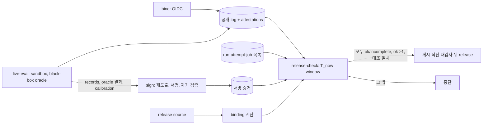

# SPEC-HARNEVAL-003 리서치

## 기존 코드 분석

- `pkg/evalregression` strict 경로: policy 검증 → 빈 attestation(`artifact_unsigned`) → decode/schema → policy 일치 → key 조회 → SHA-256·서명 → report context → gate. allowlist는 Autopus 키 하나(`attestation.go:64`)이고 "There is no unsigned-accept path"가 불변식이다. `verify_e2e_test.go` L120·L138은 allowlist 길이 1을 단언한다. v1 `VerifyEvalRegressionArtifact`는 allowlist 전체를 신뢰한다.
- `auto check --eval-regression`은 여섯 expected flag와 `--eval-regression-max-age`를 받는다. 출력은 `eval-regression: <reason>`과 선택적 ` (version=<v>)`다. blocked report에는 `regression_blocked`만 출력하고 report `reason`은 출력하지 않는다(`writeEvalRegressionDecision`, `gate.go:13`).
- release.yaml을 읽는 test는 9개 파일에 23개다. 모든 job을 제약하는 test 5개는 다음을 검사한다: action SHA 고정, BOOTSTRAP 계열 env 이름 금지, fixture 문자열 금지, job env 금지, step env allowlist(`GH_TOKEN` 포함), run 안의 `${{ secrets.` 금지, release 명령의 `env -i`. `release_contract_test.go:15`는 `needs` 리터럴을 검사한다.
- 키 입력 선례: `internal/cli/companion_manifest.go::readPrivateKey`(L167)는 64-byte 키만 받고, 빈 입력에는 일반 오류를 낸다.
- 001 rev 4: golden 모드, 격리 grader(sandbox-exec, 읽기 전용 module cache), calibration, `expected_tests`, advisory verdict. 001 REQ-HE-11과 S12는 live workflow와 allowlist 변경을 금지하므로 이 SPEC과 함께 개정해야 한다.
- 외부 사실(2026-10-06 웹 확인): Rekor의 hash 검색 index는 v1에서 best-effort였고, Rekor v2에서는 `/api/v1/index/retrieve`가 제거되었다. 같은 Rekor v2 GA 공지는 v2 log가 proof와 함께 서명된 timestamp를 더 이상 돌려주지 않고 client가 별도 timestamp 서비스에서 받는다고 적는다. GitHub는 repo attestation을 subject digest로 나열하는 API와 삭제 API를 함께 제공한다.
- 로컬 관측(2026-10-06, macOS 26.5.2): 제한이 있는 sandbox 안의 process가 다른 profile로 `sandbox-exec`를 다시 실행하면 `sandbox_apply: Operation not permitted`(exit 71)로 실패한다. 한 겹 profile의 `deny file-read*`는 적용되어 `cat`이 EPERM으로 실패했다. 그래서 REQ-HR-08은 중첩 없이 runner가 형제 process로 profile을 적용한다. 같은 profile 아래에서 읽기가 거부된 파일로 hard link를 만드는 것도 `Operation not permitted`였다.
- 로컬 관측(2026-10-06, go1.26.6, repo `toolchain` 지시문과 같음): `os.Root`는 root 밖 symlink, `..`, 디렉터리 symlink를 `path escapes from parent`로 거부했다. 그러나 root 안 symlink는 `O_NOFOLLOW`를 줘도 따라갔고, root 밖 파일의 hard link는 그 내용을 읽었으며(link 수 2), FIFO는 `O_NONBLOCK`으로 열려 일반 파일이 아님이 드러났다. REQ-HR-08의 출력 열기 규칙은 이 결과에 맞춰 Lstat, SameFile, link 수, 파일 종류 검사를 함께 둔다.

## Plan Intent Ledger

출처: `../SPEC-HARNEVAL-001/prd.md` Plan Intent Ledger, 2026-10-06 사용자 결정, coordinator 결정. 셀은 근거로만 요약했다.

| Field | Status | Source | SPEC 반영 |
|-------|--------|--------|-----------|
| goal | answered | 사용자 D1(HYBRID의 live release lane) | Outcome Lock, REQ-HR-01~10 |
| scope_split | answered | 사용자 결정(AskUserQuestion): 서명·release 차단을 003으로 분리 | 이 SPEC 전체 |
| freshness_window | answered | 사용자 수락: 72시간 window와 flaky 차단 | REQ-HR-06 |
| record_medium | answered | coordinator 결정: public repo의 GitHub artifact attestation(Sigstore 공개 log) | REQ-HR-07. 열거는 run 목록 대조로 보완(Rekor 검색 제거 근거) |
| oracle_authenticity | answered | coordinator 결정(rev 3): 서명 lane은 black-box oracle만 쓴다. white-box 전용 task는 001 advisory에 남는다 | REQ-HR-08, REQ-HR-02 |
| scope_boundary | assumed | PRD Scope Boundary | Autopus/backend 불변 |
| done_evidence | assumed | PRD Done Evidence | S1-S12, T10 OPS 증거 |

## Question Audit

- question_transport: AskUserQuestion
- question_count: 1 (2026-10-06 범위 분할 질문과 72시간 수락. 기록 매체와 oracle 진위는 coordinator 결정이며 사용자 질문이 아니다)
- unresolved_fields: [scope_boundary, done_evidence]

## Outcome Lock

- User-visible outcome: release operator가 main에서 live workflow를 dispatch하면 격리 세션이 실행된다. 세션은 공개 log에 기록되고 보호 Environment에서 서명된다. release는 같은 binding의 window 안 세션 중 기록과 run 목록 어느 한쪽에라도 남은 세션을 모두 센다. 그 세션이 모두 검증된 `ok`/`incomplete`이고 `ok`가 하나 이상일 때만, 그리고 게시 직전 재검사도 통과할 때만 진행된다. 한 행위자가 두 출처를 모두 지우는 경우는 문서화된 잔여 위험이다(CD-HR-1). A2가 그 행위자를 admin으로 한정하지 못하면 release gate를 켜지 않는다.
- Mandatory requirements: REQ-HR-01 ~ REQ-HR-10.
- Explicit non-goals: `spec.md` `## Outcome Boundary`의 목록과 같다.
- Completion evidence: S1-S12 PASS, T10 OPS 증거(hosted control run 포함), CD-HR-1~CD-HR-5 해소, `auto spec validate --strict` 통과.

## Visual Planning Brief

전체 sequence는 `plan.md`에 있다. 판정의 신뢰 사슬은 다음과 같다.

## 설계 결정

| 결정 | 선택 | 기각한 대안 | 근거와 trade-off |
|------|------|-------------|------------------|
| 기록 매체 | GitHub artifact attestation(public repo라 Sigstore 공개 log entry가 남음) | protected branch bot log, 비공개 저장 | 내부자가 log entry를 지울 수 없다. 단점: binding digest와 run id가 공개되고(hash와 식별자뿐), Sigstore와 GitHub API 가용성에 의존한다(실패 시 fail-closed) |
| 열거 | attestation API 목록 + run·attempt·job 목록 교차 대조 | Rekor hash 검색 | Rekor 검색은 best-effort이고 v2에서 제거되었다. 두 출처를 대조하면 한쪽 삭제가 드러난다 |
| window | `T_now`를 검사 step 안에서 한 번 읽는다. 닫힌 구간 `[T_now−72h+15m, T_now]`이고, 두 출처가 같은 bound log 시각을 쓰며, 검사 step timeout은 15분이다 | runs API `created` 필터, 출처마다 다른 시각 기준 | 재실행 attempt와 비신뢰 시각 문제를 없앤다. 두 출처의 경계가 어긋나 생기는 주기적 거짓 차단도 없앤다 |
| 부분 재실행 | live-eval이 같은 attempt의 bound 기록을 요구한다. bind 없는 attempt는 golden 세션 step이 시작되지 않았으면 세지 않는다 | 허용, 모두 `run_not_ok` | bind 없는 세션이 생기지 않는다. 흔한 'Re-run failed jobs'가 어떤 binding의 release도 막지 않는다. 복구는 전체 재실행이다 |
| oracle 진위 (rev 3-4) | black-box oracle. runner가 빌드·실행·판정을 형제 process로 띄운다. artifact는 기대 출력을 읽지 못하고, trusted harness는 artifact가 끝난 뒤 출력만 비교한다 | in-process 관측 + sentinel + 정적 gate(rev 2), harness가 artifact를 자식으로 띄우는 중첩 sandbox | 같은 process에서는 진위를 증명할 수 없다(review HR-F-002). 중첩 sandbox는 로컬에서 적용이 거부되었다. 단점: 서명 gate의 coverage가 줄고, oracle을 새로 써야 하며, 읽기 허용 목록을 유지해야 한다 |
| 출력 열기 (rev 5) | 기대 출력은 stdin으로만 넘기고 `oracle.sb`는 기대 출력 파일을 읽지 못한다. 출력은 `os.Root`, 고정 상대 경로, Lstat·SameFile·link 수 1·일반 파일·1 MiB 상한으로만 연다. 남은 process 확인 뒤에 판정한다 | `os.Root`만 쓰거나 일반 open | `os.Root`만으로는 root 안 symlink와 hard link가 남는다(로컬 probe). 층을 둘로 나누어, sandbox가 기대 출력 파일 접근을 막고 코드가 출력 구조를 검사한다. 단점: 출력이 일반 파일이어야 하므로 링크를 정상 출력으로 내는 task는 서명 gate에 넣을 수 없다 |
| calibration 결속 (rev 5) | `calibration.json` bytes의 SHA-256을 session-result attestation에 넣고 signer가 대조한다 | protocol의 `before`만 결속 | `after`는 모든 trial 뒤에 쓰이므로 protocol digest가 덮지 못한다 |
| 열거 완전성 실패 분기 | A2 FAIL이면 T7을 merge하지 않고, 세 번째 출처를 정의하는 SPEC 개정 뒤에 차단을 켠다 | 재판정만으로 잔여 위험 수용 | Outcome Lock (c)를 충족하지 못한 채 gate를 켜지 않는다 |
| 시각 출처 | 검증된 timestamp만 쓴다(v1 integrated time 또는 v2 TSA) | bundle의 `integratedTime` 직접 판독 | v2 entry에는 서명된 integrated time이 없다. 검증되지 않은 값은 비신뢰 데이터다 |
| incomplete 면제 | 검증된 `regression_blocked` 출력 뒤에만 report reason 판독 | report bytes 직접 판독 | 서명·freshness 실패를 incomplete로 면제하지 않는다 |
| 게시 시점 | `release` job 안에서 재검사 | 선행 job 결과 재사용 | 승인 대기 중 만료와 새 회귀를 잡는다(OMP 선례) |
| binding 범위 | `runner_tree_digest`, `model`, `baseline_commit` 추가 | 단일 파일 digest | 채점·격리 코드, model, tag 이동을 모두 무효화 사유로 만든다 |
| 키 회전 | 동시 적용과 자기 검증 | 단계적 교체 | 불일치 구간의 서명 증거가 생기지 않는다 |

## Minimality Decision Matrix

| Ladder step | Evidence | Decision | Receipt item |
|-------------|----------|----------|--------------|
| actual need | release가 harness 행동 회귀를 서명 증거로 막아야 한다. 001 advisory는 gate가 아니다 | proceed | signer, 기록, release gate |
| existing code/helper/pattern | v2 verifier·statement builder, `readPrivateKey`, OMP evidence 재검증 패턴, 001 verdict·golden runner·grader | reuse | builder 공유, 재검증 패턴 차용, verdict 재사용 |
| stdlib/native | `crypto/ed25519`, `crypto/sha256`, `encoding/json`, `os.OpenFile(O_EXCL, 0600)`, macOS `sandbox-exec` | use | 새 암호·파싱 library 없음 |
| existing dependency | cobra, testify, actionlint, `gh` CLI(`gh attestation verify` 포함) | reuse | 신규 module 의존성 0 |
| new dependency or new abstraction | `actions/attest`(pinned SHA), sign_v2, binding, trusted protocol, 재도출, release-check, oracle harness와 두 sandbox profile | accepted | 외부 action 1개. 삭제 권한 확인은 A2 |
| minimum sufficient verification | `go test ./pkg/evalregression/... ./pkg/harneval/... ./internal/cli -run 'EvalRegression\|EvalHarness'`, macOS CI e2e, actionlint, 운영 키 control pair, hosted control run | required checks | 보안, validation, data-loss(새 디렉터리, O_EXCL), deterministic-oracle 유지 |

## Semantic Invariant Inventory

| ID | source clause | invariant type | affected outputs | acceptance IDs |
|----|---------------|----------------|------------------|----------------|
| INV-HR-01 | "strict policy로 검증, 변조와 다른 lane은 거부" | trust mapping | `eval-regression:` stdout 한 줄 | S1, S12 |
| INV-HR-02 | 보안 NFR "private material 0" | secret non-disclosure | 출력 bytes, 파일 mode, 자식 환경 | S2 |
| INV-HR-03 | "PR-head 코드는 secret을 받지 않음" | trust boundary | job별 권한 집합, secret 참조 | S3 |
| INV-HR-04 | review HR-F-009·HR-F-014·F-005 "started_at, 재도출, calibration 결속" | field equality, derivation, digest binding | export reason과 detail | S4 |
| INV-HR-05 | review HR3-F-003·HR-F-017·F-006 "binding 범위, tag 이동, black-box 기대값" | digest chain | binding digest, `expectation_changed`, 검증 결과 | S5 |
| INV-HR-06 | review HR-F-004 window: 세션 집합은 bound log 시각(검증된 timestamp)이 닫힌 구간 `[L, T_now]`(L = T_now−72h+15m)에 드는 (binding B, run, attempt)다. 두 출처 모두 같은 timestamp로 거르고, 판정은 그 집합 전체에 대한 AND다 | aggregation, time window, boundary | release-check reason, 경계 `L` 포함·`L−1s` 제외 | S6, S10 |
| INV-HR-07 | review HR-F-003·A-F-017 "삭제": 세션 집합은 attestation 출처와 run·job 출처의 합집합이며, 한쪽에만 있으면 차단이다 | append-only membership | `session_log_inconsistent`, `session_log_unavailable` | S7 |
| INV-HR-08 | review HR-F-002·F-004·HR-F-005·F-005 "같은 process 위조, 기대 출력 읽기, 출력 구조를 통한 대리 읽기, 판정 입력과 vacuity" | black-box judgement, precedence, isolation | trial별 (outcome, signal, `oracle.ran`, `oracle.build_failed`), `output_check`, verdict, 격리 결과 | S8, S11 |

## Black-box Oracle Coverage

서명 gate에는 black-box oracle을 가진 agent task만 들어간다. 분류 근거는 mutation이 든 package를 `internal/cli`가 import하는지(2026-10-06 grep)와, 그 동작이 드러나는 `auto` 명령을 확인했는지다.

| task | mutation package | 분류 | 근거 |
|------|------------------|------|------|
| a06 | `pkg/experiment` | 확인됨 | `auto telemetry harness`(CompareHarness) |
| b03, b04 | `pkg/spec/gates` | 확인됨 | `auto spec gates`의 결정·분류 출력 |
| b05 | `pkg/config` | 확인됨 | 설정을 읽는 모든 명령(symlink fixture로 관측) |
| b06 | `pkg/adapter/opencode` | 확인됨 | `auto init`의 opencode 생성 파일 |
| a01, a05 | `pkg/skillpolicy` | 후보 | CLI importer 2개. 출력 경로 확인 필요 |
| a02 | `pkg/telemetry` | 후보 | CLI importer 12개 |
| a03 | `pkg/promptlayer` | 후보 | CLI importer 30개 |
| a04, b01 | `pkg/pipeline` | 후보 | CLI importer 16개 |
| b02 | `pkg/workerreceipt` | 제외(white-box 전용) | CLI importer 0개. 001 advisory에만 남는다 |

- coverage trade-off: 서명 gate는 처음에 확인된 5개로 시작한다(`floors.signed_agent_tasks` 5). 후보 6개는 oracle을 쓸 수 있는지 판정한 뒤 더한다. 최대는 11개다. black-box oracle은 unit test보다 관측이 거칠어 미세한 회귀를 놓칠 수 있다. 대신 artifact는 기대 출력을 읽거나 판정 기록에 쓸 수 없으므로, 출력이 실제로 맞아야만 통과한다(REQ-HR-08 process 구조). 12개 전부는 계속 001 advisory lane에서 white-box로 측정된다.

## Feature Coverage Map

| Outcome slice | Covered by | Status |
|---------------|------------|--------|
| happy path: dispatch → 기록 → 세션 → 서명 → release | REQ-HR-01~07 / S1, S4, S5, S6 | covered |
| error/recovery: 변조, 부분 재실행, 승인 지연, 만료 뒤 복구, 목록 잘림, 조회 실패 | REQ-HR-02, 06, 07 / S4, S6, S7, S10 | covered |
| security: Environment custody, 키 누출과 자식 환경, 주입, 삭제, 출력 위조 | REQ-HR-01, 03, 07, 08, 09 / S2, S3, S7, S8 | covered (S7·S8은 completion-debt) |
| integration boundary: GitHub OIDC·attestation·runs API, Sigstore, strict verifier, hosted runner | REQ-HR-05, 06, 07, 10 / S1, S6, S7, S11 | covered |
| 001 교차 변경 | Cross-SPEC Changes / T12, T13, S9 | covered (CD-HR-5) |
| docs/ops: runbook, 키 회전, Environment, control run | REQ-HR-05, 10 / T6, T10, S11, S12 | covered (OPS는 completion-debt) |

## Completion Debt

| Item | Blocks | Required resolution |
|------|--------|---------------------|
| CD-HR-1 attestation 삭제 권한, timestamp 출처, 열거·검증 경로 | Outcome Lock (c), S7, T7 merge | probe A2. PASS(admin만 삭제)면 해소된다. FAIL(write 권한으로 삭제)이면 T7을 merge하지 않고 release gate를 켜지 않는다. 세 번째 출처(bot 전용 protected branch 세션 log)를 정의하는 SPEC 개정과 구현이 끝날 때까지 열려 있다. 재판정만으로는 닫지 않는다 |
| CD-HR-2 black-box oracle 작성, calibration, 격리 | Outcome Lock (b), S8, S11 | probe A3와 T15. 확인된 5개 task부터 작성하고 floor 5 이상을 맞춘다. 기대 출력 읽기·hard link 생성 거부, 출력 구조 위협 유형의 거부, `artifact.sb` 빌드 모드의 Go 빌드, 형제 process 실행도 A3에서 확인한다. 후보 6개는 작성 가능 여부를 판정한다 |
| CD-HR-3 hosted control run과 trial 소요 측정 | Outcome Lock (b), S11 | T10·T14. trial 400초 한도가 부족하면 정책을 조정한다 |
| CD-HR-4 OPS: Environment 2개, 보호 규칙, 키 발급과 공개키 커밋, 운영 키 control pair | (b)(c), S1 재실행 | T10. 그 전까지 T7은 blocked다. T7을 차단 없는 형태로 바꿔 merge하지 않는다 |
| CD-HR-5 001 문서·schema 개정 | 001과의 계약 일관성, S9, 001 strict decode | T12·T15. 001 개정이 merge되어야 한다. 항목은 다음과 같다: REQ-HE-11·S12 범위 축소, REQ-HE-10 reason 표 명시, manifest `floors.signed_agent_tasks`, task schema `oracle_mode`·`black_box_oracle`, `expectation_digest` 공식 확장, record signal 목록과 black-box `oracle{…}` 의미, record `oracle_result_sha256`·`stage_reached`·`agent_termination`, protocol 다섯 필드 |

## Evolution Ideas

These are optional improvements and do not block sync completion.

| Idea | Why not required now | Promotion trigger |
|------|----------------------|-------------------|
| claude, gemini, opencode로 서명 lane 확장 | codex lane으로 Outcome Lock을 충족한다 | 사용자가 provider 확장을 요청 |
| Sigstore의 검증 가능한 index 서비스가 나오면 열거 출처로 추가 | 지금은 run 목록 대조로 충족한다 | 서비스가 공개됨 |
| 신뢰구간 기반 판정으로 flaky 차단 완화 | 72시간 trade-off를 사용자가 수락했다 | 차단 빈도가 운영 부담으로 관측됨 |

## Sibling SPEC Decision

| Decision | Reason | Sibling SPEC IDs |
|----------|--------|------------------|
| 이 SPEC은 두 번째이자 마지막 sibling이며 새 sibling을 만들지 않는다 | 허용 사유는 보안·컴플라이언스 경계(서명키, protected Environment, release 차단)이고 사용자가 분할을 결정했다. HARNEVAL sibling은 002와 이 SPEC으로 한도 2개에 닿았다 | SPEC-HARNEVAL-001, SPEC-HARNEVAL-002 |

## Reference Discipline

| Reference | Type | Verification |
|-----------|------|--------------|
| `pkg/evalregression/verify_v2.go`, `attestation.go:64`, `gate.go:13`, `verify_e2e_test.go` L120·L138 | existing | Read, grep, probe A1 실행 |
| `internal/cli/eval_regression.go::checkEvalRegressionStrict`, `writeEvalRegressionDecision`; `check.go:224` | existing | Read, grep |
| release.yaml을 읽는 test 23개(9개 파일)와 모든 job 제약 5개, `release_contract_test.go:15`, `publicKeyReceiptAllowedStepEnv` | existing | helper 호출까지 따라간 grep, Read |
| `internal/cli/companion_manifest.go::readPrivateKey` L167, `.github/workflows/release.yaml` L316 재검증 패턴 | existing | grep, Read |
| `../Autopus/.github/workflows/eval-regression-gate.yml` L200-203 | existing (sibling repo, read-only) | grep |
| Rekor v2에서 search index 제거와 서명된 timestamp 미반환: https://blog.sigstore.dev/rekor-v2-ga/ , `rekor-cli search --sha`: https://docs.sigstore.dev/logging/cli/ | external | 2026-10-06 WebSearch, review F-008 인용 |
| 중첩 `sandbox-exec` 거부, 한 겹 read-deny 적용, 읽기 거부 파일로의 hard link 생성 거부 | local observation | 2026-10-06 macOS 26.5.2, session scratchpad의 일회성 probe(repo 파일 미수정) |
| `os.Root`의 root 이탈 거부, root 안 symlink 추종, hard link와 FIFO 비탐지 | local observation | 2026-10-06 go1.26.6, session scratchpad의 일회성 Go probe(repo 파일 미수정) |
| 001 REQ-HE-08 단계 순서와 채점 계속 규칙, REQ-HE-09·10 calibration·vacuity | existing (SPEC 문서) | `../SPEC-HARNEVAL-001/spec.md` L109, L119-123, L131-134 Read |
| GitHub repo attestation 목록·삭제 API: https://docs.github.com/en/rest/repos/attestations , 수명 관리: https://docs.github.com/actions/how-tos/security-for-github-actions/using-artifact-attestations/managing-the-lifecycle-of-artifact-attestations | external | 2026-10-06 WebSearch |
| `sign_v2.go`, 상수 2개, `pkg/harneval/{binding,protocol_trust,derive,report_v1,releasecheck}.go`, `cmd/harneval-oracle/`, `artifact.sb`, `oracle.sb`, `eval_harness_{export,policy,releasecheck}.go`, `harness-eval-live.yml`, Environment 2개 | [NEW] planned addition | 부재 확인(ls, grep) |
| `golden.py`, `records.go`, `eval_harness_workflow_test.go`, 001 Wire Contracts | [NEW] SPEC-HARNEVAL-001 planned addition(이 SPEC이 변경) | 001 rev 4 문서 |

## Reviewer Brief

- Intended scope: 서명된 live 증거와 release 차단. rev 2는 첫 review의 21건을, rev 3-5는 이후 review의 open·regressed 항목을 처리했다(`spec.md` Review Resolution).
- Explicit non-goals: Autopus/backend 변경, verifier 의미 완화, PR마다 LLM, 로컬 서명, 001 결정적 lane 변경, 권한 작업 자동화, black-box oracle 재작성.
- Self-verified: Traceability Matrix, invariant 8개와 oracle, existing/[NEW]/external 구분, probe A1 실행, test 수 재집계, 실제 parser EARS 검증, 중첩 sandbox 로컬 관측, 001 판정 규칙 대조.
- Reviewer should focus on: 형제 process 구조와 `artifact.sb` 읽기 허용 목록, 출력 열기 규칙과 stdin 기대 출력, calibration 결속, 10행 판정표와 `oracle{…}` 채우기, 단일 timestamp window와 경계, 부분 재실행 귀속, A2 분기, 001 교차 변경, Completion Debt only. 72시간 trade-off, 기록 매체, black-box 전환은 결정 사항이므로 재검토 대상이 아니다.

## Self-Verify Summary

- Q-CORR-01 | status: PASS | attempt: 2 | files: spec.md, research.md | reason: key id 위치를 `attestation.go:64`와 gate L200으로, test 수를 23개로 정정했다
- Q-CORR-04 | status: PASS | attempt: 4 | files: research.md, spec.md, plan.md | reason: existing, [NEW], external, local observation을 구분했다. `os.Root`와 hard link 동작은 로컬 probe로 확인한 범위만 적었다
- Q-COMP-02 | status: PASS | attempt: 3 | files: spec.md, plan.md, research.md | reason: 001 소유 변경(manifest floor, expectation_digest, signal 목록, calibration.json, record 필드)을 Cross-SPEC 표, T13·T15, CD-HR-5에 맞췄다
- Q-COMP-03 | status: PASS | attempt: 3 | files: spec.md, plan.md, research.md, acceptance.md | reason: signer 입력을 attest된 records·oracle 결과·calibration bytes로 한정했다(REQ-HR-01·02·03·07·09, Wire Contracts, T2, flowchart, S4)
- Q-COMP-04 | status: FAIL | attempt: 3 | files: spec.md, research.md | reason: 설계와 A2 FAIL 분기는 정했지만 A2·A3와 OPS가 남아 S7·S8·S11이 닫히지 않는다. CD-HR-1~5로 sync를 막는다
- Q-COMP-05 | status: PASS | attempt: 4 | files: research.md, acceptance.md | reason: 단일 timestamp window와 경계 oracle, 부분 재실행 귀속(S6), 판정표 10행·출력 구조·종료 표기·vacuity·calibration 사례(S8), 출력 열기 자체 검사(S11)를 넣었다
- Q-COMP-06 | status: PASS | attempt: 2 | files: spec.md, research.md | reason: Traceability Matrix가 10개 REQ를 잇고 Reviewer Brief가 범위를 제한한다
- Q-COMP-07 | status: PASS | attempt: 2 | files: research.md | reason: Completion Debt와 Evolution Ideas를 분리했다
- Q-COMP-08 | status: PASS | attempt: 2 | files: plan.md | reason: A1은 실행 증거로 PASS, A2·A3는 실행 조건이 없어 not-run이며 이유를 남겼다
- Q-FEAS-02 | status: PASS | attempt: 3 | files: spec.md | reason: 001 manifest·digest·signal·calibration 변경을 Cross-SPEC Changes로 선언했다
- Q-FEAS-03 | status: PASS | attempt: 4 | files: spec.md, plan.md | reason: 중첩 sandbox를 쓰지 않고(로컬 EPERM 관측), Rekor v2의 timestamp 출처를 정의했으며, 출력 열기 규칙을 `os.Root`의 실제 동작에 맞췄다
- Q-SEC-01 | status: PASS | attempt: 5 | files: spec.md, acceptance.md, plan.md | reason: 형제 process 구조, 읽기 허용 목록 `artifact.sb`, 기대 출력의 stdin 전달, 출력 열기 규칙으로 직접 읽기·대리 읽기·결과 쓰기를 막는다(S8, S11, A3)
- Q-SEC-02 | status: PASS | attempt: 3 | files: spec.md, acceptance.md | reason: 읽는 변수와 지우는 변수를 `HARNESS_EVAL_SIGNING_KEY` 하나로 통일했다(S2, S3)
- Q-SEC-03 | status: PASS | attempt: 4 | files: spec.md, research.md, acceptance.md | reason: 보장 범위를 명시하고 A2 FAIL 분기(T7 미merge, SPEC 개정)를 정했다(S7, CD-HR-1)
