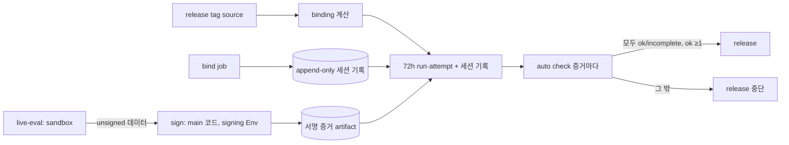

# SPEC-HARNEVAL-003 리서치

## 기존 코드 분석

- `pkg/evalregression` strict 경로 순서: policy 검증 → 빈 attestation(`artifact_unsigned`) → decode/schema(`signature_invalid`) → policy 일치(`attestation_policy_mismatch`) → key 조회(`signature_key_unknown`) → SHA-256·서명 → report context(`produced_at`, `workspace_scope` 문자열 일치) → gate(schema, raw payload, version shape, freshness ±5분, blocked). allowlist는 Autopus 키 하나이고 "There is no unsigned-accept path"가 불변식이다. `verify_e2e_test.go` L120·L138은 allowlist 길이 1을 단언한다.
- `auto check --eval-regression`은 여섯 `--eval-regression-expected-*` flag와 `--eval-regression-max-age`(기본 24h)를 받고 `eval-regression: <reason>`과 선택적 ` (version=<v>)`를 출력한다(`writeEvalRegressionDecision`).
- release 선례: `release.yaml`은 tag 좌표 고정 trigger이고 `needs: [ci, security, omp-production-evidence]`다. `release_contract_test.go:15`가 이 리터럴을 검사한다. Autopus gate는 `gh run list … --status success`와 `actions/download-artifact`의 `run-id`로 증거를 가져온다(`assertAutopusGateFetchSelection`). Autopus lane 값은 `../Autopus/.github/workflows/eval-regression-gate.yml:201-203`에 있다.
- 키 입력 선례: `internal/cli/companion_manifest.go::readPrivateKey`(L167)는 64-byte ed25519 개인키를 stdin에서 받는다.
- 001 rev 3 review 결과 중 이 SPEC으로 넘어온 미해결 항목은 셋이다. artifact·run 삭제와 재실행 attempt(A-F-017), grader 출력 위조와 리터럴 검사 우회(A-F-001), 승인 지연과 `started_at` 하한 충돌(F-003)이다. runner·profile digest의 binding 누락(F-004)도 함께 넘어왔다.

## Plan Intent Ledger

출처: `../SPEC-HARNEVAL-001/prd.md` Plan Intent Ledger와 2026-10-06 사용자 결정. 셀은 근거로만 요약했다.

| Field | Status | Source | SPEC 반영 |
|-------|--------|--------|-----------|
| goal | answered | 사용자 D1(HYBRID의 live release lane) | Outcome Lock, REQ-HR-01~08 |
| scope_split | answered | 사용자 결정(AskUserQuestion, 2026-10-06): 서명·release 차단을 003으로 분리 | 이 SPEC 전체 |
| freshness_window | answered | 사용자 수락(2026-10-06): 72시간 window와 flaky 차단 trade-off | REQ-HR-06 |
| scope_boundary | assumed | PRD Scope Boundary | Autopus/backend 불변. 틀리면 backend 변경 필요 |
| done_evidence | assumed | PRD Done Evidence | S1-S9, T10 OPS 증거 |

## Question Audit

- question_transport: AskUserQuestion
- question_count: 1 (2026-10-06 범위 분할 질문. 72시간 trade-off 수락은 coordinator가 같은 결정으로 전달했다)
- unresolved_fields: [scope_boundary, done_evidence]

## Outcome Lock

- User-visible outcome: release operator가 main에서 live workflow를 dispatch하면 격리 세션이 실행되고 보호 Environment에서 서명된다. release는 그 binding의 72시간 안 모든 세션(삭제·재실행 포함)이 `ok`/`incomplete`이고 `ok`가 하나 이상일 때만 진행된다.
- Mandatory requirements: REQ-HR-01 ~ REQ-HR-08.
- Explicit non-goals: `spec.md` `## Outcome Boundary`의 목록과 같다.
- Completion evidence: S1-S9 PASS, T10 OPS 증거, CD-HR-1~CD-HR-4 해소, `auto spec validate --strict` 통과.

## Visual Planning Brief

전체 sequence는 `plan.md`에 있다. 판정의 신뢰 사슬은 다음과 같다.

## 설계 결정

| 결정 | 선택 | 기각한 대안 | 근거와 trade-off |
|------|------|-------------|------------------|
| 분리 (사용자 결정) | 서명·release 차단을 별도 SPEC으로 | 001 안에 유지 | revision 한도를 넘었다. 보안 경계를 독립적으로 review한다 |
| 증거 전달 | release job이 run·attempt 목록과 세션 기록에서 binding별 증거를 모두 가져와 검증 | 커밋 증거, OMP repo vars | 커밋 방식은 통과한 것만 고르는 best-of-N을 허용한다. Autopus gate가 같은 선택 패턴을 쓴다 |
| 신뢰 경계 | `bind`, eval, signer 세 job과 Environment 2개 | 한 job에서 실행과 서명 | agent가 서명 단계를 오염시킬 수 없다 |
| signer 코드 | 같은 main SHA에서 빌드한 `auto` | openssl만 쓰는 서명 job | main이 release와 같은 신뢰 루트다. openssl은 byte layout drift 위험이 있다 |
| 키 보관 | 서명 Environment secret만 | 운영자 로컬 키 | 보관 장소를 하나로 만든다 |
| `started_at` 범위 (F-003) | run `created_at` 이후, signer +5분 이하, run·attempt 귀속 | signer 기준 −6시간 하한 | 승인 지연이 서명을 실패시키지 않는다. 나이는 release max-age가 제한한다 |
| binding 범위 (F-004) | runner·profile digest 포함 | surface와 정책만 | 채점·격리 코드를 바꾸면 이전 증거가 무효가 된다 |
| 세션 집계 | attempt 단위, 결론 무관, 72시간, append-only 기록 | success run만 | 취소, 재실행, 삭제로 결과를 고를 수 없다. 단점: flaky 차단(사용자 수락) |
| 위조 방어 | type 정보로 alias를 해석하는 AST gate와 framing 모순 규칙 | 리터럴 문자열 검사 | 리터럴 검사는 alias와 초기화식으로 우회된다 |

## Minimality Decision Matrix

| Ladder step | Evidence | Decision | Receipt item |
|-------------|----------|----------|--------------|
| actual need | release가 harness 행동 회귀를 서명 증거로 막아야 한다(PRD Outcome (b)(c)). 001 advisory는 gate가 아니다 | proceed | signer, binding, release gate |
| existing code/helper/pattern | v2 verifier·statement builder, `readPrivateKey`, Autopus run 선택 패턴, OMP evidence job 구조, 001 verdict | reuse | builder 공유, 선택 패턴 차용, verdict 재사용 |
| stdlib/native | `crypto/ed25519`, `crypto/sha256`, `encoding/json`, `go/parser`, `go/types`, `os.OpenFile(O_EXCL, 0600)` | use | 새 암호·파싱 library 없음 |
| existing dependency | cobra, testify, actionlint, `gh` CLI | reuse | 신규 module 의존성 0 |
| new dependency or new abstraction | `sign_v2.go`, binding, trusted protocol, AST gate, append-only 기록(선택지에 따라 GitHub attestation action) | revise-target | 세션 기록 선택지는 probe A2 전까지 accepted가 아니다(CD-HR-1) |
| minimum sufficient verification | `go test ./pkg/evalregression/... ./pkg/harneval/... ./internal/cli -run 'EvalRegression\|EvalHarness'`, actionlint, e2e 사슬, 운영 키 control pair | required checks | 보안(Environment 분리, stdin key, 누출 검사), validation, data-loss(O_EXCL), deterministic-oracle 유지 |

## Semantic Invariant Inventory

| ID | source clause | invariant type | affected outputs | acceptance IDs |
|----|---------------|----------------|------------------|----------------|
| INV-HR-01 | "strict policy로 검증, 변조와 다른 lane은 거부" | trust mapping, parser | `eval-regression:` stdout 한 줄 | S1 |
| INV-HR-02 | 보안 NFR "private material 0" | secret non-disclosure | 출력 bytes, 파일 mode | S2 |
| INV-HR-03 | "PR-head 코드는 secret을 받지 않음" | trust boundary | workflow key 집합, job별 secret 참조 | S3 |
| INV-HR-04 | review A-F-005·F-003 "protocol 변조, 승인 지연" | field equality, set equality | export reason과 detail, `produced_at` | S4 |
| INV-HR-05 | review A-F-002·F-004 "digest 불일치, runner·profile 누락" | digest chain | binding digest, 검증 결과 | S5 |
| INV-HR-06 | review A-F-017 "취소·승인 거부·재실행 best-of-N, 목록 잘림" | aggregation | attempt별 판정, release 판정 | S6 |
| INV-HR-07 | review A-F-017 "run·artifact 삭제" | append-only membership | 세션 집계, 거부 reason | S7 |
| INV-HR-08 | review A-F-001 "출력 위조, alias 우회" | static analysis, parser | `forbidden_construct` 위치, trial outcome | S8 |

## Feature Coverage Map

| Outcome slice | Covered by | Status |
|---------------|------------|--------|
| happy path: dispatch → 세션 → 서명 → release 통과 | REQ-HR-01~06 / S1, S4, S5, S6 | covered |
| error/recovery: protocol 변조, record 불일치, 승인 지연, 72h 경과 재실행, 목록 잘림, 기록 불가 | REQ-HR-02, 06, 07 / S4, S6, S7 | covered |
| security: Environment custody, 키 누출, 주입, 삭제·재실행, 출력 위조 | REQ-HR-01, 03, 07, 08 / S2, S3, S7, S8 | covered (S7·S8은 completion-debt) |
| integration boundary: GitHub Actions·runs API·attestation, strict verifier | REQ-HR-05, 06, 07 / S1, S6, S7 | covered |
| CLI surface: `auto eval harness export/policy/digest --binding` | REQ-HR-03, 04 | covered |
| docs/ops: runbook lane 절, 키 회전, Environment 보호, control pair | REQ-HR-01, 05 / T6, T10 | covered (OPS는 completion-debt) |
| 결정적 lane, advisory live lane, grader | SPEC-HARNEVAL-001 | approved-sibling |

## Completion Debt

| Item | Blocks | Required resolution |
|------|--------|---------------------|
| CD-HR-1 run·artifact 삭제와 재실행에 견디는 append-only 세션 기록 | Outcome Lock (c), S7 | probe A2로 선택지(attestation, Rekor, protected branch log)를 고르고 T8 구현 |
| CD-HR-2 grader 출력 진위 | Outcome Lock (b), S8 | probe A3로 AST gate와 framing 규칙의 충분성을 판정하고 T9 구현 |
| CD-HR-3 `forbidden_construct` alias·초기화식 우회 | Outcome Lock (b), S8 | T9의 type 해석 기반 gate, corpus 정상 수정 오탐 0 확인 |
| CD-HR-4 OPS: Environment 2개와 보호 규칙, 키 발급과 공개키 커밋, 운영 키 control pair | Outcome Lock (b)(c), S1 운영 키 재실행 | T10. 증거는 `gh api` 출력이다. 그 전까지 T7은 blocked이고 advisory로 낮추지 않는다 |

## Evolution Ideas

These are optional improvements and do not block sync completion.

| Idea | Why not required now | Promotion trigger |
|------|----------------------|-------------------|
| claude, gemini, opencode로 서명 lane 확장 | codex lane으로 Outcome Lock을 충족한다 | 사용자가 provider 확장을 요청 |
| 신뢰구간 기반 판정으로 flaky 차단 완화 | 72시간 trade-off를 사용자가 수락했다 | flaky 차단 빈도가 운영 부담으로 관측됨 |
| live workflow nightly schedule | dispatch로 충족한다 | 운영자가 요청 |

## Sibling SPEC Decision

| Decision | Reason | Sibling SPEC IDs |
|----------|--------|------------------|
| 이 SPEC은 두 번째이자 마지막 sibling이며 새 sibling을 만들지 않는다 | 허용 사유는 보안·컴플라이언스 경계(서명키, protected Environment, release 차단)이고 사용자가 분할을 결정했다. HARNEVAL sibling은 002와 이 SPEC으로 한도 2개에 닿았다 | SPEC-HARNEVAL-001, SPEC-HARNEVAL-002 |

## Reference Discipline

| Reference | Type | Verification |
|-----------|------|--------------|
| `pkg/evalregression/verify_v2.go`, `attestation.go`, `gate.go`, `verify_e2e_test.go` L120·L138 | existing | Read, grep, probe A1 실행 |
| `internal/cli/eval_regression.go::checkEvalRegressionStrict`, `writeEvalRegressionDecision`, `deriveEvalRegressionAttestationPath`; `check.go` L136-145 | existing | Read, grep, probe A1 실행 |
| `internal/cli/eval_regression_workflow_test.go::assertAutopusGateFetchSelection` L127, `TestEvalRegressionADKWorkflowIsRetired` L51, `TestEvalRegressionRequiredCheckRunbookExists` L164 | existing | Read, grep |
| `internal/companionmanifest/release_contract_test.go:15`, release.yaml을 읽는 test 9개 | existing | grep, Read |
| `internal/cli/companion_manifest.go::readPrivateKey` L167, `.github/workflows/release.yaml`, `.github/EVAL_REGRESSION_REQUIRED_CHECK.md` | existing | grep, Read |
| `../Autopus/.github/workflows/eval-regression-gate.yml:201-203` | existing (sibling repo, read-only) | grep |
| `sign_v2.go`, `ADKHarnessEvalKeyID`, `ADKHarnessEvalTrustLane`, `pkg/harneval/{binding,protocol_trust,report_v1}.go`, `pkg/harneval/astgate/`, `eval_harness_{export,policy}.go`, `harness-eval-live.yml`, Environment 2개, 세션 기록 | [NEW] planned addition | 부재 확인(ls, grep) |
| `pkg/harneval/**`, `golden.py`, `grader.sb`, `prepare_grader.py`, `auto eval harness report` | [NEW] SPEC-HARNEVAL-001 planned addition | 001 rev 4 문서 |

## Reviewer Brief

- Intended scope: 서명된 live 증거와 release 차단. 설계는 001 rev 3에서 옮겼고 F-003, F-004를 고쳤다.
- Explicit non-goals: Autopus/backend 변경, verifier 의미 완화, PR마다 LLM, 로컬 서명, 001 advisory 의미 변경, 권한 작업 자동화.
- Self-verified: Traceability Matrix, invariant 8개와 oracle, existing/[NEW] 구분, probe A1 실행, 실제 parser EARS 검증.
- Reviewer should focus on: must-resolve 세 항목의 설계 선택지(CD-HR-1~CD-HR-3), attempt 단위 집계, run 귀속 검사, binding 범위, Completion Debt only. 72시간 trade-off는 사용자가 수락했으므로 재검토 대상이 아니다.

## Self-Verify Summary

- Q-CORR-04 | status: PASS | attempt: 1 | files: research.md, spec.md | reason: 기존 참조는 Read/grep/실행으로 확인했고 신규·001 계획 항목은 [NEW]로 구분했다
- Q-COMP-04 | status: FAIL | attempt: 1 | files: spec.md, research.md | reason: must-resolve 세 항목의 설계가 아직 선택되지 않아 S7·S8이 닫히지 않는다. Completion Debt CD-HR-1~CD-HR-3로 sync를 막는다
- Q-COMP-05 | status: PASS | attempt: 1 | files: research.md, spec.md, plan.md, acceptance.md | reason: INV-HR-01~08이 REQ, T, Must S에 연결되고 concrete oracle을 가진다
- Q-COMP-06 | status: PASS | attempt: 1 | files: spec.md, research.md | reason: Traceability Matrix가 8개 REQ를 모두 잇고 Reviewer Brief가 범위를 제한한다
- Q-COMP-07 | status: PASS | attempt: 1 | files: research.md | reason: Completion Debt와 Evolution Ideas를 분리했고 Evolution Ideas에는 ID가 없다
- Q-COMP-08 | status: PASS | attempt: 1 | files: plan.md | reason: A1은 실행 증거로 PASS, A2·A3는 실행 조건이 없어 not-run이며 이유를 남겼다
- Q-SEC-01 | status: PASS | attempt: 1 | files: spec.md | reason: Trust Model이 job별 비밀, 비신뢰 데이터, write 권한 행위자를 구분한다
- Q-SEC-02 | status: PASS | attempt: 1 | files: spec.md, acceptance.md | reason: 키는 서명 Environment 전용이고 누출 검사는 64-byte 키의 모든 표현을 본다(S2)
