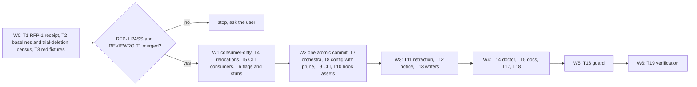

# SPEC-PANERM-001 구현 계획

## Tasks

Waves: W0 = T1, T2, T3 (no code change). Entry to W1 needs a T1 PASS receipt and SPEC-REVIEWRO-001 T1 merged.
W1 = T4, T5, T6 (consumer-only). W2 = T7, T8, T9, T10 (one atomic deletion merge). W3 = T11, T12, T13.
W4 = T14, T15, T17, T18. W5 = T16. W6 = T19. Rules: W1 deletes no declaration, file, or asset, and every existing test
still compiles; a test whose expected value changes is updated in the same commit by the owner of the code it tests.
W2's tasks own disjoint files, are integrated on one branch, and merge as one commit after the combined
`go build ./...`, `go vet ./...`, and `go test ./...` pass; each deletes declarations together with every test that
references them. Within a wave each file has one owner. Lint `unused` findings inside group P are expected in W1.

- [ ] T1: RFP-1 operator gate (REQ-01). Runs the RFP-1 row and records the redacted receipt in `research.md`. A FAIL
  or a missing billing confirmation stops the pipeline before W1, and the question returns to the user.
- [ ] T2: Baselines and census (REQ-02, REQ-03). At B, records the `go test -race ./...` failure set, rebuilt deadcode
  output, `go run ./cmd/source-lines -max 0 -ext .go pkg/orchestra` totals, touched-package coverage (PRD Q7), the S16
  goldens, and answers to PRD Q4, Q5, Q8, Q9. Census: in a scratch copy of B (`git archive`), delete groups P, C, H and
  the group F and K declarations, run `go vet ./...`, and add `rg` hits of group H file names; every error site gets
  exactly one owner task.
- [ ] T3: Red fixtures (REQ-08, REQ-10, REQ-13). Owns `[NEW] pkg/config/testdata/legacy_pane/` (C1–C7) and
  `[NEW] internal/cli/testdata/stale_hooks/` (W-claude, W-codex, W-agy, W-oc2, W-oc1, W-oc-bad, W-mix) built with O,
  with the fake `opencode --version` binaries per workspace; each fixture fails at B for the asserted reason.
- [ ] T4: Relocations (REQ-02). Moves `usesAntigravityPromptInteractive` (`interactive_launch.go` →
  `provider_patterns.go`), `noneBackendMarker` (`pane_fallback.go:15` → `run_receipt.go`, used by `run_receipt.go:229`,
  `debate_judge.go:26`, `failure_result.go:41`), and every other group P declaration the census shows in retained use.
- [ ] T5: CLI consumers (REQ-01, REQ-02, REQ-17). Owns `orchestra.go`, `orchestra_config.go`, `orchestra_helpers.go`,
  `orchestra_run_runtime.go`, `codex_catalog_runtime.go`, `orchestra_terminal.go`, `orchestra_readonly_policy.go`
  (after REVIEWRO T1), `spec_review_loop.go`, `spec_review_structured.go`: no group F write, no group K read, no group
  C call; census-mapped tests.
- [ ] T6: Flags and stubs (REQ-04, REQ-05, REQ-06). Owns `[NEW] internal/cli/orchestra_retired.go`, `orchestra_flags.go`,
  `orchestra_brainstorm.go`, `orchestra_plan.go`, `orchestra_file_cmds.go`, `orchestra_run.go` (drops the
  `applyHookMode` call at `:212` and its group F writes), `spec_review.go`, `orchestra_job.go`, `orchestra_collect.go`,
  `orchestra_inject.go`, `orchestra_cleanup.go`; retired `OrchestraFlags` fields stay declared until T9.
- [ ] T7: pkg/orchestra deletion (REQ-01, REQ-02, REQ-03, REQ-17). Entry cut in `runner.go`, `backend.go`, `recheck.go`;
  group F reads dropped from `judge_session_evidence.go`, `provider_validation.go`, `reliability_preflight.go`; group F
  (`types.go`); `BuildYieldOutput` (`yield.go`); the 60 group P files with their tests (`pane_backend_test.go`,
  `interactive_judge_pane_test.go`, ...); retained tests that set group F (`backend_test.go`, `backend_routed_test.go`,
  `subprocess_judge_session_evidence_test.go`); appends the remaining group I declarations.
- [ ] T8: pkg/config deletion (REQ-07, REQ-08, REQ-11). Group K fields (`schema_orchestra.go`, `schema.go`), the
  wildcard prune with pruned-path reporting (`loader_strict.go`, `loader.go`), `defaults.go`, `migrate.go`,
  `migrate_antigravity.go`, `codex_provider.go`, `claude_provider.go`, `configs/autopus.yaml`,
  `templates/shared/autopus.yaml.tmpl`, the S14 decision table, and every pkg/config test that references group K.
- [ ] T9: internal/cli deletion (REQ-02). `orchestra_hookmode.go`, `orchestra_hook_discovery*.go`, `orchestra_cc21.go`,
  the pane functions of `orchestra_terminal.go`, `ownStructuredReviewHookSession`, `resolveSubprocessMode`, retired
  `OrchestraFlags` fields, their tests, and `internal/cli/provider_argv_test.go`'s `TestProviderConfig_GeminiPaneNoPrint`
  and `TestProviderConfig_CodexPaneNotExec` (ORCH-021 S17, S19).
- [ ] T10: Hook generation and assets (REQ-12). `pkg/content/hooks.go`, `hooks_completion.go`, group H assets,
  `pkg/adapter/codex/codex_hooks.go`, `pkg/adapter/antigravity/antigravity_completion_hook.go`, `antigravity.go`,
  `antigravity_update.go`, generated-settings snapshots, and the tests naming group H assets: `pkg/content`
  `hook_round_cursor_contract_test.go`, `codex_hook_contract_test.go`, `opencode_hook_contract_test.go`,
  `claude_hook_contract_test.go`, `gemini_stop_hook_contract_test.go`, `hooks_test.go`, and
  `pkg/adapter/codex/codex_internal_test.go`.
- [ ] T11: Retraction (REQ-13). Owns `[NEW] pkg/adapter/stale_completion_hooks.go`, `[NEW] adapter.transactionStepHook`
  in `pkg/adapter/transaction.go`, `claude_settings_hooks.go` (handler-level), `claude_obsolete_surface.go`,
  `claude_update.go`, `pkg/adapter/codex/codex.go`, `codex_hooks_schema.go`, antigravity update and clean files,
  `opencode_config.go`, `opencode_config_v2.go`, and their tests.
- [ ] T12: Config notice (REQ-09). Owns `[NEW] internal/cli/config_notice.go`, `root.go` (`golang.org/x/term` TTY check).
- [ ] T13: Writers (REQ-10). Owns `update.go` (raw-node prune when a load pruned group K and no other migration
  holds), `quality_config.go`, `quality_provider_config.go`, `platform_omp_config.go` (prune group K from the raw node),
  the normalization-rewrite test, and the S7 old-binary reloads.
- [ ] T14: Doctor (REQ-14). Owns `doctor_json_checks.go`, `doctor_remediation.go`, `[NEW] doctor_legacy_orchestra.go`;
  calls the T8 prune and the T11 group S functions only.
- [ ] T15: Instructions and docs (REQ-15, REQ-18, REQ-20). Owns `templates/shared/orchestration-contract.md.tmpl`, the
  11 instruction sources in `research.md` Reference Discipline, `content/skills/monitor-patterns.md`,
  `content/skills/auto-setup.md`, `README.md`, `ARCHITECTURE.md`, `docs/README.ko.md`, `CHANGELOG.md`; regenerates per
  the Prompt Layer Manifest Contract.
- [ ] T16: Guard (REQ-16, REQ-17, REQ-18). Owns `internal/cli/orchestra_pane_unreachable_test.go`: group I, group P,
  and instruction-token checks plus a self-test over a fixture holding each token class.
- [ ] T17: `pkg/terminal/tmux_orchestra_regression_test.go` (REQ-19): delete or retarget per assertion.
- [ ] T18: Superseded notes (REQ-21, Nice) in the FR-30 SPEC headers.
- [ ] T19: Integration verification: RFP-2 and RFP-3 with the final binary, Verification below, sync evidence.

## Implementation Strategy

- Gate, then consumers, then one deletion: T1 proves the premise; W1 rewires consumers while every declaration and
  test still exists; W2 deletes declarations, assets, and their tests in one commit, with the prune in the same commit
  as the group K fields, so no commit rejects an A34 file or leaves the tree uncompilable.
- One source of truth per closed set: `removedConfigKeys` drives load, writers, notice, and doctor; the group S
  declaration drives update and doctor. The loader returns pruned paths; only the CLI decides whether to print.
- Scope decisions (flagged, not silently promoted): (1) REQ-18 is Must, not PRD P1, and covers `--subprocess`;
  (2) the notice covers group K only; (3) the opencode dangling-reference rule; (4) REQ-17 is explicit and limited to
  code-added flags; (5) claude retraction becomes handler-level for every managed handler, so a user handler sharing an
  entry survives (data-loss gate). Any further constraint an implementer adds (an ACL, a compatibility or security
  limit) is a scope expansion: it gets a probe row here before fan-out instead of becoming a requirement.

## Cross-SPEC Ordering

1. SPEC-REVIEWRO-001 T1 (shared read-only projection, typed violation in `orchestra_readonly_policy.go`) merges first;
   PANERM T5 edits that file afterwards. SPEC-SIGMABAND-001 T10 consumes the policy and is serialized with PANERM W2;
   whichever lands second carries no group F or group I reference (T16 enforces).
2. REVIEWRO items PANERM makes moot: the `PaneArgs` half of REQ-01, REQ-02, and S3; REQ-16 (subprocess forcing shipped
   in `fd07c45d`, `7c781509`, `16b50216`) and its pane-capable notice; REQ-17 and the S2 pane assertions
   (`buildPaneLaunchCommand(paneLaunchFor(...))`, fake-terminal pane counts); Error Contract key `.pane_args`; the
   F-default `PaneArgs` columns; T6's `SubprocessMode` true. REVIEWRO tasks after PANERM drop them; earlier ones are
   cleaned by T5, T7, or T9.
3. Worktree `wt/adk-turns` rebases after W2. T15 regenerates only after the user commits or stashes the local
   `.omp/skills/...` edits.

## Visual Planning Brief



## Feature Completion Scope

The Primary SPEC closes the Outcome Lock; Completion Debt CD-1..CD-8 (`research.md`) is owned here. Sync is blocked
while a Must scenario (S1–S19) fails, RFP-1 lacks a receipt, RFP-2 or RFP-3 lacks PASS evidence, a touched package is
below 85% coverage, or a source file exceeds 300 lines. S20 (Nice) does not block. No sibling: 19 tasks ≤ 25.

## Risk-First Integration Probe

| assumption_id | class | risk | boundary | input | oracle | isolation | status | reason | evidence |
|---------------|-------|------|----------|-------|--------|-----------|--------|--------|----------|
| RFP-1 | implementation_assumption | high | default provider headless argv → real `claude --print` 2.1.289, `codex exec`, `agy --print` under subscription logins | `auto orchestra brainstorm "<tiny prompt>" --providers claude,codex,gemini --rounds 1 --format json` from (a) a plain shell, (b) cmux or tmux, (c) a Claude Code Bash tool with `CLAUDECODE` set | stdout `schema` = `orchestration_cli_result.v1`; for each provider at least one `receipt.provider_receipts[]` row and every row with `backend` = `subprocess`, `exit_code` 0, `timed_out` false, `usable` true, no `failure_class` (`pkg/orchestra/run_receipt.go:18-30`); the operator confirms subscription billing in the provider consoles | `ANTHROPIC_API_KEY`, `OPENAI_API_KEY`, `GEMINI_API_KEY` unset; opt-in paid run with operator consent | not-run | partial run only: the operator-scoped claude row in context (c) passed on 2026-10-06T22:21Z (1 paid call, backend `subprocess`, exit_code 0, usable true) with the operator's billing confirmation; codex, gemini, and contexts (a), (b) were outside the operator's T1 scope | `evidence/t1-rfp1-receipt.txt`; `research.md` W0 Evidence T1 |
| RFP-2 | implementation_assumption | high | `autopus.yaml` load and write across binary O and the new binary | fixtures C1–C7 (`acceptance.md`) | S4–S7 expected values | scratch dirs, both binaries built locally, no network | not-run | the new binary does not exist yet; T3 writes the fixtures red; partial verified fact: B's `DefaultFullConfig` emits exactly P1 and C3 yields the S5 error text | scratchpad `panerm/config-probe.txt` (overlay test, no repo file) |
| RFP-3 | implementation_assumption | high | O `auto init` per platform → new `auto update` → `auto doctor` on real generated projects | W-claude, W-codex, W-agy, W-oc2, W-oc1, W-oc-bad, W-mix with user, mixed, legacy, invalid, and out-of-band entries | S11–S13 expected values | scratch project dirs and scratch `HOME`; no network | not-run | the new binary does not exist yet; T3 builds the workspaces red; verified fact: this repo's installed layout (7 scripts in `.claude/hooks/autopus`, 2 in `.codex/hooks/autopus`, 2 in `.gemini/hooks/autopus`, managed handlers in 4 settings files) | `ls` and `grep` of this repo at B |

Statement classification:

- requirement_invariant: no pane backend is constructed; tolerance is group K plus `workflow.team_default` plus
  `reservedConfigKeys`, and other unknown keys fail; the notice never reaches stdout, appears at most once, and is
  suppressed for `--quiet` or a non-terminal stderr; no writer emits a group K key; user handlers stay byte-identical;
  a second update is a no-op; doctor and update share one source of truth; hidden flags change nothing; stubs have no
  side effects; output keys stay as at B.
- implementation_assumption: the RFP-1 premise; the trial-deletion census is complete, so the W2 merge compiles; the
  `ApplyTransaction` journal restores removed files on a failed write; every group H script is a
  no-op without `AUTOPUS_SESSION_ID` (Q8); `FallbackMode` values stay valid (Q9); `c447badc` builds offline; after T7
  `pkg/orchestra` imports no `pkg/terminal`.
- verified_fact: the CLI cannot reach pane execution at B: `7c781509` forces `subprocessMode := true`
  (`orchestra.go:180`), `16b50216` removed the detach branch and `isStdoutTTY`, and
  `TestCLIProductionCodeNeverCallsPaneEntryPoints` guards the four entry points; pane branches remain inside
  `pkg/orchestra` (`runner.go:33-38`, `backend.go:36-40`, `recheck.go:39-43`); other baselines in `research.md`.

Gate applicability is read only from `gate-applicability.json`, written by `auto spec gates` into this directory; this
plan declares no gate status. Security, validation, data_loss, and deterministic_oracle gates cannot be `not_applicable`.

## Prompt Layer Manifest Contract

T15 edits prompt state. Stable layer: canonical sources in `content/skills/`, `templates/**/*.tmpl`, and
`templates/shared/orchestration-contract.md.tmpl`. Snapshot layer: regenerated platform copies (`.claude/`, `.codex/`,
`.gemini/`, `.agents/`, `.opencode/`, `.omp/`) and their manifest checksums. Ephemeral layer: per-run orchestra prompts
(unchanged). Observability: every changed generated file maps to a changed canonical source, the manifest checksum
changes exactly for those files, and no template carries secrets, tokens, or absolute user paths.

## Verification

Minimum sufficient set (security, validation, data-loss, deterministic-oracle, and generated-surface-hygiene gates kept):

```text
go build ./... && go vet ./... && golangci-lint run ./...
go test -race ./... -count=1            (failure set within the T2 baseline)
go test ./pkg/orchestra/ ./internal/cli/ ./pkg/config/ ./pkg/content/ ./pkg/adapter/... -coverprofile=cover.out
<rebuilt deadcode> -test ./... | grep -E '^(pkg/orchestra/|internal/cli/orchestra)'   (empty)
go run ./cmd/source-lines -max 300 -ext .go pkg internal cmd
git diff --name-only -- .claude .codex .gemini .agents .opencode .omp   (each path maps to a changed canonical source)
auto spec validate .autopus/specs/SPEC-PANERM-001 --strict
```
