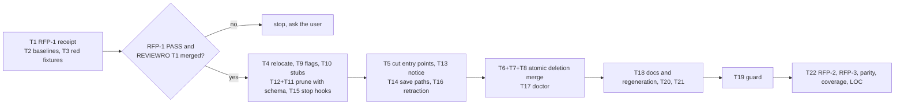

# SPEC-PANERM-001 구현 계획

## Tasks

Waves: W0 = T1, T2, T3 (no deletion). Entry to W1 needs a T1 PASS receipt and SPEC-REVIEWRO-001 T1 merged.
W1 = T4, T9, T10, T12+T11, T15. W2 = T5, T13, T14, T16. W3 = T6+T7+T8 (one atomic merge), T17. W4 = T18, T20, T21.
W5 = T19. W6 = T22. Within a wave each file has one owning task; T7 and T8 also remove group F references from files
that earlier waves own (`orchestra_run.go`, `spec_review.go`) after those merge. The build is green after every merge.

- [ ] T1: RFP-1 operator gate (REQ-01). Runs the RFP-1 row and records the redacted receipt in `research.md`. A FAIL
  or a missing operator billing confirmation stops the pipeline before T4 and the question returns to the user.
- [ ] T2: Baselines (REQ-02, REQ-03). Records in `research.md`: the clean-HEAD `go test -race ./...` failure set,
  deadcode v0.50.0 (rebuilt with the local Go) output, `go run ./cmd/source-lines -max 0 -ext .go pkg/orchestra` totals,
  touched-package coverage (PRD Q7), golden `--format json` stdout and receipts for brainstorm, plan, review, run, and
  recheck with fake providers, and answers to PRD Q4, Q5, Q8, Q9.
- [ ] T3: Red fixtures (REQ-08, REQ-10, REQ-13). Owns `[NEW] pkg/config/testdata/legacy_pane/` (C1–C6 of
  `acceptance.md`; C1 serialized by an `auto` binary built from `c447badc` = v0.50.123) and
  `[NEW] internal/cli/testdata/stale_hooks/` (workspaces generated by that binary per platform, plus user hooks). Each
  fixture fails on HEAD for the asserted reason.
- [ ] T4: Relocate shared helpers (REQ-02). Owns `pkg/orchestra/provider_patterns.go`, `yield.go`: moves
  `usesAntigravityPromptInteractive` and every other helper the compiler flags out of group P; drops the pane-only
  `BuildYieldOutput(cfg, panes, ...)` and keeps `YieldOutput`, `WriteYieldOutput`, `BuildYieldOutputFromResult`.
- [ ] T5: Cut entry points (REQ-01). Owns `pkg/orchestra/runner.go`, `backend.go`, `recheck.go`, `backend_routed.go`:
  `RunOrchestra` stops delegating, `SelectBackend` returns the subprocess backend, recheck uses the subprocess
  transport, `selectRoutedBackend` keeps the OMP route. Ports the `7c781509` (`orchestra_hookmode_test.go`) and
  `fd07c45d` (`orchestra_readonly_subprocess_test.go`) assertions into no-pane-backend assertions.
- [ ] T6: Delete group P (REQ-02, REQ-17). Deletes the 60 files and their tests, deadcode-guided; records per deleted
  test file whether its subject is deleted or retained and ports retained assertions; appends group I declarations.
- [ ] T7: Trim group F (REQ-03). Owns `types.go`, `judge_session_evidence.go`, `provider_validation.go`,
  `reliability_preflight.go`; compares stdout and receipts with the T2 goldens.
- [ ] T8: CLI glue (REQ-02). Owns the group C files, `orchestra.go`, `orchestra_config.go`, `orchestra_helpers.go`,
  `orchestra_readonly_policy.go` (drops `PaneArgs` projection and the `WorkingPatterns` copy), `spec_review_loop.go`,
  `spec_review_structured.go`.
- [ ] T9: Hidden no-op flags (REQ-04, REQ-05). Owns `[NEW] internal/cli/orchestra_retired.go` and the flag lines of
  `orchestra_plan.go`, `orchestra_brainstorm.go`, `orchestra_file_cmds.go`, `orchestra_run.go`, `spec_review.go`:
  `MarkHidden`, values no longer copied into `OrchestraConfig`, the yield notice written once.
- [ ] T10: Retired subcommand stubs (REQ-06). Owns `orchestra_job.go`, `orchestra_collect.go`, `orchestra_inject.go`,
  `orchestra_cleanup.go`: `Hidden`, `DisableFlagParsing`, `cobra.ArbitraryArgs`, RunE returns the retirement error.
- [ ] T11: Schema and defaults (REQ-07, REQ-11). Owns `schema_orchestra.go`, `schema.go`, `defaults.go`, `migrate.go`,
  `migrate_antigravity.go`, `codex_provider.go`, `claude_provider.go`, `configs/autopus.yaml`,
  `templates/shared/autopus.yaml.tmpl`, plus the S14 decision table test. Merges together with T12.
- [ ] T12: Wildcard prune (REQ-08). Owns `pkg/config/loader_strict.go`, `loader.go`: group K entries, `*` segment
  matching, concrete pruned paths returned to the caller; `workflow.team_default` stays silent.
- [ ] T13: Config notice (REQ-09). Owns `[NEW] internal/cli/config_notice.go`, `root.go`: one notice per process,
  suppressed for `--quiet` and a non-terminal stderr (`golang.org/x/term`).
- [ ] T14: Save paths (REQ-10). Owns the save path files that T2 Q5 lists, at least the raw-node path pinned by
  `TestQualitySupervisorCmdPreservesRawConfigAndEnvPlaceholder`; runs the C1 round trip with the v0.50.123 binary.
- [ ] T15: Stop generation (REQ-12). Owns `pkg/content/hooks.go`, `hooks_completion.go`, group H assets,
  `pkg/adapter/codex/codex_hooks.go`, `pkg/adapter/antigravity/antigravity_completion_hook.go`, `antigravity.go`,
  `antigravity_update.go`, and the generated-settings snapshots.
- [ ] T16: Retraction (REQ-13). Owns `[NEW] pkg/adapter/stale_completion_hooks.go`, `claude_obsolete_surface.go`,
  `claude_update.go`, `pkg/adapter/codex/codex.go`, `codex_hooks_schema.go`, antigravity update and clean files,
  `pkg/adapter/opencode/opencode_config.go`; all writes go through each adapter's update transaction and rollback.
- [ ] T17: Doctor (REQ-14). Owns `doctor_json_checks.go`, `doctor_remediation.go`, `check_cc21.go`,
  `[NEW] internal/cli/doctor_legacy_orchestra.go`; calls the T12 and T16 functions only.
- [ ] T18: Instructions and docs (REQ-15, REQ-18, REQ-20). Owns `templates/shared/orchestration-contract.md.tmpl`, the
  skill sources listed in `research.md` Reference Discipline, `content/skills/monitor-patterns.md`, `auto-setup.md`,
  `README.md`, `ARCHITECTURE.md`, `docs/README.ko.md`, `CHANGELOG.md`; regenerates per the Prompt Layer Manifest
  Contract below.
- [ ] T19: Guard (REQ-16, REQ-17, REQ-18). Owns `[NEW] internal/cli/pane_retirement_guard_test.go`, with a self-test
  that feeds it a fixture containing each retired token class and expects a failure naming the file and token.
- [ ] T20: `pkg/terminal/tmux_orchestra_regression_test.go` (REQ-19): delete or retarget per assertion.
- [ ] T21: Superseded notes (REQ-21) in the FR-30 SPEC headers.
- [ ] T22: Integration verification. Re-runs RFP-2 and RFP-3 with the final binary, runs Verification below, and
  records results in the sync evidence.

## Implementation Strategy

- Gate, then unreachable, then delete: T1 proves the premise; T5 cuts every pane entry point so that deadcode and the
  compiler, not the survey, decide what T6 deletes; mixed files are trimmed, not deleted.
- Compatibility lands with removal: the prune (T12) merges with the field removal (T11), so no commit rejects an A34
  file; the hidden flags (T9) and stubs (T10) land before any skill instruction changes (T18).
- One source of truth per closed set: `removedConfigKeys` drives load, Save, notice, and doctor; the group S declaration
  drives update and doctor. The loader returns pruned paths; only the CLI decides whether to print.
- Scope decisions, flagged and not silently promoted: (1) REQ-18 is Must, not PRD P1, and also covers `--subprocess`,
  because both flags are hidden no-ops and the instruction guard would otherwise have a hole; (2) the notice covers
  group K only and `workflow.team_default` stays silent, narrower than the PRD wording; (3) the opencode
  dangling-reference rule in the Compatibility Contract is an added constraint; (4) REQ-17 makes the PRD security NFR
  an explicit requirement. Any further constraint an implementer adds (an ACL, a compatibility limit, a security
  limit) is a scope expansion: it gets a probe row here before fan-out instead of becoming a requirement.

## Cross-SPEC Ordering

1. SPEC-REVIEWRO-001 T1 (shared read-only projection in `orchestra_readonly_policy.go`, typed violation) merges first.
2. PANERM T8 edits `orchestra_readonly_policy.go` on top of it. SPEC-SIGMABAND-001 T10 consumes that policy; it is
   serialized with the T6–T8 merge, and whichever lands second carries no group F or group I reference (T19 enforces).
3. REVIEWRO items PANERM makes moot: the `PaneArgs` half of REQ-01/REQ-02 and S3; REQ-16 subprocess forcing (shipped in
   `fd07c45d` and `7c781509`) and its pane-capable notice; REQ-17 and the S2 `buildPaneLaunchCommand(paneLaunchFor(...))`
   and fake-terminal pane-count assertions; the Error Contract key `.pane_args`; the F-default `PaneArgs` columns; the
   T6 routed factory's `SubprocessMode` true. REVIEWRO tasks landing after PANERM drop them; landing before, T7 or T8
   removes them.
4. Worktree `wt/adk-turns` (`chore/agent-max-turns`) rebases after the T6–T8 merge. T18 regenerates only after the
   user commits or stashes the local `.omp/skills/...` edits, so no uncommitted edit is overwritten.

## Visual Planning Brief



## Feature Completion Scope

- The Primary SPEC closes the Outcome Lock: dispatch (T5), deletion (T4, T6–T8), compatibility (T9–T14), hooks
  (T15–T17), instructions and guard (T18, T19), verification (T22). No sibling SPEC: 22 tasks stay under the 25-task
  threshold although about 180 files exceed 40, and the rule needs both.
- Completion Debt CD-1..CD-8 (`research.md`) is owned here; sync is blocked while any Must scenario S1–S19 fails, RFP-1
  lacks an operator receipt, RFP-2 or RFP-3 lacks PASS evidence, coverage of a touched package is below 85%, or a
  source file exceeds 300 lines.

## Risk-First Integration Probe

| assumption_id | class | risk | boundary | input | oracle | isolation | status | reason | evidence |
|---------------|-------|------|----------|-------|--------|-----------|--------|--------|----------|
| RFP-1 | implementation_assumption | high | default provider headless argv → real `claude --print` 2.1.289, `codex exec`, `agy --print` under subscription logins | `auto orchestra brainstorm "<tiny prompt>" --providers claude,codex,gemini --rounds 1 --format json` from (a) a plain shell, (b) cmux or tmux, (c) a Claude Code Bash tool with `CLAUDECODE` set | every provider reports `success` with `executed_backend` = `subprocess` in all three contexts, and the operator confirms in the provider consoles that the run drew on the subscription (claude.ai Max, ChatGPT login) and not on API credits | `ANTHROPIC_API_KEY`, `OPENAI_API_KEY`, `GEMINI_API_KEY` unset; opt-in paid run with operator consent | not-run | paid live run needs operator consent; precheck only: `claude auth status --json` → loggedIn true, authMethod claude.ai, subscriptionType max, Claude Code 2.1.289, 0 model calls; the billing source is not observable from CLI output, so the gate needs operator confirmation | precheck recorded in `prd.md` survey correction 8 |
| RFP-2 | implementation_assumption | high | `autopus.yaml` load, Save, reload across the v0.50.123 binary (`c447badc`) and the new binary | fixtures C1–C6 (`acceptance.md`) | S4–S7 expected values: loads, notice text, typo error, Save output, old-binary reload | scratch dirs, both binaries built locally, no network | not-run | the new binary does not exist yet; T3 writes the fixtures red; partial verified fact: HEAD `DefaultFullConfig` emits exactly the 4 group K paths of C1 and the typo error text of S5 | scratchpad `panerm/config-probe.txt` (overlay test, no repo file) |
| RFP-3 | implementation_assumption | high | v0.50.123 `auto init` per platform → new `auto update` → `auto doctor` on real generated projects | 4 scratch workspaces (claude-code, codex, antigravity-cli, opencode), each with one user Stop or AfterAgent hook; opencode with one managed and one out-of-band plugin entry | S11–S13 expected values: removed set equals group S present set, user hooks byte-identical, second update no diff, doctor warn → pass | scratch project dirs and scratch `HOME`; no network | not-run | the new binary does not exist yet; T3 builds the workspaces red; verified fact: this repo's installed layout holds 7 scripts in `.claude/hooks/autopus`, 2 in `.codex/hooks/autopus`, 2 in `.gemini/hooks/autopus`, and managed entries in 4 settings files | `ls` and `grep` of this repo at `7c781509` |

Statement classification:

- requirement_invariant: no pane backend is constructed; removed-key tolerance is the closed group K set plus the
  existing literal; other unknown keys fail; the notice never reaches stdout, appears at most once, and is suppressed
  for `--quiet` or a non-terminal stderr; no write emits a group K key; user hooks stay byte-identical; a second update
  is a no-op; doctor and update share one source of truth; hidden flags change nothing; stubs have no side effects;
  output keys stay as at `7c781509`.
- implementation_assumption: RFP-1 premise (headless runs bill to the subscription); the group P list equals the
  deadcode-unreachable set after T5; the raw-node save paths are enumerable (Q5); every group H script is a no-op without
  `AUTOPUS_SESSION_ID` (Q8); `FallbackMode` values stay valid in receipts (Q9); `c447badc` builds offline; after T7
  `pkg/orchestra` imports no `pkg/terminal` (today only `types.go` and `judge_session_evidence.go` outside group P do).
- verified_fact: subprocess forced at HEAD (`orchestra.go:177-180`); group P = 60 files, 8,732 lines of 17,945
  non-test lines in 139 files; deadcode baseline; A34 default group K paths; the typo error text; this repo's
  installed hook layout (`research.md` Verified Baselines).

Gate applicability is read only from `gate-applicability.json`, written by `auto spec gates` into this directory; this
plan declares no gate status. Security, validation, data_loss, and deterministic_oracle gates cannot be `not_applicable`.

## Prompt Layer Manifest Contract

- T18 edits prompt state. Stable layer: canonical sources in `content/skills/`, `templates/**/*.tmpl`, and
  `templates/shared/orchestration-contract.md.tmpl`. Snapshot layer: the regenerated platform copies (`.claude/`,
  `.codex/`, `.gemini/`, `.agents/`, `.opencode/`, `.omp/`) and their manifest checksums. Ephemeral layer: per-run
  orchestra prompts, which this SPEC does not change.
- Observability: after regeneration, every changed generated file maps to a changed canonical source, and the
  manifest checksum changes exactly for those files; no template carries secrets, tokens, or absolute user paths.

## Verification

Minimum sufficient set (security, validation, data-loss, deterministic-oracle, and generated-surface-hygiene gates kept):

```text
go build ./... && go vet ./... && golangci-lint run ./...
go test -race ./... -count=1            (failure set within the T2 baseline)
go test ./pkg/orchestra/ ./internal/cli/ ./pkg/config/ ./pkg/content/ ./pkg/adapter/... -coverprofile=cover.out
<rebuilt deadcode> -test ./... | grep -E '^(pkg/orchestra/|internal/cli/orchestra)'   (empty)
go run ./cmd/source-lines -max 300 -ext .go pkg internal cmd
git diff --name-only -- .claude .codex .gemini .agents .opencode .omp   (each path maps to a changed canonical source)
auto spec validate .autopus/specs/SPEC-PANERM-001 --strict
```
