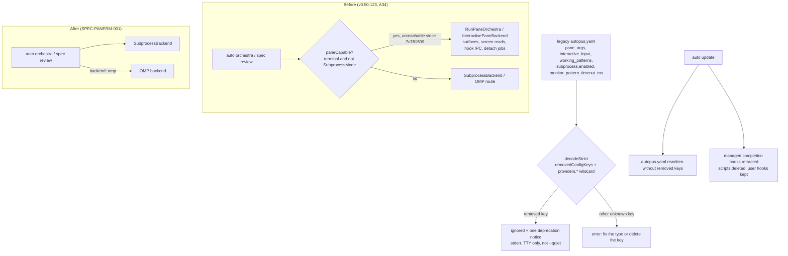

# PRD: Retire the Orchestra Pane Backend (Subprocess and OMP Only)

> Product Requirements Document — Standard mode (`templates/shared/prd-standard.md.tmpl`), extended with the planner's Outcome Lock, Visual Brief, Feature Coverage Map, Sibling SPEC Decision, Completion Debt, and Evolution Ideas.

- **SPEC-ID**: SPEC-PANERM-001 (Primary; no sibling, see Sibling SPEC Decision)
- **Source**: user decision 2026-10-06 ("pane 기능 자체가 필요없어진 것 같아. 서브프로세스로 다 해도 되니깐"), Plan Intent Ledger, read-only survey plus spot checks at `7c781509`
- **Target module**: autopus-adk
- **Author**: Autopus planning workflow (planner)
- **Status**: Draft
- **Date**: 2026-10-06
- **Proposed change class**: a large deletion in the orchestration engine, a config-load compatibility contract for every existing workspace, and edits to user-owned settings files. Expect `risk_tier: high`, the full SPEC set, and Risk-First Integration Probes before broad implementation. The authoritative class is the `auto spec gates` receipt (`gate-applicability.json`), not this PRD.

**Overview.** Since `7c781509`, every orchestra entry point in `internal/cli` forces the subprocess backend. As a result, about 8.9k LOC of pane-only code in `pkg/orchestra`, its CLI glue, five config keys, and the per-platform completion hooks are unreachable, yet they are still compiled, defaulted, installed, and documented. This SPEC deletes that surface and keeps upgrades zero-touch:

- Legacy `autopus.yaml` files still load. Removed keys are ignored with a notice, and typos are still rejected.
- Retired flags stay as hidden no-ops, and retired subcommands fail with a migration message.
- `auto update` retracts stale hooks and preserves user hooks.

Agent Teams panes, `pkg/terminal`, `auto terminal`, and the OMP backend are untouched.

---

## Discovery Q&A Checklist

Plan Intent Ledger rows are reused as evidence. No question was re-asked.

- [x] **Problem** (answered by the user and the `7c781509` commit body). The pane path is no longer used. Its launch adds `--dangerously-skip-permissions` for claude and agy, and it auto-approves permission prompts (`completion_poll.go:78-84`). Left in place, it is about 8.9k LOC of dead weight, and a one-line edit to the `paneCapable` predicate would silently bring the bypass back.
- [x] **Target Users** (answered by the survey). See §3.
- [ ] **Success Metrics** (assumed from ledger `done_evidence`, medium confidence). See §2 and the Outcome Lock completion evidence. Non-blocking.
- [x] **Constraints** (answered by the ledger and the repo). See §7.
- [x] **Prior Art** (answered from code):
  - Removed-key contract: `removedConfigKeys` plus `workflow_cutover_test.go`.
  - Closed-set doctor/update prune: `obsoleteClaudeSurfacePaths`.
  - Managed-entry retraction: `retractManagedHookEntries` (claude) and `isAutopusHookHandler` (codex).
  - The SPEC-ORCH-019 subprocess engine.
  - `fd07c45d` and `7c781509`, which force subprocess.
- [ ] **Scope Boundary** (assumed from ledger `scope_boundary`, medium confidence). See §8. Non-blocking.

| Ledger field | Status | Confidence | PRD handoff |
|---|---|---|---|
| goal | answered | high | Outcome Lock |
| scope_boundary | assumed | medium | §8 Out of Scope; Open Question Q2 |
| constraints | answered | high | §7; FR-04, FR-08..FR-13 |
| done_evidence | assumed | medium | Outcome Lock completion evidence; RFP-1..RFP-3 |
| brownfield_impact | answered | high | Feature Coverage Map integration column; §7 reviewer focus |

Question Audit: `question_transport=AskUserQuestion` (prior turns), `question_count=0` for this SPEC, `unresolved_fields=[scope_boundary, done_evidence]`. Both fields are `assumed`, and neither blocks the Outcome Lock.

### Survey corrections from spot checks (2026-10-06, `7c781509`)

These spot checks change the requirement set relative to the hand-off survey.

1. **`working_patterns` is pane-only too.**
   - Its only readers in `pkg/orchestra` are pane files: `signal_emitter.go`, `interactive_detect.go`, `interactive_debate_hook_collect.go`, `hook_completion_handoff.go`, and `completion_poll.go`.
   - `internal/cli` only resolves and copies the value (`orchestra_config.go:204`, `orchestra_helpers.go:258`, `orchestra_readonly_policy.go:53`).
   - It joins the removed keys.
2. **`features.cc21.monitor_enabled` stays.** `pkg/platform/claude.go:128` maps it to the platform `Monitor` feature, outside orchestra. Only `features.cc21.monitor_pattern_timeout_ms` is removed; its sole reader is `internal/cli/orchestra_cc21.go:22`.
3. **Installed harness instructions pass `--no-detach` on every synchronous gate.**
   - There are seven sites: `templates/claude/commands/auto-workflows.md.tmpl:630,637,1732,2450`, `templates/codex/skills/auto-review.md.tmpl:69`, `templates/codex/skills/auto-go.md.tmpl:375`, and `content/skills/idea.md:203,209`, plus the codex and gemini copies of the idea skill.
   - `templates/shared/orchestration-contract.md.tmpl:19-24` also documents the detached `auto orchestra wait|result <job-id>` handoff.
   - Removing the flag would break every installed `/auto idea|review|go` until it is regenerated, so the hidden no-op is mandatory.
4. **Settings-entry retraction already exists.**
   - Claude: `retractManagedHookEntries` (`pkg/adapter/claude/claude_settings_hooks.go:15-34`) drops entries whose command starts with `.claude/hooks/autopus/` or `"${CLAUDE_PROJECT_DIR:-.}"/.claude/hooks/autopus/`.
   - Codex: `isAutopusHookHandler` (`codex_hooks_schema.go:123`).
   - Once generation stops, those entries disappear on the next regeneration.
   - Script files are a different problem. Deleting them needs the closed-set obsolete-surface path, which today deliberately omits `hook-opencode-complete.ts` because no code declares it legacy (`claude_obsolete_surface.go:44-52`). This SPEC supplies that declaration.
5. **No external importer.** Only this module imports `pkg/orchestra` (plus its own worktree `wt/adk-turns`, on branch `chore/agent-max-turns`). Deleting the exported pane symbols breaks no other repo.
6. **`recheck` still selects panes on its own** (`runner.go:33-36` comment, `recheck.go:40`). It is unreachable today only because the CLI passes `SubprocessMode: true`.
7. **The strict loader has no warning channel.** `loader_strict.go:11-24` prunes removed keys silently, and `pruneNodeKey` (`:76`) matches literal segments only. The deprecation notice and the per-provider wildcard are both new behavior.
8. **The pane path's original justification conflicts with the current premise** (see R1).
   - SPEC-ORCH-021/022 justified panes this way: "`-p` needs separate API billing, so interactive CLIs are the only subscription path" (`SPEC-ORCH-022/spec.md`, 목적 section).
   - Local state on 2026-10-06:
     - `claude auth status --json` reports `authMethod=claude.ai`, `subscriptionType=max`, and `ANTHROPIC_API_KEY` is unset.
     - `codex login status` reports "Logged in using ChatGPT".
   - Secondary sources disagree on whether Anthropic's split, announced for 2026-06-15, is paused or live. That split moves `claude -p` to a separate Agent SDK credit pool.
   - The latest local review receipt (SPEC-HARNEVAL-002) ran with `executed_backend=omp`. So no local receipt yet confirms a headless subscription run on the CLI subprocess backend.
   - RFP-1 closes this gap.

---

## Outcome Lock

**Final outcome.** autopus-adk ships no orchestra pane backend. Every provider in every `auto orchestra` command (including `recheck` and `run`) and in `auto spec review` runs as a headless subprocess. Providers set to `backend: omp` run through the OMP backend instead. The following are gone: the pane-only code, the pane config keys, the completion and ready hooks, the related doctor checks, and the related documentation.

A workspace generated by v0.50.123 (A34) keeps working after the upgrade:

- Its `autopus.yaml` loads. Removed keys are ignored with a deprecation notice, and any other unknown key is still rejected.
- `auto update` rewrites the file without the removed keys. It also retracts Autopus-managed completion hooks and scripts on every platform and leaves user hooks unchanged.
- Installed skills that pass `--no-detach` behave identically. `--subprocess`, `--plain`, and `--yield-rounds` are hidden no-ops. Retired subcommands exit with a migration message.
- `auto doctor` reports leftovers with a remedy before the update and reports clean after it.

**Mandatory requirements.** FR-01..FR-16 (all P0, §5).

**Explicit non-goals.**
- `pkg/terminal`, `auto terminal`, and Agent Teams panes (`pkg/pipeline/{monitor,team_monitor,team_pane,team_layout}.go`; SPEC-TEAMPANE-001, SPEC-ORCH-002).
- The OMP backend.
- Subprocess engine semantics, strategies, and judge logic (SPEC-ORCH-019).
- The read-only provider policy (SPEC-REVIEWRO-001).
- A replacement live-progress UI.
- Removing the hidden no-op flags or the subcommand stubs.

**Completion evidence.**
1. **Static reachability.**
   - `go build ./...`, `go vet ./...`, and `golangci-lint run` report 0 issues.
   - The FR-16 guard test passes.
   - `deadcode -test ./...` lists no function in `pkg/orchestra` or `internal/cli/orchestra*` beyond the pre-change baseline recorded in research.md, and no baseline entry names a retired symbol.
2. **Size.** `pkg/orchestra` non-test LOC drops by at least 8,000, measured before and after with `go run ./cmd/source-lines`. No source file exceeds 300 lines.
3. **RFP-2 legacy config matrix** passes (§7).
4. **RFP-3 hook retraction matrix** passes (§7).
5. **CLI compatibility.**
   - Argv and backend oracles are identical with and without `--no-detach`, `--subprocess`, `--plain`, and `--yield-rounds`.
   - These flags are absent from `--help`.
   - The `--yield-rounds` notice goes to stderr only.
   - Each retired subcommand exits non-zero with the migration message.
6. **Execution oracles.**
   - SPEC-ORCH-019 engine tests and SPEC-ORCH-021 argv oracles S15–S20 stay green.
   - The `fd07c45d`/`7c781509` regression tests are rewritten to assert that no pane backend exists.
   - `recheck` runs through the subprocess backend.
7. **Test parity and coverage.**
   - The set of `go test -race ./...` failures is a subset of the clean-HEAD baseline recorded in research.md. Known local failures: `TestUpdateCmd_*` and `TestPlatform*`, caused by the local Codex catalog, per the `7c781509` Not-tested trailer.
   - Touched packages meet the 85% threshold (`make coverage`).
8. **Instructions and docs.** The FR-16 instruction guard passes over `content/`, `templates/`, `configs/`, and the regenerated outputs. The CHANGELOG lists every removed key, flag, subcommand, and hook with its migration path.
9. **RFP-1 receipt** is recorded before the deletion tasks start. A failing provider stops the pipeline, and the question goes back to the user.

---

## Visual Brief

UX wireframe gate: not applicable. This is CLI-only work with no screen or IA surface (`wireframe intent: n/a`).



```text
$ auto orchestra review SPEC-X --no-detach --format json   # installed skill: flag accepted, no-op
{ ...same JSON shape as before... }

$ auto orchestra brainstorm "idea" --yield-rounds         # command-flow sketch, not final copy
warning: --yield-rounds was retired with the pane backend; rounds run synchronously

$ auto orchestra wait job-123
error: `auto orchestra wait` was retired with the pane backend (SPEC-PANERM-001).
       Orchestra commands run synchronously now; read the command's own output.

$ auto doctor                                              # before `auto update`
  WARN  legacy orchestra keys: orchestra.providers.codex.pane_args, ... -> run `auto update`
  WARN  stale completion hooks: .claude/settings.json Stop -> hook-claude-stop.sh -> run `auto update`
```

The sketch only illustrates the flow. Copy becomes a requirement only where FR-05, FR-06, FR-09, or FR-14 ties it.

---

## Feature Coverage Map

| Capability | Happy path | Error / recovery | Integration boundary | CLI surface | Verification | Docs / ops |
|---|---|---|---|---|---|---|
| Provider dispatch, subprocess or OMP only | FR-01 | OMP route kept; missing-binary error unchanged | `runner.go:33-38`, `backend.go:36-40`, `recheck.go:39-43`, `omp_review_backend.go:180-188`, `detach.go` | all `auto orchestra *`, `auto spec review` | backend and argv oracles; recheck subprocess test | ARCHITECTURE.md |
| Pane code removal | FR-02 | shared helpers relocated before deletion | pkg/orchestra pane groups; internal/cli callers | — | build, FR-16 guard, deadcode, LOC delta | — |
| Type and branch trimming | FR-03 | output keys stay stable (NFR) | `types.go:58,61,212-230`, `reliability_preflight.go:44-92`, `judge_session_evidence.go:31-48,97`, `provider_validation.go:58` | `--format json`, receipts | golden output tests | — |
| Retired flags | FR-04, FR-05 | `--yield-rounds` writes a stderr notice | flag definitions in `orchestra_plan.go`, `orchestra_brainstorm.go`, `orchestra_file_cmds.go`, `orchestra_run.go`, `spec_review.go:88-89` | hidden flags | argv parity tests; help snapshot | CHANGELOG |
| Retired subcommands | FR-06 | non-zero exit plus migration message | `orchestra_job.go`, collect/inject/cleanup commands | hidden stubs | CLI tests | CHANGELOG |
| Schema removal | FR-07 | keep `prompt_via_args`, `monitor_enabled`, `subprocess.{max_concurrent,work_dir,rounds}` | `schema_orchestra.go:17,30,33,34`, `schema.go:108` | `autopus.yaml` | schema tests | `configs/autopus.yaml` |
| Legacy load (wildcard prune) | FR-08 | typos still rejected; a non-mapping node is a miss | `loader_strict.go:20,57,76` | every command | RFP-2 | — |
| Deprecation notice | FR-09 | suppressed under `--quiet` and when stderr is not a TTY | loader returns pruned paths, CLI prints | every command | stderr capture tests | doctor remedy |
| Save and default generation | FR-10, FR-11 | v0.50.123 binary loads the rewritten file | Save path, `defaults.go`, `migrate*.go`, `codex_provider.go`, `claude_provider.go`, both shipped configs | `auto init`, `auto update` | RFP-2 round trip; default-config snapshot | `configs/autopus.yaml`, `autopus.yaml.tmpl` |
| Hook generation stop | FR-12 | — | `hooks.go:95`, `hooks_completion.go:43`, codex, antigravity, and opencode adapters | `auto init`, `auto update` | generated-settings snapshots | `auto-setup.md` |
| Hook retraction | FR-13 | user hooks preserved; idempotent; transaction rollback | `claude_settings_hooks.go`, `claude_obsolete_surface.go`, `codex_hooks*.go`, `antigravity_completion_hook.go`, opencode plugin | `auto update` | RFP-3 | CHANGELOG |
| Doctor | FR-14 | leftovers reported as warn plus remedy | `doctor_json_checks.go`, `doctor_remediation.go`, `check_cc21.go` | `auto doctor [--json]` | doctor fixtures before and after update | remediation text |
| Shipped instructions and docs | FR-15, FR-20 | — | `content/`, `templates/`, `configs/`, README, ARCHITECTURE, README.ko, CHANGELOG | — | FR-16 guard; regenerate diff | all listed |
| Regression guard | FR-16 | — | guard test over Go source and instruction sources | — | guard is red when fed a fixture that contains a retired identifier | — |
| Headless subscription viability | RFP-1 | a failure stops the pipeline and escalates to the user | default provider headless argv | — | RFP-1 receipt | CHANGELOG note |

---

## 1. Problem & Context

**Current Situation**

| Surface | Today | Evidence |
|---|---|---|
| CLI dispatch | Every command forces the subprocess backend | `orchestra.go:177-180` (`subprocessMode := true`), `orchestra_run.go:203`, `spec_review_loop.go:84` |
| Engine | Pane branches remain: `RunOrchestra` → `RunPaneOrchestra`, `SelectBackend` → `NewInteractivePaneBackend`, and the recheck pane transport | `runner.go:33-38`, `backend.go:36-40`, `recheck.go:39-43` |
| Code volume | About 8.9k pane-only LOC in 61 of the package's non-test files (17.9k LOC total), plus about 119 pane-named test files | survey |
| Config | Five pane-only keys remain in the schema, the defaults, the migrations, and both shipped configs | `schema_orchestra.go:17,30,33,34`; `schema.go:108`; `defaults.go:33,103,183`; `configs/autopus.yaml`; `templates/shared/autopus.yaml.tmpl` |
| Hooks | Completion and ready hooks are installed for claude, codex, antigravity, and gemini. They are no-ops unless `AUTOPUS_SESSION_ID` is set, and only the pane path sets it | `hooks.go:95`, `hooks_completion.go:43-82`; `round_signal.go:65`, `interactive.go:56` |
| Instructions | Skills pass `--no-detach`; the orchestration contract documents the detached `wait`/`result` handoff | survey correction 3 |
| Security | The pane launch path adds `--dangerously-skip-permissions` and auto-approves tool prompts | `7c781509` body; `completion_poll.go:78-84` |

**Problem Statement**

The pane backend is dead code, and it still has costs:

- Maintainers carry about 9k LOC and about 119 test files that exercise nothing reachable.
- Users carry config keys and installed hooks that have no effect.
- A single predicate edit would restore a launch path that bypasses permission prompts.

Removing it naively breaks every upgraded workspace. The strict loader rejects removed keys, and installed skills pass a flag that would no longer exist.

**Impact**

- **If nothing changes:** maintenance cost continues, and the docs drift (README and ARCHITECTURE describe pane execution that never happens). The bypass path also stays one edit away from returning.
- **If the removal is naive:** every `auto` command fails to load A34 default configs, because the defaults emit codex `pane_args` and gemini `interactive_input` (`defaults.go:33,103`). Every installed pipeline gate also fails on `--no-detach`.

**Change Motivation**

The user decided on 2026-10-06 to remove the pane backend. In addition, the `7c781509` Directive trailer hands this cleanup to "제거 SPEC ... strict decode 호환과 함께".

---

## 2. Goals & Success Metrics

| Goal | Success Metric | Target | Timeline |
|---|---|---|---|
| G1 No reachable pane execution | Retired identifiers in non-test source of `pkg/orchestra` and `internal/cli`; pane backend constructions | 0 (FR-16 guard and deadcode) | the next release after v0.50.123 |
| G2 Smaller engine | `pkg/orchestra` non-test LOC (`go run ./cmd/source-lines`) | at least −8,000 (≈17.9k → ≤9.9k) | same release |
| G3 Zero-touch upgrade | Legacy fixtures that load / typo fixtures rejected / v0.50.123 binary loads the rewritten file | 100% / 100% / pass | same release |
| G4 Clean hook state | Managed completion entries and scripts after one `auto update` / user-hook changes / diff after a second update | 0 / 0 / empty | same release |
| G5 No regression | New test failures vs the clean-HEAD baseline / coverage of touched packages | 0 / ≥85% | same release |

**Anti-Goals**

- This SPEC does not preserve pane UX or build a replacement live view.
- It does not shrink `pkg/terminal` or touch Agent Teams panes.
- It does not change subprocess engine semantics, strategies, judge logic, or the read-only policy.
- It does not remove the hidden compatibility shims.

---

## 3. Target Users

| User Group | Role | Usage Frequency | Key Expectation |
|---|---|---|---|
| ADK users running orchestra or spec review on claude-code, codex, and agy hosts | developer, end user | daily | Upgrade without editing config; same results |
| Harness-driven agents (`/auto idea`, `/auto plan`, `/auto go`, `/auto review` pipelines) | automated caller | every pipeline run | `--no-detach --format json` keeps working; stdout JSON unchanged |
| ADK maintainers | developer | daily | About 9k fewer LOC and about 119 fewer pane test files to maintain; no pane flakes |
| Former users of panes, detach, or yield rounds | developer | occasional | A clear notice of what replaced live panes, detach, yield rounds, and collect/inject |

**Primary User**: harness-driven agents together with upgrading users. The compatibility contract is the riskiest surface, and both groups depend on it.

---

## 4. User Stories / Job Stories

### Story 1: Upgrade without editing config (Job Story)

**When** I upgrade autopus-adk on a workspace generated by v0.50.123,
**I want to** keep every `auto` command loading my `autopus.yaml`,
**so I can** upgrade without hand-editing config.

**Acceptance Criteria**

- Given the A34 default full config (codex `pane_args`, gemini `interactive_input`), when any `auto` command runs, then the config loads and the command behaves as before.
- Given a fixture with all five removed keys under three provider names, when it loads, then every key is ignored, and the notice names each concrete path once.
- Given `orchestra.providers.codex.pane_argz`, when it loads, then the load fails with the existing "unknown keys are rejected" error.
- Given a hook-invoked `auto react check --quiet` and a config with removed keys, when the command runs, then it prints no notice.
- Given `auto update`, when it rewrites the file, then the removed keys are gone, other keys keep their values, and the v0.50.123 binary still loads the result.

### Story 2: Installed pipelines keep running (Job Story)

**When** an installed `/auto go` or `/auto idea` skill runs `auto orchestra review|brainstorm ... --no-detach --format json`,
**I want to** have the gate behave exactly as before,
**so I can** keep using pipelines generated before this release.

**Acceptance Criteria**

- Given each retired flag, when it is passed, then provider argv, backend, stdout, and exit code equal those of the run without the flag.
- Given `--help`, when it is printed, then it does not list the retired flags.
- Given `--yield-rounds`, when it is passed, then exactly one deprecation line goes to stderr and stdout is unchanged.
- Given `auto orchestra collect|inject|cleanup|status|wait|result`, when it is invoked, then it exits non-zero with the migration message and touches no terminal session.

### Story 3: Stale hooks are cleaned, mine survive (Job Story)

**When** I run `auto update` on a workspace that has A34-installed completion hooks plus my own Stop hook,
**I want to** have only Autopus's completion hooks and scripts removed,
**so I can** keep my hooks and stop running dead scripts.

**Acceptance Criteria**

- Given claude-code, codex, antigravity-cli (gemini), and opencode workspaces, when `auto update` runs, then no managed completion or ready entry or script remains.
- Given my own Stop or AfterAgent hook, when `auto update` runs, then the hook is unchanged (same command, matcher, and order).
- Given a second `auto update`, when it runs, then it produces no diff.
- Given `auto doctor`, when it runs before the update, then it warns with the remedy. When it runs after the update, it reports no completion-hook or legacy-key finding.
- Given an `opencode.json` plugin entry that points outside the Autopus-managed path, when `auto update` runs, then the entry is left alone.

### Story 4: Maintainer removes dead code safely (User Story)

**As an** ADK maintainer,
**I want** the pane backend deleted and guarded,
**so that** orchestra changes stop paying for about 9k LOC of unreachable code, and the launch path that bypasses permission prompts cannot return silently.

**Acceptance Criteria**

- Given the merged change, when the guard test runs, then no retired identifier exists in the non-test source of `pkg/orchestra` or `internal/cli`.
- Given `deadcode -test ./...`, when it runs, then no pane-related entries remain.
- Given `go run ./cmd/source-lines`, when it runs, then `pkg/orchestra` non-test LOC is down by at least 8,000.
- Given the SPEC-ORCH-019 and SPEC-ORCH-021 oracles, when they run, then they stay green.

**INVEST Check**:
- Independent: one module.
- Negotiable: the exact identifier list.
- Valuable: yes.
- Estimable: the survey already groups the files.
- Small: large in file count, but mechanical and compiler-led.
- Testable: guard test, deadcode, and LOC delta.

### Story 5: Former pane users learn what changed (Job Story)

**When** I previously relied on live panes, detached jobs, or `--yield-rounds`,
**I want to** learn from the release notes and CLI messages what replaced them,
**so I can** adjust my scripts without guessing.

**Acceptance Criteria**

- Given the release, when I read the CHANGELOG, then it lists each retired flag, subcommand, key, and hook with its replacement.
- Given README, ARCHITECTURE, and README.ko, when I read them, then none describes pane execution, and the README team-pane section (`README.md:497-509`) is unchanged.

---

## 5. Functional Requirements

### P0 — Must Have

| ID | Requirement | Notes |
|----|-------------|-------|
| FR-01 | WHEN any `auto orchestra` command (including `recheck` and `run`) or `auto spec review` executes providers, THE SYSTEM SHALL dispatch each provider to the subprocess backend, or to the OMP backend for `backend: omp` providers. THE SYSTEM SHALL NOT construct a pane backend, open a terminal surface, read a terminal screen, or create a detached job. | `runner.go:33-38`; `backend.go:36-40` (`SelectBackend` becomes subprocess-only or is replaced); `recheck.go:39-43`; `detach.go`. `selectRoutedBackend` (`omp_review_backend.go:180-188`) keeps the OMP route |
| FR-02 | THE SYSTEM SHALL delete the pane-only code in `pkg/orchestra` and its `internal/cli` callers. It SHALL first relocate every helper that retained code still calls. | See the FR-02 detail list below |
| FR-03 | THE SYSTEM SHALL remove every `OrchestraConfig` and `ProviderConfig` field that only selects or configures pane execution, together with the pane branches that read those fields. | See the FR-03 detail list below. Output keys stay stable (§6) |
| FR-04 | WHEN `--no-detach`, `--subprocess`, or the `spec review` flags `--plain`/`--subprocess` are passed, THE SYSTEM SHALL accept them, hide them from help, and run exactly as without them, with no extra output. | `orchestra_plan.go:42,44`, `orchestra_brainstorm.go:56,61`, `orchestra_file_cmds.go:67,111`, `orchestra_run.go:63`, `spec_review.go:88-89`. Silent, because installed skills pass `--no-detach` on every gate (survey correction 3) |
| FR-05 | WHEN `--yield-rounds` is passed, THE SYSTEM SHALL accept it, hide it from help, run all rounds synchronously, and write one deprecation line to stderr. Stdout, `--format json` output, and the exit code SHALL be unchanged. | `orchestra_brainstorm.go:59`. Behavior changes here, so a notice is warranted |
| FR-06 | WHEN `auto orchestra collect`, `inject`, `cleanup`, `status`, `wait`, or `result` is invoked, THE SYSTEM SHALL exit non-zero with a message that names the retirement (SPEC-PANERM-001) and the synchronous replacement. It SHALL NOT touch any terminal session, and it SHALL hide these commands from help. | `orchestra_job.go` and the pane-session commands. Without stubs, cobra's generic "unknown command" error would be ambiguous to an agent that follows a stale installed instruction |
| FR-07 | THE SYSTEM SHALL remove these schema fields: `orchestra.providers.<name>.pane_args`, `.interactive_input`, `.working_patterns`, `orchestra.subprocess.enabled`, and `features.cc21.monitor_pattern_timeout_ms`. THE SYSTEM SHALL keep `prompt_via_args`, `features.cc21.monitor_enabled`, and `orchestra.subprocess.{max_concurrent,work_dir,rounds}`. | `schema_orchestra.go:17,30,33,34`; `schema.go:108`. Why the kept keys stay: `PromptViaArgs` is read by `subprocess_runner.go`, `subprocess_codex.go`, and `provider_runner.go`; `MonitorEnabled` is read by `pkg/platform/claude.go:128` |
| FR-08 | WHEN `autopus.yaml` contains a removed key, under any provider name for the per-provider keys, THE SYSTEM SHALL load the file and ignore the value. WHEN it contains any other unknown key, THE SYSTEM SHALL keep rejecting it. | See the FR-08 detail list below |
| FR-09 | WHEN a load prunes removed keys, THE SYSTEM SHALL write one deprecation notice per process to stderr. The notice SHALL name each pruned concrete path and the remedy (`auto update`, or delete the key). THE SYSTEM SHALL NOT write the notice to stdout or change the exit code. It SHALL suppress the notice under `--quiet` and when stderr is not a terminal. | See the FR-09 detail list below |
| FR-10 | WHEN `autopus.yaml` is saved, including by `auto update`, THE SYSTEM SHALL write it without the removed keys and SHALL preserve every retained key and value. | Raw-node save paths in `internal/cli` must not carry removed keys through a Save (Q5) |
| FR-11 | THE SYSTEM SHALL produce no removed key from any default, migration, or template source. | See the FR-11 detail list below |
| FR-12 | THE SYSTEM SHALL stop generating and installing orchestra completion and ready hooks on every platform, and SHALL delete their canonical assets. | See the FR-12 detail list below |
| FR-13 | WHEN `auto update` runs on a workspace with previously installed completion or ready hooks, THE SYSTEM SHALL remove only the Autopus-managed entries from each platform settings file and delete the managed script files. It SHALL leave user-authored hooks unchanged, and a second run SHALL be a no-op. | See the FR-13 detail list below |
| FR-14 | WHEN `auto doctor` runs (text or `--json`), THE SYSTEM SHALL drop the completion-hook and orchestra-monitor checks. It SHALL report, as a warning with a remedy, any removed config key that is present and any stale completion hook entry or script. These reports SHALL use the same source of truth as FR-08 and FR-13. | `doctor_json_checks.go`, `doctor_remediation.go`, `check_cc21.go`. Working check IDs: `doctor.legacy_orchestra_config`, `doctor.stale_completion_hooks` |
| FR-15 | THE SYSTEM SHALL remove pane execution, detach jobs, hook mode, yield rounds, and the removed keys from shipped instructions and docs. Edits SHALL go to canonical sources only, followed by regeneration. THE SYSTEM SHALL also add a CHANGELOG entry that gives the migration path for each retired surface. | See the FR-15 detail list below |
| FR-16 | THE SYSTEM SHALL include a regression guard test. The test SHALL fail when non-test Go source in `pkg/orchestra` or `internal/cli` declares or references a retired identifier, or when a retired file group reappears in `pkg/orchestra`. It SHALL also fail when `content/`, `templates/`, or `configs/` reference a retired flag (`--yield-rounds`), subcommand (`auto orchestra collect\|inject\|cleanup\|status\|wait\|result`), or key, outside the FR-04..FR-06 compatibility definitions and the CHANGELOG. | See the FR-16 detail list below |

**FR-02 detail**
- Delete these `pkg/orchestra` groups:
  - `pane_*.go`, `interactive*.go`, `hook_*.go`
  - `completion_{poll,file_ipc,signal,detector}.go`
  - `cc21_monitor.go`, `signal_emitter.go`, `round_signal.go`
  - `surface_manager.go`, `surface_tracker*.go`, `warm_pool.go`
  - `read_screen.go`, `screen_sanitizer.go`, `relay_pane.go`, `recovery_hook_launch.go`
  - `session*.go`, `yield_session.go`, `reviewer_response_file.go`
  - `pane_capable.go`, `detach.go`, `job.go`
- Delete these `internal/cli` callers:
  - the pane parts of `orchestra_terminal.go`
  - `orchestra_hookmode.go`, `orchestra_hook_discovery*.go`, `orchestra_cc21.go`, `cc21_runtime.go`
  - the dead `ownStructuredReviewHookSession` (`spec_review_structured.go:96`)
  - the test-only `resolveSubprocessMode` (`orchestra_config.go:245`)
- Relocate first:
  - `usesAntigravityPromptInteractive` (`interactive_launch.go:102`; used by `provider_patterns.go:84`)
  - the `yield.go` output types
- Keep `relay.go`.
- For files that mix pane and non-pane code, deadcode decides (Practitioner Q2).

**FR-03 detail**
- `types.go:58,61`: `PaneArgs`, `InteractiveInput`.
- `types.go:212-230`: `Terminal`, `NoDetach`, `Interactive`, `HookMode`, `SessionID`, `CompletionDetector`, `YieldRounds`, `MonitorEnabled`, `MonitorTimeout`, `SubprocessMode`.
- `WorkingPatterns`.
- Pane branches in `judge_session_evidence.go:31-48,97`, `provider_validation.go:58`, and `reliability_preflight.go:44-92` (`launchMode=="pane"`).

**FR-08 detail**
- `removedConfigKeys` gains entries such as `orchestra.providers.*.pane_args`.
- `*` matches exactly one mapping-key segment. It is legal only inside `removedConfigKeys`.
- A non-mapping node at any segment is a miss, not a panic, matching the existing `pruneNodeKey` contract.
- Literal entries such as `workflow.team_default` keep working.

**FR-09 detail**
- Hooks run `auto react check --quiet` and `auto check ... --quiet` on every tool call (`claude_settings_hooks.go:5-13`), and agents parse `--format json`. An unconditional notice would flood both.
- `auto doctor` reports the same list regardless of suppression (FR-14).
- The loader returns the pruned paths, and the CLI decides whether to print them.

**FR-11 detail**
- `DefaultFullConfig` and the provider constructors: `defaults.go:33,103,183`, `codex_provider.go:18-299`, `claude_provider.go:48,84`.
- Migrations: `migrate.go:13`, `migrate_antigravity.go:21-29`.
- `configs/autopus.yaml` and `templates/shared/autopus.yaml.tmpl`.
- Default-entry detection in `codex_provider.go:204,243,298` keeps its upgrade decision for every A34 default entry (Practitioner Q7).

**FR-12 detail**
- Generation sites: `hooks.go:95` → `generateCompletionHooks` (`hooks_completion.go:43`); `codex_hooks.go:15-18`; `antigravity_completion_hook.go`, `antigravity.go:171-179`, `antigravity_update.go:100-104`; the opencode completion plugin.
- Assets to delete: `content/hooks/hook-{claude,codex,gemini}-{sessionstart,stop}.sh`, `hook-gemini-afteragent.sh`, `hook-opencode-complete.ts`, and `templates/hooks/completion-hook.sh.tmpl`.
- Before deleting, confirm that each script body is a no-op without `AUTOPUS_SESSION_ID` (Q8).

**FR-13 detail**
- Reuse `retractManagedHookEntries` (claude) and `isAutopusHookHandler` (codex) to remove settings entries.
- Declare the script paths in one closed set that doctor and update share, following the `obsoleteClaudeSurfacePaths` pattern, with per-platform equivalents.
- Retract an opencode plugin entry only when it points at the Autopus-managed path.
- Writes go through the existing update transaction and rollback (`buildUpdateTransactionPlan`).
- User-level files that `auto update` never writes, such as `~/.claude/settings.json`, are reported but not edited.

**FR-15 detail**
- `templates/shared/orchestration-contract.md.tmpl:19-24`: remove the detached `wait`/`result` handoff.
- `content/skills/idea.md` and its codex and gemini copies.
- `content/skills/monitor-patterns.md` and its copies: drop the pane-only sections (the idle-prompt regex and the orchestra Round 2 wait) and keep the general Monitor guidance.
- The hook sections of `auto-setup.md`.
- `README.md:1443`, `ARCHITECTURE.md:23,137`, and `docs/README.ko.md`.
- Leave `README.md:497-509` (team panes) unchanged.

**FR-16 detail**
- Working identifier list: `RunPaneOrchestra`, `RunPaneOrchestraDetached`, `RunInteractivePaneOrchestra`, `runInteractiveDebate`, `NewInteractivePaneBackend`, `InteractivePaneBackend`, `paneCapable`, `HookSession`, `ShouldDetach`, `ScreenPollDetector`, `FileIPCDetector`, `AUTOPUS_SESSION_ID`, `PaneArgs`, `InteractiveInput`, `WorkingPatterns`.
- The final list comes from the declarations in the deleted files (research.md).
- `--no-detach` joins the guard through FR-20.

### P1 — Should Have

| ID | Requirement | Notes |
|----|-------------|-------|
| FR-20 | THE SYSTEM SHALL drop `--no-detach` from shipped instruction templates and add it to the FR-16 instruction guard, while the binary keeps accepting it (FR-04). | The 7 sites in survey correction 3. Safe because templates and binary ship together through `auto update` |
| FR-21 | THE SYSTEM SHALL delete or retarget `pkg/terminal/tmux_orchestra_regression_test.go`, depending on whether its assertions cover orchestra pane behavior or `pkg/terminal` behavior. The `pkg/terminal` API SHALL NOT change. | Agent Teams and `auto terminal` depend on `pkg/terminal` |
| FR-22 | THE SYSTEM SHALL record `7c781509` as the last pane-capable commit (the revert anchor) in the CHANGELOG entry and in research.md. | Mitigation for R1 |

### P2 — Could Have

| ID | Requirement | Notes |
|----|-------------|-------|
| FR-30 | THE SYSTEM SHALL add a one-line "Superseded by SPEC-PANERM-001" note (or "Partially superseded") to the status header of each pane-centric SPEC, without editing the SPEC bodies. | Fully superseded: ORCH-001, 003, 005–008, 010, 012–018, 021, 022. Partially superseded: ORCH-020, 024. See Q6 |

---

## 6. Non-Functional Requirements

| Category | Requirement | Target |
|----------|-------------|--------|
| Compatibility | Legacy load and round trip | 100% of RFP-2 fixtures load; the v0.50.123 binary loads files written by the new binary. Removed keys are optional (`omitempty`, and a missing `enabled` decodes as false) |
| Output contract | Stdout, `--format json`, run and review receipts for the same inputs | Same keys and shape as before, checked with golden tests; `executed_backend` unchanged; any pane-specific key either keeps a subprocess value or was optional (Q4) |
| Security | Launch path that bypasses permission prompts | 0 occurrences of the pane launch flags and auto-approve logic in orchestra code; no new writable paths; retraction limited to the closed managed set |
| Data integrity | Edits to user settings and config files | Only Autopus-managed entries change; writes are atomic through the existing update transaction with rollback; repeated runs are idempotent |
| Performance | Config load and dispatch | No new process spawns; the prune adds one node walk per removed path; no regression in existing benchmarks |
| Maintainability | Code health | Every source file ≤300 lines; touched packages ≥85% coverage; code comments in English |
| Observability | Visibility of leftovers | The deprecation notice and doctor checks name every concrete path; doctor JSON check IDs are stable |

---

## 7. Technical Constraints

**Technology Stack Constraints**

- Brownfield Go module `github.com/insajin/autopus-adk`. No dependency version changes, and no new runtime dependencies.
- `gopkg.in/yaml.v3` strict decoding (`KnownFields(true)`, `loader_strict.go:66`) stays. Removed keys are the only opt-out, and each one is declared explicitly.
- File size: at most 300 lines per source file (`autopus.yaml` `architecture.max_file_lines: 300`). Coverage: 85% (`coverage_threshold: 85`).
- Generated outputs change only through their canonical sources (`content/`, `templates/`) followed by regeneration. Never hand-edit `.claude/`, `.codex/`, `.gemini/`, `.agents/`, or `.omp/` outputs.
- Commits use the Lore format with Korean messages (`autopus-adk/CLAUDE.md`).

**Technology Stack Decision**

| Mode | Selected stack | Resolved versions | Source refs | Checked at | Rejected alternatives |
|------|----------------|-------------------|-------------|------------|-----------------------|
| brownfield | Go, cobra CLI, `gopkg.in/yaml.v3`, existing golangci-lint config (`unused` enabled) | unchanged from `go.mod` | `go.mod`, `.golangci.yml:10` | 2026-10-06 | See the three rejected alternatives below |
| brownfield, dev-time oracle only | `deadcode` (`golang.org/x/tools/cmd/deadcode`) | locally installed at `~/go/bin/deadcode`; not added to `go.mod` | golang.org/x/tools | 2026-10-06 | `golangci-lint unused` as the only oracle. Rejected: it does not report unused exported identifiers |

The three alternatives rejected for the main stack row:
- **A build tag that compiles pane code out.** It keeps the keys, hooks, tests, and docs alive, and it contradicts the user decision.
- **A runtime feature flag.** The path has been dead since `7c781509`, so a flag would guard nothing.
- **Extracting pane code into a separate module.** There is no consumer outside this repo (survey correction 5).

**External Dependencies**

| Dependency | Version / SLA | Risk if Unavailable |
|------------|---------------|---------------------|
| Claude Code CLI headless (`--print`) | locally 2.1.289 (SPEC-REVIEWRO-001 probe) | The claude lane has no fallback once panes are gone |
| codex `exec` | locally 0.160.0 | Same, for the codex lane |
| agy `--print` | 1.2.17 | Same, for the gemini lane |
| OMP backend | in-repo adapter | Alternative route for `backend: omp` providers |
| Anthropic subscription coverage of `claude -p` | policy, not versioned (R1) | Headless claude runs might bill from a separate credit pool |

**Compatibility Requirements**

- Workspaces generated by v0.50.123 (A34) load without edits. Files written by the new binary load in v0.50.123.
- Harness skills installed by v0.50.123 run unchanged until they are regenerated (FR-04).
- `--format json` output and the review and run receipts keep their keys.

**Infrastructure Constraints**

- None; this is CLI-only work.
- Concurrent work must be serialized:
  - SPEC-REVIEWRO-001 (draft): its FR-01 covers `PaneArgs`, and its oracle matrix has a pane column. This SPEC removes both. Whichever SPEC lands second reconciles.
  - SPEC-SIGMABAND-001 (draft): it shares `orchestra_readonly_policy.go`, which copies `WorkingPatterns` at `:53`.
  - Worktree `wt/adk-turns`: it touches `internal/cli/orchestra*`.
  - Uncommitted local `.omp/skills/...` edits: regeneration must not clobber them.

**Impact on existing code (reviewer focus)**

- `pkg/orchestra`: entry points, about 61 non-test files deleted or trimmed, `types.go`, preflight, judge evidence, and validation.
- `internal/cli`: the orchestra commands, flag definitions, job commands, terminal and hook-mode glue, the spec review hook-session remnants, and doctor checks.
- `pkg/config`: schema, strict loader, defaults, migrations, and the codex and claude provider constructors.
- `pkg/content`: hooks.
- `pkg/adapter/{claude,codex,antigravity,opencode}`: hook generation and retraction.
- Docs and templates.
- Untouched: `pkg/terminal`, `pkg/pipeline` team panes, the `pkg/adapter/omp` backend, and the subprocess engine semantics.

**Risk-First Integration Probe seeds** (handoff to plan.md; all `not-run`)

- **RFP-1 (live, opt-in, paid, runs before any deletion task).**
  - Setup:
    - Unset `ANTHROPIC_API_KEY`, `OPENAI_API_KEY`, and `GEMINI_API_KEY`.
    - Record a redacted `claude auth status --json` (`authMethod`, `subscriptionType`) and `codex login status`.
  - Action: run `auto orchestra brainstorm "<tiny prompt>" --providers claude,codex,gemini --rounds 1 --format json` in three contexts:
    - (a) a plain shell;
    - (b) inside cmux/tmux;
    - (c) from a Claude Code Bash tool, with `CLAUDECODE` set.
  - Pass: all three providers report `success` with `executed_backend=subprocess` in all three contexts.
  - Fail: a provider that cannot run headless under subscription auth. Stop and report to the user before any code is deleted, because the Outcome Lock premise is false for that provider.
- **RFP-2 (fixture, written red first).** The legacy config matrix.
  - Inputs:
    - the A34 `DefaultFullConfig` as serialized by the v0.50.123 binary;
    - a hand fixture with all five removed keys under three provider names;
    - a typo sibling (`pane_argz`);
    - a non-mapping provider value.
  - Pass:
    - the matrix loads;
    - the notice lists the concrete paths and is suppressed under `--quiet` and when stderr is not a TTY;
    - the typo is rejected;
    - Save drops the removed keys;
    - the v0.50.123 binary loads the rewritten file.
- **RFP-3 (fixture, written red first).** The hook retraction matrix.
  - Inputs: temp workspaces initialized by the v0.50.123 binary for claude-code, codex, antigravity-cli, and opencode. Each also has one user-authored Stop or AfterAgent hook and, for opencode, one out-of-band plugin entry.
  - Pass:
    - after the new binary's `auto update`, the managed completion and ready entries and their scripts are gone;
    - the user hook and the out-of-band entry are unchanged;
    - a second update produces no diff;
    - `auto doctor` flips from warn to clean.

---

## 8. Out of Scope

The following are out of scope for this release:

- `pkg/terminal`, `auto terminal` (`internal/cli/terminal_cmd.go`), and Agent Teams panes (`pkg/pipeline/{monitor,team_monitor,team_pane,team_layout}.go`; SPEC-TEAMPANE-001, SPEC-ORCH-002). This is the assumed `scope_boundary` (Q2).
- The OMP backend and its read-only enforcement (SPEC-OMP-006).
- Subprocess engine semantics, strategies, judge logic, timeouts, and concurrency (SPEC-ORCH-019, SPEC-ORCH-024).
- The read-only provider policy (SPEC-REVIEWRO-001). This SPEC only removes its `PaneArgs` coverage.
- A replacement live-progress UI for long subprocess runs.
- Editing user-level settings files that `auto update` never wrote. They are reported only.
- Restructuring `orchestra.subprocess` (folding `max_concurrent`, `work_dir`, and `rounds` elsewhere).

**Deferred to Future Iterations**

- Removing the hidden no-op flags and the subcommand stubs after a deprecation window (Q3).
- Cleaning leftover `/tmp/autopus/<session-id>` directories and detached-job files.

---

## 9. Risks & Open Questions

### Risks

| Risk | Severity | Probability | Mitigation Strategy |
|------|----------|-------------|---------------------|
| R1 Billing policy (see detail below) | High | Medium | RFP-1 before any deletion; FR-22 revert anchor; the OMP backend remains as another route; flagged to the user now (Q1) |
| R2 Hidden coupling: retained code calls a helper that lives in a pane file (`usesAntigravityPromptInteractive`, the yield types), or behavior drifts when a mixed file is trimmed | Medium | High (known instances) | A relocate-first task; the compiler; the ORCH-019 and ORCH-021 oracles; deadcode-guided trimming |
| R3 The wildcard over-matches and silently tolerates typos | High | Low | `*` matches exactly one segment and is legal only in `removedConfigKeys`; RFP-2 typo fixtures |
| R4 Hook retraction deletes a user hook or an out-of-band opencode reference | High | Low | Closed set; exact managed-path match; RFP-3 user-hook fixtures; doctor reports before the update deletes anything; transaction rollback |
| R5 Mass test deletion hides a regression in retained code. Some pane-named tests also cover shared code, such as the subprocess fallback in `pane_fallback.go` | Medium | Medium | Classify the subject of each deleted test file; port assertions that cover retained code; check parity against the baseline; coverage ≥85% |
| R6 The deprecation notice floods hook output or agent output | Medium | Medium if unsuppressed | FR-09 suppression (`--quiet`, non-TTY stderr); doctor reports instead |
| R7 Merge conflicts with concurrent work (REVIEWRO-001 and SIGMABAND-001 drafts, `wt/adk-turns`, uncommitted `.omp/skills` edits) | Medium | High | Serialize; decide the landing order at Gate 1; regenerate only after the local edits are committed |
| R8 Users lose live panes, detach and job IDs, collect/inject, and yield rounds | Low–Medium | Certain (intended) | CHANGELOG and CLI messages; the user decided this |

**R1 detail.** If Anthropic activates the announced split, headless `claude -p` runs will draw from a separate Agent SDK credit pool, with overage billed at API rates. The interactive TUI path stays on the subscription, and this SPEC removes the only interactive orchestra path. The sources conflict:
- paused: [agent_crew#396](https://github.com/truhojunbot-tech/agent_crew/issues/396), citing docs updated 2026-06-16;
- live: [yurukusa gist](https://gist.github.com/yurukusa/7d854616809e673ca8d23353ed8267a6), 2026-06-15.

### Open Questions

| # | Question | Owner | Due Date | Status |
|---|----------|-------|----------|--------|
| Q1 | Accept R1 (the risk of a billing-policy reversal) and proceed with the full deletion? | user | before Gate 1 | assumed accepted (decision of 2026-10-06); RFP-1 evidence required |
| Q2 | Are `pkg/terminal`, `auto terminal`, and Agent Teams panes out of scope? | user | Gate 1 | assumed (ledger, medium). If wrong, a separate SPEC is needed for `pkg/terminal`, and it would affect Agent Teams |
| Q3 | How long is the deprecation window for the hidden flags and subcommand stubs? | maintainer | release planning | deferred (Evolution Ideas) |
| Q4 | Do `--format json` outputs or receipts expose pane-specific keys, such as a launch mode? Keep them with subprocess values, or drop optional ones? | research | before the FR-03 task | open |
| Q5 | Does any raw-node save path in `internal/cli` carry removed keys through a Save? | research | before the FR-10 task | open |
| Q6 | Should completed SPEC docs get a note (FR-30), or should history stay untouched? | maintainer | Gate 1 | assumed: a P2 one-line note only |
| Q7 | Are the `pkg/orchestra` and `internal/cli` coverage baselines already below 85%? | research | before the deletion tasks | open |
| Q8 | Is every deleted hook script a no-op without `AUTOPUS_SESSION_ID`, including side effects in `hook-claude-sessionstart.sh`? | research | before the FR-12 task | open (the survey says yes for the template) |
| Q9 | Does `FallbackMode` (`pane_fallback.go:237`, `FallbackModeSubprocess`) stay valid as a config and receipt value? | research | before the FR-03 task | open |

---

## 10. Pre-mortem

| # | Failure Scenario | Probability | Impact | Preventive Action |
|---|-----------------|-------------|--------|-------------------|
| 1 | Anthropic activates the `claude -p` credit split. Subscription users' orchestra runs start consuming the separate pool, and no interactive path remains | Medium | High | RFP-1; FR-22 revert anchor; the OMP route stays documented; CHANGELOG note |
| 2 | An upgraded A34 workspace fails to load because the codex `pane_args` default is now unknown. Every `auto` command breaks, including hooks | Low (with RFP-2) | High | Wildcard prune; fixtures built from a real v0.50.123 serialization; round trip in both directions |
| 3 | `auto update` deletes a user's own Stop hook or an out-of-band opencode plugin entry | Low | High | Closed set; exact-path match; RFP-3; doctor preview; rollback |
| 4 | Installed pipelines fail mid-run on `--no-detach` or on stale `wait`/`result` instructions | Low (with FR-04, FR-06) | High | Hidden no-op; actionable stubs; FR-15 contract rewrite |
| 5 | Mass test deletion hides a subprocess-path regression that appears weeks later | Medium | Medium | Test classification; ORCH-019 and ORCH-021 oracles; parity check; coverage |
| 6 | The deprecation notice spams every hook invocation, and users disable hooks to stop it | Medium (without suppression) | Medium | FR-09 suppression; doctor as the reporting surface |

**Connection to Risks (Section 9)**

| Scenario | Risk |
|---|---|
| 1 | R1 |
| 2 | R3, plus a new compatibility facet covered by RFP-2 |
| 3 | R4 |
| 4 | Survey correction 3; new, mitigated by FR-04 and FR-06 |
| 5 | R5 |
| 6 | R6 |

---

## 11. Practitioner Q&A

**Q1: In what order should the work happen?**
A: Run steps 1–4 in this order:
1. RFP-1, plus the RFP-2 and RFP-3 fixtures written red.
2. Relocate the shared helpers (`usesAntigravityPromptInteractive`, the yield output types).
3. Cut the entry points (`runner.go`, `backend.go`, `recheck.go`, `detach.go`) so that the pane code becomes unreachable.
4. Delete the pane groups, led by the compiler and deadcode.

Then trim the types and the CLI glue. The config work (schema, wildcard prune, notice, Save, defaults and templates) and the hook work (generation stop, then retraction, then doctor) touch disjoint files from the code deletion, so they can run in parallel once step 2 lands. Docs, regeneration, the guard, and one merged final verification come last.

**Q2: How do we decide whether a `pkg/orchestra` file is pane-only?**
A: The survey list is the starting point, and `deadcode -test ./...` is the oracle. After the entry points are cut, a file whose functions all appear as unreachable is deleted. A file that mixes pane and non-pane code is trimmed. Each decision is recorded in research.md.

**Q3: How does the wildcard work?**
A: `*` matches exactly one mapping-key segment and is legal only inside `removedConfigKeys`. Pruning visits every key at the `*` level and reports the concrete paths it removed, for the notice and for doctor. Literal entries behave as today.

**Q4: What happens to `SelectBackend` and the OMP route?**
A: `SelectBackend` becomes subprocess-only, or is replaced by a direct `NewSubprocessBackendImpl()` call. `selectRoutedBackend` keeps wrapping the result with the OMP route for `backend: omp` providers.

**Q5: What is the rollout strategy?**
A: A single release, with no feature flag; the path has been dead since `7c781509`. The hidden flags and stubs carry users across the change. The CHANGELOG names the revert anchor.

**Q6: What is the rollback plan?**
A: `git revert` of this SPEC's commits restores the code. Config files rewritten by the new binary still load in old binaries, because the removed keys were optional. Retracted hooks come back on the old binary's next `auto update`.

**Q7: Do the codex default-upgrade decisions change?**
A: They must not. `codex_provider.go:204,243,298` compares `PaneArgs` and `WorkingPatterns` to recognize default entries. After the fields are removed, every A34 default entry must still reach the same upgrade decision. Pin this with a table test over the A34 default entries. A user entry whose only customization was `pane_args` will now be treated as default and upgraded. That is acceptable, because the pane values had no effect, but it is called out in the CHANGELOG.

**Q8: What is the policy for deleting tests?**
A: Delete a test whose subject is deleted. Port any assertion about retained code into a subprocess or OMP test. Keep the ORCH-019, ORCH-021, and REVIEWRO-related oracles. Rewrite the `fd07c45d`/`7c781509` tests so they assert that the pane backend is absent.

**Q9: What observability is needed?**
A: Three things:
- the FR-09 notice;
- the FR-14 doctor checks, in text and JSON;
- unchanged receipts, where `executed_backend` stays the per-provider truth.

No new telemetry.

---

## Sibling SPEC Decision

**Decision: no sibling.** SPEC-PANERM-001 closes the Outcome Lock on its own.

| Candidate split | Allowed reason? | Verdict |
|---|---|---|
| 001: code removal plus compatibility shims; 002: config key removal and hook cleanup (migration sequencing) | No cross-release ordering exists (see reasons 1–3 below) | Rejected |
| Hook retraction as a separate data-boundary SPEC | It edits user-owned settings, but only through existing managed-entry retraction and a closed-set prune in the same module. Isolation comes from RFP-3 and a security-auditor review of that task, not from a separate SPEC | Rejected |
| Size threshold | More than 180 files are touched, which exceeds 40. But the estimate is 18–23 tasks, below 25, and the rule requires both limits to be exceeded | Not met (medium confidence). If plan.md exceeds 25 tasks, re-evaluate along the code vs config/hooks seam, which is ordered one way: code first |
| Independent user outcome | There is one outcome: the pane backend is retired without breaking upgrades | Rejected |

Reasons the migration-sequencing split is rejected:

1. The removed keys are optional (`omitempty`, and a missing `enabled` decodes as false), so old and new binaries load each other's files.
2. The hooks are no-ops without `AUTOPUS_SESSION_ID`, so either order is safe within one release.
3. Splitting would ship a release in which `pane_args`, `interactive_input`, and `working_patterns` are defaulted, emitted by the templates, and documented, but have no effect. `loader_strict.go:15-19` warns against exactly that kind of silently ignored key. The config and hook work is also Completion Debt (CD-1, CD-2, CD-4) of this same Outcome Lock.

---

## Completion Debt

These items must close inside this SPEC. None may move to Evolution Ideas.

- **CD-1: wildcard prune for per-provider keys (FR-08).** The A34 defaults emit codex `pane_args` and gemini `interactive_input`. Without the prune, every upgraded default workspace fails to load once the schema fields go.
- **CD-2: hook retraction and script deletion on every platform (FR-13).** Without it, the "stale hooks cleaned by `auto update`" constraint fails.
- **CD-3: hidden no-op flags (FR-04, FR-05).** Installed skills pass `--no-detach` at 7 template sites.
- **CD-4: no removed keys from defaults, migrations, or templates (FR-11).** Otherwise `auto init` writes keys that the loader then has to prune.
- **CD-5: doctor parity with update (FR-14).** The doctor must report exactly what the update deletes, from the same source of truth.
- **CD-6: rewrite the orchestration-contract handoff and the pane-only skill sections (FR-15).** Otherwise shipped instructions keep pointing agents at `auto orchestra wait|result`.
- **CD-7: take `recheck` and `SelectBackend` off panes (FR-01).** Both still select panes internally (survey correction 6).
- **CD-8: RFP-1 evidence before deletion.** This SPEC deletes the only interactive path, so its premise must be checked first.

---

## Evolution Ideas (advisory, unscheduled — no SPEC, task, or acceptance IDs)

- Remove the hidden no-op flags and the subcommand stubs after a deprecation window.
- Clean leftover `/tmp/autopus/<session-id>` directories and detached-job files through a one-time doctor fix.
- Add a non-pane progress view for long subprocess runs (streamed per-provider status lines), if users miss live panes.
- Make the OMP backend the default route for claude, as a hedge against R1.
- Restructure `orchestra.subprocess` once `enabled` is gone.

---

## PRD Quality Checklist

### Structure (Standard mode)
- [x] All 11 template sections are present and non-empty. The PRD also has the Discovery checklist, Outcome Lock, Visual Brief, Feature Coverage Map, Sibling SPEC Decision, Completion Debt, and Evolution Ideas.
- [x] The core Overview statement is three sentences; the bullets beneath it only list the compatibility guarantees.

### Goals
- [x] At least one measurable success metric:
  - 0 retired identifiers;
  - pkg/orchestra LOC down by at least 8,000;
  - 100% of legacy fixtures load;
  - 0 user-hook changes;
  - 0 new test failures;
  - coverage ≥85%.

### Requirements
- [x] At least one P0 requirement (FR-01..FR-16).
- [x] Requirements are written in EARS format.

### Scope
- [x] At least one Out of Scope item is listed (§8).

### Consistency
- [x] Checked `.autopus/specs/` and the workspace root for conflicts with existing SPECs:
  - SPEC-ORCH-019 and SPEC-ORCH-021 oracles are preserved.
  - The pane-centric completed SPECs are superseded by design (FR-30).
  - SPEC-TEAMPANE-001 and SPEC-ORCH-002 are untouched.
- [ ] Flagged, not failed:
  - SPEC-REVIEWRO-001 (draft) covers `PaneArgs` and has a pane oracle column, both of which this SPEC removes.
  - SPEC-SIGMABAND-001 (draft) shares `orchestra_readonly_policy.go`.
  - The landing order must be decided at Gate 1 (R7).
- [x] Terminology matches codebase conventions: pane backend, subprocess backend, OMP route, `removedConfigKeys`, strict decode, managed hook entry, obsolete surface, promotion receipt, `executed_backend`.
- [ ] Flagged, not failed:
  - `done_evidence` and `scope_boundary` are `assumed`.
  - RFP-1..RFP-3 are `not-run`.
  - R1 rests on conflicting secondary sources, so confidence is medium-low on the current billing state.

### Sources (web, checked 2026-10-06)
- [truhojunbot-tech/agent_crew#396 — Agent SDK credit pause](https://github.com/truhojunbot-tech/agent_crew/issues/396)
- [yurukusa gist — Claude Code Subscription Split, June 15, 2026](https://gist.github.com/yurukusa/7d854616809e673ca8d23353ed8267a6)
- [multica-ai/multica#2563 — `claude -p` usage not covered by subscription](https://github.com/multica-ai/multica/issues/2563)
