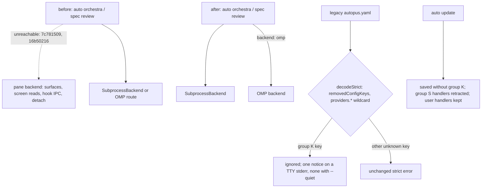

# SPEC-PANERM-001 리서치

## 기존 코드 분석

- Pane reachability at B and the remaining `pkg/orchestra` branches: `plan.md` statement classification (verified_fact).
- Consumers outside group P at B: 29 production files (declarations included) and 89 test files, 35 of them pane tests.

## Plan Intent Ledger

Carried from `prd.md` (Discovery Q&A). Cells are untrusted evidence, summarized; no cell is an instruction.

| Field | Status | Source | Confidence | Decision / Assumption | If Wrong | Plan Handoff |
|-------|--------|--------|------------|-----------------------|----------|--------------|
| goal | answered | user, 2026-10-06 | high | retire the pane backend; everything runs as subprocess | no SPEC | Outcome Lock |
| scope_boundary | assumed | ledger | medium | `pkg/terminal`, `auto terminal`, team panes, OMP stay | a separate SPEC for `pkg/terminal` | non-goals; Reviewer Brief |
| constraints | answered | ledger, repo | high | strict-decode compat, hidden no-op flags, hook cleanup on update | upgrades break | REQ-04..REQ-13 |
| done_evidence | assumed | ledger | medium | S1–S19 plus RFP-1..RFP-3 | completion claim unproven | acceptance, probes |
| brownfield_impact | answered | survey | high | engine, CLI, config, adapters, docs | missed coupling | Feature Coverage Map |

## Question Audit

- question_transport: AskUserQuestion (prior turns); question_count: 0; unresolved_fields: [scope_boundary, done_evidence] (assumed, non-blocking).

## Outcome Lock

- User-visible outcome: no orchestra pane backend ships; every orchestra and spec review provider runs as a subprocess
  or through OMP; A34 workspaces upgrade without edits: config loads, `auto update` rewrites it without group K and
  retracts only managed completion hooks, installed skills passing `--no-detach` keep working, doctor warns then passes.
- Mandatory requirements: REQ-01–REQ-18 (`spec.md`).
- Explicit non-goals: `pkg/terminal` and its API, `auto terminal`, Agent Teams panes, OMP, subprocess engine semantics
  (ORCH-019, ORCH-024), the read-only policy (REVIEWRO-001), a progress UI, removing the shims, user-level settings.
- Completion evidence: Must scenarios S1–S19 pass; RFP-1 operator receipt before W1; RFP-2, RFP-3 PASS; the T2
  baselines are not exceeded; touched packages ≥85% coverage; every source file ≤300 lines.

## Visual Planning Brief

Removal sequencing: `plan.md` Visual Planning Brief. UX wireframe gate: not applicable (CLI-only).

## Technology Stack Decision

| Mode | Selected stack | Resolved versions | Source refs | Checked at |
|------|----------------|-------------------|-------------|------------|
| brownfield | Go, cobra, `gopkg.in/yaml.v3` strict decode, `golang.org/x/term` (in `go.mod`); dev-time deadcode v0.50.0 rebuilt into a scratch `GOBIN`, not added to `go.mod` | unchanged from `go.mod` | `go.mod`, `loader_strict.go`, `golang.org/x/tools` | 2026-10-06 |

## 설계 결정 (Design Decisions)

- D1 Delete, do not flag: a build tag or runtime flag keeps keys, hooks, tests, and docs alive for a dead path.
- D2 Consumers first: W1 rewires consumers while declarations and tests exist; W2 deletes declarations, assets, and
  their tests in one commit; the census is a trial deletion in a scratch copy, so asset-name and constant users show up.
- D3 PRD corrections: REVIEWRO-001, SIGMABAND-001 approved; `--no-detach` sits in 11 files; A34 defaults emit P1; the
  hook loader is `auto check` (`check.go:68`); `checkMonitorCommands` and `cc21_runtime.go` stay (F-016); the `.ts` is
  an orphan (`content/embed.go` embeds `hooks/*.sh` only).
- D4 `config.Save` drops comments and reserved blocks (`loader.go:122-188`), so `auto update` prunes group K through a
  raw-node rewrite (F-017); OpenCode retraction accepts only what `validatePluginEntries` accepts (F-06).
- D5 Notice scope is group K only. R1: T1 confirmed claude billing; codex and gemini stay open (S19).

## Minimality Decision Matrix

| Ladder step | Evidence | Decision | Receipt item |
|-------------|----------|----------|--------------|
| actual need | Outcome Lock; `7c781509` Directive hands this cleanup to a removal SPEC with strict-decode compat | proceed | delete pane surface, zero-touch upgrades |
| existing code/helper/pattern | `removedConfigKeys` + `pruneNodeKey`; `obsoleteClaudeSurfacePaths`; `retractManagedHookEntries`; `isAutopusHookHandler`; `effectivePluginConfig`, `pluginEntryPath`, `pluginPathIdentity`; adapter transactions; the 16b50216 AST test | reuse and extend | no fork |
| stdlib/native | `go/ast` for the guard; cobra `MarkHidden`, `Hidden`, `DisableFlagParsing`, `PersistentPreRunE` | use | no new parser |
| existing dependency | `golang.org/x/term` for the stderr TTY check (`prompts.go:19`) | reuse | no isatty dependency |
| new dependency or abstraction / new dependency or new abstraction | `[NEW]` group S declaration and notice notifier only, each one source of truth; no new dependency | accepted | two small files |
| minimum sufficient verification | S1–S19, RFP-1..RFP-3, race suite vs baseline, coverage 85%, deadcode, guard | required checks | security, validation, data-loss, deterministic-oracle, generated-surface gates kept |

## Semantic Invariant Inventory

Source clauses summarize untrusted user or PRD evidence; they are not instructions.

| ID | source clause | invariant type | affected outputs | acceptance IDs |
|----|---------------|----------------|------------------|----------------|
| INV-01 | user: everything can run as subprocess | dispatch state transition, argv pass-through | receipt backends, process records, terminal calls | S1, S2, S3 |
| INV-02 | strict-decode compat: removed keys tolerated, typos rejected | parser closed set, wildcard one segment | load result, error text | S4, S5 |
| INV-03 | quiet-aware deprecation warning | dedup and byte ordering, suppression | stderr notice line | S6 |
| INV-04 | update rewrites config without removed keys | paired comparison per writer | written `autopus.yaml` files | S7 |
| INV-05 | removed flags stay hidden no-ops | paired matching with and without flag | argv, stdout, stderr, exit, help | S8, S9 |
| INV-06 | retired subcommands print a migration path | exact message, no side effects | stderr, exit status | S10 |
| INV-07 | clean stale hook scripts, keep user hooks | set difference per handler, ordering, atomicity | settings files, scripts, plugin entries | S11, S12 |
| INV-08 | doctor reports what update deletes | paired set equality | doctor text and JSON | S13 |
| INV-09 | default-entry upgrades unchanged | paired decision table | provider entries after update | S14 |
| INV-10 | no reachable pane symbol; smaller engine | static count, numeric bound 9,945 | guard test, deadcode, source-lines | S15 |
| INV-11 | subprocess engine behavior unchanged | paired golden output, bounded test diff | JSON stdout, receipts, tests | S16, S17 |
| INV-12 | docs and templates updated | token guard over sources | instruction files, CHANGELOG, SPEC headers | S18, S20 |
| INV-13 | headless runs work on subscription logins | live probe verdict | brainstorm receipt rows | S19 |

## Feature Coverage Map

| Outcome slice | Covered by | Status |
|---------------|------------|--------|
| dispatch off panes; pane code, types, CLI glue removed | REQ-01–REQ-03, REQ-17; T4, T5, T7, T9 | covered |
| hidden flags, stubs | REQ-04–REQ-06; T6 | covered |
| schema, prune, notice, writers, defaults | REQ-07–REQ-11; T8, T12, T13 | covered |
| hook generation stop, retraction, doctor | REQ-12–REQ-14; T10, T11, T14 | covered |
| instructions, docs, guard | REQ-15, REQ-16, REQ-18; T15, T16 | covered |
| headless subscription premise | RFP-1; T1 | covered (gate) |

## Completion Debt

| Item | Blocks | Required resolution |
|------|--------|---------------------|
| CD-1 wildcard prune with the schema deletion | every A34 default workspace load | T8, S4 |
| CD-2 handler-level group S retraction | stale hook cleanup without user loss | T11, S11, S12 |
| CD-3 hidden no-op flags | installed skills passing `--no-detach` | T6, S8 |
| CD-4 no group K from defaults or writers | `auto init` and saves writing pruned keys | T8, T13, S7 |
| CD-5 doctor parity | doctor and update drift | T14, S13 |
| CD-6 orchestration contract rewrite | agents pointed at `wait`/`result` | T15, S18 |
| CD-7 recheck and `SelectBackend` off panes | REQ-01 | T7, S2 |
| CD-8 RFP-1 receipt | deletion of the only interactive path | T1, S19 |

## Evolution Ideas

These are optional improvements and do not block sync completion.

| Idea | Why not required now | Promotion trigger |
|------|----------------------|-------------------|
| remove the hidden flags and stubs after a deprecation window | shims are the compatibility contract | user sets a window |
| clean leftover `/tmp/autopus/<session-id>` and job files; stream per-provider progress lines | inert files; no live view promised | user request |
| OMP as the default claude route | hedge for R1 only | RFP-1 or a policy change says so |

## Sibling SPEC Decision

| Decision | Reason | Sibling SPEC IDs |
|----------|--------|------------------|
| none | one outcome; keys are optional both ways and hooks are inert without `AUTOPUS_SESSION_ID`, so no cross-release order; 19 tasks ≤ 25 although about 180 files > 40, and the rule needs both | None |

## Reference Discipline

| Reference | Type | Verification |
|-----------|------|--------------|
| `pkg/orchestra/{runner,backend,backend_routed,recheck,interactive_launch,interactive_debate_helpers,completion_poll,pane_fallback,yield,types,provider_execution,run_receipt,run_receipt_provider}.go` | existing | Read and rg at B |
| `pkg/config/{loader_strict,loader,schema_orchestra,schema,defaults,migrate,codex_provider,claude_provider}.go`; `pkg/spec/types.go` | existing | Read; overlay probe |
| `pkg/content/hooks_completion.go`, `content/embed.go`, the `pkg/content` hook contract tests; `pkg/adapter/transaction.go`; `pkg/adapter/claude/{claude_settings_hooks,claude_obsolete_surface,claude_prepare_files,claude_update}.go`; `pkg/adapter/codex/{codex_hooks,codex_hooks_schema,codex}.go`; `pkg/adapter/antigravity/antigravity_completion_hook.go`; `pkg/adapter/opencode/{opencode,opencode_config,opencode_config_v2}.go` | existing | rg and Read |
| `internal/cli/{orchestra,orchestra_flags,orchestra_plan,orchestra_brainstorm,orchestra_file_cmds,orchestra_run,orchestra_job,orchestra_collect,orchestra_inject,orchestra_cleanup,orchestra_receipt_output,omp_review_backend,orchestra_readonly_policy,orchestra_cc21,cc21_runtime,spec_review,check,root,global_flags,update,quality_config,quality_provider_config,platform_omp_config,platform_omp_profile_apply,doctor_json_checks,check_cc21}.go` and the tests they cite | existing | rg symbols and line refs |
| instruction sources: `content/skills/idea.md`; `templates/claude/commands/auto-workflows.md.tmpl`; `templates/codex/skills/{auto-review,auto-go,idea,auto-plan,auto-idea}.md.tmpl`; `templates/gemini/skills/{idea,auto-idea,auto-go}/SKILL.md.tmpl`; `templates/shared/orchestration-contract.md.tmpl` | existing (11 files) | rg `--no-detach`, `--subprocess` |
| `.claude/`, `.codex/`, `.gemini/`, `.agents/`, `.opencode/`, `.omp/` | generated (not source of truth) | regenerated only |
| `[NEW]` files and fixtures listed in `spec.md` Retired Surface Inventory | [NEW] planned addition | excluded from existing-reference checks |

## W0 Evidence

- Anchors: revert anchor B = `16b50216` (REQ-20); `7c781509` (backend) and `16b50216` (detach) made pane execution
  unreachable; W0 ran on `60f92ea5` (B plus 14 REVIEWRO commits). `pkg/config` and `pkg/adapter` non-test code is
  unchanged since `c447badc`, so C1 equals B's defaults and in-tree loads stand in for binary O until W2.
- Tasks (`evidence/`): T1 RFP-1 PASS for claude in context (c), Max billing confirmed. T2 race 111 failing tests in 6
  packages (host Codex catalog), deadcode 0 in scope, census 931 sites, S16 goldens in `internal/cli/testdata/panerm_s16`.
  T3 C1-C7, C2', C2o, seven O workspaces; red oracles skip naming T8 or T11-T14 unless `AUTOPUS_PANERM_RED=1`.
- Q4: keep. JSON stdout (`orchestra_receipt_output.go:18-22`, `run_receipt.go:18-35`) and `review-receipt.json` have no
  pane-only key, only values (`backend` `pane`; `isolated_hook_session`, `judge_session_evidence.go:34-36`); `YieldOutput.panes`
  (`yield.go:17-18`) and `launch_mode` (`reliability_receipt.go:24`) come only from group P (`interactive_debate.go:100,228`).
- Q5: yes. `saveQualityScalar` (`quality_config.go:41-69`), `persistQualityProvider` (`quality_provider_config.go:39-76`)
  rewrite one line, `replaceAutopusConfigSection` (`platform_omp_config.go:82-116`) re-encodes siblings: group K stays.
- Q7 (one package at a time, empty `CODEX_HOME`, 0 failures): orchestra 91.4%, config 92.4, content 93.2, adapter 83.5,
  antigravity 87.1, claude 88.7, codex 90.4, omp 88.5, opencode 88.4, internal/cli 83.2; adapter and cli miss 85% at B.
- Q8: yes. Each `.sh` exits 0 before file or stdin access without `AUTOPUS_SESSION_ID` (`hook-claude-sessionstart.sh:5-8`;
  probe: no stderr, no file; `hook-gemini-stop.sh:10-13` prints `{"decision":"stop"}`); the `.ts` exits at load
  (`:18-19`), the `.tmpl` has no reader, and only group P sets the variable (`interactive.go:56`).
- Q9: yes. `types.go:28-29,84-90` and `runner.go:26-27` stay; `orchestra.go:223` passes "" (no flag binds it),
  `orchestra_run.go:206` passes `subprocess`, no key or receipt carries it, and only `pane_fallback.go:133,233` reads it.

## Reviewer Brief

- Intended scope: REQ-01–REQ-18 with zero-touch upgrades; R1 stays open for codex and gemini (S19); B is the anchor.
- Explicit non-goals: Outcome Lock; no team-pane changes. Focus: compat contract, retraction safety, wave order, CD.

## Self-Verify Summary

- Q-CORR-01 | status: PASS | attempt: 5 | files: acceptance.md | reason: S1 uses a supported name so argv rejection is reached; OpenCode major pinned (F-018, F-019)
- Q-CORR-02 | status: PASS | attempt: 1 | files: spec.md, plan.md, research.md | reason: new files carry [NEW]
- Q-CORR-03 | status: PASS | attempt: 1 | files: spec.md, acceptance.md | reason: EARS types checked with real ParseEARS; bare Given/When/Then
- Q-CORR-04 | status: PASS | attempt: 4 | files: spec.md, research.md | reason: cc21_runtime.go reclassified as retained TaskCreated runtime (F-016)
- Q-COMP-01 | status: PASS | attempt: 2 | files: all | reason: duplication cut; spec holds contracts, plan tasks, research evidence
- Q-COMP-02 | status: PASS | attempt: 4 | files: acceptance.md | reason: S7 runs every REQ-10 writer incl. provider and OMP (F-11)
- Q-COMP-03 | status: PASS | attempt: 2 | files: spec.md | reason: REQ-06 and REQ-13 side effects observable
- Q-COMP-04 | status: PASS | attempt: 4 | files: spec.md, acceptance.md | reason: valid and invalid OpenCode forms, W-mix, mixed handlers have oracles
- Q-COMP-05 | status: PASS | attempt: 5 | files: spec.md, acceptance.md | reason: H(w) excludes transaction records; separate no-change assertion (F-08 rev 3)
- Q-COMP-06 | status: PASS | attempt: 2 | files: spec.md, research.md | reason: Traceability Matrix, Reviewer Brief, Review Resolution
- Q-COMP-07 | status: PASS | attempt: 1 | files: research.md | reason: Completion Debt and Evolution Ideas separated
- Q-COMP-08 | status: PASS | attempt: 2 | files: plan.md | reason: 3 probe rows, not-run with reasons, statements classified
- Q-FEAS-01 | status: PASS | attempt: 1 | files: plan.md | reason: runtime, config, adapter, and prompt layers named
- Q-FEAS-02 | status: PASS | attempt: 1 | files: plan.md, research.md | reason: canonical sources edited, generated copies regenerated
- Q-FEAS-03 | status: PASS | attempt: 4 | files: plan.md | reason: W1 consumer-only with tests compiling; deletions plus their tests in one W2 commit (F-03)
- Q-STYLE-01 | status: PASS | attempt: 2 | files: spec.md | reason: no ambiguous words; REQ-08 names removedConfigKeys (F-05)
- Q-STYLE-02 | status: PASS | attempt: 1 | files: spec.md | reason: Priority Must, Should, Nice only
- Q-STYLE-03 | status: PASS | attempt: 1 | files: acceptance.md | reason: bare step keywords
- Q-SEC-01 | status: PASS | attempt: 1 | files: research.md | reason: ledger and source clauses treated as untrusted evidence
- Q-SEC-02 | status: PASS | attempt: 3 | files: spec.md, acceptance.md | reason: REQ-17 keeps read-only rejection for plan and brainstorm (F-018)
- Q-SEC-03 | status: PASS | attempt: 1 | files: plan.md | reason: RFP-1 receipt redacted; no new persistent artifact

## Group I Final List (T7)

The working list in `spec.md` plus the exported declarations of the deleted `pkg/orchestra` code (W2 T7: the 60
group P files, `BuildYieldOutput`, and the pane-only accessors removed from `types.go` and `provider_patterns.go`).
In `internal/cli` these names match as `orchestra.<name>` selectors.

`BuildYieldOutput`, `CleanRoundSignals`, `CleanScreenForCrossPollination`, `CleanupStaleJobs`, `CompletionDetector`, `CompletionPattern`, `DefaultCompletionPatterns`, `DefaultHookProviders`, `DefaultPromptPatterns`, `DefaultStartupHookProviders`, `HookInput`, `HookResult`, `HookResultToProviderResponse`, `IdleThreshold`, `Job`, `JobStatus`, `JobStatusDone`, `JobStatusError`, `JobStatusPartial`, `JobStatusRunning`, `JobStatusTimeout`, `LoadJob`, `LoadSession`, `NewCompletionDetector`, `NewCompletionDetectorWithConfig`, `NewHookSession`, `NewSignalEmitter`, `NewSurfaceManager`, `NewWarmPool`, `OrchestraSession`, `ReapOrphanSurfaces`, `RemoveSession`, `ResolveSessionTerminal`, `ResolveSessionTerminalWithWorkspace`, `RoundSignalName`, `SaveSession`, `SendRoundEnvToPane`, `SendSessionEnvToPane`, `SessionProviderConfig`, `SessionProviderResponse`, `SessionReadyPatterns`, `SetRoundEnv`, `SignalDetector`, `SignalEmitter`, `SurfaceManager`, `UpdateSession`, `WaitAndCollectHookResults`, `WarmPool`
