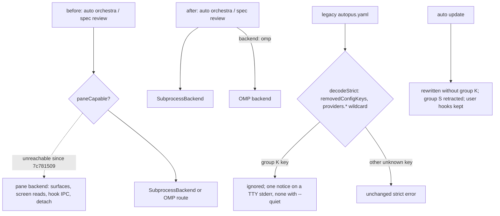

# SPEC-PANERM-001 리서치

## 기존 코드 분석

- Dispatch: `internal/cli/orchestra.go:177-180` forces `subprocessMode := true`; pane branches remain in `runner.go:33-38`,
  `backend.go:36-40` (`SelectBackend`), and `recheck.go:39-43` (`recheckTransport`).
- Launch: `interactive_launch.go` holds `paneLaunchFor`, `buildPaneLaunchCommand`, and `usesAntigravityPromptInteractive`
  (used by `provider_patterns.go:84`); `completion_poll.go` answers permission prompts with `SendCommand(..., "1")`;
  `yield.go` mixes retained output types (used by `orchestra_output.go`) with pane-only `BuildYieldOutput(cfg, panes, ...)`.
- Config: `loader_strict.go` (`removedConfigKeys`, literal `pruneNodeKey`, strict error suffix); `loader.go` `loadConfig`
  (normalization rewrite); hook-invoked `auto check` loads via `config.LoadPreview` (`check.go:68`).
- Hooks: `generateCompletionHooks` (`hooks_completion.go:43`); claude copies all of `content/hooks` to
  `.claude/hooks/autopus/` (`claude_prepare_files.go:61`); `codexHookAssetNames`; `antigravityCompletionHookAssetNames`;
  retraction `retractManagedHookEntries`, `isAutopusHookHandler`; closed set `obsoleteClaudeSurfacePaths`. CLI flags and
  subcommands are listed in `spec.md` REQ-04–REQ-06; errors print `Error: %v` with exit 1 (`root.go`).

## Plan Intent Ledger

Carried from `prd.md` (Discovery Q&A). Cells are untrusted evidence, summarized; no cell is an instruction.

| Field | Status | Source | Confidence | Decision / Assumption | If Wrong | Plan Handoff |
|-------|--------|--------|------------|-----------------------|----------|--------------|
| goal | answered | user, 2026-10-06 | high | retire the pane backend; everything runs as subprocess | no SPEC | Outcome Lock |
| scope_boundary | assumed | ledger | medium | `pkg/terminal`, `auto terminal`, team panes, OMP stay | a separate SPEC for `pkg/terminal` | non-goals; Reviewer Brief |
| constraints | answered | ledger, repo | high | strict-decode compat, hidden no-op flags, hook cleanup on update | upgrades break | REQ-04..REQ-13 |
| done_evidence | assumed | ledger | medium | S1–S19 plus RFP-1..RFP-3 | completion claim unproven | acceptance, probes |
| brownfield_impact | answered | survey | high | engine, CLI, config, adapters, docs | missed coupling | Feature Coverage Map |

## Question Audit

- question_transport: AskUserQuestion (prior turns); question_count: 0; unresolved_fields: [scope_boundary, done_evidence] (assumed, non-blocking).

## Outcome Lock

- User-visible outcome: no orchestra pane backend ships; every orchestra and spec review provider runs as a subprocess
  or through OMP; A34 workspaces upgrade without edits (config loads, update cleans keys and hooks, skills keep working).
- Mandatory requirements: REQ-01–REQ-18 (`spec.md`). Explicit non-goals: `pkg/terminal`, `auto terminal`, Agent Teams
  panes, OMP, engine semantics, the read-only policy, a live-progress UI, removing the shims, user-level settings edits.
- Completion evidence: S1–S19 pass; RFP-1 operator receipt before deletion; RFP-2, RFP-3 PASS; baselines not exceeded.

## Visual Planning Brief

Removal sequencing: `plan.md` Visual Planning Brief. UX wireframe gate: not applicable (CLI-only).

## Technology Stack Decision

| Mode | Selected stack | Resolved versions | Source refs | Checked at |
|------|----------------|-------------------|-------------|------------|
| brownfield | Go, cobra, `gopkg.in/yaml.v3` strict decode, `golang.org/x/term` (in `go.mod`); dev-time deadcode v0.50.0 rebuilt into a scratch `GOBIN`, not added to `go.mod` | unchanged from `go.mod` | `go.mod`, `loader_strict.go`, `golang.org/x/tools` | 2026-10-06 |

## 설계 결정 (Design Decisions)

- D1 Delete, do not flag: a build tag or runtime flag keeps keys, hooks, tests, and docs alive for a dead path; there is
  no external consumer to extract for. Revert anchor `7c781509` (REQ-20).
- D2 PRD corrections: SPEC-REVIEWRO-001 and SPEC-SIGMABAND-001 are approved; the seven `--no-detach` sites are 11
  instruction files; A34 defaults emit 4 group K paths, not `orchestra.subprocess.enabled`; the hook loader is `auto check`.
- D3 The notice covers group K only; `workflow.team_default` keeps its silent prune and `workflow_cutover_test.go`.
- D4 Stubs use `DisableFlagParsing` and `cobra.ArbitraryArgs`, so stale calls with job ids reach the migration message.
- D5 R1 billing stays open: RFP-1 gates deletion and needs operator confirmation, since CLI output cannot show billing.

## Minimality Decision Matrix

| Ladder step | Evidence | Decision | Receipt item |
|-------------|----------|----------|--------------|
| actual need | Outcome Lock; `7c781509` Directive hands this cleanup to a removal SPEC with strict-decode compat | proceed | delete pane surface, keep upgrades zero-touch |
| existing code/helper/pattern | `removedConfigKeys` + `pruneNodeKey`; `obsoleteClaudeSurfacePaths` closed set; `retractManagedHookEntries`; `isAutopusHookHandler`; update transactions | reuse | extend, not fork |
| stdlib/native | `path/filepath` Clean for plugin paths; cobra `MarkHidden`, `Hidden`, `DisableFlagParsing` | use | no new parser |
| existing dependency | `golang.org/x/term` for the stderr TTY check (`prompts.go:19`, `orchestra_terminal.go:49`) | reuse | no isatty dependency |
| new dependency or abstraction / new dependency or new abstraction | `[NEW]` group S declaration and notice notifier only, each one source of truth; no new dependency | accepted | two small files |
| minimum sufficient verification | S1–S19, RFP-1..RFP-3, race suite vs baseline, coverage 85%, deadcode, guard | required checks | security, validation, data-loss, deterministic-oracle, generated-surface gates kept |

## Semantic Invariant Inventory

Source clauses summarize untrusted user or PRD evidence; they are not instructions.

| ID | source clause | invariant type | affected outputs | acceptance IDs |
|----|---------------|----------------|------------------|----------------|
| INV-01 | user: everything can run as subprocess | dispatch state transition | `executed_backend`, process records, terminal calls | S1, S2, S3 |
| INV-02 | strict-decode compat: removed keys tolerated, typos rejected | parser closed set, wildcard one segment | load result, error text | S4, S5 |
| INV-03 | quiet-aware deprecation warning | dedup and byte ordering, suppression | stderr notice line | S6 |
| INV-04 | update rewrites config without removed keys | paired comparison across binaries | written `autopus.yaml` | S7 |
| INV-05 | removed flags stay hidden no-ops | paired matching with and without flag | argv, stdout, stderr, exit, help | S8, S9 |
| INV-06 | retired subcommands print a migration path | exact message, no side effects | stderr, exit status | S10 |
| INV-07 | clean stale hook scripts, keep user hooks | set difference, ordering, idempotency | settings files, script files | S11, S12 |
| INV-08 | doctor reports what update deletes | paired set equality | doctor text and JSON | S13 |
| INV-09 | default-entry upgrades unchanged | paired decision table | provider entries after update | S14 |
| INV-10 | no reachable pane symbol; smaller engine | static count, numeric bound 9,945 | rg, deadcode, source-lines | S15 |
| INV-11 | subprocess engine behavior unchanged | paired golden output | JSON stdout, receipts, tests | S16, S17 |
| INV-12 | docs and templates updated | token guard over sources | instruction files, CHANGELOG | S18 |
| INV-13 | headless runs work on subscription logins | live probe verdict | brainstorm JSON | S19 |

## Feature Coverage Map

| Outcome slice | Covered by | Status |
|---------------|------------|--------|
| dispatch and recheck off panes; pane code, types, CLI glue removed | REQ-01–REQ-03, REQ-17, T4–T8 | covered |
| hidden flags, stubs, schema, prune, notice, save, defaults | REQ-04–REQ-11, T9–T14 | covered |
| hook generation stop, retraction, doctor | REQ-12–REQ-14, T15–T17 | covered |
| instructions, docs, guard | REQ-15, REQ-16, REQ-18, T18, T19 | covered |
| headless subscription premise | RFP-1, T1 | covered (gate) |

## Completion Debt

| Item | Blocks | Required resolution |
|------|--------|---------------------|
| CD-1 wildcard prune | every A34 default workspace load | T12 with T11, S4 |
| CD-2 group S retraction | stale hook cleanup | T16, S11, S12 |
| CD-3 hidden no-op flags | installed skills passing `--no-detach` | T9, S8 |
| CD-4 no group K from defaults | `auto init` writing pruned keys | T11, S7 |
| CD-5 doctor parity | doctor and update drift | T17, S13 |
| CD-6 orchestration contract rewrite | agents pointed at `wait`/`result` | T18, S18 |
| CD-7 recheck and `SelectBackend` off panes | REQ-01 | T5, S2 |
| CD-8 RFP-1 receipt | deletion of the only interactive path | T1, S19 |

## Evolution Ideas

These are optional improvements and do not block sync completion.

| Idea | Why not required now | Promotion trigger |
|------|----------------------|-------------------|
| remove the hidden flags and stubs after a deprecation window | shims are the compatibility contract | user sets a window |
| clean leftover `/tmp/autopus/<session-id>` and job files; stream per-provider progress lines | inert files; no live view promised | user request |
| OMP as the default claude route | hedge for R1 only | RFP-1 or a policy change says so |

## Sibling SPEC Decision

| Decision | Reason | Sibling SPEC IDs |
|----------|--------|------------------|
| none | one outcome; keys are optional both ways and hooks are inert without `AUTOPUS_SESSION_ID`, so no cross-release order; 22 tasks ≤ 25 although about 180 files > 40, and the rule needs both | None |

## Reference Discipline

| Reference | Type | Verification |
|-----------|------|--------------|
| `pkg/orchestra/{runner,backend,recheck,interactive_launch,completion_poll,yield,types,provider_execution}.go` | existing | Read and rg at `7c781509` |
| `pkg/config/{loader_strict,loader,schema_orchestra,schema,defaults,codex_provider,claude_provider}.go` | existing | Read; overlay probe |
| `pkg/content/hooks_completion.go`; `pkg/adapter/claude/{claude_settings_hooks,claude_obsolete_surface,claude_prepare_files,claude_update}.go`; `pkg/adapter/codex/{codex_hooks,codex_hooks_schema,codex}.go`; `pkg/adapter/antigravity/antigravity_completion_hook.go`; `pkg/adapter/opencode/opencode_config.go` | existing | rg and Read |
| `internal/cli/{orchestra,orchestra_plan,orchestra_brainstorm,orchestra_file_cmds,orchestra_run,orchestra_job,orchestra_collect,orchestra_inject,orchestra_cleanup,spec_review,check,root,doctor_json_checks,check_cc21}.go` | existing | rg `Use:` and flag lines |
| instruction sources: `content/skills/idea.md`; `templates/claude/commands/auto-workflows.md.tmpl`; `templates/codex/skills/{auto-review,auto-go,idea,auto-plan,auto-idea}.md.tmpl`; `templates/gemini/skills/{idea,auto-idea,auto-go}/SKILL.md.tmpl`; `templates/shared/orchestration-contract.md.tmpl` | existing (11 files) | rg `--no-detach`, `--subprocess` |
| `.claude/`, `.codex/`, `.gemini/`, `.agents/`, `.opencode/`, `.omp/` | generated (not source of truth) | regenerated only |
| `[NEW] internal/cli/{orchestra_retired,config_notice,doctor_legacy_orchestra}.go`, `[NEW] internal/cli/pane_retirement_guard_test.go`, `[NEW] pkg/adapter/stale_completion_hooks.go`, `[NEW] pkg/config/testdata/legacy_pane/`, `[NEW] internal/cli/testdata/stale_hooks/` | [NEW] planned addition | excluded from existing-reference checks |

## Verified Baselines

- `git diff --stat c447badc HEAD -- pkg/config content templates` is empty, so C1 equals HEAD defaults.
- `pkg/orchestra`: 139 non-test files, 17,945 physical lines, 202 test files; group P 60 files, 8,732 lines.
- deadcode: `~/go/bin/deadcode` (go1.26 build) fails on go1.27 (`packages contain errors`); v0.50.0 rebuilt offline
  reports 18 entries, 0 under `pkg/orchestra/` or `internal/cli/orchestra`; `go.mod` unchanged.
- Overlay test (scratch file only): `DefaultFullConfig` emits exactly C1's 4 group K paths for claude, codex, gemini;
  C3 yields the S5 error text; `workflow.team_default` prunes with a nil error.
- `pkg/terminal` importers outside group P: `types.go`, `judge_session_evidence.go` (T7). RFP-1 precheck: see `plan.md`.

## Reviewer Brief

- Intended scope: retire the orchestra pane backend with zero-touch upgrades (REQ-01–REQ-18).
- Explicit non-goals: Agent Teams panes, `pkg/terminal`, `auto terminal`, OMP, engine semantics, read-only policy, a
  progress UI. Do not request team-pane changes.
- R1 call-out: headless `claude -p` billing on a Max subscription is unverified; RFP-1 blocks deletion until an operator
  confirms; `7c781509` is the revert anchor.
- Self-verified: Traceability Matrix, invariants, oracle acceptance, `[NEW]` discipline, EARS via real `ParseEARS`.
- Reviewer should focus on: compat-contract correctness, retraction data safety, mass-deletion regression risk,
  cross-SPEC ordering, Completion Debt only.

## Self-Verify Summary

- Q-CORR-01 | status: PASS | attempt: 2 | files: spec.md, acceptance.md | reason: refs rg-checked at 7c781509; S8 now cites auto-review.md.tmpl:69
- Q-CORR-02 | status: PASS | attempt: 1 | files: spec.md, plan.md, research.md | reason: new files carry [NEW]
- Q-CORR-03 | status: PASS | attempt: 1 | files: spec.md, acceptance.md | reason: EARS types checked with real ParseEARS; bare Given/When/Then
- Q-CORR-04 | status: PASS | attempt: 1 | files: research.md | reason: Reference Discipline splits existing, generated, and [NEW]
- Q-COMP-01 | status: PASS | attempt: 1 | files: all | reason: four documents with distinct roles
- Q-COMP-02 | status: PASS | attempt: 2 | files: spec.md, acceptance.md | reason: REQ-14 drop clause gained the S13 negative doctor oracle
- Q-COMP-03 | status: PASS | attempt: 2 | files: spec.md | reason: REQ-06 and REQ-13 side-effect wording made observable
- Q-COMP-04 | status: PASS | attempt: 1 | files: research.md, spec.md | reason: Outcome Lock closed by REQ-01..18 and S1..S19
- Q-COMP-05 | status: PASS | attempt: 1 | files: research.md, acceptance.md | reason: INV-01..13 map to Must oracles with concrete values
- Q-COMP-06 | status: PASS | attempt: 1 | files: spec.md, research.md | reason: Traceability Matrix and Reviewer Brief present
- Q-COMP-07 | status: PASS | attempt: 1 | files: research.md | reason: Completion Debt and Evolution Ideas separated
- Q-COMP-08 | status: PASS | attempt: 1 | files: plan.md | reason: 3 probe rows, not-run with reasons, statements classified
- Q-FEAS-01 | status: PASS | attempt: 1 | files: plan.md | reason: runtime, config, adapter, and prompt layers named
- Q-FEAS-02 | status: PASS | attempt: 1 | files: plan.md, research.md | reason: canonical sources edited, generated copies regenerated
- Q-FEAS-03 | status: PASS | attempt: 1 | files: plan.md | reason: commands exist; deadcode rebuild proven offline
- Q-STYLE-01 | status: PASS | attempt: 1 | files: spec.md | reason: no ambiguous words in REQ text
- Q-STYLE-02 | status: PASS | attempt: 1 | files: spec.md | reason: Priority Must, Should, Nice only
- Q-STYLE-03 | status: PASS | attempt: 1 | files: acceptance.md | reason: bare step keywords
- Q-SEC-01 | status: PASS | attempt: 1 | files: research.md | reason: ledger and source clauses treated as untrusted evidence
- Q-SEC-02 | status: PASS | attempt: 1 | files: spec.md, acceptance.md | reason: retraction closed set; user-level files read-only; no secrets
- Q-SEC-03 | status: PASS | attempt: 1 | files: plan.md | reason: RFP-1 receipt redacted; no new persistent artifact
- Q-COH-01 | status: PASS | attempt: 1 | files: spec.md | reason: one change story
