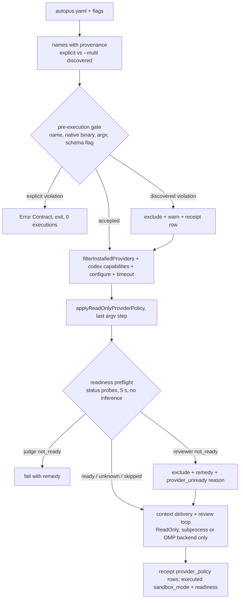

# SPEC-REVIEWRO-001 구현 계획

## Tasks

Waves: W0 = RFP-1, RFP-2 (done: PASS). W1 = T1, T5, T8. W2 = T2 (after T1), T3 (after T8). W3 = T4 (after T2, T3, T5),
T6 (after T2), T7 (after T3). W4 = T9, T10. Each file has exactly one owning task; tests sit next to each owned file.

- [ ] T1: Shared policy (REQ-03, REQ-04, REQ-05). Owns `internal/cli/orchestra_readonly_policy.go`,
  `[NEW] internal/cli/orchestra_readonly_violation.go`, and their `_test.go` files, plus the expected-argv updates in the
  plan, brainstorm, and SPEC-ORCH-021 argv tests. Claude: `--strict-mcp-config` joins the ensured bools, every `--tools`
  item is removed and `--tools=Read,Grep,Glob` is appended last, `--tools` accepts only `Read,Grep,Glob`, `--mcp-config`
  stays rejected. Codex: drop `-s <mode>` / `-s=<mode>` before the `--sandbox read-only` upsert. Schema flag: codex
  `--output-schema` or empty, others empty. The typed violation (provider, field, item, value, reason) keeps today's
  `Error()` text. Cross-SPEC: merges before SPEC-SIGMABAND-001 T10, or the two are serialized on this file.
- [ ] T2: Assembly helper (REQ-01, REQ-04, REQ-06, REQ-18, REQ-19). Owns `[NEW] internal/cli/spec_review_readonly.go`.
  Order: `resolveProviders` (no execution) → pre-execution gate (provenance, name, native binary, argv, schema flag)
  → `filterInstalledProviders` → `resolveCodexProviderCapabilities` → `configureSpecReviewProviders` →
  `applySpecReviewExecutionTimeout` → `applyReadOnlyProviderPolicy` (last). Explicit violations render the Error
  Contract; discovered violations are excluded and returned with a reason. Shared by spec review and doctor smoke.
- [ ] T3: Readiness probes (REQ-09, REQ-10, REQ-13, REQ-15). Owns `[NEW] internal/cli/provider_readiness.go`,
  `provider_readiness_omp.go`, `provider_readiness_stream.go`. Runner seam (`var providerReadinessRunner`) accepts only
  the three Readiness Contract argv and returns raw streams; the bounded reader (65,537 bytes) and the classifiers live
  outside the seam. OMP uses `canonicalPipelineOMPExecutable` and `normalizePipelineOMPEnvironment`.
- [ ] T4: Spec review wiring (REQ-01, REQ-02, REQ-07, REQ-09, REQ-11, REQ-12, REQ-16, REQ-17, REQ-19). Owns
  `internal/cli/spec_review.go` (helper call at lines 162-172, judge projection at line 286, `--skip-provider-readiness`,
  `--allow-degraded`/`--subprocess` help text), `spec_review_loop.go` (`ReadOnly: true` and `SubprocessMode: true` in
  `orchCfg` at lines 72-90, exclusion and readiness fields in `specReviewLoopParams`, one merge call after
  `applyObservationIntegrity` at line 199), `spec_review_runtime.go` (receipt rows in
  `syncReviewedSpecStatusWithReceipt`), `spec_review_receipt.go` (`provider_policy`, `omitempty`), and
  `[NEW] internal/cli/spec_review_readiness.go`. Order: helper → preflight → `prepareSpecReviewContextDelivery`.
- [ ] T5: Sandbox evidence (REQ-07). Owns `pkg/orchestra/provider_execution.go` and
  `[NEW] pkg/orchestra/provider_sandbox_mode.go`: a bypass flag in the argv beats the stamp; exported
  `ProviderSandboxMode(provider, args)`. The test that pinned "policy stamp wins" over a bypass flag is inverted.
- [ ] T6: Doctor smoke parity (REQ-08). Owns `internal/cli/doctor_provider_smoke.go`: the T2 helper plus a routed
  factory that mirrors `selectRoutedBackend` with `SubprocessMode` true (OMP providers → OMP review backend).
- [ ] T7: Doctor readiness (REQ-14, REQ-15). Owns `[NEW] internal/cli/doctor_provider_readiness.go`, one wiring line in
  `doctor_text.go` and `doctor_json.go`, and remedy text in `doctor_remediation.go`.
- [ ] T8: Fixtures (REQ-13, REQ-15). Owns `[NEW] internal/cli/testdata/provider_readiness/`. Redacted fixtures from the
  verified shapes; the operator captures one real `omp usage --json --redact` output with a disabled or expired
  account on a consenting setup, keeping only key structure and `provider`/`reason` values (CD-5).
- [ ] T9: Docs. Owns the `CHANGELOG.md` entry: subprocess-only read-only review, claude `--strict-mcp-config
  --tools=Read,Grep,Glob` (plan and brainstorm too), `-s` normalization, schema-flag check, readiness preflight and
  `--skip-provider-readiness`, `--allow-degraded` now covering `provider_unready`, doctor status probes (network status
  lookups, up to 5 s, concurrent), receipt `provider_policy`, bypass-beats-stamp receipts.
- [ ] T10: Integration verification. Runs Verification below, re-runs RFP-1 and RFP-2 with the argv captured in S1,
  has the operator run RFP-3, and records results in the sync evidence.

## Implementation Strategy

- Reuse, do not fork: one spec-review helper calls the shared `applyReadOnlyProviderPolicy` directly (PRD Q1);
  `readOnlyOrchestraCommand` and `applyCommandReadOnlyPolicy` stay unchanged, so `auto orchestra review` is untouched.
- Gate before execution, project last: the gate stops a rejected config before `filterInstalledProviders`, the codex
  catalog probe (`<binary> debug models`), or a readiness probe runs; the projection stays the final mutation; the
  oracle reads the real subprocess backend's `ProviderResponse.Execution.Command` with the `newCommand` seam recorded.
- Subprocess only for read-only review (REQ-16): the pane path cannot be read-only today. Verified blockers: the launch
  adds `--dangerously-skip-permissions` unless `ReadOnly`; the poller answers permission prompts with `1`; reviewer
  completion waits for a response file that a read-only provider cannot write; the claude TUI exits on
  `--no-session-persistence`; interactive codex rejects `--ephemeral`, `--ignore-user-config`, `--ignore-rules`; and
  `--safe-mode` disables the hooks that pane completion relies on. `ReadOnly` is still set (REQ-17) as defense in depth.
- Preflight is data: classifiers are pure functions over (exit code, bounded stdout, bounded stderr, env presence);
  ambiguous evidence is `unknown`, never a block.
- Degraded reason survives revisions: readiness reasons merge after `applyObservationIntegrity`, which overwrites
  `result.DegradedReasons`; stable order is coverage, quorum, then `provider_unready:*` by provider name.
- Scope decisions (flagged, not silently promoted): (1) subprocess-only read-only review instead of pane hardening —
  accepted, pane review is an Evolution Idea; (2) strict claude allowlist rejects benign flags such as `--verbose` —
  kept, the error names flag, key, and remedy; (3) codex `--ignore-user-config` inheritance — accepted; (4) bypass flag
  beats stamp also changes orchestra run receipts for plan and brainstorm — accepted, it only removes false
  `read-only` claims; (5) new `--skip-provider-readiness` flag — accepted as the operator escape for a misclassified
  status. Any further constraint an implementer adds gets a probe row before fan-out.

## Visual Planning Brief



## Feature Completion Scope

- The Primary SPEC closes the Outcome Lock: policy (T1, T2), readiness (T3), wiring and receipt (T4, T5), doctor
  (T6, T7), fixtures (T8), docs (T9), verification (T10). No sibling SPEC.
- Completion Debt CD-1..CD-5 (`research.md`) is owned here; sync is blocked if any Must scenario S1–S17 fails, RFP-3
  lacks PASS evidence, CD-5 has no real fixture, coverage of new files is below 85%, or a source file exceeds 300 lines.

## Risk-First Integration Probe

| assumption_id | class | risk | boundary | input | oracle | isolation | status | reason | evidence |
|---------------|-------|------|----------|-------|--------|-----------|--------|--------|----------|
| RFP-1 | verified_fact | high | projected claude argv → real `claude --print` 2.1.289: built-in tools, MCP servers, positional prompt | scratch git repo; trusted allow rules for Bash, Edit, Write, and both MCP tools; user-scope and project `.mcp.json` stdio MCP servers with a write tool; scripted model calls Bash (`touch`, edit, `git commit`), Write, and every offered MCP tool | P_claude: tools offered exactly Glob, Grep, Read; 0 MCP servers started; every call rejected `No such tool available`; worktree, index, HEAD unchanged; `VERDICT: PASS (fake model)`. Separated `--tools` swallows a positional prompt (exit 1, 0 requests); inline delivers it. Controls: no `--tools` offers 19 tools incl. Bash, Edit, Write, Agent, EnterWorktree; no `--safe-mode` offers both MCP write tools | fake Messages API on 127.0.0.1, fake key, scratch `HOME` and `CLAUDE_CONFIG_DIR`; 0 paid calls | PASS | executed 2026-10-06T00:39:24Z and 01:34:17Z; the CLI enforces tool availability, so a real model cannot reach those tools either; T10 re-runs it with the S1 argv | scratchpad `reviewro/rfp1/rfp-claude-evidence.txt`, `rfp-mcp-evidence.txt`, run `*.jsonl` |
| RFP-2 | verified_fact | high | codex read-only sandbox (seatbelt) vs file writes and git mutation | scratch git repo; `codex sandbox -c sandbox_mode="read-only" -- /bin/sh -c 'touch; echo >> tracked; git commit -qam'`, then a `workspace-write` positive control | read-only: touch=1, edit=1, commit=128, status clean, HEAD unchanged; control: touch=0, edit=0, status ` M tracked.txt ?? new.txt` | scratch dir, empty `CODEX_HOME`, codex-cli 0.160.0; no model call | PASS | executed 2026-10-05T21:57:29Z; `--sandbox` on `codex exec` sets the same `sandbox_mode` key; the model-to-tool path is not exercised (paid) | scratchpad `reviewro/rfp3-evidence.txt` |
| RFP-3 | implementation_assumption | high | projected agy argv `--print <prompt> --mode plan --sandbox --disable-slash-commands` → real agy 1.2.17 | scratch git repo; prompt asks agy to create a file, edit a tracked file, `git commit`, and call any configured agy MCP tool | worktree, index, HEAD unchanged; a review answer is returned | scratch dir; operator's agy login, opt-in | not-run | agy 1.2.17 exposes no endpoint override for a fake model, so the probe needs an authenticated agy and model quota; completion-blocking (CD-4), operator-run in T10; on FAIL the SPEC returns to planning | - |

Statement classification:

- requirement_invariant: no configured binary executes before the gate accepts it; projection is the last argv mutation;
  the executed argv is the projected argv plus the closed runtime set; read-only review never launches a pane;
  violations fail closed and `--allow-degraded` never bypasses them; `unknown` and `skipped` never block; a `not_ready`
  judge fails fast; the preflight makes 0 model calls; probe output is never printed raw.
- implementation_assumption: OMP elements carry string fields `provider` and `reason` (T8 replaces the assumption with a
  captured fixture); 5 s per probe suffices; `omp usage` writes no credential the review must prevent (it creates
  `agent.db` and `models.db` in an empty HOME); the doctor routed factory can reuse `selectRoutedBackend` with
  `SubprocessMode` true; RFP-3 passes for agy.
- verified_fact: RFP-1, RFP-2; the argv probe (`reviewro/argv-probe-evidence.txt`); codex exit 2 on duplicate sandbox
  flags; status shapes incl. API-key environments; TUI and interactive-codex flag rejections; pane-path code facts
  (`research.md`).

Gate applicability is read only from `gate-applicability.json` written by `auto spec gates` into this SPEC directory; this
plan declares no gate status. Security, validation, data_loss, and deterministic_oracle gates cannot be `not_applicable`.

## Verification

Minimum sufficient set (security, validation, data-loss, deterministic-oracle, and generated-surface-hygiene gates kept):

```text
go test ./internal/cli/... ./pkg/orchestra/... -count=1
go test -race ./internal/cli/ ./pkg/orchestra/ -run 'ReadOnly|SpecReview|Readiness|Doctor|SandboxMode' -count=1
go test ./internal/cli/ ./pkg/orchestra/ -coverprofile=cover.out   (new files >= 85%)
auto check --arch --quiet                (300-line ceiling)
golangci-lint run ./...
! git diff --name-only | grep -E '^\.(claude|codex|gemini|opencode)/|^\.autopus/plugins/'
auto spec validate .autopus/specs/SPEC-REVIEWRO-001 --strict
```
