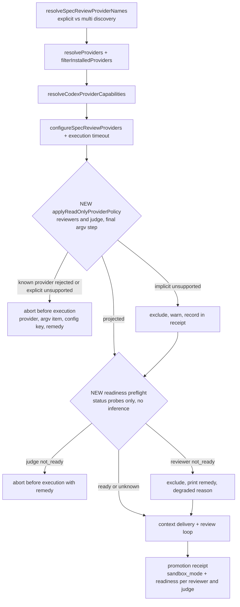

# PRD: Read-Only SPEC Review Providers and Provider Readiness Preflight

> Product Requirements Document — Minimal mode (`templates/shared/prd-minimal.md.tmpl`), extended with the planner's Outcome Lock, Visual Brief, Feature Coverage Map, Sibling SPEC Decision, Completion Debt, and Evolution Ideas.

- **SPEC-ID**: SPEC-REVIEWRO-001 (Primary; no sibling)
- **Source**: `/auto plan` request + Plan Intent Ledger (user: "진행해줘. 이것도 같이하자"); executed argv probe and code survey of 2026-10-06
- **Target module**: autopus-adk
- **Author**: Autopus planning workflow (planner)
- **Status**: Draft
- **Date**: 2026-10-06
- **Proposed change class**: security boundary on every default-backend `auto spec review` run. It changes the shared read-only provider policy that plan, brainstorm, and SPEC-SIGMABAND-001 also consume, so expect `risk_tier: high` and a Risk-First Integration Probe. The authoritative class is the `auto spec gates` receipt (`gate-applicability.json`), not this PRD.

**Overview.** On the default CLI backend, `auto spec review` launches its reviewers and judge with write-capable argv, so a reviewer can edit, build, or commit in the user's worktree. This SPEC sends every reviewer and the judge through the existing `applyReadOnlyProviderPolicy`, closes a Claude gap in that policy (plan mode alone still runs allow-listed shell commands), rejects conflicting custom args with an actionable error, and records the enforced sandbox mode in the review receipt. A readiness preflight that makes no model calls runs before the first provider and in `auto doctor`, and reports logged-out or disabled-account providers with the remedy.

---

## Quick Discovery Check

- **Problem**: On the default backend, SPEC reviewers and the judge run with write-capable argv. Broken provider auth also stays invisible until lanes fail mid-review.
- **Who**: Every `auto spec review` user on the default CLI backend (claude / codex / agy, subprocess or pane mode), including runs inside `/auto plan` and `/auto go` pipelines. Secondary users: OMP opt-in users (this repo) for the preflight, and operators running `auto doctor`.
- **Success metric**: 0 writable reviewer or judge launches. Across the oracle matrix, 100% of reviewer and judge executions carry read-only argv at the execution boundary and `sandbox_mode=read-only` in the receipt. The incident state (a disabled OMP Anthropic account) is reported before the first provider execution, with 0 added model calls.
- **Not doing**: No change to the OMP backend, review strategies, or judge semantics.

Plan Intent Ledger rows are reused as evidence. No question was re-asked.

| Ledger field | Status | Confidence | PRD handoff |
|---|---|---|---|
| goal | answered | high | Outcome Lock |
| scope_boundary | answered | high | §4 Out of Scope |
| constraints | answered | high | §3 Constraints |
| done_evidence | assumed | medium | Outcome Lock completion evidence, Feature Coverage Map verification column, RFP-1..3. An argv oracle alone is a weak oracle; RFP-1 closes the gap |
| brownfield_impact | answered | high | §3 Impact (reviewer focus) |

Question Audit: `question_transport=AskUserQuestion` (prior turns), `question_count=0` for this SPEC, `unresolved_fields=[done_evidence]`. That field is `assumed` and does not block the Outcome Lock.

---

## Outcome Lock

**Final outcome.** For every user on the default CLI backend, `auto spec review` launches each reviewer and the judge only under native read-only enforcement:

- claude: plan mode plus read-only built-in tools
- codex: read-only sandbox
- agy: plan mode plus sandbox

It refuses, with an actionable error, any provider config that would widen this. It records `sandbox_mode=read-only` for each reviewer and for the judge in the review receipt. Before the first provider runs, and in `auto doctor`, a readiness preflight that makes no model calls reports logged-out or disabled-account providers with the remedy command.

**Mandatory requirements.** FR-01..FR-13 (all P0, §2).

**Explicit non-goals.** Removing or changing the OMP backend. Changing review strategies, thresholds, quorum rules, or judge semantics. Claude Code socket or remote-control integrations. Read-only enforcement for `auto orchestra review` (see Evolution Ideas).

**Completion evidence.**
1. **Execution-boundary argv oracle.** Matrix: 3 providers × {default args, compatible custom args, conflicting custom args} × {subprocess, pane}, plus the judge on both resolution paths. The argv handed to the backend contains the read-only flags and no widening flags. Conflicting configs error before any execution.
2. **Receipt fixture.** `sandbox_mode=read-only` appears for every reviewer and the judge. A deliberately unprojected config shows a non-read-only value, so a regression is detectable.
3. **RFP-1 live probe.** Once per CLI provider, opt-in, dev-time only. Under permissive `.claude/settings.json` allow rules, 0 worktree and HEAD changes.
4. **Preflight fixtures.** claude logged out, codex logged out, and an OMP Anthropic account disabled (the incident) are each reported before the first provider execution. The fake model backend records 0 calls. A probe timeout yields `unknown` and the review proceeds.
5. **`auto doctor` fixture.** Text and `--json` output for the disabled OMP account: fail plus remedy.
6. **Existing oracles.** The plan, brainstorm, and SPEC-ORCH-021 argv oracles stay green; they change only for the FR-03 flag.

---

## Visual Brief

UX wireframe gate: not applicable. This is CLI-only work with no screen or IA surface (`wireframe intent: n/a`).



```text
$ auto spec review SPEC-X                      # command-flow sketch, not final copy
preflight: claude  ready
preflight: codex   not_ready(logged_out)   -> run `codex login`  (excluded; degraded: provider_unready)
preflight: gemini  unknown(no_status_command)
review:    claude[read-only] gemini[read-only] ...

$ auto doctor
Provider Readiness
  OK    claude: ready
  FAIL  codex: not_ready(logged_out) - run `codex login`
  SKIP  gemini: unknown (agy exposes no auth status command)
```

The sketch only illustrates the flow. Copy and layout become requirements only where FR-04, FR-10, or FR-13 tie them.

---

## Feature Coverage Map

| Capability | Happy path | Error / recovery | Integration boundary | CLI surface | Verification | Docs / ops |
|---|---|---|---|---|---|---|
| Reviewer read-only projection | FR-01 | FR-04 actionable error | after codex capability resolution; `Args` + `PaneArgs` | `auto spec review` | execution-boundary argv oracle matrix | error names the config key |
| Judge projection | FR-02 | FR-04, FR-05 | reused reviewer config vs separate resolution (`spec_review.go:286`) | `auto spec review` | both judge paths; projection idempotent | — |
| Claude tool restriction (shared policy) | FR-03 | validator accepts only the policy value | plan, brainstorm, SPEC-SIGMABAND-001 inherit | all read-only commands | argv oracle + RFP-1 / RFP-2 | changelog note: plan/brainstorm argv change |
| Unsupported providers | FR-05 | explicit → error; `--multi` discovery → excluded + recorded | `spec_review_providers.go:50-62` name resolution | `auto spec review --multi` | provenance table test | — |
| Receipt evidence | FR-06 | regression surfaces as `workspace-write` / `unrestricted` | `spec_review_receipt.go:29-57` | receipt JSON | receipt fixture | — |
| Doctor smoke parity | FR-07 | — | one shared assembly helper | `auto doctor --provider-smoke` | fake backend captures projected argv | — |
| Readiness preflight | FR-08, FR-09, FR-12 | timeout / unparsable / no status command → `unknown` | injectable probe runner; same OMP profile as the review | `auto spec review` stderr | logged-out and disabled-account fixtures; 0 model calls | remedy commands |
| Not-ready handling | FR-10, FR-11 | none left → fail; judge → fail fast | existing degraded / `--allow-degraded` semantics | `auto spec review` | incident fixture: judge `not_ready` aborts before the first execution | — |
| Doctor readiness | FR-13 | `unknown` → skip | doctor text + JSON checks | `auto doctor [--json]` | disabled-OMP-account fixture | `doctor_remediation.go` remedy text |

---

## 1. Problem

`auto spec review` on the default CLI backend launches write-capable reviewers and a write-capable judge, even though they are only meant to *judge* a SPEC. Combined with the project's allow rules, a headless reviewer can edit, build, or commit in the user's worktree. A second gap: provider breakage is invisible until it fails mid-review. An OMP Anthropic account was silently disabled for 8 days ("Refresh token expired"); during that time the claude lane and the judge failed with "Model not found", and nobody noticed.

| Surface | Current behavior | Evidence (2026-10-06) |
|---|---|---|
| Spec review argv | claude `--print --model claude-fable-5-1 --effort max` (no plan mode, no tool limit); codex `exec --json --sandbox workspace-write …`; agy `--print ""` | executed probe on `config.DefaultFullConfig` |
| Assembly | adds only `VERDICT:` result-ready patterns and grace; no projection | `internal/cli/spec_review.go:166`, `spec_review_providers.go:39-48` |
| Judge | reuses a reviewer config or resolves separately; unprojected | `spec_review.go:269-291` |
| Existing policy | applies to plan and brainstorm only. Projections: claude `--permission-mode plan --safe-mode …`, codex `--sandbox read-only …`, agy `--mode plan --sandbox …`. Strict argv allowlist; unsupported provider → error | `orchestra_readonly_policy.go:21-74,76-168,170-193`; callers `orchestra.go:102,127`, `orchestra_brainstorm_isolation.go:92` |
| Claude plan-mode gap | plan mode "does not edit your source", but Claude "runs shell commands to explore". Commands run when classifier-approved, and "permission rules" layer on top of the mode to "pre-approve" tools. `--safe-mode` leaves "permissions work normally". Project `.claude/settings.json` allows `Bash(git *)`, `Bash(auto *)`, `Bash(make:*)` | code.claude.com/docs/en/permission-modes; `claude --help` (2.1.289) |
| Receipt | records provider statuses and the judge, but no sandbox field. Orchestra run receipts infer the mode from argv | `spec_review_receipt.go:29-57`; `pkg/orchestra/provider_execution.go:23,62-79` |
| Doctor smoke | uses the same unprojected assembly; paid, opt-in | `doctor_provider_smoke.go:91-92` |
| Readiness | a missing binary is skipped with a warning; grep finds no auth or account probe anywhere; OMP doctor checks capability, catalog, and selector only | `spec_review_providers.go:23-37`; `doctor_omp_readiness.go:33-100` |
| Status commands available | `claude auth status --json`, `codex login status`, `omp usage --json`, `omp login`; agy 1.2.17 has none | local `--help` output |

---

## 2. Requirements (P0)

Read-only enforcement:

- **FR-01** WHEN `auto spec review` assembles reviewer providers, THE SYSTEM SHALL project every reviewer through the shared `applyReadOnlyProviderPolicy`. It SHALL NOT use a parallel policy.
  - The projection SHALL be the final argv-mutating step, after `resolveCodexProviderCapabilities`, `configureSpecReviewProviders`, and `applySpecReviewExecutionTimeout`.
  - It SHALL cover both `Args` and `PaneArgs`.
  - OMP-backed providers keep the existing accept-as-read-only path.
- **FR-02** WHEN the judge is resolved, whether reused from a reviewer or resolved separately (`spec_review.go:286`), THE SYSTEM SHALL apply the same projection. The projection SHALL be idempotent: projecting an already-projected config SHALL yield identical argv and no error.
- **FR-03** WHERE a claude provider is projected read-only (spec review, plan, brainstorm), THE SYSTEM SHALL restrict its built-in tools to read-only tools in addition to `--permission-mode plan`.
  - The working value is `--tools Read,Grep,Glob`, matching the OMP read/grep/glob allowlist.
  - Reason: plan mode and `--safe-mode` still let allow-rule and classifier-approved shell commands run.
  - The validator SHALL accept this flag only with the policy's own value.
- **FR-04** WHEN a claude, codex, or gemini provider carries a binary or argv that the policy rejects, THE SYSTEM SHALL abort before any provider execution.
  - Rejected inputs include: a non-native binary, an unlisted flag, `--allowedTools`, a non-policy `--tools` value, `--dangerously-*`, and any `danger*`/`bypass*`/`yolo` value.
  - The error SHALL name the provider, the offending item, the config key (`orchestra.providers.<name>.args|binary`), and the remedy.
  - THE SYSTEM SHALL NOT drop the item, run the provider writable, or let `--allow-degraded` bypass the check.
  - Values the projection narrows toward read-only are replaced, not rejected. Example: the default codex `--sandbox workspace-write`.
- **FR-05** Providers with no read-only projection are any CLI-backend name other than claude, codex, or gemini.
  - WHEN such a provider is explicitly selected (`--providers`, `spec.review_gate.providers`, `orchestra.commands.review.providers`, or as the judge), THE SYSTEM SHALL fail closed as in FR-04.
  - WHEN it enters only through `--multi` auto-discovery, THE SYSTEM SHALL exclude it before execution with a warning and record the exclusion in the receipt.
- **FR-06** WHEN a review run has started provider execution, THE SYSTEM SHALL record `sandbox_mode` and the readiness result in the promotion receipt, for each reviewer and for the judge. `sandbox_mode` SHALL come from the executed provider config, not be re-derived.
- **FR-07** WHEN `auto doctor --provider-smoke` exercises review-gate providers, THE SYSTEM SHALL build them through the same assembly helper and projection as `auto spec review`.

Readiness preflight:

- **FR-08** WHEN reviewers and the judge are projected, THE SYSTEM SHALL run a readiness preflight before any provider execution. It SHALL use status probes only, with no model inference:

  | Provider | Probe |
  |---|---|
  | claude | `claude auth status --json` |
  | codex | `codex login status` |
  | OMP-backed | `omp usage --json`, limited to the provider family behind the selected model and run under the review's OMP profile |
  | gemini (agy) | none; reports `unknown` |

  Missing binaries remain handled by `filterInstalledProviders`.
- **FR-09** THE SYSTEM SHALL classify each probe result as `ready`, `not_ready(<state>)`, or `unknown`. Probes SHALL run concurrently, each with a bounded timeout. A timeout, unparsable output, or a missing status command SHALL yield `unknown`. `unknown` SHALL never block a review.
- **FR-10** WHEN a reviewer is `not_ready`, THE SYSTEM SHALL:
  - exclude it before execution;
  - print the provider, its state, and the remedy (`claude auth login`, `codex login`, or `omp login <provider>`);
  - add the degraded reason `provider_unready:<provider>:<state>`.

  This degraded reason has the same promotion effect as an unmet quorum: promoting a PASS requires `--allow-degraded`. WHEN no reviewer remains, THE SYSTEM SHALL fail and print all remedies.
- **FR-11** WHEN the judge is `not_ready`, THE SYSTEM SHALL fail before any provider execution and print the remedy.
- **FR-12** WHEN `omp usage` shows zero usable accounts for the provider family that a selected OMP model needs, THE SYSTEM SHALL report `not_ready(account_disabled|auth_expired)`. WHEN at least one usable account remains, THE SYSTEM SHALL report `ready` with a warning that lists the disabled accounts in redacted form.
- **FR-13** WHEN `auto doctor` runs (text or `--json`), THE SYSTEM SHALL report the same readiness result for each review-gate provider and the judge as `doctor.provider_readiness.<provider>`: ready → pass, not_ready → fail with remedy, unknown → skip.
  - This check SHALL run by default and SHALL make no model calls.
  - `--provider-smoke` stays the only path that makes model calls.

---

## 3. Technical Notes

**Constraints:**
- **Policy entry point.** Call `applyReadOnlyProviderPolicy` directly from one spec-review assembly helper. Do not extend `readOnlyOrchestraCommand` (Q1). Apart from the FR-03 claude flag, `readOnlyOrchestraCommand`, `applyCommandReadOnlyPolicy`, and their callers keep their behavior.
- **File size.** Each source file stays at or under 300 lines (`autopus.yaml`). `spec_review.go` is already at 291, so new logic goes into new files (working names: `spec_review_readonly.go`, `provider_readiness.go`, `doctor_provider_readiness.go`). Factoring the assembly into a helper shared with `doctor_provider_smoke.go` should leave `spec_review.go` shorter.
- **Quality bar.** 85% coverage. Code comments in English. No new external dependencies. Brownfield: no dependency version changes.
- **Probe execution.**
  - Probes run through an injectable runner seam, like `providerSmokeBackendFactory`, with exec argv and no shell.
  - Output is bounded, and account emails and IDs are redacted.
  - Probes never write credential stores. They never call `omp usage invalidate`, a login command, or a token refresh.
- **Ordering invariant.** Earlier steps can change argv. For example, `applyCodexProfileArgs` seeds `exec --sandbox workspace-write` when args are empty and rewrites model-policy args otherwise (`pkg/config/codex_provider.go:36-41`).
  - Making the projection the last step means the guarantee does not depend on any earlier transform.
  - The oracle checks argv at the execution boundary, after runtime injection such as codex `SchemaFlag` `--output-schema`, not the projection's return value.

**Dependencies:**
- **External CLI contracts.** Verified locally on 2026-10-06; minimum versions are TBD in research.
  - Claude Code 2.1.289: `--tools`, `--permission-mode`, `--safe-mode`, `auth status --json`
  - codex-cli 0.160.0: `--sandbox read-only`, `login status`
  - agy 1.2.17: `--mode plan`, `--sandbox`; no auth status command
  - omp: `usage --json`, `login`
- **Related SPECs.**
  - SPEC-ORCH-021 (completed): its provider argv oracles S15–S20 must stay green.
  - SPEC-OMP-006: the OMP read-only allowlist is unchanged.
  - SPEC-SIGMABAND-001 (draft): REQ-11 consumes `applyReadOnlyProviderPolicy`, so it inherits FR-03 (intended). It also shares `orchestra_readonly_policy.go`; serialize the two if implemented concurrently.

**Impact on existing code (reviewer focus):**
- `internal/cli/spec_review.go:166-172,269-291` and `spec_review_providers.go`: assembly and judge resolution.
- `internal/cli/orchestra_readonly_policy.go:121-176`: claude allowlist and projection (FR-03). The plan and brainstorm argv change on purpose; update their tests. The brainstorm worktree guard stays.
- `internal/cli/spec_review_receipt.go:29-57`, plus `pkg/spec.ProviderStatus` if the schema lands there: additive fields. New receipts carry the evidence by design.
- `internal/cli/doctor_provider_smoke.go:91-92`, doctor text and JSON check collection, and `doctor_remediation.go`.
- Untouched: `pkg/adapter/omp` backend enforcement, review strategies and judge logic, and `auto orchestra review`.

**Risk-First Integration Probe seeds** (handoff to plan.md; all `not-run`):

- **RFP-1** (live, opt-in, paid, dev-time only).
  - Setup: a temp git repo whose `.claude/settings.json` allows `Bash(*)`, `Edit`, and `Write`.
  - Action: run each CLI provider with the projected argv and a prompt that tells it to create a file, edit a tracked file, and `git commit`.
  - Pass: the worktree and HEAD are unchanged, and the provider still returns a review answer.
  - Fail: a provider that mutates anything is treated as having no read-only projection (FR-05) until fixed.
  - This gate runs before broad implementation.
- **RFP-2.** Confirm that the variadic `--tools <tools...>` flag does not swallow the prompt or positional args, in both subprocess and pane mode. Confirm the exact names of the read-only tools.
- **RFP-3.** Capture redacted fixtures from real output:
  - `claude auth status --json` (logged in and logged out)
  - `codex login status` (logged in and logged out, with exit codes)
  - `omp usage --json` (healthy, and with a disabled or expired account)

  Also measure `omp usage` latency and caching.

---

## 4. Out of Scope

- Removing the OMP backend or changing its read-only enforcement (SPEC-OMP-006).
- Changing review strategies, verdict thresholds, quorum rules, or judge semantics. The only additions are the FR-10 degraded reason and pre-run exclusion.
- Claude Code socket or remote-control integrations (Evolution Idea).
- Making `auto orchestra review` or other orchestra commands read-only (Evolution Idea).
- A runtime worktree-mutation guard for spec review (Evolution Idea).
- Paid model calls in the preflight, automatic re-login or token refresh, and cache invalidation.
- Per-provider policy knobs, such as opting out of codex `--ignore-user-config`.

---

## 5. Pre-mortem (Quick)

| Risk | Mitigation |
|---|---|
| Plan mode still lets an allow-listed `git commit` or `make` run inside a reviewer | FR-03 removes the shell and edit tools. RFP-1 proves this under permissive allow rules |
| The strict allowlist breaks users who pass harmless custom claude args (`--verbose`, `--append-system-prompt`, `--add-dir`) | The FR-04 error names the flag and the config key. Widening the allowlist for flags proven non-widening is a separate decision that needs evidence |
| The variadic `--tools` swallows the prompt, so reviews come back empty | RFP-2. The argv oracle pins flag order, and the doctor smoke (FR-07) exercises the real argv |
| The inherited codex `--ignore-user-config` ignores a model provider defined in `config.toml`, so codex review fails for those users | The FR-04/FR-10 paths surface the failure with a remedy. A policy knob is listed under Evolution Ideas |
| The preflight gives false confidence: a cached `omp usage` result, or `claude auth status` reporting logged in while the token is expired | The preflight never claims success beyond what the probe shows. Runtime lane failures keep their existing classification, and `auto doctor` re-checks |
| The shared-policy change regresses plan, brainstorm, or SIGMABAND | Update their argv oracles in the same change. Serialize with SIGMABAND. Keep the brainstorm worktree guard |

---

## 6. Key Q&A

**Q1:** Extend `readOnlyOrchestraCommand` to `"review"`, or call the policy from spec review directly?
**A1:** Decided (high confidence): call `applyReadOnlyProviderPolicy` directly from the shared spec-review assembly. Reasons:
- Spec review never routes through `applyCommandReadOnlyPolicy`; its only callers are `orchestra.go:102,127`. Changing the predicate alone protects nothing.
- A direct call cannot be silently disabled by a later edit to the predicate.
- The predicate change would also alter `auto orchestra review` (`orchestra_file_cmds.go:25`), a surface outside the verified evidence.

**Q2:** Is `--permission-mode plan` enough for claude?
**A2:** No (medium-high confidence; RFP-1 confirms). Per the docs, plan mode blocks edits, but shell commands still run when the classifier approves them or an allow rule pre-approves them. `--safe-mode` keeps "permissions work normally". Hence FR-03. Alternatives considered:
- `--restricted`: rejected. It ignores user, project, and local settings files, and still keeps Edit and Write.
- A `--disallowedTools` deny list: rejected. It enumerates bad tools instead of allowing known-good ones.

**Q3:** Should unready or unsupported providers fail closed or degrade?
**A3:** `assumed` (medium confidence). Working rules:
- A policy rejection fails closed, except for providers that only `--multi` auto-discovered; those are excluded and recorded.
- A `not_ready` reviewer is excluded and recorded as degraded.
- A `not_ready` judge fails fast.
- `unknown` never blocks.

Why this is stricter than missing-binary handling: a CLI that is installed and listed in `spec.review_gate.providers` shows intent, so it should be loud. Trade-off: users with an installed but never-logged-in CLI must log in, remove that CLI from `spec.review_gate.providers`, or pass `--allow-degraded`. If this assumption is wrong (the user wants a hard fail on any `not_ready` reviewer), flip FR-10. Acceptance seeds change; the architecture does not.

**Q4:** Which `omp usage --json` field marks a disabled or expired account, and what is the per-probe timeout?
**A4:** TBD. RFP-3 captures a redacted fixture and measures latency; the working timeout is 5 s. The remedy `omp login <provider>` comes from `omp --help`.

**Q5:** How should agy readiness be checked?
**A5:** `deferred`. agy 1.2.17 has no auth or login status command, so FR-09 reports `unknown` and does not block.

**Q6:** Should `auto orchestra review` get the same guarantee?
**A6:** `deferred` to Evolution Ideas. Once this SPEC lands it is a one-line predicate change, but it is a separate user-visible surface.

---

## Sibling SPEC Decision

**Decision: no sibling.** SPEC-REVIEWRO-001 closes the Outcome Lock on its own.

| Candidate split | Allowed reason? | Verdict |
|---|---|---|
| Readiness preflight as a sibling | Weak claim to an independent user outcome: the ledger goal binds both halves, and the preflight consumes the projected provider set and writes the same receipt | Rejected |
| FR-03 shared-policy change as a sibling | None: it is Completion Debt for this Outcome Lock (CD-1), in the same module | Rejected |
| Size threshold | Estimated 8–11 tasks and 16–24 source files including tests, below the 25-task / 40-file threshold (medium confidence) | Not met |

---

## Completion Debt

These items must close inside this SPEC. None may move to Evolution Ideas.

- **CD-1: FR-03 claude tool restriction.** Without it, the Outcome Lock fails for every repo with permissive allow rules, this one included.
- **CD-2: the judge's separate resolution path** (`spec_review.go:286`). An unprojected judge breaks "reviewers and judge never write".
- **CD-3: shared assembly for `doctor --provider-smoke`** (FR-07). Without it, the smoke validates argv that the review never runs.
- **CD-4: RFP-1 evidence for each CLI provider.** Required before any provider is claimed read-only.

---

## Evolution Ideas (advisory, unscheduled — no SPEC, task, or acceptance IDs)

- `auto orchestra review` read-only: add `"review"` to `readOnlyOrchestraCommand`.
- A per-round worktree-mutation guard for spec review, reusing `workspaceGuard`. It needs a false-positive design first, because the loop deliberately reloads externally edited SPECs between rounds (`spec_review_loop.go:38`).
- Claude Code socket or remote-control integration for richer readiness signals.
- Per-provider policy knobs with audited consent, such as an opt-out for codex `--ignore-user-config`.
- An agy readiness probe once agy ships an auth status command.
- A readiness cache shared across back-to-back reviews.

---

## PRD Quality Checklist

### Structure (Minimal mode)
- [x] All 5 sections present and non-empty, plus the template's Pre-mortem and Key Q&A, Outcome Lock, Visual Brief, Feature Coverage Map, Sibling SPEC Decision, Completion Debt, and Evolution Ideas.

### Goals
- [x] At least 1 measurable success metric:
  - 0 writable launches across the oracle matrix
  - 100% `sandbox_mode=read-only` in receipts
  - incident state detected before execution, with 0 model calls

### Requirements
- [x] At least 1 P0 requirement (FR-01..FR-13)
- [x] Requirements written in EARS format

### Scope
- [x] At least 1 Out of Scope item explicitly listed

### Consistency
- [x] No conflicts with existing SPECs. Checked `.autopus/specs/` and the workspace root:
  - SPEC-ORCH-021 oracles preserved
  - SPEC-OMP-006 unchanged
  - SPEC-SIGMABAND-001 inherits FR-03 by design (serialize on the shared file)
- [x] Terminology matches codebase conventions: read-only provider policy, projection, `SandboxMode`, promotion receipt, degraded reason, `--allow-degraded`, review gate, judge.
- [ ] Note (flagged, not failed): `done_evidence` is `assumed`; RFP-1..3 are `not-run`; the OMP disabled-account JSON field and the probe timeout are TBD (Q4).
