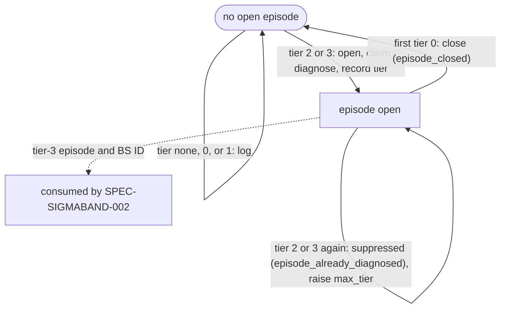

# SPEC-SIGMABAND-001 구현 계획

## Tasks

Waves (disjoint write ownership inside a wave): W1 = T1, T2, T3, T8, T11, T13, T14, T15. W2 = T5, T6, T7, T9. W3 = T4, T10.
W4 = T12. W5 = T16. Each task owns only the listed paths; tests sit next to each owned file; every source file stays at or
under 300 lines. The draft PR path is not planned here; it belongs to SPEC-SIGMABAND-002.

- [ ] T1: Config namespace and strict-decode compatibility (REQ-15, PRD R8). Owns `[NEW] pkg/config/schema_health_band.go` (`HealthBandConf{DiagnosisProvider}` with `omitempty`) and the `HealthBand` field in `pkg/config/schema.go`. Tests: the default generated `autopus.yaml` and a load-save round trip of defaults contain no `health_band`; `decodeStrict` accepts `diagnosis_provider` and rejects `allow_draft_pr` and any other unknown key inside `health_band`.
- [ ] T2: Store primitives and shared lock (REQ-01, REQ-02). Owns `[NEW] pkg/filelock/lock.go`, `lock_unix.go`, `lock_windows.go` (flock pattern of `pkg/terminal/cmux_buffer_flock_*.go` with a polling timeout) and `[NEW] pkg/healthband/types.go`, `store.go`, `store_compact.go`.
- [ ] T3: Detector (REQ-06). Owns `[NEW] pkg/healthband/detector.go`. Pure functions; tests O1–O10, the ε boundary pair, and grouping G1.
- [ ] T4: Replay fixture (REQ-06, REQ-04). Owns `[NEW] pkg/healthband/testdata/replay-2026-10-06.jsonl` and its test, built from the probe A2 payload keeping databaseId, workflowName, headBranch, event, status, conclusion, attempt, createdAt.
- [ ] T5: CI ingest and gh invocation (REQ-04, REQ-05, REQ-19). Owns `[NEW] internal/cli/react_band_ingest.go` and `[NEW] internal/cli/react_band_gh.go` (the four commands of the gh Invocation Table behind the command-runner seam, `GH_REPO`/`GH_HOST` override, per-call timeouts, host rule).
- [ ] T6: Canary append (REQ-03). Owns `[NEW] internal/cli/canary_history.go` and the single call added to `runCanaryCmd` in `internal/cli/canary.go`; parity test with history enabled and disabled.
- [ ] T7: Write-ahead log, decision table, episodes, catch-up, claims (REQ-07, REQ-08, REQ-09, REQ-10, REQ-24). Owns `[NEW] pkg/healthband/wal.go`, `episode.go`, `catchup.go`. Three-value action enum, batch rule, sequential phase B with chained lease budgets and per-claim result recording, 24 h late-result and retention window, `claim_unknown`, pending results, late observations.
- [ ] T8: Untrusted input and identifiers (REQ-22). Owns `[NEW] pkg/healthband/sanitize.go`, `identifier.go`.
- [ ] T9: Prompt layers (REQ-23). Owns `[NEW] pkg/healthband/prompt.go`.
- [ ] T10: Provider runner (REQ-11, REQ-12, REQ-18). Owns `[NEW] internal/cli/react_band_diagnose.go` and `[NEW] pkg/orchestra/provider_runner_single.go`. Merge gate: probe A1 PASS; the claude-ok row of S12 also needs SPEC-REVIEWRO-001.
- [ ] T11: BS writer, validator, BS root (REQ-13). Owns `[NEW] pkg/brainstorm/render.go`, `validate.go`, `id.go`, `root.go`; the root rule (component chain, recursive scope) calls `setup.DetectMultiRepo` only (probe A3); the per-user allocation lock goes through `pkg/filelock` (hand-off from T2 interface, no shared file).
- [ ] T12: CLI and orchestration (REQ-14, REQ-20, REQ-07 wiring). Owns `[NEW] internal/cli/react_band.go`, `react_band_output.go`, and the `AddCommand(newReactBandCmd())` line in `internal/cli/react.go`; reads the help constant from T15.
- [ ] T13: Hygiene classification (REQ-16). Owns one `.autopus/metrics/` entry each in `internal/cli/init_helpers.go`, `sync_verify_policy.go`, `status_hygiene_families.go`, `check_rules_hygiene.go`.
- [ ] T14: Hook and react-check invariance (REQ-17). Owns `[NEW] pkg/content/testdata/hooks-baseline/` with its test and `[NEW] internal/cli/react_check_metrics_test.go`.
- [ ] T15: Docs and help text (REQ-21). Owns `[NEW] internal/cli/react_band_help.go`, `[NEW] docs/health-band.md`, `CHANGELOG.md`.
- [ ] T16: Integration verification (all REQ). Owns `[NEW] internal/cli/react_band_integration_test.go` (S5–S7, S13–S15 end to end, the tier-3 no-mutation recorder of S14, and the "no react apply / git stash" assertion) and runs the Verification commands.

## Implementation Strategy

- Pure core, thin shell. `pkg/healthband` holds types, detector, decision table, WAL logic, sanitization, and prompt layers as
  functions over values plus a small store. `internal/cli/react_band*.go` holds every subprocess call behind one
  command-runner seam, so tests drive gh and providers with fakes and an injected clock.
- Reuse before adding: `applyReadOnlyProviderPolicy`, `runConfiguredProvider` (via a thin exported wrapper),
  `promptlayer.SanitizeContent`/`Render`, `addJSONFlags`/`writeJSONResult`, `decodeStrict`, `setup.DetectMultiRepo`, and the
  existing flock pattern. `pkg/qa/agentexec` is excluded because its generate argv carries no read-only flags.
- Lock scope: network calls happen before the lock; phase A and C hold it only for local file IO; phase B (provider up to
  600 s per claim, claims one at a time) runs without it, so canary appends are never blocked by band.
- No git or GitHub mutation exists in this SPEC; tier 3 differs from tier 2 only in the recorded tier.
- Change surface on existing files is one line or one entry each (react.go, canary.go, schema.go, four hygiene lists).
- Scope expansion rule: any constraint broader than these requirements (a new ACL, provider allowlist, or compatibility
  limit) is flagged as scope expansion in the task hand-off, gets a probe row, and is not promoted to a requirement.

## Visual Planning Brief

Tier and episode state machine (per series; the Decision Table in `spec.md` is normative):



Command and data flow (`auto react band`):

```text
network (no lock, 30 s timeouts)  origin -> host, owner/repo; gh auth status --hostname <host>;
                                  gh api repos/<owner>/<repo> --hostname <host> --jq .default_branch; gh run list -R <owner/repo>
phase A (lock, wait <= 5 s else store_locked)
  replay   events newer than checkpoint; append pending results; expire leases
  merge    fetched observations, idempotent by series + sample_key + attempt
  detect   every position newer than checkpoint, oldest first; decision table; batch rule; diagnose claims with chained leases
  record   evaluation events (WAL) -> checkpoint (rename) -> compaction (512 per series, 2,048 events)
phase B (no lock, claims one at a time in series order)
  diagnose  gh run view --attempt --log-failed -> redact whole text -> cut -> fence -> promptlayer.Render -> RunSingleProvider
  bs        per-user allocation lock -> component-tree scan -> next BS-BAND-NNN -> render (tier 2 or 3) -> validate -> O_EXCL create
phase C (after each claim, lock, wait <= 60 s inside its margin, else pending/<claim-id>.json)  action_result event -> checkpoint
output  text table or JSON envelope (checks band.<series>), exit 0
```

## Feature Completion Scope

- The Primary SPEC closes its Outcome Lock: ingest (T5, T6), detection (T3, T4), WAL and episodes (T7), diagnosis and BS
  (T8–T11), CLI (T12), integration boundaries (T1, T13, T14), docs (T15), verification (T16).
- Approved sibling: SPEC-SIGMABAND-002 (security boundary) owns the 3σ draft PR path and depends on this SPEC; this SPEC has
  no dependency on it. Cross-SPEC dependency: SPEC-REVIEWRO-001 for the claude `--tools=Read,Grep,Glob` projection.
- Sync completion is blocked when any Must scenario S1–S19 fails, coverage is below 85%, or a source file exceeds 300 lines.

## Risk-First Integration Probe

| assumption_id | class | risk | boundary | input | oracle | isolation | status | reason | evidence |
|---------------|-------|------|----------|-------|--------|-----------|--------|--------|----------|
| A1 | implementation_assumption | high | provider read-only boundary: projected claude argv (with `--tools=Read,Grep,Glob`) and the OMP routed backend, each as a real headless run in a git repo | temp repo with one committed file; prompt asks to create `x.txt`, edit the file, run `git stash`, run the allow-listed `git status`, and print a diagnosis | stdout non-empty; `x.txt` absent; status, stash, and HEAD unchanged; no Bash tool execution recorded; OMP tools equal as a set to glob, grep, read | temp dir outside the workspace, projected `--no-session-persistence` / `--ephemeral` | not-run | needs an installed, authenticated paid provider and the SPEC-REVIEWRO-001 projection; run in Phase 1.9 before T10 merges | - |
| A2 | verified_fact | high | gh CLI contract and run data | `gh run list --limit 200 --json …`; `gh <auth status, repo view, run list, run view, api> --help` on gh 2.98.0 | 200 rows, unique run ids, event mix CI push 83 / Security Scan push 83 + schedule 5 / dispatch 2; `-R` on run list and run view only; `auth status --hostname`; `repo view [<repository>]`; `api --hostname` | read-only API calls; outputs kept in the session scratchpad | PASS | executed 2026-10-05T19:59Z and 23:39Z; feeds the event allowlist and the gh Invocation Table | scratchpad `probe-a2-evidence.txt`, `probe-a2b-evidence.txt`, `oracle-events-evidence.txt` |
| A3 | verified_fact | medium | BS Root Resolution over the real `setup.DetectMultiRepo` | temp fixtures W (`.git/hooks` only, children module and other), H (child dots, project `work/proj` without `.git`), P (single repo), N (component m with nested repo x) via `go test -overlay` | W lists `.`, module, other; W/module nil; H lists `.`, dots; H/work/proj nil; P nil; N lists `.`, m, n; N/m lists `.`, x | temp dirs, no network, no repo file written | PASS | executed 2026-10-06; fixes the S9 preconditions and the outermost-containing rule | scratchpad `probe-a7-topology-evidence.txt` |

Statement classification:

- requirement_invariant: Detector Contract constants and formula; inclusive tier boundaries with ε = 1e-9; trusted events
  `push` and `schedule` only; agent read-only in every tier; tier 2 and tier 3 both diagnose, at most once per episode, one BS
  per episode; no git ref, worktree, or GitHub change; exit 0 for every completed evaluation; no new hook; `react check`
  never writes the store.
- implementation_assumption: `RunSingleProvider` can build `ProviderBackends` the way orchestra commands do (T10); yaml.v3
  `omitempty` omits a zero `HealthBandConf` (T1 test proves it); a 24 h late-result window is long enough for any live
  owner, because every step has a timeout and the longest chained lease of one run stays far below it.
- verified_fact: probes A2 and A3; O1–O10, G1, R1–R2 with the event filter, and SHA-256 prefixes recomputed by independent
  Python (scratchpad `oracle.py`, `oracle_events.py`); all 24 requirements parsed by the real `ParseEARS` through a
  `go test -overlay` run (scratchpad `ears-parse-evidence.txt`); the workspace root `.git` holds only `hooks/`; this module's
  `autopus.yaml` sets `orchestra.judge: claude` with `backend: omp`.

Gate applicability is read only from `gate-applicability.json` written by `auto spec gates` into this SPEC directory; this
plan declares no gate status. Security, validation, data_loss, and deterministic_oracle gates cannot be `not_applicable`.

## Verification

Minimum sufficient set (security, validation, data-loss, deterministic-oracle, and generated-surface-hygiene gates kept):

```text
go test ./pkg/healthband/... ./pkg/brainstorm/... ./pkg/filelock/... ./pkg/config/... ./pkg/content/... ./pkg/orchestra/... ./internal/cli/... -count=1
go test -race ./pkg/healthband/... ./pkg/filelock/... ./internal/cli/ -run 'Band|Canary' -count=1
go test ./... -coverprofile=cover.out   (pkg/healthband, pkg/brainstorm, pkg/filelock, react_band*.go, canary_history.go >= 85%)
go vet ./... && golangci-lint run ./...
auto check --arch --quiet                (300-line ceiling)
git diff --name-only | grep -E '^\.(claude|codex|gemini|opencode)/|^\.autopus/plugins/' && exit 1
auto spec validate .autopus/specs/SPEC-SIGMABAND-001 --strict
```
