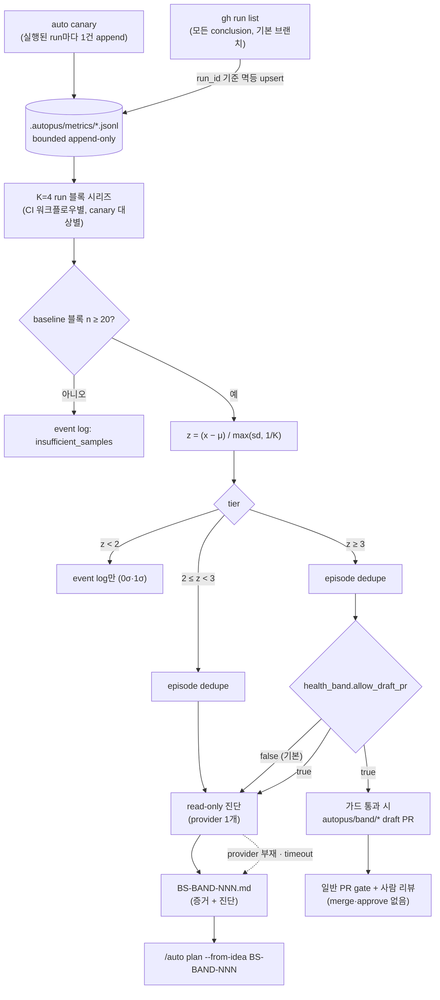
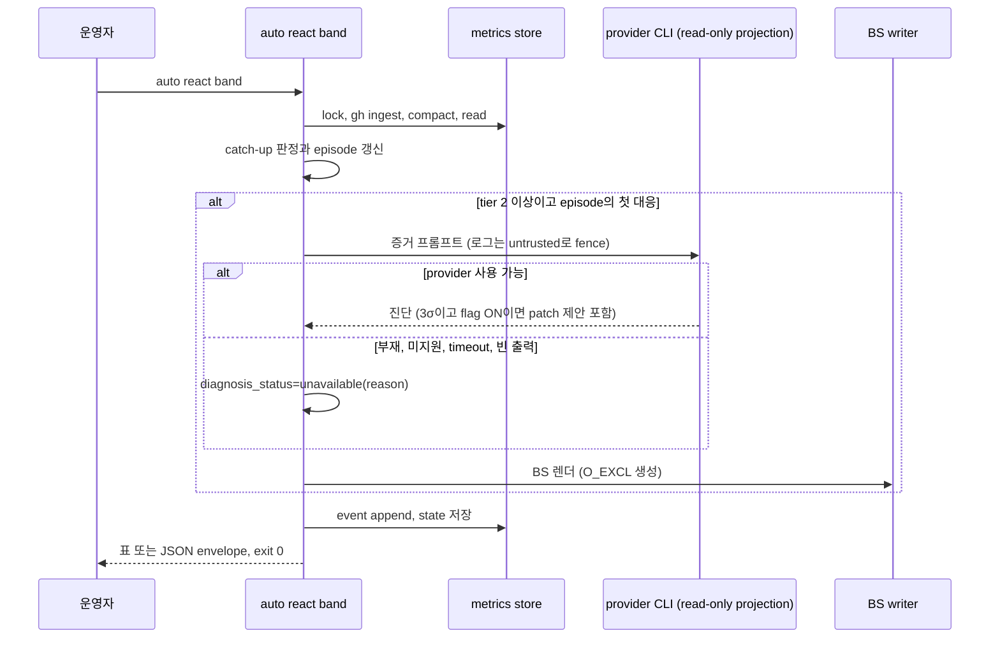

# PRD: σ-band 단계형 하네스 헬스 신호 대응

> Product Requirements Document — Standard mode. Plan Intent Ledger와 사용자 결정 D3를 근거로 작성했다.
> Outcome Lock, Feature Coverage Map, Visual Brief, Completion Debt, Evolution Ideas, Sibling SPEC Decision을 함께 담는다.

- **SPEC-ID**: SPEC-SIGMABAND-001
- **Mode**: Standard
- **Source**: `/auto plan` Plan Intent Ledger (2026-10-06), 사용자 결정 D3 (AskUserQuestion, 2026-10-06), Anthropic "AI-Native SDLC Playbook" Maintain 단계
- **Author**: Autopus planning workflow (planner)
- **Status**: Draft
- **Date**: 2026-10-06
- **Target module**: `autopus-adk`

**Overview**: CI와 canary 실행 결과를 bounded append-only 이력에 쌓고, 지표 시리즈마다 rolling mean ± σ를 결정적으로 계산한다. 1σ는 기록만 하고, 2σ는 read-only 에이전트 진단을 BS 파일로 남겨 `/auto plan --from-idea` triage에 넣으며, 3σ는 기본 OFF 플래그가 켜졌을 때만 별도 브랜치 draft PR을 연다. 같은 이상에는 한 번만 대응하고, gh나 에이전트가 없으면 기록 후 건너뛰며 판정 자체는 실패하지 않는다.

---

## Discovery Q&A Checklist

- [x] **Problem** (answered — ledger `goal`, 코드 근거): 지표 이력이 없어서 "평소 대비 비정상"을 판정할 수 없다. canary는 `latest.json`을 덮어쓰고, react는 실패만 조회하므로 실패율을 만들 수 없다. 그 결과 대응은 기록도 triage도 없는 ad-hoc 수정이 된다.
- [x] **Target Users** (answered — 탐색): ADK 메인테이너와 운영자(주 사용자), ADK를 설치한 제3자 프로젝트 운영자, 리뷰어와 보안 담당, 그리고 BS를 소비하는 `/auto plan --from-idea` 파이프라인.
- [x] **Success Metrics** (assumed — ledger `done_evidence`, medium): numeric oracle 정확 일치, 멱등 재실행 시 새 부작용 0건, flag-off 3σ에서 branch/PR 생성 0건, 도구 부재 시 exit 0, BS 구조 검증 100% 통과.
- [x] **Constraints** (answered — D3 + `autopus.yaml`, high): 3σ draft PR 플래그 기본 OFF, N<20이면 log-only, 소스 파일 300줄 이하, coverage 85% 이상, generated surface 직접 편집 금지.
- [x] **Prior Art** (answered — 탐색): `auto react check|apply`, `auto canary`, `pkg/telemetry` JSONL, `pkg/learn` JSONL store, orchestra read-only provider policy, `pkg/qa/agentexec`, `content/skills/idea.md` BS 형식. mean/σ 계산 코드는 저장소 어디에도 없다.
- [x] **Scope Boundary** (assumed — ledger `scope_boundary`, medium): v1 지표는 CI 실패율과 canary 실패율뿐이다. 운영 서비스 지표(5xx, latency), runbook 실행, auto-merge는 제외한다.

### Ledger Reuse

| Field | Status | Confidence | PRD 반영 위치 |
|---|---|---|---|
| goal | answered | high | Outcome Lock, §2 |
| scope_boundary | assumed | medium | §8 Out of Scope, Open Question Q1 |
| constraints | answered | high | §6, §7, FR-07, FR-14, FR-17 |
| done_evidence | assumed | medium | §2, Outcome Lock Completion evidence, Open Question Q2 |
| brownfield_impact | answered | high | §1, §7 Compatibility, Cross-SPEC Consistency |

Question Audit 재사용: `question_transport=AskUserQuestion`, `question_count=1` (D3), `unresolved_fields=[scope_boundary, done_evidence]`. 두 항목 모두 Outcome Lock이나 Must acceptance를 막지 않으므로 추가 질문 없이 `assumed`로 진행한다.

---

## Outcome Lock

- **User-visible outcome**: 운영자가 `auto react band`를 실행하면 다음이 일어난다. (1) 기본 브랜치의 CI 실행 결과(성공 포함)와 실제로 실행된 canary 결과가 bounded append-only 이력에 쌓인다. (2) 지표 시리즈마다 §5.1 Detector Contract에 따른 결정적 판정이 기록된다. (3) 1σ는 로그만 남긴다. 2σ는 read-only 진단이 담긴 `BS-BAND-NNN` 파일을 만들어 `/auto plan --from-idea`의 입력이 되게 한다. 3σ는 `health_band.allow_draft_pr: true`일 때만 `autopus/band/*` 브랜치의 draft PR로 이어지고, 플래그가 꺼져 있으면 2σ와 같이 대응한다. 같은 이상(episode)에는 tier마다 한 번만 대응한다.
- **Mandatory requirements**: FR-01 ~ FR-19 (P0) 전부.
- **Accepted assumptions** (plan 단계로 검증과 함께 넘긴다):
  - A1. v1 지표 범위는 CI 워크플로우별 실패율(기본 브랜치)과 canary 실패율이다.
  - A2. 보정 상수는 K=4, W=30, σ floor=1/K이다.
  - A3. 진단을 못 해도 증거만 담은 BS를 쓴다.
  - A4. canary `WARN`은 실패로 세지 않는다.
  - A5. `react check`는 이력 저장소에 쓰지 않는다.
  - A6. 3σ에서도 에이전트는 read-only로 patch를 제안만 한다. 적용, commit, push, PR 생성은 결정적 CLI 코드가 가드 아래에서 수행한다.
- **Deferred decisions**: K/W config override, 주기 실행(스케줄러, `canary --watch`), 운영 서비스 지표, `react apply` 정리.
- **Explicit non-goals**: 5xx/latency 같은 운영 지표, runbook 실행, merge·approve·auto-merge·기본 브랜치 push, 새 훅이나 데몬, 어느 tier에서든 에이전트에게 쓰기 권한을 주는 것.
- **Completion evidence**: Detector oracle O1–O10과 실데이터 replay fixture가 정확히 일치한다. tier 라우팅과 episode dedupe 테스트가 fake gh·git·provider로 통과한다. BS 구조 검증기와 `--from-idea` 조회 경로 테스트가 통과한다. flag-off 3σ에서 branch/push/PR 호출이 0건이다. 훅 생성 golden이 바뀌지 않는다. 신규 패키지 coverage가 85% 이상이고 모든 소스 파일이 300줄 이하다.

---

## Feature Coverage Map

| 영역 | 이번 SPEC이 닫는 범위 | 요구사항 | 완료 증거 (acceptance seed) |
|---|---|---|---|
| 수집 (happy path) | CI run 결과(성공 포함, 기본 브랜치, 워크플로우별), 실제 실행된 canary run | FR-01, FR-03, FR-04 | 같은 run을 두 번 ingest해도 observation은 1건이다. 재시도 run은 가장 높은 attempt로 대체된다 |
| 판정 (happy path) | K=4 블록 시리즈, mean ± σ, floor, 동률, N≥20 | FR-06, §5.1 | oracle O1–O10, replay fixture R1–R2 |
| 대응 (happy path) | 1σ 로그, 2σ 진단 BS, 3σ 플래그 draft PR | FR-07, FR-11, FR-13, FR-14 | tier별 라우팅 테스트, BS 구조 검증, `--from-idea` 조회 |
| 중복 방지 | episode, catch-up, bootstrap, 멱등 재실행 | FR-08, FR-09 | 새 observation 없이 재실행하면 새 event·BS·agent 호출이 0건이다 |
| 오류·복구 | gh 부재, provider 부재·timeout, lock 경합, 손상 라인, patch 무효 | FR-01, FR-05, FR-12, FR-15 | 모든 경우 exit 0과 reason code |
| 통합 경계 | react 훅·명령 불변, canary 출력 불변, strict config, hygiene 분류, generated surface | FR-03, FR-17, FR-18, FR-19 | 훅 golden 불변, canary stdout/envelope 불변, gitignore/hygiene 테스트 |
| CLI 표면 | `auto react band` 플래그와 JSON envelope | FR-16 | 플래그별 동작 테스트, `--dry-run` 무부작용 테스트 |
| 검증 | hermetic fake(gh·git·provider), 주입 clock, coverage 85% 이상 | §6 | CI test job |
| 문서·운영 | help 텍스트, 공식·tier 설명, 스케줄 안내 | FR-16, FR-23 | help golden, 문서 diff |

---

## Visual Brief

UI 표면이 없는 CLI 작업이므로 wireframe 대신 data-flow와 sequence로 설명한다. `wireframe intent: not applicable`.





```text
auto react band [--no-fetch] [--no-agent] [--dry-run] [--series ID] [--format json]
 1. .autopus/metrics/.lock 획득 (timeout -> reason store_locked, exit 0)
 2. ingest: gh run list (status 필터 없음) -> ci-runs.jsonl upsert   [skip: gh_missing | no_remote | ...]
 3. retention compaction (시리즈당 최신 512건, atomic rename)
 4. 시리즈별(정렬 순) catch-up 판정: state.last_key 이후 위치만 (state 없음 -> 최신 위치 1개)
 5. band-events.jsonl에 새 위치마다 1줄 append
 6. 라우팅: tier<2 log | tier 2 진단 -> BS | tier 3 (flag ? 가드 draft PR : 진단 -> BS)
 7. band-state.json atomic 저장, 출력, exit 0
```

---

## 1. Problem & Context

### Current Situation

| 영역 | 현재 동작 | 근거 |
|---|---|---|
| canary 결과 | 실행마다 `.autopus/canary/latest.json`을 덮어쓴다. 이력이 없다. `--watch`/`--compare`는 reserved no-op이다 | `internal/cli/canary_helpers.go:114-124`, `internal/cli/canary.go:79-80,157-181` |
| CI 신호 | `gh run list --status failure --limit 5`로 실패만 조회한다. 성공 수를 모르므로 실패율을 계산할 수 없다 | `internal/cli/react.go:102-106` |
| 기본 훅 | PostToolUse(Bash) `auto react check --quiet`가 모든 Bash 호출마다 `gh` 네트워크 호출을 한다(timeout 60s). quiet 모드는 요약 한 줄만 출력하고 보고서를 쓰기 전에 반환한다. `react_ci_failure`와 `react_review`는 같은 명령을 만들고 `appendUniqueHook`이 하나로 합친다 | `pkg/content/hooks.go:71-89,144-151`, `internal/cli/react.go:124-128`, `.claude/settings.json` |
| react apply | y/N 확인 뒤 `git stash`를 하고 곧바로 `git stash pop`을 한 다음 "Delegate to debugger agent"를 출력한다. 실제 수정 없이 사용자 작업 트리만 건드린다 | `internal/cli/react.go:216-241` |
| 통계 | mean/σ 계산 코드가 없다. `pkg/telemetry`는 파이프라인 이벤트 전용이다 | 탐색 결과 |
| triage 입력 | BS 파일은 에이전트가 `content/skills/idea.md` 형식대로 직접 쓴다. 결정적 writer나 Go 구조 검증기는 없다(템플릿 계약 테스트만 있다). `.autopus/brainstorms/`는 local-only다(gitignore, staging 항상 차단) | `content/skills/idea.md:267-343`, `templates/idea_clarification_test.go`, `internal/cli/check_rules_hygiene.go:24-28` |
| 진단 실행 | read-only를 argv로 강제하는 projection은 orchestra에만 있다. `pkg/qa/agentexec` generate 모드는 claude/gemini/opencode argv에 read-only 플래그가 없다. 프로젝트 권한은 `Bash(git *)`, `Bash(gh:*)`를 허용한다 | `internal/cli/orchestra_readonly_policy.go:39-74,170-193`, `pkg/qa/agentexec/agentexec.go:200-227`, `pkg/content/hooks.go:178,189` |

실데이터 (2026-10-06에 `gh run list --limit 200`으로 조회, 2026-09-03 ~ 2026-10-05):

- 200 run에 6개 워크플로우가 섞여 있다: Security Scan 91, CI 86, Release 10, Upgrade Canary 8, 기타 5.
- 재시도(attempt > 1)가 9건이고, 기본 브랜치(main) run이 173건이다.
- 기본 브랜치 CI 워크플로우의 완료 run은 80건이다. 활성일은 17일이고 하루 1~10건이며, 최대 6일 공백이 있다.

### Problem Statement

하네스 운영자에게는 CI와 canary 신호가 "평소보다 나쁜지" 판단할 데이터가 없다. 그래서 단발 실패와 지속 장애가 같은 무게로 다뤄지고, 대응은 기록과 triage 없이 그때그때의 수정으로 끝난다.

### Impact

- 2026-09-14 기본 브랜치에서 CI가 8건 중 4건 실패했고 Security Scan은 9건이 연속 실패했다. 2026-10-03에는 CI가 5건 중 3건 실패했다. 지금은 이런 군집이 run별 보고서(비-quiet 실행 때만 생성)로 흩어질 뿐, "이상" 판정이나 triage 기록으로 남지 않는다.
- 기본 훅은 Bash 호출마다 네트워크 비용을 쓰지만 아무것도 저장하지 않는다.
- 사람이 그때그때 대응하면 에이전트 수정이 PR gate를 우회하거나 기록 없이 사라질 위험이 있다.

### Change Motivation

Playbook Maintain 단계가 요구하는 것: 지표 mean ± σ 기반 결정적 탐지, 1σ 로그 / 2σ read-only 진단 / 3σ 제한적 행동, 진단을 intent로 기록해 triage에 진입시키기, 변경은 일반 PR gate 통과, 에이전트는 자기 작업을 승인하지 못함. 사용자는 D3에서 3σ 상한을 "별도 브랜치 draft PR, 기본 OFF 플래그"로 확정했다. OKR은 정의되어 있지 않아 정렬 항목은 생략한다.

---

## 2. Goals & Success Metrics

| Goal | Success Metric | Target | Timeline |
|---|---|---|---|
| 판정 정확성 | §5.1 oracle O1–O10과 replay R1–R2 일치 | 100% (tier 정확 일치, 수치 \|Δ\| ≤ 1e-9) | sync 시점 |
| 결정성·멱등성 | 새 observation 없이 재실행했을 때 새 event 줄, BS 파일, agent 호출 | 각각 0건 | sync 시점 |
| 3σ 안전 (flag OFF) | 3σ fixture에서 git branch 생성, push, `gh pr create` 호출 | 0건 (fake recorder로 확인) | sync 시점 |
| 3σ 안전 (flag ON) | `refs/heads/autopus/band/*` 밖으로의 push, `--draft` 누락, merge/approve/auto-merge 호출 | 각각 0건 | sync 시점 |
| fail-open | gh 부재·미인증·원격 없음, provider 부재·미지원·timeout, lock 경합 fixture의 exit code | 모두 0, reason code 기록 100% | sync 시점 |
| 훅 비용 불변 | 생성되는 PostToolUse react 훅 수, 새로 추가되는 훅 수 | 1개 (현행 유지), 0개 | sync 시점 |
| triage 진입 | 2σ episode fixture당 생성되는 BS 수, 구조 검증 통과율 | 정확히 1개, 100% | sync 시점 |
| 운영 도달 (비차단) | 이 저장소 `ci.failure_rate:CI`가 `insufficient_samples`를 벗어나는 시점 | 기본 브랜치 CI 완료 run 84건 (현재 80건) | 운영 관찰 |
| 코드 품질 | 신규·변경 패키지 coverage, 소스 파일 줄 수 | 85% 이상, 300줄 이하 | sync 시점 |

**Anti-Goals**

- 실제 운영 데이터로 2σ/3σ가 발화하는 것을 완료 조건으로 삼지 않는다. cold start 때문에 sync 시점에는 불가능할 수 있고, 완료 증거는 fixture와 실데이터 replay로 충분하다.
- 민감도를 높이려고 N_min=20 미만에서 판정하지 않는다.
- 진단 품질을 위해 에이전트에게 쓰기 권한을 주지 않는다.
- 탐지 빈도를 늘리려고 Bash 훅에 판정을 붙이지 않는다.

---

## 3. Target Users

| User Group | Role | Usage Frequency | Key Expectation |
|---|---|---|---|
| ADK 메인테이너·운영자 | 하네스 운영 | 일 1회 또는 cron/`/auto schedule` 주기 | 평소 대비 이상만 걸러지고, 이상 하나에 triage 문서 하나 |
| 제3자 프로젝트 운영자 | ADK 사용자 | canary 실행 시마다, 주기적 band | 프로젝트 기본 동작(canary 출력, 훅)이 바뀌지 않음, 플래그 없이는 원격 변경 0 |
| 리뷰어·보안 담당 | 검토 | 3σ draft PR 발생 시 | 에이전트가 승인·merge하지 않고, 변경 범위가 가드로 제한됨 |
| 계획 파이프라인 | `/auto plan --from-idea` | BS 생성 시 | idea.md 형식과 같은 섹션과 ledger, untrusted 증거 표시 |

**Primary User**: 하네스 운영자다. 이상 판정과 triage 진입이 핵심 가치다.

---

## 4. User Stories / Job Stories

### Story 1: 평소 대비 이상만 보고 싶다

**When** CI가 가끔 실패하는 평범한 하루에, **I want to** 단발 실패는 로그로만 남고 군집 실패만 올라오기를, **so I can** 진짜 장애에만 시간을 쓴다.

- Given baseline 20블록이 모두 0이고 최근 4 run 중 1건 실패, when 판정하면, then z=1.000000, tier 1, action log이다 (O1).
- Given 같은 baseline에 최근 4 run 중 2건 실패, when 판정하면, then z=2.000000, tier 2, action diagnose이다 (O2, 경계값 포함).
- Given baseline 블록이 19개, when 판정하면, then z를 계산하지 않고 `insufficient_samples`와 log만 남긴다 (O4).
- Given 실패율이 baseline보다 낮을 때, when 판정하면, then tier 0과 `below_baseline`이다 (O8).

### Story 2: 2σ 진단이 triage로 들어가야 한다

**When** 시리즈가 처음 2σ에 도달하면, **I want to** read-only 진단이 담긴 BS 파일 하나를 받기를, **so I can** `/auto plan --from-idea BS-BAND-NNN`으로 정상 계획 경로에 넣는다.

- Given 2σ episode가 처음 열렸을 때, when band가 실행되면, then `BS-BAND-NNN.md` 1개가 idea.md 섹션 순서대로 생성된다.
- Given 같은 episode가 계속 2σ일 때, when band를 다시 실행하면, then 새 BS도 agent 호출도 없다.
- Given BS 파일이 이미 같은 ID로 있을 때, when writer가 생성을 시도하면, then 덮어쓰지 않고 다음 ID로 생성한다.
- Given 생성된 BS를, when `--from-idea` 조회 규칙(`auto-workflows.md.tmpl:840`)으로 찾으면, then 모듈과 workspace 루트 양쪽에서 찾을 수 있다.

### Story 3: 3σ에서도 제안만 받고 싶다

**When** 시리즈가 3σ에 도달하면, **I want to** 플래그를 켠 경우에만 별도 브랜치 draft PR을 받기를, **so I can** 일반 PR gate에서 사람이 판단한다.

- Given flag OFF와 3σ, when band가 실행되면, then branch/commit/push/PR 호출이 0건이고 tier 3이 기록된 BS가 생성된다.
- Given flag ON과 3σ, 유효한 patch, when band가 실행되면, then `refs/heads/autopus/band/<series>-<episode>`로만 push하고 `gh pr create --draft`를 1회 호출한다.
- Given flag ON과 `.github/workflows/ci.yaml`을 건드리는 patch, when 가드를 평가하면, then PR 없이 `draft_pr_guard:path_denied`를 기록한다.
- Given 어떤 경우든, when 3σ 경로가 실행되면, then 사용자 작업 트리, index, stash는 바뀌지 않는다.

### Story 4: 도구가 없어도 판정은 계속돼야 한다

**When** CI 러너나 새 장비처럼 gh 인증이나 provider CLI가 없는 환경에서, **I want to** 판정이 끝까지 돌고 이유가 기록되기를, **so I can** 신호를 잃지 않는다.

- Given gh가 없을 때, when band가 실행되면, then CI ingest는 `gh_missing`으로 건너뛰고 저장된 시리즈는 판정되며 exit 0이다.
- Given 2σ이고 provider가 opencode처럼 read-only projection 미지원일 때, when 진단하면, then `diagnosis_status=unavailable(provider_unsupported)`이고 증거만 담은 BS가 생성된다.
- Given 다른 프로세스가 lock을 잡고 있을 때, when band가 실행되면, then 쓰기를 건너뛰고 `store_locked`로 exit 0이다.

### Story 5: 기존 react와 충돌하지 않아야 한다

**When** 기본 PostToolUse 훅이 Bash 호출마다 `auto react check --quiet`를 실행하는 상태에서, **I want to** band가 새 트리거를 추가하지 않기를, **so I can** 비용과 중복 대응이 늘지 않는다.

- Given band 도입 후, when 훅 설정을 생성하면, then PostToolUse react 훅은 지금과 같은 1개이고 새 훅은 없다.
- Given `react check`가 실행될 때, when 결과를 확인하면, then metrics store에 쓴 것이 없다.
- Given band 실행 중, when 명령 기록을 확인하면, then `react apply`와 `git stash`를 호출하지 않는다.

---

## 5. Functional Requirements

### P0 — Must Have

| ID | Requirement | Notes |
|---|---|---|
| FR-01 | THE SYSTEM SHALL persist metric observations as append-only JSON Lines under `.autopus/metrics/` (`ci-runs.jsonl`, `canary-runs.jsonl`) with schema `autopus.metric_observation.v1`, write only under a cross-process lock, and read tolerantly by skipping and counting malformed lines. | 교차 프로세스 잠금은 `pkg/worker/pidlock` flock 패턴, atomic 쓰기는 `pkg/companionmanifest/atomic.go`를 참고한다. `pkg/learn`의 프로세스 내부 mutex와 truncating `os.Create` rewrite로는 부족하다 |
| FR-02 | WHEN the store is written, THE SYSTEM SHALL retain at most the newest 512 observations per series and the newest 2,048 evaluation events, compacting by temp-file plus atomic rename under the same lock. | 불변식: 512 ≥ (W+1)·K = 124 |
| FR-03 | WHEN `auto canary` finishes a non-dry-run execution in which at least one check actually ran, THE SYSTEM SHALL append exactly one `canary.failure_rate:<target>` observation (value 1 iff verdict `FAIL`), including the early build/harness failure returns, without changing `latest.json`, stdout, the JSON envelope, or the exit code. | early return: `canary.go:160-169`. append 실패 시 stderr 경고만 낸다. canary stdout은 QAMESH 증거다 (`canary_helpers.go:136-140`). `<target>`은 api/frontend URL host를 정규화한 집합이고, URL이 없으면 `local` |
| FR-04 | WHEN `auto react band` runs without `--no-fetch`, THE SYSTEM SHALL fetch recent runs via `gh run list` without a status filter, keep completed runs on the remote default branch, map `success` to 0 and `failure`/`timed_out`/`startup_failure` to 1, exclude every other conclusion, and upsert one observation per `run_id` in which the highest attempt supersedes earlier attempts. | 시리즈는 `ci.failure_rate:<workflowName>`. 같은 run을 다시 ingest해도 추가되는 것이 없다. 기본 limit 200. 정렬 순서는 (`createdAt`, `run_id`) |
| FR-05 | IF `gh` is missing or unauthenticated, no git remote exists, or the default branch cannot be resolved, THEN THE SYSTEM SHALL skip CI ingest with reason `gh_missing`, `gh_unauthenticated`, `no_remote`, or `default_branch_unknown` and continue evaluating stored series. | 판정은 실패하지 않는다 |
| FR-06 | THE SYSTEM SHALL evaluate every series exactly as defined in §5.1 Detector Contract. | 외부 통계 라이브러리를 쓰지 않는다 |
| FR-07 | WHEN an evaluation completes, THE SYSTEM SHALL route tier 0, tier 1, and `insufficient_samples` to log, tier 2 to diagnose, and tier 3 to a draft PR only WHERE `health_band.allow_draft_pr` is true and every §5.2 guard passes; otherwise tier 3 SHALL behave as tier 2 and record tier 3. | D3 |
| FR-08 | THE SYSTEM SHALL open an episode at a series' first tier ≥2 evaluation, keep it open through tier 1, close it at the first tier-0 evaluation, execute each action at most once per (episode, tier), and write at most one BS file per episode. | hysteresis로 flapping을 막는다. BS는 불변이고, 이후 escalation은 event와 state에만 기록한다 |
| FR-09 | WHEN a series has prior state, THE SYSTEM SHALL evaluate every newer current-block position in chronological order (at most 50 per run, recording `catchup_truncated` beyond that); WHEN a series has no state, THE SYSTEM SHALL evaluate only the newest position; WHEN no new observation exists, THE SYSTEM SHALL append no event and execute no action. | 판정 결과가 실행 주기와 무관해진다. 첫 backfill에서 과거 장애를 한꺼번에 진단하지 않는다 |
| FR-10 | THE SYSTEM SHALL append one `autopus.band_evaluation.v1` event per evaluated position to `.autopus/metrics/band-events.jsonl` containing series, sample key, n, μ, sd, sd_eff, x, z, tier, action, episode id, and reason codes. | "1σ는 로그만"의 로그가 이 레코드다. 상태는 `.autopus/metrics/band-state.json` (`autopus.band_state.v1`) |
| FR-11 | WHEN the action is diagnose or draft PR, THE SYSTEM SHALL invoke exactly one headless provider (`orchestra.judge`, otherwise the first configured provider) projected through the existing orchestra read-only policy (`applyReadOnlyProviderPolicy`), with a bounded timeout (default 600 s) and a prompt whose CI logs and react reports are redacted, size-bounded, and fenced as untrusted evidence; THE SYSTEM SHALL NOT use `pkg/qa/agentexec` generate mode. | projection 결과: claude `--permission-mode plan --safe-mode --no-session-persistence --disable-slash-commands`, codex `--sandbox read-only --ephemeral --ignore-user-config --ignore-rules`, gemini(agy) `--mode plan --sandbox --disable-slash-commands`, OMP backend는 read/grep/glob allowlist. pane이나 detach 없이 subprocess로 실행한다. 증거는 현재 블록의 실패 run(최대 K개)이고, 기존 `.autopus/react/<run>.md`가 있으면 재사용한다 |
| FR-12 | IF the provider is unsupported by the projection, missing, times out, exits non-zero, or returns empty output, or `--no-agent` is set, THEN THE SYSTEM SHALL record `diagnosis_status` as `unavailable` or `skipped` with a reason code, still write the evidence-only BS file, and SHALL NOT fail the command. | 예: opencode는 projection 미지원 (`orchestra_readonly_policy.go:67-68`) |
| FR-13 | WHEN a BS file is due, THE SYSTEM SHALL render every section of the `content/skills/idea.md` BS format in order, allocate `BS-BAND-NNN` as one above the highest existing `BS-BAND-*` across the module's `.autopus/brainstorms/` and, when the module is a git submodule, the superproject's `.autopus/brainstorms/` and `*/.autopus/brainstorms/`, create the file exclusively without overwriting, and pass a structural validator. | `**Strategy**: band-diagnosis`, `**Status**: active`. ledger 5행은 `assumed`/`deferred`, Source `code`/`none`, Confidence 6 이하, If Wrong 필수 (`idea.md:96-99`). Question Audit는 `none`/0. agent 출력은 untrusted fence, redaction, 32 KiB 상한. `## 다음 단계`는 `/auto plan --from-idea BS-BAND-NNN "..."`. v1에서는 CLI 없이 내부 패키지로만 제공한다 |
| FR-14 | WHERE `health_band.allow_draft_pr` is true, WHEN an episode first reaches tier 3, THE SYSTEM SHALL request a proposed unified diff from the read-only provider and, only if every §5.2 guard passes, apply it in an isolated git worktree based on the remote default branch, commit through the repository's normal hooks, push with an explicit refspec to `refs/heads/autopus/band/<series-slug>-<episode-id>`, and open the PR with `gh pr create --draft`. | episode당 agent 호출은 진단과 patch 요청을 합쳐 최대 2회다. PR 본문에는 BS ID와 판정 수치를 넣는다 |
| FR-15 | IF any §5.2 guard fails, THEN THE SYSTEM SHALL create no branch, commit, push, or PR, record `draft_pr_guard:<code>`, and keep the tier-2 outcome (BS). | 가드 실패도 exit 0 |
| FR-16 | THE SYSTEM SHALL expose `auto react band` with `--project-dir`, `--no-fetch`, `--no-agent`, `--dry-run` (no store/state/BS writes, no agent call, no git/gh mutation), `--series`, and the existing JSON flags (`addJSONFlags`), exiting 0 for every completed evaluation, including insufficient samples, unavailable sources, and lock contention, and non-zero only for invalid invocation or unreadable config. | help 텍스트에 공식, 상수, tier 의미를 넣는다. JSON envelope의 checks ID는 `band.<series>` |
| FR-17 | THE SYSTEM SHALL add an optional `health_band` config namespace (`allow_draft_pr`, default false) that is omitted from generated and saved `autopus.yaml` while at defaults and is strictly decoded. | `loader_strict.go:43-71`은 모르는 키를 거부하므로, 기본값이 생략되어야 구버전 바이너리가 깨지지 않는다 |
| FR-18 | THE SYSTEM SHALL classify `.autopus/metrics/` as local-only runtime output in `gitignorePatterns`, sync runtime prefixes, the tracked-ignored local-only family, and the staging hygiene block, consistent with `.autopus/canary/` and `.autopus/runtime/`. | `internal/cli/init_helpers.go`, `sync_verify_policy.go`, `status_hygiene_families.go:24-29`, `check_rules_hygiene.go:24-28` |
| FR-19 | THE SYSTEM SHALL register no new hook, keep the generated PostToolUse `auto react check --quiet` hook and `react check`/`react apply` behavior unchanged, never invoke `react apply` or `git stash` from band, and never write the metric store from `react check`; band MAY read existing `.autopus/react/<run>.md` reports as diagnosis evidence. | CI 이력의 원천은 GitHub이므로 band가 멱등하게 가져오면 충분하다 |

### 5.1 Detector Contract

1. **Observation**: 값 v ∈ {0, 1} (1 = 실패). 유한하지 않거나 범위를 벗어난 값은 ingest 단계에서 `invalid_value`로 거부한다. canary dry-run과 모든 check가 SKIPPED인 run은 observation이 아니다 (`no_checks_executed`).
2. **Series**: `ci.failure_rate:<workflowName>` (기본 브랜치만), `canary.failure_rate:<target>`. 정렬 순서는 (observed_at, tiebreak)이고, tiebreak는 CI가 `run_id`, canary가 append 순서 sequence다. canary `Timestamp`는 초 단위라 충돌할 수 있으므로 별도 나노초 observed_at과 sequence를 쓴다.
3. **Blocks**: K = 4. 최신 observation 기준으로 겹치지 않는 블록을 자른다. current block = 최신 K개, baseline = 그 직전 블록들 중 최신부터 최대 W = 30개. 블록 값은 x = 블록 안 실패 수 / K다.
4. **Eligibility**: observation이 K개 미만이면 `no_current_block`. baseline 블록 수 n < N_min = 20이면 `insufficient_samples`로 z를 계산하지 않고 action은 log다.
5. **Statistics** (float64, two-pass): μ = Σb / n, sd = sqrt(Σ(b − μ)² / (n − 1)) (Bessel 보정), sd_eff = max(sd, 1/K). sd = 0이면 reason `zero_variance`, 0 < sd < 1/K이면 `variance_floor_applied`.
6. **z-score**: z = (x − μ) / sd_eff. 단측 판정이다. 실패율 하락은 대응하지 않는다(z < 0이면 `below_baseline`).
7. **Tier**: z ≥ k − ε를 만족하는 가장 큰 k ∈ {1, 2, 3}, ε = 1e-9 (경계값 포함). 만족하는 k가 없으면 tier 0.
8. **Routing**: tier 0/1 → log, tier 2 → diagnose, tier 3 → flag와 가드에 따라 draft PR, 아니면 diagnose.

**Numeric oracle** (O1–O3, O5–O9는 baseline 20블록, 수치는 소수 6자리 반올림):

| ID | Baseline 블록 값 | x | μ | sd | sd_eff | z | 기대 결과 |
|---|---|---|---|---|---|---|---|
| O1 | 0.0 × 20 | 0.25 | 0 | 0 | 0.25 | 1.000000 | tier 1, log, `zero_variance` |
| O2 | 0.0 × 20 | 0.50 | 0 | 0 | 0.25 | 2.000000 | tier 2, diagnose (경계값 포함 확인) |
| O3 | 0.0 × 20 | 0.75 | 0 | 0 | 0.25 | 3.000000 | tier 3, flag ON이면 draft PR, 아니면 diagnose |
| O4 | 0.0 × 19 | 1.00 | — | — | — | — | `insufficient_samples`, log, z 미계산 |
| O5 | 0.25 × 4, 0.5 × 1, 0.0 × 15 | 0.75 | 0.075000 | 0.142810 | 0.25 | 2.700000 | tier 2, `variance_floor_applied` |
| O6 | O5와 같음 | 1.00 | 0.075000 | 0.142810 | 0.25 | 3.700000 | tier 3 |
| O7 | (0.0, 0.75) × 10 | 1.00 | 0.375000 | 0.384742 | 0.384742 | 1.624466 | tier 1, log (변동이 큰 시리즈는 문턱이 높다) |
| O8 | (0.0, 0.75) × 10 | 0.00 | 0.375000 | 0.384742 | 0.384742 | −0.974679 | tier 0, `below_baseline` |
| O9 | 0.25 × 1, 0.0 × 19 | 0.50 | 0.012500 | 0.055902 | 0.25 | 1.950000 | tier 1 (2 바로 아래) |
| O10 | 최신 30블록 0.0 + 그 이전 5블록 1.0 | 0.50 | 0 | 0 | 0.25 | 2.000000 | tier 2. 윈도우 상한을 무시하면 n=35, z=1.005935, tier 1이 되므로 W=30 위반을 잡아낸다 |

**Replay fixture** (production 상수, 2026-10-06 스냅샷을 정제해 testdata로 커밋. 로그는 넣지 않는다):

| ID | Series | 기대 결과 |
|---|---|---|
| R1 | `ci.failure_rate:CI` (기본 브랜치 완료 80건) | n=19, `insufficient_samples`, log |
| R2 | `ci.failure_rate:Security Scan` (기본 브랜치 완료 88건) | n=21, x=0.0, μ=0.107143, sd=0.280306, z=−0.382235, tier 0 |

**보정 근거** (acceptance가 아닌 분석 결과, N_min만 8로 완화한 replay): CI의 단발 실패는 1σ를 넘지 않았다. 09-14 군집은 z=2.727273, 10-03 군집은 z=2.529412(2σ)까지 올라갔다. Security Scan의 09-14 연속 실패는 z=3.000000(정확한 경계값)을 거쳐 4.0(3σ)에 도달했다. CI 09-14 군집은 tier 1 이상 평가가 연속 5회(그중 tier 2가 3회) 나왔지만, episode 규칙으로는 진단 1회다.

**기각한 대안**:

- run 단위 0/1에 바로 σ를 적용하는 방식: baseline 실패율 p ≤ 10%이면 실패 1건만으로 z ≥ 2.92가 되어(n=20) tier가 사실상 "실패 = 행동"으로 무너진다.
- 일 단위 버킷: 당일 부분 데이터 노이즈, 시간대 의존, 날마다 다른 run 수(1~10건)로 인한 이분산, 최대 6일 공백 문제가 있다.

### 5.2 3σ Guard Contract (flag ON일 때만)

- 에이전트는 read-only다. patch는 응답 안의 fenced unified diff로만 받는다. 에이전트는 git이나 gh를 실행하지 않는다.
- worktree는 원격 기본 브랜치 HEAD에서 새로 만든 격리 worktree다. 끝나면 제거한다. 사용자 작업 트리, index, stash는 건드리지 않는다.
- 경로 거부 목록: `.github/**`, `GeneratedSurfacePrefixes`/`GeneratedSurfaceExactPaths` (`pkg/workflow/drift_gate.go`), `.autopus/**`, 비밀값처럼 보이는 파일. 변경 상한은 파일 10개, 변경 줄 400줄이다. `git apply --check`가 통과해야 한다.
- commit은 `--no-verify` 없이 저장소 훅을 통과해야 한다. Lore commit-msg 형식 `<type>(<scope>): <subject>`와 `Constraint:` trailer를 갖춘다.
- push는 `HEAD:refs/heads/autopus/band/<series-slug>-<episode-id>` 명시 refspec으로만 한다. force, tags, mirror는 금지이고 대상이 기본 브랜치이면 거부한다.
- PR은 `gh pr create --draft`로만 연다. `gh pr merge`, auto-merge, review approve는 호출하지 않는다. 시리즈마다 열린 band PR은 최대 1개다.
- 가드 실패 코드: `no_patch`, `patch_invalid`, `path_denied`, `patch_too_large`, `open_pr_exists`, `hook_rejected`, `push_rejected`, `gh_failed`, `remote_unavailable`.

### P1 — Should Have

| ID | Requirement | Notes |
|---|---|---|
| FR-20 | WHERE `health_band.diagnosis_provider` is set, THE SYSTEM SHALL use that provider for diagnosis after validating that the read-only projection supports it. | 미지원이면 FR-12 경로 |
| FR-21 | WHEN `--limit <n>` is given, THE SYSTEM SHALL fetch up to n runs (1–1000, default 200). | 실행 빈도가 높은 저장소의 ingest 공백을 줄인다 |
| FR-22 | WHEN output is text, THE SYSTEM SHALL print one row per series with n/N_min, x, μ, sd_eff, z, tier, action, and episode. | 정렬은 series ID 순 |
| FR-23 | THE SYSTEM SHALL document the formula, constants, tiers, flag, and scheduling guidance (cron or the existing `/auto schedule`) in CLI help and the docs and CHANGELOG. | 새 스케줄러는 만들지 않는다 |

### P2 — Could Have

| ID | Requirement | Notes |
|---|---|---|
| FR-30 | WHEN `--explain --series <id>` is given, THE SYSTEM SHALL print each block's run IDs and values. | 보정 디버깅용. acceptance를 막지 않는다 |

---

## 6. Non-Functional Requirements

| Category | Requirement | Target |
|---|---|---|
| Determinism | 판정은 store 내용과 주입된 clock만의 순수 함수. 시리즈·출력 순서 고정 | 같은 입력에 대해 wall-clock 필드를 제외하고 byte 단위로 같은 JSON |
| Performance | 시리즈 10개 × observation 512개 판정 (네트워크 제외) | 200 ms 미만. gh ingest는 1회 호출, timeout 30 s |
| Cost | agent 호출 수 상한 | episode당 최대 2회, bootstrap 때 과거 episode는 진단하지 않음 |
| Security | 진단은 read-only projection, 에이전트는 git/gh 미실행, 3σ 원격 변경은 §5.2 가드 | read-only 우회 argv 0건 (`dangerousProviderArg` 재사용) |
| Data handling | 로그와 agent 출력의 토큰 패턴 redaction, untrusted fence, 크기 상한 | BS 본문 32 KiB 이하, 실패 run당 로그 8 KiB 이하 |
| Reliability | 모든 외부 의존성 부재와 lock 경합은 fail-open | exit 0과 reason code |
| Storage | 시리즈당 512건, event 2,048건 retention | 이 저장소 기준 1 MB 미만 |
| Concurrency | 훅, canary, band 동시 실행 | 교차 프로세스 lock, run_id 멱등 key, atomic compaction |
| Portability | macOS, Linux, Windows | Windows는 기존 `flock_windows.go` 패턴 |
| Testability | gh·git·provider fake, 주입 clock, 네트워크 없는 테스트 | coverage 85% 이상, 소스 파일 300줄 이하 |

---

## 7. Technical Constraints

### Technology Stack Constraints

- brownfield Go 모듈이다. `go.mod` major 버전을 유지하고 통계나 git 라이브러리를 새로 추가하지 않는다.
- 우선 재사용할 것: `internal/cli/orchestra_readonly_policy.go` (read-only projection), `runOrchestraCommand`의 provider 해석 (`internal/cli/orchestra.go:50,102,127`), `addJSONFlags`/`writeJSONResult`, `pkg/worker/pidlock`, `pkg/companionmanifest/atomic.go`, `pkg/workflow/drift_gate.go`의 generated surface 목록.
- 새 패키지 이름(예: `pkg/healthband`, BS writer 패키지)은 spec-writer가 정한다.
- generated surface(`.claude/**`, `.codex/**`, `.gemini/**`, `.opencode/**`, `.autopus/plugins/**`)는 직접 편집하지 않는다. help나 문서가 생성물에 반영되어야 하면 `content/`와 `templates/`를 고치고 재생성한다.

### Technology Stack Decision

| Mode | Selected stack | Resolved versions | Source refs | Checked at | Rejected alternatives |
|---|---|---|---|---|---|
| brownfield | 기존 Go 모듈, 표준 라이브러리 `math`, 기존 gh/git CLI subprocess 패턴 | 현재 `go.mod`, 설치된 gh (`attempt`, `workflowName`, `event` JSON 필드 실제 조회로 확인) | `go.mod`, `internal/cli/react.go`, `internal/cli/orchestra_readonly_policy.go` | 2026-10-06 | 통계 라이브러리(필요한 수식이 mean과 sd뿐), go-git(기존 git subprocess 패턴과 hook 실행 의미가 다름), 새 데몬이나 서비스 |

### External Dependencies

| Dependency | Version / SLA | Risk if Unavailable |
|---|---|---|
| `gh` CLI + GitHub API | 설치된 버전, 인증 필요 | CI ingest를 건너뛴다(FR-05). 저장된 시리즈 판정은 계속된다 |
| `git` | 시스템 git | 3σ 경로를 건너뛴다(`remote_unavailable`). 판정과 BS 생성은 계속된다 |
| provider CLI (claude, codex, agy) 또는 OMP backend | 사용자 설치 | 진단을 건너뛰고 증거만 담은 BS를 쓴다(FR-12) |

### Compatibility Requirements

- `auto canary`의 `latest.json`, stdout 순서, JSON envelope, exit code는 바뀌지 않는다.
- `auto react check|apply`의 출력과 동작, 생성되는 훅 설정은 바뀌지 않는다.
- 기본값 상태의 `autopus.yaml`에는 `health_band` 키가 나타나지 않는다. 키를 켠 파일은 구버전 바이너리가 strict decode에서 거부하므로, 문서에 "켜기 전에 업그레이드"를 적는다.
- BS 파일은 `content/skills/idea.md` 형식과 `--from-idea` 조회 규칙을 따른다.

### Infrastructure Constraints

- 새 서비스, 데몬, 원격 저장소를 만들지 않는다. 이력은 로컬 local-only다.
- 주기 실행은 운영자가 cron이나 기존 `/auto schedule`로 구성한다.

---

## 8. Out of Scope

- 운영 서비스 지표(5xx, latency, p95 duration)와 원격 metrics backend.
- runbook 실행, 자동 rollback, auto-merge, approve, 기본 브랜치 push.
- 새 훅, 데몬, 스케줄러, `canary --watch`/`--compare` 구현.
- `react check`와 `react apply`의 동작 변경 (문서 언급만 한다).
- 기본 브랜치가 아닌 CI run(PR 브랜치, 태그)의 판정.
- `auto idea new` 공개 CLI.
- 팀 간 이력 공유, 여러 저장소 집계.

### Deferred to Future Iterations

- K/W config override, robust baseline, 주기 실행 같은 개선은 아래 Evolution Ideas에 둔다. 이 SPEC의 acceptance나 후속 SPEC 대상이 아니다.

---

## 9. Risks & Open Questions

### Risks

| Risk | Severity | Probability | Mitigation Strategy |
|---|---|---|---|
| R1. 보정 상수(K=4, floor=1/K)가 너무 둔감하거나 예민하다 | Medium | Medium | replay fixture와 보정 근거를 남기고, 출력에 상수를 표시한다. override는 Evolution Idea |
| R2. cold start: CI는 기본 브랜치 완료 84건이 필요하고(현재 80건), canary는 실행된 run 84건이 필요해 오래 log-only일 수 있다 | Medium | High | 상태를 `insufficient_samples (n/N)`로 명시하고 문서에 안내한다. 운영 발화는 완료 조건에서 뺀다 |
| R3. 장애 블록이 baseline에 들어가 이후 최대 120 run 동안 σ가 커지고 민감도가 떨어진다 | Medium | Medium | 문서화한다. robust baseline은 Evolution Idea |
| R4. CI 로그나 react 보고서를 통한 prompt injection이 BS를 거쳐 plan 에이전트에 전달된다 | High | Medium | read-only projection, untrusted fence, redaction, `idea.md:137` 규칙, 기본 브랜치만 사용 |
| R5. 3σ 경로가 안전하지 않은 변경을 push하거나 merge한다 | Critical | Low | 기본 OFF, 에이전트 read-only, CLI만 git 실행, §5.2 가드, fake 기반 테스트, security-auditor 리뷰, Risk-First probe |
| R6. read-only projection 미지원이나 OMP 미설치 때문에 진단이 자주 불가해진다 | Medium | Medium | 증거만 담은 BS, reason code, FR-20 provider override |
| R7. 훅, canary, band 동시 실행으로 append가 유실되거나 중복된다 | Medium | Low | 교차 프로세스 lock, 멱등 key, atomic compaction |
| R8. 구버전 바이너리가 새 config 키를 거부한다 | Medium | Low | 기본값 생략(omitempty)과 문서 안내 |
| R9. 유료 provider 호출 비용 | Medium | Medium | episode dedupe, bootstrap 시 catch-up 없음, `--no-agent` |
| R10. 실행이 잦은 저장소에서는 200 run이 몇 시간치뿐이라 ingest에 공백이 생긴다 | Low | Medium | 멱등 ingest, FR-21 `--limit`, 문서 안내 |

### Open Questions

| # | Question | Owner | Due Date | Status |
|---|---|---|---|---|
| Q1 | v1 지표를 CI와 canary 실패율로만 한정하는가? (ledger `scope_boundary`) | 사용자 | spec review 전 | Open — assumed: 예. 틀리면 지표 schema와 series 구성이 바뀐다 |
| Q2 | 완료 증거로 fixture와 실데이터 replay면 충분한가, 실제 2σ 발화 시연이 필요한가? (ledger `done_evidence`) | 사용자 | spec review 전 | Open — assumed: fixture와 replay. 발화 시연은 비차단 운영 관찰 |
| Q3 | 진단이 불가하면 증거만 담은 BS를 쓰는가, 로그만 남기는가? | 사용자 / reviewer | spec review 전 | Open — assumed: BS를 쓴다(triage 신호를 잃지 않으려고) |
| Q4 | canary `WARN`을 실패로 세는가? | 사용자 | 구현 전 | Open — assumed: 아니오 (0) |
| Q5 | 3σ에서 read-only patch 제안 대신 worktree에 갇힌 쓰기 에이전트가 필요한가? | 사용자 / security | spec review 전 | Open — assumed: read-only 제안. 쓰기 에이전트가 필요하면 보안 경계가 넓어지므로 sibling SPEC으로 분리한다 |
| Q6 | 이력 위치는 `.autopus/metrics/`인가 `.autopus/runtime/band/`인가? | planner | — | Resolved — `.autopus/metrics/` (사용자 제안, 장기 보존 의미. runtime은 휘발성 의미라 정리 시 canary 이력을 잃을 수 있다) |
| Q7 | 명령 이름은 `auto react band`인가 최상위 `auto band`인가? | planner | — | Resolved — `auto react band` (CI 신호 대응 namespace에 모으면 react와의 관계가 분명하다) |
| Q8 | BS ID는 `BS-BAND-NNN` family인가 숫자 `BS-NNN`인가? | planner | — | Resolved — family prefix (에이전트가 할당하는 숫자 ID와의 경합을 피한다) |

### Risk-First Integration Probe 후보 (plan 단계에서 확정)

- P1: read-only projection을 적용한 provider 1개를 임시 git 저장소에서 headless로 실행한다. 출력이 캡처되고, 파일·ref·stash 변화가 0인지 확인한다.
- P2: 설치된 `gh`에서 `gh run list --json databaseId,attempt,conclusion,status,headBranch,event,workflowName,createdAt`와 기본 브랜치 해석이 동작하는지 확인한다.

---

## 10. Pre-mortem

| # | Failure Scenario | Probability | Impact | Preventive Action |
|---|---|---|---|---|
| 1 | 판정이 너무 둔감해서 실제 장애를 놓치고, 팀이 band를 신뢰하지 않는다 | Medium | High | 실데이터 replay와 보정 근거, 상수 노출, robust baseline Evolution Idea |
| 2 | 진단 BS가 쏟아져서 사용자가 band를 끈다 | Medium | High | episode hysteresis, bootstrap 시 catch-up 없음, BS family prefix, `--no-agent` |
| 3 | 3σ 경로가 사용자 저장소를 망가뜨리거나 기본 브랜치에 push한다 | Low | Critical | 기본 OFF, 에이전트 read-only, CLI만 git 실행, 명시 refspec, fake recorder 테스트, security review |
| 4 | CI 로그에 심긴 지시가 BS를 거쳐 plan 에이전트를 조종한다 | Medium | High | untrusted fence, redaction, read-only 실행, downstream untrusted 규칙 |
| 5 | canary 이력이 84건에 도달하지 못해 영구 log-only가 되고, 기능이 고장 난 것처럼 보인다 | High | Medium | `insufficient_samples (n/N)` 표시, 문서에 cold start 명시 |

**Connection to Risks (Section 9)**: 1은 R1·R3, 2는 R9, 3은 R5, 4는 R4, 5는 R2와 연결된다. 새로 드러난 위험은 없다.

---

## 11. Practitioner Q&A

**Q1: 왜 run 단위 0/1 값에 바로 mean ± σ를 쓰지 않는가?**
A: baseline 실패율 p ≤ 10%이면 실패 한 건만으로 z = sqrt((n−1)/n · (1−p)/p) ≥ 2.92가 된다(n=20). tier가 비례 대응이 아니라 "실패 = 행동"으로 무너진다. K=4 블록 비율은 실패 1/2/3건이 깨끗한 baseline에서 1σ/2σ/3σ로 대응한다.

**Q2: 0 분산과 동률은 어떻게 처리하는가?**
A: sd_eff = max(sd, 1/K)다. sd = 0이면 `zero_variance`, 0 < sd < 1/K이면 `variance_floor_applied`를 기록한다. tier 경계는 z ≥ k − 1e-9로 포함 판정이다(O1–O3). N_min 미만이면 z를 계산하지 않는다(O4).

**Q3: `react check`가 이력을 채우지 않는 이유는?**
A: 그 훅은 Bash 호출마다 실행되므로 비용과 부작용이 없어야 한다. CI 이력의 원천은 GitHub이고 band가 `run_id` 기준으로 멱등하게 가져오면 같은 데이터를 얻는다. 대가로 band 실행 시점에 네트워크 호출이 필요하고, 실행이 드물면 ingest 공백이 생길 수 있다(R10).

**Q4: `react apply`의 `git stash`는 어떻게 하는가?**
A: band는 호출하지 않는다. 3σ는 격리 worktree를 쓰고 사용자 작업 트리, index, stash를 건드리지 않는다. `react apply` 정리는 이 SPEC의 범위가 아니다(Evolution Idea).

**Q5: 에이전트는 어떻게 호출되고, 없으면 어떻게 되는가?**
A: `orchestra.judge`(없으면 첫 번째 설정 provider) 하나를 `applyReadOnlyProviderPolicy`로 projection한 뒤 subprocess로 실행한다. 미지원, 미설치, timeout, 0이 아닌 exit, 빈 출력이면 `diagnosis_status=unavailable(reason)`을 기록하고 증거만 담은 BS를 쓴다. 명령은 exit 0이다.

**Q6: 처음 실행하면 과거 장애를 한꺼번에 진단하는가?**
A: 아니다. state가 없는 시리즈는 최신 위치 하나만 판정한다(bootstrap). 이후 실행부터 새 위치를 순서대로 catch-up한다.

**Q7: 3σ PR에는 무엇이 들어가는가?**
A: read-only 에이전트가 응답으로 제안한 unified diff를 CLI가 §5.2 가드 아래 격리 worktree에 적용한 commit이다. 가드를 하나라도 통과하지 못하면 PR 없이 2σ 결과(BS)만 남긴다.

**Q8: 롤백 방법은?**
A: `health_band.allow_draft_pr`를 끄면 원격 변경이 멈춘다. `.autopus/metrics/`를 지우면 이력이 초기화된다(CI 이력은 다시 가져올 수 있지만 canary 이력은 사라진다). schema migration은 없다.

**Q9: 관찰성은?**
A: `band-events.jsonl`이 판정마다 수치와 reason code를 남긴다. JSON envelope에는 시리즈별 `band.<series>` check가 들어간다. BS와 PR 본문에는 같은 수치가 들어간다.

**Q10: sibling SPEC이 필요한가?**
A: 아니다. 아래 Sibling SPEC Decision을 참고한다.

---

## Completion Debt

PRD 시점에 알려진 Completion Debt는 없다. 다음 항목은 Primary SPEC 안에서 닫혀야 하고, 하나라도 빠지면 Completion Debt가 되어 sync 완료를 막는다.

- FR-01 ~ FR-19 전부. 특히 FR-14·FR-15(3σ 경로)는 기본 OFF여도 D3 요구사항이므로 구현과 fake 기반 검증이 필요하다.
- oracle O1–O10과 replay R1–R2 테스트.
- flag-off 3σ에서 원격 변경 0건 테스트, flag-on 가드 실패 코드별 테스트.
- 훅 생성 golden 불변 테스트와 canary 출력 불변 테스트.

다음은 Completion Debt가 아니다: 실제 운영 데이터에서 2σ/3σ가 발화하는 것(cold start, Q2), 실제 GitHub에서 draft PR을 생성하는 수동 smoke(선택적 운영 증거).

---

## Evolution Ideas

다음은 개선 기회이며 필수 후속 작업이 아니다. Outcome Lock을 막지 않으며, 사용자가 명시적으로 요청할 때만 승격한다.

| Idea | Why not required now | Promotion trigger |
|---|---|---|
| K/W config override (N_min은 20 이상으로 고정) | 기본 상수만으로 Outcome Lock을 충족한다 | 실제 판정 분포를 관찰한 뒤 보정이 필요할 때 |
| robust baseline (median/MAD, episode 블록 제외) | rolling mean ± σ가 사용자 요구다 | 장애 후 둔감화가 실제로 문제가 될 때 |
| 주기 실행 (`canary --watch`, 내장 스케줄러) | cron과 `/auto schedule`로 충분하다 | 운영자가 내장 스케줄을 요청할 때 |
| 운영 서비스 지표 (5xx, latency, CI duration) | v1 scope_boundary 밖이다 | 지표 원천이 정해질 때 |
| `auto idea new` 공개 CLI | band 내부 writer로 충분하다 | `/auto idea` 스킬이 결정적 writer를 쓰기로 할 때 |
| `react apply` stash no-op 정리 | band와 충돌하지 않는다 | react 사용성 개선 요청이 있을 때 |
| 팀 공유 이력, CI artifact 모드 | 로컬 이력으로 충분하다 | 여러 장비의 판정을 합칠 필요가 생길 때 |

---

## Sibling SPEC Decision

- **Decision**: sibling SPEC 없음. Primary SPEC `SPEC-SIGMABAND-001` 하나로 Outcome Lock을 닫는다.
- **검토한 후보**: 3σ draft PR 경로 분리(보안 경계 사유). 기각한 이유는 다음과 같다.
  1. D3는 이 기능의 확정된 사용자 결정이므로, 분리하면 Primary SPEC에 Completion Debt가 남거나 내부 계약(episode, router, config)이 SPEC 사이에 걸친다.
  2. 기본 OFF여서 위험 경로가 opt-in이다.
  3. A6 설계로 에이전트가 어느 tier에서도 read-only이므로 보안 경계가 새로 넓어지지 않는다. 원격 변경은 결정적 CLI 코드와 §5.2 가드로 제한된다.
  4. 보안 위험은 security-auditor 리뷰와 Risk-First probe로 다룬다.
- **재검토 조건**: Q5에서 쓰기 가능한 에이전트가 필요하다고 결정되면 보안 경계가 넓어지므로 그 경로를 sibling으로 분리한다.
- **규모 추정**: 태스크 약 16개, 소스 파일 약 30개(테스트 포함)로 sibling 기준(25 태스크와 40 파일을 동시에 초과)에 해당하지 않는다.

---

## Cross-SPEC Consistency

- **SPEC-CANARY-001** (completed): `latest.json` 갱신과 `--watch`/`--compare` 유보 결정을 유지한다. 이 SPEC은 append만 추가한다.
- **SPEC-ADK-IDEA-CLARIFY-001** (completed): Clarification Ledger 7열·5행 계약을 BS writer가 그대로 따른다.
- **SPEC-EDITGUARD-001** (같은 세션에서 계획 중, 아직 디스크에 없음): 에이전트 Edit/Write 도구 호출을 막는 가드여야 하며, CLI 프로세스가 `.autopus/brainstorms/`에 쓰는 BS 파일을 막지 않아야 한다.
- **SPEC-HARNEVAL-001/002** (계획 중): band의 event log는 eval 결과가 아니므로 `eval_regression_report`와 schema를 공유하지 않는다.
- 다른 submodule(`autopus`, `autopus-desktop`)의 SPEC은 키워드 검사를 하지 않았다. 별도 제품이라 충돌 가능성은 낮다.

---

## PRD Quality Checklist

### Structure (Standard mode)
- [x] 11개 섹션이 모두 있고 비어 있지 않다 (Problem & Context ~ Practitioner Q&A)
- [x] Overview가 3문장 이하다

### Goals
- [x] 측정 가능한 성공 지표가 1개 이상 있다 (oracle 일치율 100%, 원격 변경 0건, 재실행 부작용 0건 등)

### Requirements
- [x] P0 요구사항이 1개 이상 있다 (FR-01 ~ FR-19)
- [x] 요구사항이 EARS 형식이다 (WHEN / WHERE / IF-THEN / THE SYSTEM SHALL)

### Scope
- [x] Out of Scope 항목이 1개 이상 명시되어 있다

### Consistency
- [x] 기존 SPEC과 충돌하지 않는다: `autopus-adk/.autopus/specs/`와 workspace 루트 `.autopus/specs/`를 키워드로 확인했다. 다른 submodule은 미확인(Cross-SPEC Consistency 참고)
- [x] 용어가 코드베이스 관례와 맞는다 (`react`, `canary`, BS, Outcome Lock, Evolution Ideas, `GeneratedSurfacePrefixes`, JSON envelope)
