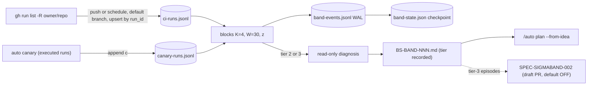

# SPEC-SIGMABAND-001 리서치

## 기존 코드 분석

- `internal/cli/canary.go:86,113` overwrite `.autopus/canary/latest.json` via `canary_helpers.go:115`; early returns at `canary.go:160-169`; statuses `PASS`, `WARN`, `FAIL`, `SKIPPED`. `internal/cli/react.go:102-103` queries failures only; `:228-237` stash/pop. `pkg/content/hooks.go:71-89` registers one PostToolUse react hook.
- `internal/cli/orchestra_readonly_policy.go:39` projects claude (`--permission-mode plan`; `--tools` arrives with SPEC-REVIEWRO-001), codex, gemini argv and stamps OMP-backed providers read-only; `:195` `dangerousProviderArg`.
- OMP: `orchestra_helpers.go:231-240` fills binary `omp`; `pkg/orchestra/provider_backend_route.go:8,32` `runConfiguredProvider` routes through `ProviderBackends`; `provider_runner.go:23` `runProvider` spawns the binary directly. `autopus.yaml:77-90` sets `judge: claude` with `backend: omp`.
- `pkg/promptlayer/context_scan.go:30-35,112` `SanitizeContent` (PEM pattern needs BEGIN and END); `layer.go:14-16,32-34,89,141,152`.
- `internal/cli/sync_verify_discover.go:37-55` `resolveMetaRoot` (unexported, package `cli`) returns the outermost multi-repo ancestor; `pkg/setup/multirepo.go:13` `DetectMultiRepo` (exported) needs two or more components; `isGitRepo` (`:106`) only stats `.git`. This workspace root's `.git` holds only `hooks/`.
- gh 2.98.0 help (probe A2): `-R` on `run list` and `run view`; `auth status --hostname`; `repo view [<repository>]`; `api <endpoint> --hostname`.
- `content/skills/idea.md:96-99,137,269-343` BS format and confidence rules; no Go BS writer, no mean/σ code. Real flock exists only as unexported helpers (`pkg/terminal/cmux_buffer_flock_unix.go:14`, `_windows.go:13`).

## Plan Intent Ledger

Source: `prd.md` Discovery Q&A and Ledger Reuse from direct `/auto plan` (no BS file). Cells are summarized as untrusted evidence.

| Field | Status | Source | Confidence | Decision / Assumption | If Wrong | Plan Handoff |
|---|---|---|---|---|---|---|
| goal | answered | user (D3) and code | high | tiered σ-band response over CI and canary history | the Outcome Lock changes | requirement seed |
| scope_boundary | assumed | inferred | medium | v1 metrics are CI and canary failure rates only (Q1) | metric schema and series layout change | explicit non-goal |
| constraints | answered | user (D3) and `autopus.yaml` | high | flag default OFF, N<20 log-only, 300 lines, 85% coverage | requirements and gates change | risk or constraint seed |
| done_evidence | assumed | inferred | medium | fixtures and replay suffice; live 2σ firing is not required (Q2) | an operational demo gate is added | acceptance seed |
| brownfield_impact | answered | code | high | react, canary, config, hygiene, orchestra touch points | reviewer focus shifts | reviewer focus |

User decision 2026-10-06 (AskUserQuestion): D3 (3σ draft PR behind a default-OFF flag) stays valid and is deferred to the sibling SPEC-SIGMABAND-002; this SPEC treats tier 3 as diagnosis-only. Carried open questions (not promoted): Q3 assumed an evidence-only BS when diagnosis is unavailable (if wrong, REQ-12 becomes log-only and S12 changes). Q4 assumed canary `WARN` counts as 0 (if wrong, REQ-03 and S20 change). Q5 assumed a read-only patch proposal in tier 3 (if wrong, a write-capable agent widens the security boundary and needs a new plan).

## Question Audit

- question_transport: AskUserQuestion
- question_count: 1 for this SPEC (D3); 3 in the planning session (D1–D3)
- unresolved_fields: [scope_boundary, done_evidence]

## Outcome Lock

- User-visible outcome: `auto react band` ingests trusted default-branch CI runs (`push`, `schedule`; successes included) and executed canary runs into bounded local history, evaluates every series deterministically into a write-ahead log, logs 1σ, and writes one read-only diagnosis `BS-BAND-NNN` per episode at 2σ and 3σ (tier recorded) for `/auto plan --from-idea`, without changing any git ref, worktree, or GitHub state.
- Mandatory requirements: REQ-01–REQ-17 and REQ-22–REQ-24 (same list as the spec.md Outcome Boundary).
- Explicit non-goals: the 3σ draft PR path and its flag (SPEC-SIGMABAND-002), service metrics, runbooks, new hooks/daemons/schedulers, agent write access, `react` behavior changes, `auto idea new`, untrusted or non-default-branch runs, K/W overrides.
- Completion evidence: S1–S19 pass; tier 3 records 0 git/gh mutations; hook entries unchanged; coverage ≥ 85%; files ≤ 300 lines.

## Visual Planning Brief

`wireframe intent: not applicable` (CLI only). The tier state machine and phase flow are in `plan.md`; data flow:

## Technology Stack Decision

| Mode | Selected stack | Resolved versions | Source refs | Checked at |
|---|---|---|---|---|
| brownfield | existing Go module, stdlib `math`, `golang.org/x/sys` (already direct), gh and git subprocesses | `go.mod` as-is, gh 2.98.0, git 2.50.1 (probe hosts) | `go.mod`, probes A2 and A3 | 2026-10-06 |

## 설계 결정

- Split (user decision 2026-10-06): the draft PR path crosses a security boundary (agent-authored patch reaching a remote before human review) and did not converge within the revision limit, so it moved to SPEC-SIGMABAND-002 with its open findings; this SPEC keeps no patch, worktree, commit, push, PR, CI scan, or flag.
- Block ratios instead of per-run σ: with baseline p ≤ 10%, one failure gives z ≥ 2.92 at n=20, collapsing tiers (PRD §5.1).
- Trusted evidence is `push` and `schedule` on the default branch (F-001). Partial rebuttal kept: `workflow_dispatch` needs write access, so it is excluded for signal meaning, not as a fork vector.
- Every newer position is evaluated before compaction (no 50 cap, F-006); the batch rule bounds provider calls.
- WAL plus checkpoint (F-026). Phase B runs claims one at a time, and leases chain the budgets of earlier claims (930 s, 1,860 s, …), and each claim's result is recorded right after it, so expiry means the owner exceeded every timeout (F-032). A 24 h window both accepts late results and bounds how long an interrupted earlier episode stays in the checkpoint, which removes the F-008 conflict.
- The action enum is `log`, `diagnose`, `suppressed`; tier 3 differs from tier 2 only in the recorded tier and `max_tier` (F-033).
- BS root = top of the component chain, scope = recursive walk along component edges, lock = one per-user allocation lock, all through the exported `setup.DetectMultiRepo` (probe A3). Every start in one component tree, nested repositories included, shares one scope, and no lock is written inside a repository (F-013).
- Redaction before any cut with a bound of 2×len(raw)+17 so redaction never truncates, last-4-MiB capture, attempt-pinned logs, filtered identifiers (F-004, F-023, F-029, F-035, F-038).
- Claude read-only depends on `--tools=Read,Grep,Glob` from SPEC-REVIEWRO-001; band checks the projected argv fail-closed.

## Minimality Decision Matrix

| Ladder step | Evidence | Decision | Receipt item |
|-------------|----------|----------|--------------|
| actual need | Outcome Lock and D3; no history or σ code exists (`rg` over `pkg/`, `internal/`) | proceed | history, detector, decision table, tiered actions |
| existing code/helper/pattern | `applyReadOnlyProviderPolicy`, `runConfiguredProvider`, `SanitizeContent`, `Render`, `setup.DetectMultiRepo`, `addJSONFlags`, `decodeStrict`, flock helpers | reuse | projection, OMP routing, redaction, manifests, BS root, output, config, lock pattern |
| stdlib/native | `math.Sqrt`, `encoding/json`, `os.O_EXCL`, `os.Rename`, `crypto/sha256`, git worktree | use | statistics, JSONL, exclusive create, atomic swap, h8, isolation |
| existing dependency | `golang.org/x/sys` for flock, `gopkg.in/yaml.v3`, `cobra` | reuse | no new module |
| new dependency or abstraction / new dependency or new abstraction | `pkg/healthband` (detector and store have no home), `pkg/brainstorm` (no Go BS writer), `pkg/filelock` (flock helpers are unexported in two packages), `RunSingleProvider` (routing entry for one provider); no new dependency | accepted | three packages, one thin exported wrapper |
| minimum sufficient verification | S1–S19 with fakes, real files in S8 and S9, a real repo in S14, race test, coverage, file size, vet, lint, hygiene, strict validate | required checks | `plan.md` Verification |

## Semantic Invariant Inventory

| ID | source clause | invariant type | affected outputs | acceptance IDs |
|----|---------------|----------------|------------------|----------------|
| INV-01 | "deterministic block-based mean±σ detector", K=4, at most 30 prior blocks | grouping / numeric formula | μ, sd, sd_eff, x, z in events and envelope | S1, S2, S20 |
| INV-02 | "z boundaries inclusive to upper tier, tol 1e-9", floor 0.25, N<20 log-only | numeric threshold | tier, action, reasons | S1, S3 |
| INV-03 | ordering by observed time with a stable tie-break | ordering | block membership, sample keys | S2, S18 |
| INV-04 | "dedup of CI runs incl. successes" | deduplication / parser | ci-runs.jsonl lines, series values | S3, S4, S13, S20 |
| INV-05 | "같은 이상에는 tier마다 한 번만 대응" | state transition / dedup | BS count, provider calls, claims | S6, S7, S12 |
| INV-06 | catch-up, backlog, late observations, idempotent re-run | ordering / idempotency | evaluation events, checkpoint | S5, S15 |
| INV-07 | `BS-BAND-NNN` above the highest existing ID in every topology | ordering / uniqueness | BS file name, lock location | S9 |
| INV-08 | BS follows the idea.md format | parser / report rows | BS sections, ledger rows, next-step line | S10 |
| INV-09 | "CI logs and BS content are untrusted" | parser / transformation | prompt, BS, series IDs | S4, S11, S12, S19 |
| INV-10 | 3σ behaves like 2σ and changes no git or GitHub state (user decision) | state transition / containment | git and gh argv, refs, BS tier line | S14, S17 |
| INV-11 | append-only bounded history, tolerant read, strict config | parser / bounded retention | observation counts, config text | S8, S16 |
| INV-12 | prompt layer manifest | layer classification | `prompt_manifest` entries | S19 |
| INV-13 | only default-branch `push` and `schedule` runs supply evidence | parser / trust filter | which runs become observations | S3, S4 |
| INV-14 | durable at-most-once diagnosis with late results | state transition / recovery | events, checkpoint, claims, episodes[] | S6, S7, S8 |

## Feature Coverage Map

| Outcome slice | Covered by | Status |
|---------------|------------|--------|
| Happy path: ingest CI and canary | REQ-03, REQ-04 / T5, T6 / S4, S18 | covered |
| Happy path: detect and route (tier 3 diagnosis-only) | REQ-06, REQ-07 / T3, T7 / S1, S2, S3, S6, S14 | covered |
| Happy path: diagnose to BS | REQ-11, REQ-13 / T10, T11 / S9, S10, S12 | covered |
| Dedupe and durability: episodes, backlog, leases, WAL, late results | REQ-08, REQ-09, REQ-10, REQ-24 / T7 / S5, S6, S7, S8 | covered |
| Error: gh unavailable or slow | REQ-05 / T5 / S13 | covered |
| Error: agent unavailable or not read-only | REQ-12 / T10 / S12 | covered |
| Error: corrupt history line, lock contention, BS collisions | REQ-01, REQ-13 / T2, T11 / S8, S9, S13 | covered |
| Integration boundary: react, hooks, canary output, config, hygiene, generated surfaces | REQ-15–REQ-17 / T1, T13, T14 / S16, S17, S18 | covered |
| Security: trust filter, untrusted input, read-only provider, no remote mutation | REQ-04, REQ-07, REQ-11, REQ-22 / T5, T8, T10 / S4, S11, S12, S14 | covered |
| CLI surface | REQ-14, REQ-19, REQ-20 / T12 / S15, S20 | covered |
| Verification | all / T16 / plan.md Verification | covered |
| Docs and ops | REQ-21 / T15 / S20 | covered |
| 3σ draft PR (D3) | approved sibling SPEC-SIGMABAND-002 | approved-sibling |

## Completion Debt

| Item | Blocks | Required resolution |
|------|--------|---------------------|
| None at authoring time | - | Any unmet Must requirement, a failing S1–S19, coverage below 85%, probe A1 not PASS before T10 merges, or SPEC-REVIEWRO-001 not landed at sync (S12 claude-ok row) becomes Completion Debt and blocks sync |

Live 2σ or 3σ firing on production data (cold start, Q2) and a manual GitHub draft-PR smoke are not Completion Debt.

## Evolution Ideas

These are optional improvements and do not block sync completion.

| Idea | Why not required now | Promotion trigger |
|------|----------------------|-------------------|
| K and W config override (N_min stays at least 20) | default constants satisfy the Outcome Lock | observed tier distribution needs tuning |
| robust baseline (median/MAD, excluding episode blocks) | rolling mean ± σ is the requested method | post-incident desensitization becomes a real problem |
| periodic execution (`canary --watch`, built-in scheduler) | cron and `/auto schedule` suffice | operators ask for built-in scheduling |
| service metrics (5xx, latency, CI duration) | outside the v1 scope boundary | a metric source is chosen |
| per-block explain output (`--explain`) | debugging aid only | calibration work needs it |
| public `auto idea new` command | the internal writer suffices | `/auto idea` adopts a deterministic writer |
| cleanup of the `react apply` stash no-op | does not conflict with band | a react usability request |

## Sibling SPEC Decision

| Decision | Reason | Sibling SPEC IDs |
|----------|--------|------------------|
| approved (user decision 2026-10-06) | security/compliance boundary: the 3σ path lets an agent-authored patch reach a remote branch before human review; it needs its own review and must not block the detector and diagnosis outcome | SPEC-SIGMABAND-002 |

One sibling only, no recursive sibling. SPEC-SIGMABAND-002 depends on this SPEC (tier-3 episodes, BS IDs, WAL claims); this SPEC does not depend on it.

## Reference Discipline

| Reference | Type | Verification |
|-----------|------|--------------|
| `internal/cli/orchestra_readonly_policy.go:39,170-193,195`; `orchestra_helpers.go:231-240` | existing | Read 2026-10-06 |
| `pkg/orchestra/provider_backend_route.go:8,32`; `backend_routed.go:30`; `provider_runner.go:23` | existing | rg and Read |
| `autopus.yaml:56,77-90` (`judge: claude`, `backend: omp`) | existing | rg |
| `internal/cli/output_json.go:77,94`; `react.go:35-43,102-103,228-237`; `canary.go:31,37,86,113,160-169`; `canary_helpers.go:115` | existing | rg and Read |
| `pkg/content/hooks.go:71-89` | existing | Read |
| `pkg/promptlayer/context_scan.go:16,30-35,112`; `layer.go:14-16,32-34,89,141,152` | existing | Read |
| `internal/cli/sync_verify_discover.go:37-55`; `pkg/setup/multirepo.go:13,106` | existing | Read; `DetectMultiRepo` executed in probe A3 |
| `pkg/config/loader_strict.go:43`; `schema.go` `HarnessConfig`; `schema_orchestra.go:8` | existing | rg and Read |
| `pkg/terminal/cmux_buffer_flock_unix.go:14`, `_windows.go:13` | existing | rg |
| `internal/cli/init_helpers.go:91`, `sync_verify_policy.go:45`, `status_hygiene_families.go:24`, `check_rules_hygiene.go:24` | existing | Read |
| `content/skills/idea.md:96-99,137,269-343`; `auto-workflows.md.tmpl:840` | existing (canonical sources, not generated copies) | Read |
| gh 2.98.0 flags per command (gh Invocation Table) | external CLI | `--help` of each command, probe A2 |
| Corrections: `pkg/worker/pidlock` is a PID-liveness file; gh `-R` is not accepted by `auth status`, `repo view`, or `api`; the workspace root `.git` holds only `hooks/` | existing, external CLI | Read `pidlock.go:40`, probe A2, `ls ../.git` |
| `pkg/healthband/*`, `pkg/brainstorm/*`, `pkg/filelock/*`, `internal/cli/react_band*.go`, `canary_history.go`, `react_check_metrics_test.go`, `pkg/config/schema_health_band.go`, `docs/health-band.md`, testdata | [NEW] planned addition | n/a |
| `RunSingleProvider`, `HealthBandConf`, `newReactBandCmd` | [NEW] planned addition | n/a |
| SPEC-REVIEWRO-001 `--tools=Read,Grep,Glob` projection; SPEC-SIGMABAND-002 draft PR path | planned in other SPECs | Read `.autopus/specs/SPEC-REVIEWRO-001/plan.md:9-10`; `../SPEC-SIGMABAND-002/` |

## Reviewer Brief

- Intended scope: the Outcome Lock above via REQ-01–REQ-24; Primary SPEC with the approved sibling SPEC-SIGMABAND-002 for the 3σ draft PR path; rev 3 records every finding's status (spec.md Review Resolution).
- Explicit non-goals: the Outcome Lock non-goals; anything in SPEC-SIGMABAND-002; K/W tuning; any agent write access; any change to `react` or hooks.
- Self-verified: Traceability Matrix, Semantic Invariant Inventory, independent oracle recomputation, probes A2/A3 executed, `ParseEARS` types for all 24 requirements, existing/[NEW] reference discipline, strict validate.
- Reviewer should focus on: the three-value decision table, the 24 h late-result and retention window, sequential lease budgets, BS Root Resolution in every topology, the gh Invocation Table, and Completion Debt only.

## Self-Verify Summary

- Q-CORR-03 | status: PASS | attempt: 4 | files: spec.md | reason: real ParseEARS recognizes 24 requirements with intended types and 0 warnings
- Q-CORR-04 | status: PASS | attempt: 4 | files: spec.md, research.md, plan.md | reason: gh flags verified per command; plan flow uses the verified commands; DetectMultiRepo behavior executed; planned items carry [NEW]
- Q-COMP-02 | status: PASS | attempt: 3 | files: spec.md, acceptance.md | reason: every REQ maps to an existing task and scenario after the split
- Q-COMP-03 | status: PASS | attempt: 5 | files: spec.md | reason: one three-value action enum; one late-result and retention window; per-claim result recording
- Q-COMP-04 | status: PASS | attempt: 5 | files: spec.md, research.md | reason: Outcome Lock lists match; BS IDs unique in every topology including the meta root, nested repositories, and outer repositories; draft PR scope moved to the approved sibling
- Q-COMP-05 | status: PASS | attempt: 6 | files: research.md, spec.md, acceptance.md | reason: INV-01–INV-14 map to Must oracles, including nested sequential and concurrent allocation, prior-claim state during a later claim, and redaction growth
- Q-COMP-06 | status: PASS | attempt: 3 | files: spec.md, research.md | reason: Traceability Matrix matches acceptance IDs; Reviewer Brief names the rev 3 focus
- Q-COMP-07 | status: PASS | attempt: 3 | files: research.md | reason: Completion Debt is empty with blocking rules; the draft PR debt lives in SPEC-SIGMABAND-002; Evolution Ideas carry no IDs
- Q-COMP-08 | status: PASS | attempt: 4 | files: plan.md | reason: three probe rows; A2 and A3 PASS with executed evidence; A1 not-run with a reason
- Q-FEAS-03 | status: PASS | attempt: 4 | files: acceptance.md | reason: S9 fixtures match executed DetectMultiRepo output; gh argv match the verified help
- Q-SEC-01 | status: PASS | attempt: 4 | files: spec.md, acceptance.md | reason: trust filter; OMP through the routed allowlist; no git or GitHub mutation in this SPEC
- Q-SEC-02 | status: PASS | attempt: 3 | files: spec.md, acceptance.md | reason: redaction before cut, path redaction, no remote writes
- Q-SEC-03 | status: PASS | attempt: 3 | files: spec.md, acceptance.md | reason: identifiers filtered at ingest with a raw-name hash; events and outputs hold filtered IDs only
