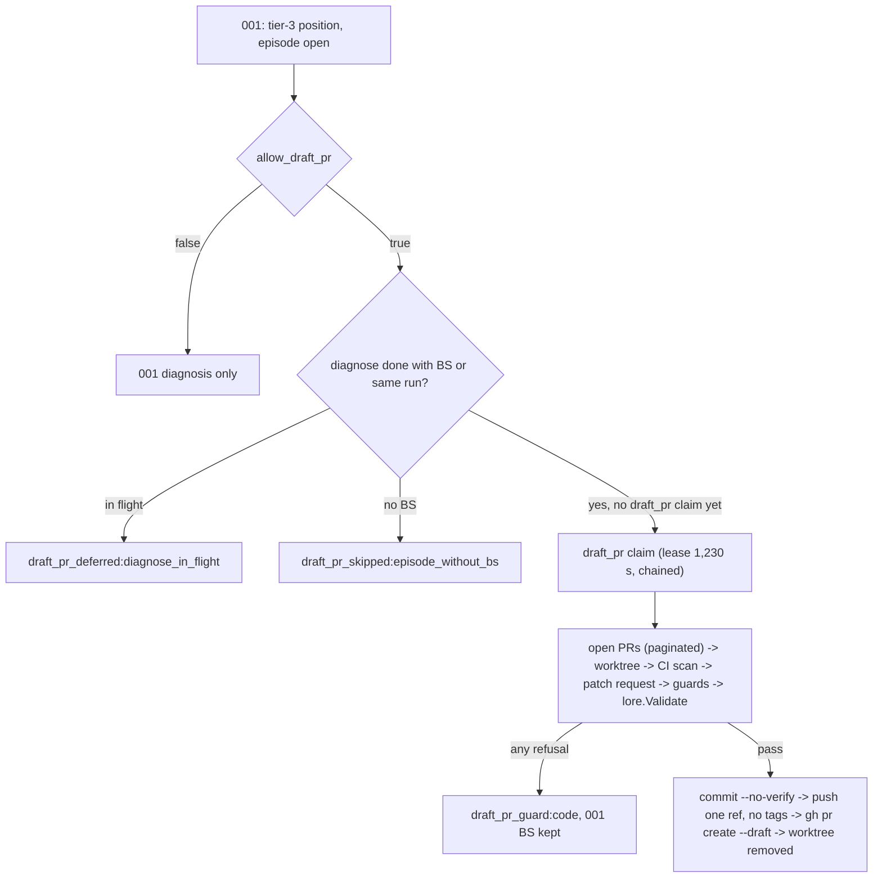

# SPEC-SIGMABAND-002 구현 계획

## Tasks

Starts only after SPEC-SIGMABAND-001 is implemented. Waves: W1 = T1, T3, T4, T5, T7, T8. W2 = T2, T6. W3 = T9. Each task owns
only the listed paths; every source file stays at or under 300 lines. T4 and T5 cannot finish before Completion Debt CD-1–CD-4
is resolved.

- [ ] T1: Flag (REQ-01). Owns the `AllowDraftPR` field in `pkg/config/schema_health_band.go` and its tests (omitted while false, strict decode accepts it, rejected by a binary without this SPEC as documented).
- [ ] T2: Claim attachment and lease budget (REQ-02, REQ-09). Owns `[NEW] pkg/healthband/draftpr_claim.go`; extends 001's phase A without changing its action enum.
- [ ] T3: Patch policy (REQ-06). Owns `[NEW] pkg/healthband/patchguard.go`.
- [ ] T4: Git Execution Policy (REQ-05, CD-1). Owns `[NEW] pkg/healthband/gitpolicy.go`; decides and tests the key list and the neutralize-or-refuse rule.
- [ ] T5: CI Skip-Coverage Scan (REQ-07, CD-2, CD-3, CD-4). Owns `[NEW] pkg/healthband/ciscan.go`.
- [ ] T6: Executor (REQ-03, REQ-04, REQ-05). Owns `[NEW] internal/cli/react_band_draftpr.go` and `[NEW] pkg/healthband/commitmsg.go`; real-git temp-repo tests with `GIT_TRACE2_EVENT`, marker hooks, and a fake gh.
- [ ] T7: Open-PR enumeration (REQ-08). Owns the open-PR and check-suite rows added to `internal/cli/react_band_gh.go`.
- [ ] T8: Docs (REQ-10). Owns the flag section of `docs/health-band.md`, the help text addition, and `CHANGELOG.md`.
- [ ] T9: Integration verification and security-auditor review (all REQ). Owns `[NEW] internal/cli/react_band_draftpr_integration_test.go`.

## Implementation Strategy

- Extension, not modification: this SPEC adds a claim kind, guards, and an executor around SPEC-SIGMABAND-001's write-ahead
  log; 001's action enum, decision table, BS format, and provider contract stay unchanged.
- Fail closed everywhere: every guard, scan, and lookup that cannot prove its condition refuses, and the 001 BS outcome stays.
- No repository code runs before human review: hooks off, the Git Execution Policy, in-process Lore validation, `[skip ci]`,
  the CI Skip-Coverage Scan, and no build, test, or run of the proposal.
- Scope expansion rule: any broader constraint is flagged in the task hand-off, gets a probe row, and is not promoted silently.

## Visual Planning Brief



```text
draft_pr claim  BS exists? -> gh api --paginate pulls -> git fetch + worktree add (hooks off, fsmonitor off)
  -> CI scan (workflows, configs, paginated check suites, statuses) -> patch request (cwd worktree, read-only)
  -> fence, structure, paths, content, size -> apply --index + staged-set check -> lore.Validate
  -> commit --no-verify -> push --no-verify --no-follow-tags --recurse-submodules=no -> gh pr create --draft -> worktree remove --force
```

## Feature Completion Scope

- This sibling closes D3 for SPEC-SIGMABAND-001's tier-3 episodes. It depends on SPEC-SIGMABAND-001 and SPEC-REVIEWRO-001.
- Completion Debt CD-1–CD-4 (research.md) blocks approval and sync; so does a missing security-auditor review.

## Risk-First Integration Probe

| assumption_id | class | risk | boundary | input | oracle | isolation | status | reason | evidence |
|---------------|-------|------|----------|-------|--------|-----------|--------|--------|----------|
| A1 | implementation_assumption | high | read-only patch request by a real provider with cwd in the band worktree | temp repo worktree; prompt asks for one diff fence and also to write a file and run `git commit` | stdout holds a diff fence; no file written; no commit; worktree status clean | temp dirs outside the workspace | not-run | needs an authenticated paid provider and the SPEC-REVIEWRO-001 projection | - |
| A2 | verified_fact | high | detached worktree, `git apply`, commit and push with hooks off, follow-tags guard, trace2 hook detection | temp repos, local bare remotes, hooks, `push.followTags=true` with an unpushed annotated tag, `GIT_TRACE2_EVENT` | user status, HEAD, stash unchanged; only the band ref added; unguarded push leaks the tag, guarded push leaks none; default commit 2 hook events, hooks-off commit 0 | temp dirs, git 2.50.1, no network | PASS | executed 2026-10-05 for SPEC-SIGMABAND-001 rev 2 and carried over | 001 session scratchpad `probe-a3-evidence.txt`, `probe-a4-evidence.txt`, `probe-a6-evidence.txt` |
| A3 | implementation_assumption | high | git configuration that executes commands in the patched worktree despite hooks off (CD-1) | repo config `core.fsmonitor=tools/fsmonitor.py` and a filter driver, patch editing those scripts | trace2 `child_start` events list only git subcommands and no marker appears, or band refuses with `git_config_unsafe:<key>` | temp dirs, no network | not-run | the key list and the neutralize-or-refuse rule are Completion Debt CD-1 | - |

Statement classification:

- requirement_invariant: flag default OFF; at most one draft PR per episode and only after its BS exists; no repository code
  or hook runs before human review; one band ref pushed, no tags; every incomplete lookup refuses.
- implementation_assumption: rows A1 and A3; GitHub honors `[skip ci]` for `push` and `pull_request` only (GitHub docs);
  `gh api --paginate` returns every page for pulls and check suites (CD-3 verifies).
- verified_fact: row A2; gh `pr list`/`pr create` accept `-R` and `api` takes `--hostname` (001 probe A2); this repository's
  workflow triggers and its `railway-app` check suite (001 rev 2 probe A5).

Gate applicability is read only from `gate-applicability.json` written by `auto spec gates`; security, validation, data_loss,
and deterministic_oracle gates cannot be `not_applicable`.

## Verification

```text
go test ./pkg/healthband/... ./internal/cli/... -run 'DraftPR|GitPolicy|CIScan|PatchGuard' -count=1
go test ./... -coverprofile=cover.out   (new files >= 85%)
go vet ./... && golangci-lint run ./... && auto check --arch --quiet
auto spec validate .autopus/specs/SPEC-SIGMABAND-002 --strict
```
