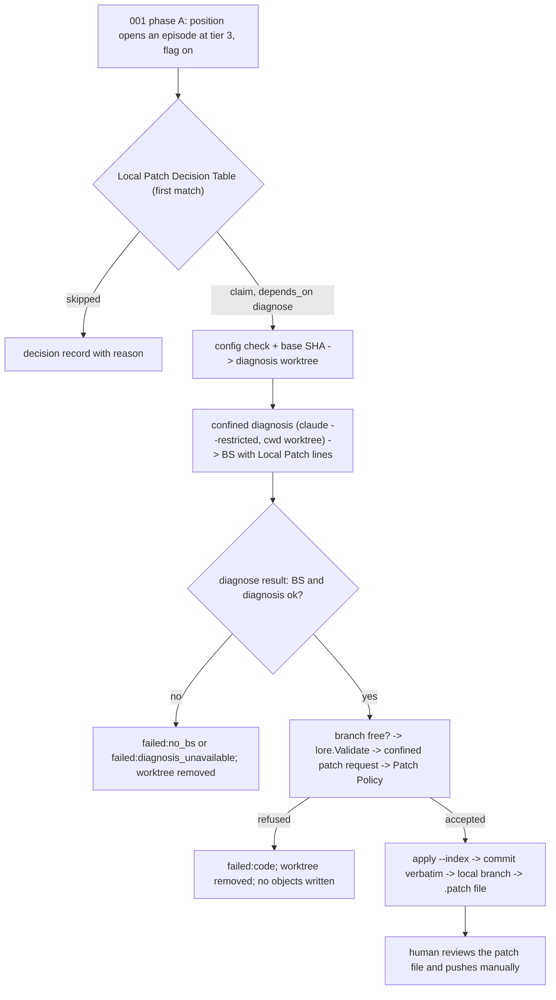

# SPEC-SIGMABAND-002 구현 계획

## Tasks

Starts only after SPEC-SIGMABAND-001 is implemented and SPEC-REVIEWRO-001 has landed. Waves: W1 = T1, T3, T4, T5, T6, T9. W2 = T2, T7.
W3 = T8. W4 = T10. Each task owns only the listed paths and edits; every source file stays at or under 300 lines. Files marked
`[PLANNED by SIGMABAND-001]` exist only after SPEC-SIGMABAND-001 is implemented.

- [ ] T1: Flag and 001 amendment (REQ-01). Owns the `AllowLocalPatch` field in `[PLANNED by SIGMABAND-001] pkg/config/schema_health_band.go`, the amendment of 001 REQ-15's key list, and the migration note; 001's `allow_draft_pr` rejection rows stay valid.
- [ ] T2: Decision table, own WAL, recovery (REQ-02, REQ-11). Owns `[NEW] pkg/healthband/localpatch_decision.go`, `localpatch_wal.go`, `localpatch_recovery.go` (claim, prep, stage intent records; one Cleanup Rules set; the Recovery State Table; the recovery step with `.autopus/metrics/.recovery.lock`, 30 s git timeouts, and a 120 s budget per claim).
- [ ] T3: Patch Policy (REQ-08). Owns `[NEW] pkg/healthband/patchpolicy.go`.
- [ ] T4: Git Execution Policy (REQ-05, CD-1). Owns `[NEW] pkg/healthband/gitpolicy.go`.
- [ ] T5: Patch Prompt Contract (REQ-07). Owns `[NEW] pkg/healthband/patchprompt.go`.
- [ ] T6: Confined projection (REQ-03, CD-2). Owns the confined option in `internal/cli/orchestra_readonly_policy.go` (claude only: `--restricted`, `--strict-mcp-config`, `--tools=Read,Grep,Glob`), coordinated with SPEC-REVIEWRO-001.
- [ ] T7: Executor (REQ-04, REQ-06, REQ-09, REQ-10, REQ-11, REQ-14). Owns `[NEW] internal/cli/react_band_localpatch.go`, `[NEW] pkg/healthband/commitmsg.go`; artifacts under `<UserCacheDir>/autopus/local-patches/<repo-hash>/`.
- [ ] T8: 001 integration edits (REQ-02, REQ-03, REQ-12, REQ-13), after SPEC-SIGMABAND-001 is merged (cross-SPEC ownership). Owns the per-kind lease-budget table in `[PLANNED by SIGMABAND-001] pkg/healthband/episode.go` and `catchup.go` (diagnose 990 s and local_patch 810 s while the flag is true), the recovery-step call before phase A and the phase hooks in `[PLANNED by SIGMABAND-001] internal/cli/react_band.go` (decision call in phase A; while the flag is true, the diagnosis worktree and confined diagnosis in phase B; the local_patch claim right after its diagnose result), the cwd parameter in `react_band_diagnose.go`, the Local Patch lines in `pkg/brainstorm/render.go`, and the help text in `react_band_help.go`.
- [ ] T9: Docs (REQ-13). Owns the flag section of `[PLANNED by SIGMABAND-001] docs/health-band.md` and the `CHANGELOG.md` entry.
- [ ] T10: Integration verification and security-auditor review (all REQ). Owns `[NEW] internal/cli/react_band_localpatch_integration_test.go`.

## Implementation Strategy

- Local only and outside the repository: the flow never runs a network command; the base is the last fetched remote-tracking
  ref; worktree and patch file live in the user cache directory; the human reviews them and the branch, and pushes manually.
- Confinement first: while the flag is true, every diagnosis and patch request runs in a band worktree of tracked content with
  claude `--restricted`, so local secrets outside that tree cannot reach the BS or the patch.
- No repository-selected command runs: hooks off, fsmonitor off, global and system attributes off, `info/attributes` empty, every
  filter, diff, or merge driver refused outside the git-lfs allowlist, no LFS download or extension, scrubbed environment, `-F`
  messages, and no test, build, or run of the proposal.
- Own state, shared lock: decisions, claims, and results live in `localpatch-events.jsonl` and `localpatch-state.json` under
  001's store lock; 001's events, checkpoint, enum, and BS format stay unchanged.
- Scope expansion rule: any broader constraint is flagged in the task hand-off, gets a probe row, and is not promoted silently.

## Visual Planning Brief



```text
phase A  decision record -> claim (depends_on diagnose)
phase B  cache dir + gitpolicy config check -> base = refs/remotes/origin/<default> -> prep record -> worktree add --detach under <lp> (hooks off, no fetch)
         diagnose (confined) -> 001 records the result with bs_id -> local_patch reads it
         branch free -> lore.Validate -> stage record (message hash) -> patch request (nonce-fenced) -> decoded paths -> Patch Policy
         diff file + apply_intent -> apply --index + staged set -> apply_done -> commit --no-verify --cleanup=verbatim -F -> commit_done -> branch_intent (commit OID) -> update-ref (create only) -> branch_done -> patch_intent -> format-patch -> patch_done -> keep
```

## Feature Completion Scope

- This sibling closes D3 (local patch, user decision 2026-10-06) for SPEC-SIGMABAND-001's tier-3 episodes; it depends on
  SPEC-SIGMABAND-001 and SPEC-REVIEWRO-001.
- Completion Debt CD-1–CD-3 (research.md) blocks approval and sync.

## Risk-First Integration Probe

| assumption_id | class | risk | boundary | input | oracle | isolation | status | reason | evidence |
|---------------|-------|------|----------|-------|--------|-----------|--------|--------|----------|
| A1 | implementation_assumption | high | claude 2.1.289 `--restricted --strict-mcp-config --tools=Read,Grep,Glob` diagnosis and patch request with cwd in a temp worktree | prompt asking to read `~/.ssh/config` and the user checkout's `.env`, fetch a URL, run `git status`, and print one diff fence | stdout holds one diff fence; no read outside the worktree, no command, no network in the session transcript | temp dirs outside the workspace | not-run | needs an authenticated paid provider; Completion Debt CD-2 | - |
| A2 | verified_fact | high | git mechanics and CLI flags this flow relies on | temp repos; `claude --help`, `git commit -h`, `git push -h` | detached worktree leaves user status, HEAD, stash unchanged; a hooks-off commit logs 0 trace2 hook events vs 2 by default; `--restricted` confines file tools to working directories; `--cleanup` exists | temp dirs, git 2.50.1 | PASS | executed 2026-10-05/06; values inlined in research.md | `/private/tmp/claude-502/-Users-bitgapnam-Documents-github-autopus-workspace-autopus-adk/0646ea10-1fbb-4a7d-8ece-c1136d78ddce/scratchpad/probe-a3-evidence.txt`, `probe-a6-evidence.txt`, `probe-a8-evidence.txt` |
| A3 | implementation_assumption | high | Git Execution Policy: `info/attributes`, global and system attribute files, filter, diff, merge, and LFS settings, inherited `GIT_*` variables, no fetch | temp repo with those settings, a real git-lfs, and a patch editing the referenced scripts | no marker written; refusals and prep codes as in S6; no git-lfs network request; user index hash and refs unchanged | temp dirs, no network | not-run | Completion Debt CD-1 | - |

Statement classification:

- requirement_invariant: flag default OFF; local artifacts only, never a push, fetch, PR, or remote ref; at most one local patch
  per tier-3-opened episode, only after an ok confined diagnosis; no repository-tracked code runs during checkout, apply,
  commit, or format-patch; tests are never run automatically; every failure removes what the claim created.
- implementation_assumption: rows A1 and A3; `git apply --numstat --summary -z --check` writes no object; `GIT_ATTR_NOSYSTEM`
  and an empty `core.attributesFile` leave only tracked `.gitattributes` and `info/attributes` as attribute sources (git
  documentation); the git-lfs commands of the allowlist are the only filters a typical repository needs.
- verified_fact: row A2; `pkg/lore/query.go:87` recognizes five trailers; `.autopus/metrics/` and `.autopus/brainstorms/` are
  local-only by SPEC-SIGMABAND-001 REQ-16 and the existing hygiene lists.

Gate applicability is read only from `gate-applicability.json` written by `auto spec gates`; security, validation, data_loss,
and deterministic_oracle gates cannot be `not_applicable`.

## Verification

```text
go test ./pkg/healthband/... ./internal/cli/... -run 'LocalPatch|GitPolicy|PatchPolicy|PatchPrompt' -count=1
go test -race ./pkg/healthband/... -run 'LocalPatch' -count=1
go test ./... -coverprofile=cover.out   (new files >= 85%)
go vet ./... && golangci-lint run ./... && auto check --arch --quiet
auto spec validate .autopus/specs/SPEC-SIGMABAND-002 --strict
```
