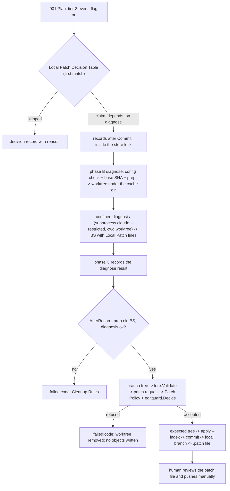

# SPEC-SIGMABAND-002 구현 계획

## Tasks

SPEC-SIGMABAND-001, SPEC-REVIEWRO-001, SPEC-PANERM-001, and SPEC-EDITGUARD-001 are implemented and merged (main `1943e596`), so
every task can start. Waves: W1 = T1, T3, T4, T5, T6, T9. W2 = T2, T7. W3 = T8. W4 = T10. Each task owns only the listed paths
and edits; every source file stays at or under 300 lines (several 001 files already sit at 255–292 lines, so T8 may split a
file along its existing seams instead of growing it past the ceiling).

- [ ] T1: Flag, provider key, and 001 amendment (REQ-01). Owns the `AllowLocalPatch` and `LocalPatchProvider` fields in `pkg/config/schema_health_band.go:8-14` (both `omitempty`; the provider key, like `DiagnosisProvider`, is not validated at load), their comment update, the strict-decode and omit-when-default tests, the amendment of 001 REQ-15's key list with both keys, and the migration note; 001's `allow_draft_pr` rejection rows stay valid.
- [ ] T2: Decision table, own WAL, recovery (REQ-02, REQ-11, REQ-12). Owns `[NEW] pkg/healthband/localpatch_decision.go`, `localpatch_wal.go`, `localpatch_recovery.go`: the Opening tier rule, the five record kinds over 001's store helpers (`store_compact.go:129-258`), one Cleanup Rules set in the order 3, 1, 2, the Recovery State Table, and the recovery step with `.autopus/metrics/.recovery.lock` (`filelock.Acquire`), 30 s git timeouts, and a 120 s budget per claim.
- [ ] T3: Patch Policy (REQ-08). Owns `[NEW] pkg/healthband/patchpolicy.go`, including the `healthband.Sanitize` added-line check and the `editguard.Decide` check against the user's checkout.
- [ ] T4: Git Execution Policy (REQ-05). Owns `[NEW] pkg/healthband/gitpolicy.go`: environment from `orchestra.EnvironWithout`, flags, unsafe-configuration check (with the mandatory `info/attributes` refusal and the all-scope driver refusal of probe A3), base SHA with `git check-ref-format --branch`, and the command allowlist the executor enforces.
- [ ] T5: Patch Prompt Contract (REQ-07). Owns `[NEW] pkg/healthband/patchprompt.go` over 001's `EvaluationLayer` and the in-memory sanitized evidence, with the nonce fence and `Fence`'s length rule.
- [ ] T6: Confined projection (REQ-03, REQ-15). Owns `[NEW] readOnlyPolicyOptions.Confined` in `internal/cli/orchestra_readonly_policy.go:11-15,53-88,209-217`, which sets `--output-format stream-json` and adds `--verbose` and `--restricted` before the last `--tools=Read,Grep,Glob` item of SPEC-REVIEWRO-001's shared claude projection and refuses a provider that has a `Backend` or a name other than `claude`, so a confined projection never passes an OMP-backed provider through as-is.
- [ ] T7: Executor and local-patch provider (REQ-03, REQ-04, REQ-06, REQ-07, REQ-09, REQ-10, REQ-11, REQ-14, REQ-15). Owns `[NEW] internal/cli/react_band_localpatch.go` (Local Patch Flow, lease check per step group, own git allowlist and process-group runner), `[NEW] internal/cli/react_band_localpatch_provider.go` (Local Patch Provider Contract: the key first, then 001's `selectBandProvider` only for a backend-less claude entry, else `provider_unconfined`; the band-only subprocess form, a backend-less `orchestra.providers.claude` entry or else `config.DefaultClaudeProviderEntry()`; T6's projection with `bandReadOnlyControls` and the check for `--restricted`, `--verbose`, and stream-json; the model rule; the stream parse with `[NEW]` `bandProviderStreamBytes` (8 MiB) and the `models[]` record of Provider Contract item 7), which the patch request (step 6) and, through T8, every flag-on diagnosis use, and `[NEW] pkg/healthband/commitmsg.go`; artifacts under `<UserCacheDir>/autopus/local-patches/<repo-hash>/`.
- [ ] T8: 001 integration edits (REQ-02, REQ-03, REQ-12, REQ-13, REQ-15), cross-SPEC ownership of these 001 files: `pkg/healthband/episode.go:21-27` (`local_patch` entry in `claimBudgets`); `catchup.go:12-22,51-58,73-111` (`[NEW]` `PlanOptions` budget override and `LocalPatch` hook, `[NEW]` `Plan.LocalPatch`, chaining 810 s after each row-4 claim); `claims.go:84-117` (`[NEW]` `ExecuteOptions.AfterRecord`); `internal/cli/react_band.go:139-255` (recovery step between `fetchCI` and `store.Lock`, decision and claim records after `Commit`, the phase B hook); `react_band_diagnose.go:54-62,72-86,140-276` (work directory apart from the BS directory, steps 1–2 inside `Run`, the flag-on provider from T7's resolver in place of `selectBandProvider` and `resolveProvider` with its `result` text and model record, `GIT_*` unset, worktree path redaction, the two new unavailable reasons); `react_band_ingest.go:33-41,83-111` (`[NEW]` `bandCIFetch.DefaultBranch`); `pkg/brainstorm/render.go:31-40,180,196,208-209` (`[NEW]` `Request.LocalPatch` and `Request.DiagnosisModel`, pointer and model lines, three sentences); `react_band_help.go:9-58` (help text, including `local_patch_provider`).
- [ ] T9: Docs (REQ-13). Owns the flag section of `docs/health-band.md` (and its tier-3 text at `:223-228`) and the `CHANGELOG.md` entry, including the subprocess claude requirement, the `local_patch_provider` key with the subscription claude CLI deployment, the `worktree_incomplete` removal command (`git worktree remove --force --force <path>`), and the fail-closed refusal of global or system non-LFS filters.
- [ ] T10: Integration verification and security-auditor review (all REQ). Owns `[NEW] internal/cli/react_band_localpatch_integration_test.go`.

## Implementation Strategy

- Local only and outside the repository: the flow never runs a network command; the base is the last fetched remote-tracking
  ref; worktree and patch file live in the user cache directory; the human reviews them and the branch, and pushes manually.
- Confinement first: while the flag is true, every diagnosis and patch request runs in a band worktree of tracked content on a
  subprocess claude with `--restricted` on top of the shared read-only projection, without GitHub, cloud, or `GIT_*`
  variables, so local secrets outside that tree cannot reach the BS or the patch. With SPEC-PANERM-001 there is no pane path,
  and an OMP-backed provider cannot be confined, so it is reported unconfined unless `health_band.local_patch_provider` names
  claude, which band alone runs as a subscription-authenticated CLI subprocess while orchestra keeps its backend.
- No repository-selected command runs: hooks off, fsmonitor off, global and system attributes off, `info/attributes` empty, every
  filter, diff, or merge driver refused outside the git-lfs allowlist, no LFS download or extension, scrubbed environment, `-F`
  messages, an own git allowlist beside 001's unchanged `checkBandCommand`, and no test, build, or run of the proposal.
- The edit guard (SPEC-EDITGUARD-001) never sees band's writes, so the Patch Policy asks `editguard.Decide` against the user's
  checkout, where the manifests and fix locks live.
- Own state, shared lock: decisions, claims, prep, stage, and results live in `localpatch-events.jsonl` and
  `localpatch-state.json` under 001's store lock; 001's events, checkpoint, enum, BS sections, and command allowlist stay
  unchanged.
- Scope expansion rule: any broader constraint is flagged in the task hand-off, gets a probe row, and is not promoted silently.

## Visual Planning Brief



```text
run      guardStore -> fetchCI -> recovery step (only when localpatch-events.jsonl exists; never under --dry-run) -> phase A
phase A  Plan (LocalPatch hook, chained leases 990 s / 810 s) -> Commit -> decision + claim records -> Unlock
phase B  diagnose: checks -> prep -> worktree_intent -> worktree add -> worktree_done -> confined diagnosis -> BS
         phase C result -> AfterRecord: local_patch result check -> branch free -> message -> patch request -> policy
         expected tree (temp index) -> apply_intent -> diff file -> apply --index -> apply_done -> commit -> commit_done
         branch_intent -> update-ref (create only) -> branch_done -> patch_intent -> format-patch -> patch_done -> result
provider local_patch_provider as a CLI subprocess (any backend) -> else 001 selection if subprocess claude -> else unconfined
```

## Feature Completion Scope

- This sibling closes D3 (local patch, user decision 2026-10-06) for SPEC-SIGMABAND-001's tier-3 episodes; it depends on
  SPEC-SIGMABAND-001 and SPEC-REVIEWRO-001, both merged, and interacts with SPEC-PANERM-001 and SPEC-EDITGUARD-001 as
  spec.md Related SPECs states.
- Completion Debt CD-3 (research.md) blocks approval and sync; probes A3 and A1 closed CD-1 and CD-2 on 2026-10-08. OQ-1 is closed by the operator decision of 2026-10-08:
  this repository produces a local patch through `health_band.local_patch_provider: claude` (REQ-15) and keeps OMP for orchestra.

## Risk-First Integration Probe

| assumption_id | class | risk | boundary | input | oracle | isolation | status | reason | evidence |
|---------------|-------|------|----------|-------|--------|-----------|--------|--------|----------|
| A1 | verified_fact | high | claude 2.1.289 subprocess signed in with the Claude subscription (no API key), `config.DefaultClaudeProviderEntry()` argv through the shared read-only projection plus `--restricted` (runs 2 and 3 also `--output-format stream-json --verbose`; run 3 on `claude-opus-5-5`), cwd in a detached temp worktree | `env -i` without any API key or `GIT_*`; prompts asking to read an outside canary file and the user checkout's `.env`, fetch a URL, run `git status`, and print one diff fence; run 3 a benign task that reads a file outside the worktree | `init` `apiKeySource` `none`; tools only `Glob`, `Grep`, `Read`, no MCP server; the outside `Read` denied by the permission layer and listed in `permission_denials`; no canary in any output; one diff fence when the prompt frames the diff as a proposal | temp dirs outside the workspace | PASS | executed 2026-10-08 (3 runs); run 1 gave no fence (plan-mode refusal of a throwaway edit), so the Patch Prompt Contract frames a proposal; run 2 showed a silent `model_refusal_fallback` (`claude-fable-5-1` to `claude-opus-4-8`, category `cyber`), now Local Patch Provider Contract items 2 and 7 and S15 | `/private/tmp/claude-502/-Users-bitgapnam-Documents-github-autopus-workspace-autopus-adk/0646ea10-1fbb-4a7d-8ece-c1136d78ddce/scratchpad/sigmaband002-a1a3-probe-20261008171829/a1-evidence.txt`, `a1b-evidence.txt` |
| A2 | verified_fact | high | git mechanics and CLI flags this flow relies on | temp repos; `claude --help`, `git commit -h`, `git push -h` | detached worktree leaves user status, HEAD, stash unchanged; a hooks-off commit logs 0 trace2 hook events vs 2 by default; `--restricted` confines file tools to working directories and ignores project and local settings; `--cleanup` exists | temp dirs, git 2.50.1 | PASS | executed 2026-10-05/06; claude 2.1.289 `--restricted`, `--safe-mode`, and `--strict-mcp-config` help re-read 2026-10-08 | `/private/tmp/claude-502/-Users-bitgapnam-Documents-github-autopus-workspace-autopus-adk/0646ea10-1fbb-4a7d-8ece-c1136d78ddce/scratchpad/probe-a3-evidence.txt`, `probe-a6-evidence.txt`, `probe-a8-evidence.txt` |
| A3 | verified_fact | high | Git Execution Policy and Local Patch Flow git mechanics: `info/attributes`, global and system attribute files, filter, diff, merge, and LFS settings, inherited `GIT_*` variables, no fetch, the temp-index expected tree, and the `locked` file of an interrupted `git worktree add` | temp repos with hostile tracked, local, global, and inherited settings, a fake git-lfs, a patch with modify, crlf, ident, lfs, new, delete, mode, and rename, and an add of 60,000 files killed mid-checkout | 0 markers under the policy vs 15 distinct markers without it; the S6 fixture codes; temp-index tree equals the `git apply --index` tree; user index hash, HEAD, and stash unchanged; 0 fetch or push; the killed add leaves `locked` (`initializing`) and `index.lock`, `remove --force` exits 128, `--force --force` removes it | temp dirs, no network, git 2.50.1 | PASS | executed 2026-10-08; deviations folded in: the `info/attributes` refusal is mandatory, the interrupted entry's HEAD already equals the base so only the `locked` check classifies it, global or system non-LFS filters are refused (fail-closed); residual risks RR-1 (real git-lfs network behavior and a tracked `.lfsconfig`; a fake ran) and RR-2 (`GIT_ATTR_NOSYSTEM` against a real `/etc/gitattributes`; needs root) | `/private/tmp/claude-502/-Users-bitgapnam-Documents-github-autopus-workspace-autopus-adk/0646ea10-1fbb-4a7d-8ece-c1136d78ddce/scratchpad/sigmaband002-a1a3-probe-20261008171829/a3-evidence.txt` |

Statement classification:

- requirement_invariant: flag default OFF; local artifacts only, never a push, fetch, PR, or remote ref; at most one local patch
  per tier-3-opened episode, only after an ok confined diagnosis; no repository-tracked code runs during checkout, apply,
  commit, or format-patch; tests are never run automatically; a failure removes what the claim created unless a Cleanup Rule
  keeps a changed or unprovable artifact, which `kept[]` names.
- implementation_assumption: `git apply --numstat --summary -z --check` writes no object (A3 showed it for `--check`);
  `GIT_ATTR_NOSYSTEM` hides a real system attributes file (git documentation; A3 could not write `/etc/gitattributes`, RR-2);
  a real git-lfs behaves as the fake did, with no network and no tracked `.lfsconfig` effect (RR-1); the git-lfs commands of
  the allowlist are the only filters a typical repository needs; a checkout of the base fits the 30 s setup deadline;
  `editguard.Decide` against the user's checkout gives the answer the guard gives an agent edit there; claude keeps the
  stream-json event names and fields that 2.1.289 emitted in probe A1.
- verified_fact: rows A1, A2, and A3 (A1 and A3 executed 2026-10-08: subscription sign-in of a `--restricted` session,
  permission-layer confinement, the silent model fallback, 0 markers under the Git Execution Policy, the temp-index tree
  equal to the `git apply --index` tree, the interrupted add's `locked` entry); `pkg/lore/query.go:87` recognizes five trailers; `.autopus/metrics/` and `.autopus/brainstorms/` are
  gitignored and always blocked from staging (`internal/cli/check_rules_hygiene.go:25-30`); 001's `Plan` chains only the
  diagnose budget (`pkg/healthband/catchup.go:100-101`); claim ids are 32 hex (`wal_validate.go:14`); 001's
  `checkBandCommand` refuses git mutations (`internal/cli/react_band_gh.go:90-113`); the shared claude projection already
  carries `--strict-mcp-config` and `--tools=Read,Grep,Glob` (`orchestra_readonly_policy.go:209-217`); `.autopus/*-manifest.json`
  and `.autopus/runtime/` are gitignored (`.gitignore:11,30`); every provider of this repository is `backend: omp`
  (`autopus.yaml:77-90`); a provider without `Backend` runs as a subprocess (`pkg/orchestra/provider_backend_route.go:26-30`)
  and the shared projection passes an OMP-backed provider as-is (`orchestra_readonly_policy.go:59-63`); all read at main
  `1943e596`. claude 2.1.289 help says `--bare` reads only `ANTHROPIC_API_KEY` or `apiKeyHelper`, and `claude auth status`
  on the authoring machine reports a claude.ai subscription login with no API key set (2026-10-08, research.md Reference
  Discipline).

Gate applicability is read only from `gate-applicability.json` written by `auto spec gates`; security, validation, data_loss,
and deterministic_oracle gates cannot be `not_applicable`.

## Verification

```text
go test ./pkg/config/... ./pkg/healthband/... ./pkg/brainstorm/... ./internal/cli/... -run 'LocalPatch|GitPolicy|PatchPolicy|PatchPrompt|Band' -count=1
go test -race ./pkg/healthband/... -run 'LocalPatch' -count=1
go test ./... -coverprofile=cover.out   (new files >= 85%)
go vet ./... && golangci-lint run ./... && auto check --arch --quiet
auto spec validate .autopus/specs/SPEC-SIGMABAND-002 --strict
```
