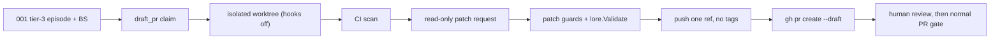

# SPEC-SIGMABAND-002 리서치

## Decision Record

- User decision D3 (2026-10-06, AskUserQuestion): 3σ = draft PR on a separate branch behind a default-OFF flag; no merge, no push to the default branch. Preserved here.
- User decision (2026-10-06, AskUserQuestion): SPEC-SIGMABAND-001 exceeded the revision limit; the 3σ draft PR path is split into this sibling, which is reviewed separately later. SPEC-SIGMABAND-001 treats tier 3 as diagnosis-only.

## Outcome Lock

- User-visible outcome: with `health_band.allow_draft_pr: true`, every SPEC-SIGMABAND-001 tier-3 episode with a diagnosis BS gets at most one draft PR on `autopus/band/<series-slug>-<h8>-<episode-id>`, built from a read-only patch proposal in an isolated worktree, with no repository code or hook run before human review, and refused (001 BS kept) whenever safety cannot be proven.
- Mandatory requirements: REQ-01–REQ-10.
- Explicit non-goals: merge, approve, auto-merge, default-branch or tag push, agent write access, building or testing the proposal, anything SPEC-SIGMABAND-001 owns.
- Completion evidence: S1–S11 pass, Completion Debt CD-1–CD-4 resolved, security-auditor review passed, flag OFF records 0 git/gh mutations.

## Visual Planning Brief

`wireframe intent: not applicable` (CLI only). The claim decision and the guard pipeline are in `plan.md`; data flow:

## 설계 결정

- Carried from SPEC-SIGMABAND-001 rev 2 (review rounds 1–2): read-only patch proposal with the provider in the worktree (F-020), `git apply --index` with staged-set equality (F-011), hooks off plus `--no-verify` and in-process `lore.Validate` with enum-valid trailers (F-002, F-016), `[skip ci]`, single-ref push without follow-tags or submodules (F-024, probe evidence), `-R` only where gh accepts it (F-025), forced cleanup of the band-owned worktree only (F-028), attempts versus ref changes in the push oracle (F-021).
- F-017 (regressed in round 3): `--limit 1000` could silently miss a band PR; open PRs are now enumerated with `gh api --paginate`, and an incomplete enumeration refuses.
- F-034: draft_pr needs the episode's BS; in-flight diagnoses defer, BS-less episodes skip. F-033: the draft PR is a claim kind, so 001's three-value action enum stays unchanged.
- The CI scan keeps fail-closed semantics: unknown triggers, unparsable files, foreign CI, and incomplete lookups all refuse.

## Semantic Invariant Inventory

| ID | source clause | invariant type | affected outputs | acceptance IDs |
|----|---------------|----------------|------------------|----------------|
| INV-01 | "3σ draft PR behind default-OFF flag" (D3) | state transition / default | draft_pr claims, git and gh argv, config text | S1, S10, S11 |
| INV-02 | one draft PR per episode, only after its BS (F-034) | state transition / ordering | claims, reasons, lease values | S2, S9 |
| INV-03 | no repository code runs before human review (F-002) | guard / containment | trace2 events, marker files | S3, S7 |
| INV-04 | one band ref pushed, no tags, nothing after a failed step (F-021, F-024) | guard / ordering | remote refs and tags, push attempts | S3, S4 |
| INV-05 | patch policy: allowlist, deny list, content, size, staged set (F-011) | parser / guard | guard codes | S4 |
| INV-06 | CI that ignores `[skip ci]` refuses; incomplete lookups refuse (F-036, F-037) | parser / fail-closed | `ci_skip_unverifiable` codes | S5, S6 |
| INV-07 | open-PR enumeration is complete or refuses (F-017) | enumeration / fail-closed | `open_pr_exists`, `open_pr_lookup_incomplete` | S8 |

## Feature Coverage Map

| Outcome slice | Covered by | Status |
|---------------|------------|--------|
| Flag and default-OFF behavior | REQ-01 / T1 / S1, S10 | covered |
| Claim attachment and ordering after 001's BS | REQ-02, REQ-09 / T2 / S2, S9 | covered |
| Happy path draft PR | REQ-03, REQ-05 / T6 / S3 | covered |
| Guard failures and patch policy | REQ-04, REQ-06 / T3, T6 / S4 | covered |
| CI Skip-Coverage Scan | REQ-07 / T5 / S5, S6 | completion-debt |
| Git configuration execution | REQ-05 / T4 / S7 | completion-debt |
| Open-PR enumeration | REQ-08 / T7 / S8 | covered |
| Docs and operator precondition | REQ-10 / T8 / S11 | covered |

## Completion Debt

| Item | Blocks | Required resolution |
|------|--------|---------------------|
| CD-1 (F-002 residual) | INV-03, S7, approval | Decide and test the Git Execution Policy: every configuration key that runs a command in the patched worktree despite hooks off (`core.fsmonitor`, `filter.<driver>.clean`/`smudge`/`process`, `diff.<driver>.textconv`, `core.sshCommand`, `credential.helper`, `gpg.program`, relative `include.path`/`includeIf`), each neutralized (for example `-c core.fsmonitor=false`) or refused with `git_config_unsafe:<key>`; run probe A3 |
| CD-2 (F-036) | INV-06, S6, approval | Confirm the skip-safe trigger set against the GitHub event documentation, judged by whether a trigger can fire for the band PR without honoring `[skip ci]`; review and comment triggers are refused in the proposal |
| CD-3 (F-037) | INV-06, S5, approval | Verify `gh api --paginate` over check suites against `total_count` on a commit with more than 30 suites; a short count refuses with `scan_incomplete` |
| CD-4 (incomplete CI lookups) | INV-06, approval | Prove completeness or refuse for every other lookup: commit statuses (`total_count`), workflow file enumeration, configuration file detection |
| Security-auditor review and probe A1 | approval and sync | Independent review of the trust boundary; probe A1 PASS |

## Evolution Ideas

These are optional improvements and do not block sync completion.

| Idea | Why not required now | Promotion trigger |
|------|----------------------|-------------------|
| a write-capable agent confined to the worktree | the read-only proposal satisfies D3 and keeps the boundary narrow | the user asks for agent-applied fixes |
| GitHub App or bot identity for band PRs | the operator's gh identity is enough for a draft | organizations require bot authorship |
| explicit allowlist of trusted external CI apps | refusing all foreign CI is the safe default | an operator needs draft PRs with such CI |

## Sibling SPEC Decision

| Decision | Reason | Sibling SPEC IDs |
|----------|--------|------------------|
| this SPEC is the approved sibling of SPEC-SIGMABAND-001 | security/compliance boundary: an agent-authored patch reaches a remote branch before human review; user decision 2026-10-06 | SPEC-SIGMABAND-001 |

No further sibling; no recursive sibling.

## Reference Discipline

| Reference | Type | Verification |
|-----------|------|--------------|
| `pkg/lore/validator.go:9-11,15,64`; `writer.go:8,11`; `types.go:28-30` | existing | Read 2026-10-06 |
| `pkg/promptlayer/context_scan.go:30-35,112` | existing | Read |
| `pkg/workflow/drift_gate.go:15,29` (`GeneratedSurfacePrefixes`, `GeneratedSurfaceExactPaths`) | existing | rg |
| gh 2.98.0: `pr list`/`pr create` accept `-R`; `api` takes `--hostname` | external CLI | `--help`, 001 probe A2 |
| GitHub "Skipping workflow runs": `[skip ci]` applies to `push` and `pull_request` only | external doc | docs.github.com, 2026-10-06 |
| git 2.50.1 behavior: hooks off via `core.hooksPath`, trace2 hook events, follow-tags leak | external CLI | 001 rev 2 probes (row A2 of plan.md) |
| SPEC-SIGMABAND-001 decision table, WAL, claims, provider contract, gh table | sibling SPEC | `../SPEC-SIGMABAND-001/spec.md` |
| `pkg/healthband/draftpr_claim.go`, `patchguard.go`, `commitmsg.go`, `ciscan.go`, `gitpolicy.go`, `internal/cli/react_band_draftpr.go`, integration test | [NEW] planned addition | n/a |

## Reviewer Brief

- Intended scope: D3 for SPEC-SIGMABAND-001's tier-3 episodes via REQ-01–REQ-10; draft status; Completion Debt CD-1–CD-4 is explicit and blocking.
- Explicit non-goals: merge, approve, auto-merge, default-branch or tag push, agent write access, running the proposal, anything 001 owns.
- Self-verified: Traceability Matrix, Semantic Invariant Inventory, `ParseEARS` types for all 10 requirements, carried probe evidence, strict validate.
- Reviewer should focus on: whether CD-1–CD-4 fully name the remaining trust-boundary gaps, the fail-closed rules, the claim ordering after 001's BS, and the open-PR enumeration fix.

## Self-Verify Summary

- Q-CORR-04 | status: PASS | attempt: 1 | files: research.md, spec.md | reason: existing references verified; carried probe evidence cited; planned items carry [NEW]
- Q-COMP-04 | status: PASS | attempt: 1 | files: research.md, spec.md | reason: the Outcome Lock maps to REQ-01–REQ-10 and S1–S11; the unresolved parts are explicit Completion Debt that blocks sync
- Q-COMP-05 | status: PASS | attempt: 1 | files: research.md, spec.md, acceptance.md | reason: INV-01–INV-07 map to requirements, tasks, and Must scenarios with concrete codes, refs, and lease values
- Q-COMP-06 | status: PASS | attempt: 1 | files: spec.md, research.md | reason: Traceability Matrix and Reviewer Brief bound the review scope
- Q-COMP-07 | status: PASS | attempt: 1 | files: research.md | reason: Completion Debt lists CD-1–CD-4 and the review as blocking; Evolution Ideas carry no IDs
- Q-COMP-08 | status: PASS | attempt: 1 | files: plan.md | reason: three probe rows; A2 PASS with carried evidence; A1 and A3 not-run with reasons
- Q-SEC-01 | status: PASS | attempt: 1 | files: spec.md, research.md | reason: the trust boundary is named; every open gap is Completion Debt with a Must oracle
