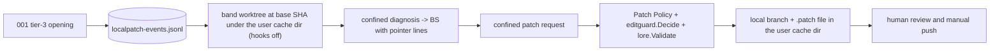

# SPEC-SIGMABAND-002 리서치

## Decision Record

- User decision D3 (2026-10-06, AskUserQuestion): the 3σ autonomy cap was a draft PR on a separate branch behind a default-OFF flag.
- User decision (2026-10-06, AskUserQuestion): the 3σ path was split from SPEC-SIGMABAND-001, which treats tier 3 as diagnosis-only.
- User decision (2026-10-06, AskUserQuestion): the 3σ cap changed from "draft PR" to "local patch only"; band never pushes, never creates a PR, and never calls a remote write API; the human reviews and pushes manually. D3 now reads "local patch".
- Operator restatement (2026-10-08, refresh hand-off): 3σ produces a local patch on an isolated worktree only, no push and no PR, behind a flag that defaults to OFF. Rev 6 refreshes the draft against the merged code; no new user decision was taken.
- Operator decision (2026-10-08, OQ-1, rev 7 hand-off): the OMP backend cannot be confined and every orchestra provider here is `backend: omp`, so band gets a band-only subprocess provider: `health_band.local_patch_provider` (default empty) names a provider that band always runs as a CLI subprocess with the confined projection, whatever `orchestra.providers.<name>.backend` says, while orchestra keeps its backend. Order: the key, then 001's selection only when it resolves to a confinable subprocess provider, otherwise `unavailable(provider_unconfined)`. Expected deployment: the subscription claude CLI, no API key.
- Operator hand-off (2026-10-08, rev 8): probes A1 and A3 ran (plan.md); the hand-off set the model rule (an OMP entry's `anthropic/claude-*` model, here `claude-opus-5-5`, else `claude-fable-5-1`), stream-json recording of a model substitution that marks `model_substituted` without failing, the proposal framing of the patch prompt, and the three A3 deviations. No new user decision was taken.
- Operator hand-off (2026-10-08, rev 9): the CD-3 security design review (security-auditor, repro `cd3-probe/probe.sh`) returned H1–H3, M1–M7, and L1–L4, and the hand-off fixed each resolution (spec.md Review Resolution rev 9); it left the CR rule to this SPEC, which allows a CR only as the byte right before the LF that ends an added line, so CRLF files stay patchable. No new user decision was taken.
- Operator hand-off (2026-10-08, rev 10): the security-auditor's CD-3 verify of rev 9 (`cd3v-probe/probe.sh`) returned L2, M5, M7, and N1–N5 and settled three probe assumptions, and the coordinator added the rev 9 spec-review findings F-001–F-011 (codex; F-011 is M7) with a fixed resolution each. For F-009 it preferred refusing LFS-tracked paths; this SPEC does that and also blanks the git-lfs driver, so band never runs git-lfs and F-002 has no generated value left. No new user decision was taken.
- Operator hand-off (2026-10-08, rev 11): the CD-3 verify of rev 10 left N3 and the stopped-checkout regression, which rev 11 fixes with the rules the hand-off fixed, and named follow-ups, of which the hand-off chose to apply the gitlink keep rule, the two N5 cases, and the `Frsize` unit and to record the rest as residual risks. The hand-off states that the operator approved proceeding after the quorum spec review passed on rev 10, so the status is `approved` and CD-3 is closed; no other decision was taken.

## 기존 코드 분석

SPEC-SIGMABAND-001 is merged (main `1943e596`); rev 6 read its code instead of its plan:

- Phase structure (`internal/cli/react_band.go:139-255`): `guardStore`, `fetchCI`, then `--dry-run` `planDry` without a lock, or `store.Lock`, `phaseA` (`OpenWAL`, merge, `ReadSeries`, `Plan`, `Commit`), `Unlock`, and `phaseB` (`ExecuteClaims` with the diagnoser as runner).
- Claims and leases: `Plan` (`pkg/healthband/catchup.go:73-111`) chains `ClaimBudget(ClaimKindDiagnose)` only (`:100-101`); `claimBudgets` (`episode.go:21-27`) is consulted for that kind alone; `DiagnoseBudget` = 930 s (`:12-19`); claim ids are 32 hex (`claims.go:44`, `wal_validate.go:14`); `Episode` (`types.go:175-181`) keeps `max_tier`, not the opening tier; `ExecuteClaims` (`claims.go:94-117`) has no hook after `RecordResult`.
- Diagnoser (`react_band_diagnose.go`): one `projectDir` is both the provider cwd and the BS directory (`:72-86`, `:253-276`); `bandProviderUnsetEnv` strips GitHub, Actions OIDC and runtime, AWS (`AWS_CONTAINER_*`, Bedrock), Google Cloud, and Azure credentials (`:54-62`); the capture is bounded at `ProviderCaptureBytes` + 1 (`sanitize.go:16`); `bandReadOnlyControls` checks the claude controls (`:215-233`).
- git and gh: `checkBandCommand` admits only `git remote get-url origin`, the tracked-store `ls-files`, and four gh rows (`react_band_gh.go:90-113`); the default branch stays a local variable of `fetchCI` (`react_band_ingest.go:83-111`).
- BS: `render.go:180,196,208-209` hold diagnosis-only sentences; `validate.go:26-27` checks sections only; prompts use `EvaluationLayer` (`prompt.go:113`) and an unexported `evidenceLayer` with a fixed `untrusted-evidence` fence (`:164`).
- Cross-SPEC: SPEC-REVIEWRO-001's projection already appends `--strict-mcp-config`, `--safe-mode`, and `--tools=Read,Grep,Glob` (`orchestra_readonly_policy.go:209-217`); SPEC-PANERM-001 left subprocess and OMP backends only (no `SubprocessMode` in `pkg`, `internal`, `cmd`); SPEC-EDITGUARD-001 guards `Edit|Write|MultiEdit` tool calls and documents that a fresh worktree has no manifests (`docs/edit-guard.md:92`).
- Provider routing (rev 7, same commit): `providerConfigFromEntry` gives an OMP entry the binary `omp`, its model selector, and OMP tools (`orchestra_helpers.go:222`); the shared projection passes an OMP-backed provider through as-is and otherwise requires the binary `claude` (`orchestra_readonly_policy.go:59-63,90-99`); `runConfiguredProvider` runs a provider without `Backend` as a subprocess (`provider_backend_route.go:26-30`); `config.DefaultClaudeProviderEntry()` is the built-in subprocess claude (`claude_provider.go:42-48`, model `claude-fable-5-1`, `quality_tier.go:8`); orchestra commands build their providers in `resolveProviders` (`orchestra_config.go:92`). claude 2.1.289 help: `--bare` reads only `ANTHROPIC_API_KEY` or `apiKeyHelper`, and `--safe-mode` keeps auth working. `claude auth status` on the authoring machine: `loggedIn: true`, `authMethod: claude.ai`, `subscriptionType: max`, no `ANTHROPIC_API_KEY` set (identity fields omitted).
- Rev 8 (read at `40398043`): `orchestra.SplitModelSelector` splits `provider/model:thinking` (`pkg/orchestra/model_family.go:9-28`); 001's diagnoser bounds the capture through `MaxOutputBytes` (`react_band_diagnose.go:258`), keeps the head with `NewHeadBuffer` (`:268`), and reports `provider_empty_output` (`:39,272`); the claude argv allowlist accepts `--output-format` (`orchestra_readonly_policy.go:170`) but not `--verbose` (`:150-153`).

## Outcome Lock

- User-visible outcome: with `health_band.allow_local_patch: true`, every SPEC-SIGMABAND-001 episode opened at tier 3 with an ok confined diagnosis gets at most one local patch (exactly one when every guard passes and fewer than 5 kept keys remain under `<lp>`, else `local_patch_skipped:cap_reached`): branch `autopus/band/<key>`, worktree `<lp>/<key>/worktree/`, patch file `<lp>/<key>.patch` with `<lp>` = `<UserCacheDir>/autopus/local-patches/<repo-hash>` outside the repository, a pointer in the 3σ BS, nothing remote, and no repository-selected command run by band. A repository whose orchestra providers are all OMP-backed gets the same with `health_band.local_patch_provider: claude`, while orchestra keeps its backend.
- Explicit non-goals: push, fetch, PR, remote refs, GitHub write APIs, CI, automatic tests or builds, agent write access, patches for episodes that reached tier 3 after a tier-2 BS, OMP backend confinement, changing an orchestra provider's backend, reviewer-side execution (warned in the BS), anything SPEC-SIGMABAND-001 owns.
- Completion evidence (mandatory requirements REQ-01–REQ-15): S1–S15 pass, Completion Debt CD-3 resolved (CD-1 and CD-2 closed by probes A3 and A1, 2026-10-08), security-auditor review passed, 0 remote writes in every run, and no file under the repository root outside `.git/` changes except the BS and `.autopus/metrics/` records, with only the REQ-14 changes inside `.git/`.

## Visual Planning Brief

`wireframe intent: not applicable` (CLI only). Decision flow and the step order are in `plan.md`; data flow:

## 설계 결정

- Rescope (user decision 2026-10-06): removing publication removes the remote trust problems; the remaining boundary is agent-authored code placed in the user's repository.
- Confinement (F-039, PANERM): only a subprocess claude can be confined (`--restricted` is argv); an OMP-backed provider is reported unconfined instead of silently running unconfined.
- Band-only subprocess provider (operator decision 2026-10-08, OQ-1): `local_patch_provider` lets an all-OMP repository produce a local patch without touching orchestra. A set key is final, as 001 never tries a second provider; an OMP entry's `binary` and `tools` are not reused because they have no subprocess meaning, and its `model` only through the rev 8 model rule, so a backend-less entry or `DefaultClaudeProviderEntry()` applies; `Confined` refuses a `Backend` because the shared projection passes OMP providers as-is. Rejected: switching `orchestra.providers.claude` to the subprocess backend (changes every orchestra command) and OMP worktree confinement (the operator ruled the OMP backend cannot be confined).
- No repository-selected command (F-043, F-071, F-075): attribute sources off or empty, drivers refused outside the git-lfs token rule, LFS downloads and extensions off, no network command, and an own git allowlist so 001's mutation-free `checkBandCommand` stays as it is.
- Location (F-070): worktree and patch file live in the user cache directory; the BS keeps only a pointer.
- Binding (F-049, F-050, F-067, F-073, F-074): the claim depends on the diagnose claim; preparation codes come first; first-match decision order with a default row; the Opening tier rule replaces an opening tier 001 does not store.
- Recovery (F-068, F-080, F-081, F-082, F-083, F-084): every artifact is named by a write-ahead intent record; the claim commit is the recorded OID or parent, message hash, and expected tree; one Cleanup Rules set (order 3, 1, 2) keeps anything a user changed and any partial checkout band cannot prove; diagnoses without a claim are recovered too; recovery never runs under `--dry-run`.
- Ownership (F-072): plan task T8 owns the edits in 001's files; 001's `Plan` needs a hook, because registering a budget alone does not chain it.
- Edit guard (EDITGUARD): band's writes bypass the pre-tool hook by construction, so the Patch Policy asks the guard's own decision function against the user's checkout instead of assuming the guard applies.
- Budgets (F-032, F-072): diagnose 990 s (930 + 30 setup + 30 diagnosis-only cleanup), local_patch 810 s; appends wait at most 5 s inside group deadlines; a claim stops before a group its lease cannot cover.
- Model record and model rule (probe A1): claude can switch models after a safeguard refusal with no trace in text output, so band reads stream-json events and records requested and actual models; a substitution is recorded; since rev 9 (CD-3 M4) it ends a patch request with `patch_model_refused`, because a safeguard refused that prompt on the configured model, while a diagnosis only records it. The operator's configured `anthropic/claude-*` model (here `claude-opus-5-5`, which answered run 3 without a fallback) wins over the built-in `claude-fable-5-1`, whose safeguards refused the run-2 prompt (category `cyber`). The 1 MiB bound moves to the `result` text, because tool events inflate the stream.
- Git deviations (probe A3): `info/attributes` selects filters in a linked worktree under every flag, so its refusal is mandatory; a killed add leaves HEAD at the base, so only the `locked` file classifies it, and a human removes it with `--force --force`; refusing global or system non-LFS filters over-refuses on purpose (fail-closed), because a tracked `.gitattributes` can select any configured driver by name.
- CD-3 hardening (rev 9): the applied diff is raw, so control characters are refused before `Sanitize`; base modes come from the base tree, not from headers; links are checked out as text; lazy fetches are off and partial clones refused; collisions are checked on folded paths and prefixes; structural rules deny tool-loaded names by shape; guard faults deny; a key lock separates a live claim from recovery; record paths are re-derived; a retention cap and a checkout preflight bound disk use. Rev 10: the configuration is checked again inside the new worktree before its checkout (includeIf), git-lfs never runs, replace refs and automatic maintenance are off, refs are written with `--no-deref`, the commit is checked on its recorded OID, the patch file is compared with its recorded hash, index flags keep a worktree, the cache path is walked without symlinks, a fresh read under the key lock precedes every action, and characters are denied by Unicode property. Rev 11: base entries are read one exact path at a time, a checkout that the live run stopped is removed at once, a non-empty gitlink directory keeps a worktree, the `init` model must equal the requested one, and free space uses `Frsize` on Linux.

## Minimality Decision Matrix

| Ladder step | Evidence | Decision | Receipt item |
|-------------|----------|----------|--------------|
| actual need | D3 as a local patch (Decision Record); 001 stops at diagnosis (`render.go:180`) | proceed | one local patch per tier-3 opening |
| existing code/helper/pattern | 001 store helpers, `Plan`, `ExecuteClaims`, `bandProviderUnsetEnv`, `Sanitize`, `EvaluationLayer`, `Fence`, `H8`, `applyReadOnlyProviderPolicy`, `selectBandProvider`, `providerConfigFromEntry`, `config.DefaultClaudeProviderEntry`, `editguard.Decide`, `lore.BuildCommit`/`Validate`, `orchestra.EnvironWithout`, `orchestra.SplitModelSelector`, `filelock.Acquire` | reuse | no second store, sanitizer, projection, provider schema, or guard |
| stdlib/native | `os.UserCacheDir`, `crypto/sha256`, `crypto/rand`, git worktree, apply, update-ref, format-patch | use | artifacts, hashes, nonce, isolation |
| existing dependency | no new module; git and claude CLIs already required | reuse | none added |
| new dependency or abstraction / new dependency or new abstraction | two hooks in 001 (`PlanOptions.LocalPatch`, `ExecuteOptions.AfterRecord`), one projection option (`Confined`), one stream-json parser, one config key (`local_patch_provider`), one key lock per claim and a fixed retention cap (rev 9), write-once results, the in-worktree check, and the recorded patch hash (rev 10; `os.Root`, `unicode`, and `syscall.Statfs` are stdlib), nine `[NEW]` source files and one integration test | accepted | hooks keep 001 free of local-patch logic; the key leaves orchestra unchanged |
| minimum sufficient verification | S1–S15 with real git in temp repos, probes A1 and A3 (PASS 2026-10-08), security-auditor review, strict validate | required checks | `plan.md` Verification |

## Semantic Invariant Inventory

| ID | source clause | invariant type | affected outputs | acceptance IDs |
|----|---------------|----------------|------------------|----------------|
| INV-01 | "3σ (flag default OFF)" | state transition / default | local-patch files, git argv, config text, docs | S1, S10, S11 |
| INV-02 | one local patch per tier-3-opened episode, only after an ok diagnosis, bound to its BS ID | state transition / ordering | decision, claim, result records, leases | S2, S3, S9 |
| INV-03 | checkout, apply, commit, and format-patch run no repository-tracked code, git-lfs, or maintenance, and read no replace object | guard / containment | trace2 events, marker files, index hash, argv flags | S4, S6 |
| INV-04 | never push, fetch, PR, or remote write | containment | git and gh recorders, trace2 `child_start` events, bare remote | S12 |
| INV-05 | Patch Policy over the raw diff, including dotenv and credential paths, base entries, folded collisions, structural rules, `filter` attributes, hunk-counted added lines, and Unicode-property characters | parser / guard | guard codes, object counts, per-file counts | S5 |
| INV-06 | diagnosis and patch providers confined to the band worktree | containment / layer classification | provider argv, cwd, environment, manifest, worktree file types | S7, S8, S13 |
| INV-07 | artifacts stay outside the repository and every worktree by real path and are pointed to from the BS | location / record | repository file hashes, branch, worktree, patch file, BS lines | S3, S4, S11 |
| INV-08 | the commit message equals the validated `-F` bytes | integrity | commit object message, Lore codes | S4, S5 |
| INV-09 | a failure removes what the claim created unless a Cleanup Rule keeps it, ignored files, index flags, and symbolic refs included; recovery uses only durable records read fresh under the key lock and re-derived paths; one `result` per claim | cleanup / recovery | worktree, branch, patch file, result records, `kept[]` | S5, S9 |
| INV-10 | a path the edit guard denies in the user's checkout is denied in a patch | guard / parity | `path_denied:<class>` codes | S5 |
| INV-11 | operator decision 2026-10-08: the key's claude always runs as a band-only CLI subprocess; orchestra keeps its configured backend | ordering / selection | provider argv, cwd, diagnosis status, OMP backend request count, orchestra provider config | S7, S13, S14 |
| INV-12 | operator hand-off rev 8 and CD-3 M4: record requested vs actual model and mark `model_substituted`; a diagnosis proceeds, a patch request ends `patch_model_refused`, or `patch_model_unverified` without an `init` event, with an `init` model other than the requested one, or with an `assistant` event on another model or without one | parser / record | stream-json events, `result` `models[]`, `model_substituted`, BS model line, stream and text bounds | S15 |

## Feature Coverage Map

| Outcome slice | Covered by | Status |
|---------------|------------|--------|
| Flag, migration, 001 amendment | REQ-01 / T1 / S1, S10 | covered |
| Decisions, own WAL, BS binding, leases, recovery | REQ-02, REQ-04, REQ-11, REQ-12 / T2, T8 / S2, S3, S9 | covered (CD-3 M5, M7, F-005–F-008, F-010, F-011 in rev 10; the stopped-checkout removal and the gitlink keep rule in rev 11) |
| Happy path local patch outside the repository | REQ-05, REQ-06, REQ-09, REQ-14 / T7 / S4 | covered |
| Patch Policy, edit guard parity, failure cleanup | REQ-08, REQ-11 / T3, T7 / S5 | covered (CD-3 H1, H2, M2, M3, L1 in rev 9; N1, N3, N4, F-009 in rev 10; the N3 exact-path query in rev 11) |
| Git Execution Policy | REQ-05 / T4 / S6, S7 | covered (probe A3 PASS; CD-3 H3, M1, L2, L4 in rev 9; L2, F-001–F-004, F-009 in rev 10; RR-2 residual) |
| Provider confinement, prompt, stream, and model record | REQ-03, REQ-07 / T5, T6, T7 / S7, S8, S15 | covered (probe A1 PASS; N5 in rev 10) |
| Band-only subprocess provider (`local_patch_provider`) | REQ-01, REQ-15 / T1, T6, T7, T8 / S1, S10, S13, S14 | covered |
| Never publish | REQ-10 / T7, T10 / S12 | covered |
| Docs, BS warning | REQ-13 / T9 / S11 | covered |

## Completion Debt

| Item | Blocks | Required resolution |
|------|--------|---------------------|
| CD-1 | INV-03, S6, approval | closed 2026-10-08: probe A3 PASS (plan.md); its three deviations are encoded in Git Execution Policy item 3, Cleanup Rule 3, and the Recovery State Table |
| CD-2 | INV-06, S7, S13, approval | closed 2026-10-08: probe A1 PASS (plan.md); the silent model fallback it found is recorded by Local Patch Provider Contract items 2 and 7 and S15, and the patch prompt frames a proposal |
| CD-3 | approval and sync | closed 2026-10-08 in rev 11: security-auditor review of the local boundary; the design review returned H1–H3, M1–M7, and L1–L4 (applied in rev 9), the verify of rev 9 returned L2, M5, M7, and N1–N5 (applied in rev 10 with the spec-review findings F-001–F-011), and the three verify rounds in all closed every item except N3 and the stopped-checkout regression, which rev 11 fixes; the quorum spec review passed on rev 10, and the status is approved per the operator hand-off (spec.md Review Resolution rev 11) |

Residual risks, not blockers (follow-ups for a later revision; RR-1, real git-lfs network behavior and a tracked `.lfsconfig`, closed in rev 10 by construction: band blanks the git-lfs driver and never starts git-lfs, F-009; the earlier CI-scan, pagination, and ruleset items were only about remote publication and were dropped with the rescope):

| ID | Residual risk | Follow-up |
|----|---------------|-----------|
| RR-2 | `GIT_ATTR_NOSYSTEM=1` against a real `/etc/gitattributes`, which probe A3 could not write without root and no review promoted | exercise it on a host where a test may write the system file |
| RR-3 | CD-3 verify N2: the checkout preflight sums blob bytes, while a checkout with `eol=crlf` can need up to 2× and one with `working-tree-encoding` UTF-16 or UTF-32 2–4× | count such paths at their worst-case factor, read with `git check-attr --source=<base-sha>` |
| RR-4 | CD-3 verify N4: Patch Policy item 7 checks the added lines that band's hunk count finds, not the lines that `git apply --cached` staged | re-run item 7 at step 8 over `git diff --cached` of the temp index against the base tree |
| RR-5 | the step-1 retention recount is not atomic with the worktree add, so band runs that share `<lp>` and check out at once can overshoot the cap of 5 | hold one `<lp>`-wide lock from the recount to `worktree_intent` |
| RR-6 | outside this SPEC: the agy (gemini) subprocess spec-review lane returned empty output twice, with stderr `--mode plan has no effect while slash command expansion is disabled` | none here; the orchestra provider adapters own it |
| RR-7 | Phase 4 security L3: Patch Policy item 6 does not deny an allowed source path that a build runs, such as a Rust proc-macro crate, a Cargo `build =` target other than `build.rs`, or a Gradle `includeBuild` directory other than `build-logic/` and `buildSrc/` | band never builds or runs the change; the BS reviewer warning and the run-output warning tell the reviewer to read the whole patch before any build; a later revision may read Cargo and Gradle manifests at the base to deny those paths |

## Open Questions

| ID | Question | Status |
|----|----------|--------|
| OQ-1 | This repository sets `backend: omp` for every provider (`autopus.yaml:77-90`) and only a subprocess claude can be confined; how does it produce a local patch? | closed 2026-10-08 by operator decision: the band-only subprocess provider `health_band.local_patch_provider` (REQ-15, spec.md Local Patch Provider Contract); orchestra keeps `backend: omp` |

## Evolution Ideas

These are optional improvements and do not block sync completion.

| Idea | Why not required now | Promotion trigger |
|------|----------------------|-------------------|
| local patches for episodes that escalate from tier 2 to tier 3 | tier-3 openings keep the BS binding simple | operators see escalations that need patches |
| optional publication as a draft PR | the user capped the 3σ path at a local patch | the user lifts the cap |
| running the proposal's tests in a sandbox | no automatic execution is the current boundary | a sandbox with no network and no secrets exists |

## Sibling SPEC Decision

| Decision | Reason | Sibling SPEC IDs |
|----------|--------|------------------|
| this SPEC is the approved sibling of SPEC-SIGMABAND-001 | security boundary: agent-authored code is written into the user's repository; user decisions 2026-10-06 (split, local patch cap) | SPEC-SIGMABAND-001 |

No further sibling; no recursive sibling.

## Reference Discipline

| Reference | Type | Verification |
|-----------|------|--------------|
| `pkg/healthband/episode.go:12-27`, `catchup.go:12-22,30-42,51-58,73-144`, `claims.go:44,54-60,84-163`, `wal.go:57-68,104-134`, `wal_validate.go:14,31-34`, `types.go:136-153,175-181`, `store.go:33-34,170`, `store_compact.go:129-258`, `sanitize.go:16,79,88,246`, `sanitize_secrets.go:16`, `prompt.go:113,126,164`, `identifier.go:10` | existing (001, merged) | Read at main `1943e596`, 2026-10-08 |
| `internal/cli/react_band.go:139-255`, `react_band_diagnose.go:54-62,72-86,108,192-276`, `react_band_gh.go:73-113`, `react_band_ingest.go:33-41,83-111`, `react_band_help.go:9-58`, `pkg/brainstorm/render.go:31-40,180,196,208-209`, `id.go:101`, `validate.go:26-27`, `pkg/config/schema_health_band.go:3-14`, `docs/health-band.md:223-228`, `pkg/filelock/lock.go:37` | existing (001, merged) | Read at main `1943e596`, 2026-10-08 |
| `internal/cli/orchestra_readonly_policy.go:11-15,53,150-153,207-217`; `pkg/orchestra/provider_runner_single.go:28`, `provider_env.go:34`, `types.go:65-75`; `internal/cli/omp_review_backend.go:63`; `autopus.yaml:77-90` | existing (REVIEWRO, PANERM) | Read and rg; no `SubprocessMode` match in `pkg`, `internal`, `cmd` |
| `internal/cli/orchestra_helpers.go:222`, `orchestra_config.go:92`, `react_band_diagnose.go:84,140-233`, `orchestra_readonly_policy.go:59-63,90-99,148-185`; `pkg/config/claude_provider.go:42-48`, `quality_tier.go:8`, `schema_provider_backend.go:11`, `loader_strict.go:105`; `pkg/orchestra/provider_backend_route.go:26-30` | existing (rev 7 provider routing) | Read 2026-10-08 at `7bfe5d20`, whose code equals main `1943e596` |
| `pkg/editguard/decide.go:24-36,116`; `docs/edit-guard.md:92`; `.gitignore:11,30`; `pkg/workflow/drift_gate.go:17,22`; `internal/cli/check_rules_hygiene.go:25-30` | existing (EDITGUARD) | Read; check-ignore output for the manifest and runtime paths |
| `pkg/lore/validator.go:9-11,15,64`; `query.go:87` (`hasField`: Constraint, Rejected, Confidence, Directive, Tested); `writer.go:8,11`; `pkg/promptlayer/context_scan.go:112`, `layer.go:89` | existing | Read 2026-10-08 |
| claude 2.1.289 `--restricted` (removes code-running tools and WebFetch, ignores user, project, and local settings, confines file tools to working directories), `--safe-mode`, `--strict-mcp-config`, `--tools`; git 2.50.1 `commit --cleanup` | external CLI | help output 2026-10-08, `probe-a8-evidence.txt` |
| Probe values: `probe-a3-evidence.txt` (`user_status_unchanged=yes head_unchanged=yes stash_after=0`), `probe-a6-evidence.txt` (`default_commit hook_child_events=2 markers=2`, `guarded_commit hook_child_events=0 markers=0`) | executed evidence in `/private/tmp/claude-502/-Users-bitgapnam-Documents-github-autopus-workspace-autopus-adk/0646ea10-1fbb-4a7d-8ece-c1136d78ddce/scratchpad/` | file names are SPEC-SIGMABAND-001 rev 2 probe IDs, not 001's current plan rows |
| claude 2.1.289 `--bare` (auth reads only `ANTHROPIC_API_KEY` or `apiKeyHelper`), `--safe-mode` (auth works normally); `claude auth status` (`authMethod: claude.ai`, `subscriptionType: max`) | external CLI, executed | `sigmaband002-rev7-claude-help.txt` and `sigmaband002-rev7-auth-status.json` in the same scratchpad directory, 2026-10-08; identity fields omitted |
| claude 2.1.289 stream-json events: `system` `init` (`model`, `tools`, `apiKeySource`, `mcp_servers`), `system` `model_refusal_fallback` (`original_model`, `fallback_model`, `api_refusal_category`), `assistant` (`message.model`: the fallback model after the fallback in run 2, the `init` model in run 3), `result` (`subtype`, `is_error`, `result`, `permission_denials`) | external CLI, executed | probe A1 runs 2 and 3, `a1-evidence.txt`, `a1b-evidence.txt`, `a1/run2.stream.jsonl`, and `a1b/run3.stream.jsonl` (re-parsed for rev 10) in `/private/tmp/claude-502/-Users-bitgapnam-Documents-github-autopus-workspace-autopus-adk/0646ea10-1fbb-4a7d-8ece-c1136d78ddce/scratchpad/sigmaband002-a1a3-probe-20261008171829/`, 2026-10-08 |
| `pkg/orchestra/model_family.go:9-28`; `internal/cli/react_band_diagnose.go:39,258,268,272`; `orchestra_readonly_policy.go:150-153,170` | existing (rev 8) | Read 2026-10-08 at `40398043` |
| Auditor CD-3 probe `cd3-probe/probe.sh` (git 2.50.1): `a/link.go` (mode 120000, link text `../../../../../../../.ssh/id_rsa` after `git apply --index`), `c` (index holds `pkg/N.go` and `pkg/n.go`, disk holds `n.go`), `pc` (`remote.origin.promisor=true`, `remote.origin.partialclonefilter=blob:none`), `t2.json` (4 fetch or upload-pack argv); part (d), `worktree remove --force` deleting an ignored file, is taken from the script | executed evidence (security-auditor) in the same scratchpad directory | artifacts re-read 2026-10-08 at `81cefca8` |
| `pkg/filelock/lock.go:31-37` (a zero wait tries once, 0600 file, symlink refused); `pkg/editguard/decide.go:40-45,116-139` (a fault allows with a `Diagnostic`); git(1) `GIT_NO_LAZY_FETCH`, git-config(1) `core.symlinks` | existing; external docs | Read and `man` 2026-10-08 at `81cefca8` |
| Auditor CD-3 verify probe `cd3v-probe/` (`probe.sh`, `term.py`, `nolazy.out`, `t2-nolazy.json`, `t2-sym.json`; git 2.50.1); rev 10 probe `sb2-rev10/evidence.txt` (format-patch against hostile `format.*`, blank `filter.x.*` values through `cat-file --filters`, Go 1.26 `unicode` tables); git 2.50.1 help for `update-ref --no-deref`, `worktree add --no-checkout`, `ls-files -v`, `symbolic-ref --no-recurse`, and the format-patch flags; `git help --config` (`core.useReplaceRefs`, `maintenance.auto`, `core.ignoreStat`, `core.sparseCheckout`); the git manual page for `GIT_NO_REPLACE_OBJECTS`; `go.mod` `go 1.26` (`os.Root`) | executed evidence and external docs in the same scratchpad directory | run and read 2026-10-08 at `6272e8cd` |
| Worktree-safety rule (no automatic gc and no prune while worktrees run) | existing harness rule | hook context 2026-10-06 |
| gitattributes(5), git-lfs-config(5), the `locked` file that a running worktree add holds, Go `os.UserCacheDir` | external docs, executed | probe A3 2026-10-08 (git 2.50.1, `a3-evidence.txt`): attribute sources, filters, temp index, and the `locked` file behave as stated; real git-lfs and `/etc/gitattributes` not exercised (RR-1, RR-2) |
| `PlanOptions.LocalPatch`, `Plan.LocalPatch`, `ExecuteOptions.AfterRecord`, `bandCIFetch.DefaultBranch`, `Request.LocalPatch`, `Request.DiagnosisModel`, `bandProviderStreamBytes`, `readOnlyPolicyOptions.Confined`, `HealthBandConf.LocalPatchProvider`, the `local_patches[]` run output, `pkg/healthband/localpatch_decision.go`, `localpatch_wal.go`, `localpatch_recovery.go`, `patchpolicy.go`, `patchprompt.go`, `commitmsg.go`, `gitpolicy.go`, `internal/cli/react_band_localpatch.go`, `react_band_localpatch_provider.go`, integration test | [NEW] planned addition | n/a |

## Reviewer Brief

- Intended scope: D3 as a local patch for SPEC-SIGMABAND-001's tier-3 openings via REQ-01–REQ-15; approved status (rev 11, per the operator hand-off) with Completion Debt CD-3 closed; rev 11 fixes N3 with exact-path base-entry queries and removes a checkout that the live run stopped or saw fail, and applies the gitlink keep rule, the two N5 cases, and the `Frsize` unit; rev 10 applies the CD-3 verify (L2, M5, M7, N1–N5) and the spec-review findings F-001–F-011; rev 9 applies the CD-3 design review (H1–H3, M1–M7, L1–L4); rev 8 folds in probes A1 and A3 (CD-1 and CD-2 closed: stream-json model record, the model rule, the proposal-framed patch prompt, the A3 deviations); rev 7 added the band-only subprocess provider `health_band.local_patch_provider` (operator decision on OQ-1) to the rev 6 refresh against merged code.
- Explicit non-goals: any remote write, automatic tests, agent write access, escalated episodes, OMP confinement, changing an orchestra provider's backend, reviewer-side execution, anything 001 owns.
- Self-verified: every 001, REVIEWRO, PANERM, and EDITGUARD reference and the rev 7 provider-routing code re-read at main `1943e596`; the rev 8 references read at `40398043`; the rev 9 references and the auditor's CD-3 probe artifacts read at `81cefca8`; the rev 10 probe run and the CD-3 verify artifacts read at `6272e8cd`; the rev 11 rules as the hand-off states the CD-3 verify of rev 10 (its `ls-tree -t` probe not re-run here); probe evidence A1 and A3; Traceability Matrix; Semantic Invariant Inventory; strict validate.
- Reviewer should focus on: the two 001 hooks and the lease chain, the Opening tier rule, the claim-commit and expected-tree rules, Cleanup Rule order and `worktree_incomplete`, recovery under `--dry-run` and flag-off runs, edit guard parity, the Local Patch Provider Contract (selection order, band-only subprocess form and model rule, `Confined` refusing a `Backend`, the stream parse and model record), Cleanup Rule 3's `locked` check and `--ignored` status rule, the rev 9 CD-3 rules (raw control-character check, base-mode read, folded collisions, structural denies, `core.symlinks=false`, lazy-fetch and partial-clone refusal, step-8 re-check, key lock, Derived paths, retention cap, `patch_model_refused`), the rev 10 rules (in-worktree check before checkout, blanked git-lfs driver, replace refs and maintenance off, `--no-deref`, the recorded commit OID and patch hash, index flags, the `os.Root` cache walk, the fresh read under the key lock, write-once results, Unicode-property characters, hunk counting, `patch_model_unverified`), the rev 11 rules (exact-path `ls-tree` queries per path and prefix, the live removal of a stopped checkout, the gitlink keep rule, the requested-model and missing-model cases, `Frsize`), and Completion Debt only.

## Self-Verify Summary

- Q-CORR-01 | status: PASS | attempt: 6 | files: spec.md, research.md, plan.md | reason: every existing path, symbol, and line re-read at main `1943e596`, the rev 7 provider-routing references included; no reference rests on 001's plan
- Q-CORR-02 | status: PASS | attempt: 5 | files: spec.md, research.md, plan.md | reason: references carry existing (001), existing, or [NEW] labels; no planned-by-001 label remains (F-061)
- Q-CORR-03 | status: PASS | attempt: 6 | files: spec.md | reason: strict validate parses all 15 requirements; trailer support matches `hasField`
- Q-CORR-04 | status: PASS | attempt: 10 | files: research.md | reason: references classified; claude help, auth status, probe A1 and A3 evidence, the auditor's CD-3 probe and verify artifacts, and the rev 10 probe (format-patch flags, blank filter values, Go `unicode` tables, A1 `assistant` models) saved or re-read; `LocalPatchProvider`, the provider resolver, `bandProviderStreamBytes`, and `Request.DiagnosisModel` are [NEW]; `/etc/gitattributes` stays residual risk RR-2, and RR-1 closed by construction
- Q-COMP-01 | status: PASS | attempt: 1 | files: all | reason: each document keeps its role
- Q-COMP-02 | status: PASS | attempt: 12 | files: spec.md, plan.md, acceptance.md | reason: every REQ maps to an owning task and a scenario, the rev 9, rev 10, and rev 11 CD-3 rules included (T2–T4, T7–T10; S3–S7, S9, S12, S15); REQ-15 maps to T6, T7, T8 and S7, S13, S14; S15 covers the REQ-03 model record and the REQ-07 stream bounds; T8 lists every 001 edit with lines
- Q-COMP-03 | status: PASS | attempt: 7 | files: spec.md | reason: the Recovery State Table has rows for `worktree_failed`, an interrupted add, and `patch_done` (F-083); live failures keep step codes
- Q-COMP-04 | status: PASS | attempt: 11 | files: spec.md, research.md, plan.md | reason: no blocking work remains: CD-3 closed in rev 11 after three verify rounds and the quorum spec review of rev 10, with the status approved per the operator hand-off; probes A3 and A1 closed CD-1 and CD-2 on 2026-10-08; OQ-1 is closed by the operator decision of 2026-10-08 (REQ-15); RR-2–RR-6 are non-blocking residual risks
- Q-COMP-05 | status: PASS | attempt: 12 | files: research.md, acceptance.md | reason: INV-01–INV-12 map to Must oracles; S9 follows the Recovery State Table row by row; S13 and S14 fix the provider selection with exact argv, statuses, and OMP request counts; S15 fixes `models[]` values, byte bounds, and the `patch_model_refused` and `patch_model_unverified` ends of a patch request; S9 holds both M7 race paths, the live removal of a stopped checkout with its retention count, and the gitlink keep rule; S15 holds the two rev 11 `patch_model_unverified` cases
- Q-COMP-06 | status: PASS | attempt: 4 | files: spec.md, research.md | reason: Traceability Matrix and Reviewer Brief bound the scope, including the rev 7 provider key
- Q-COMP-07 | status: PASS | attempt: 10 | files: research.md | reason: CD-1, CD-2, and CD-3 are closed with evidence; RR-2–RR-6 are named non-blocking residual risks with a follow-up each, RR-6 outside this SPEC, and RR-1 closed by construction; OQ-1 is closed; Evolution Ideas carry no IDs
- Q-COMP-08 | status: PASS | attempt: 9 | files: plan.md, research.md | reason: A1, A2, and A3 are PASS verified_fact rows with evidence paths; the A1 and A3 deviations are encoded in spec.md, not left in the probe table; the three assumptions that the CD-3 verify settled moved to verified_fact, with their evidence in the A3 row
- Q-FEAS-01 | status: PASS | attempt: 3 | files: plan.md | reason: the 001 hooks are small and owned by T8; files near the 300-line ceiling may split along their seams
- Q-FEAS-02 | status: PASS | attempt: 5 | files: plan.md, spec.md | reason: recovery has its own step, lock, and timeouts; appends wait 5 s inside group deadlines (F-068 b')
- Q-FEAS-03 | status: PASS | attempt: 7 | files: acceptance.md | reason: each S9 expectation matches one row of the Recovery State Table; the recorded expected tree replaces a recovery-time recomputation (F-080)
- Q-STYLE-01 | status: PASS | attempt: 1 | files: spec.md | reason: no ambiguous words in requirements
- Q-STYLE-02 | status: PASS | attempt: 1 | files: spec.md, acceptance.md | reason: Priority uses Must only
- Q-STYLE-03 | status: PASS | attempt: 1 | files: acceptance.md | reason: bare Given/When/Then/And steps
- Q-SEC-01 | status: PASS | attempt: 11 | files: spec.md, acceptance.md | reason: subprocess claude confined; tracked symlinks checked out as text and tracked `.claude/settings.json` and `.mcp.json` inert (S7); a patch from a substituted model refused; probe A1 showed the permission layer denying an outside Read; an OMP selection is unconfined unless the key runs claude as a subprocess; `Confined` refuses a `Backend`; a set key is final; a model substitution is recorded, never hidden; a patch from an unverified model refused, an `init` model other than the requested one and an `assistant` event without a model included (rev 11)
- Q-SEC-02 | status: PASS | attempt: 7 | files: spec.md | reason: untracked secrets are outside the worktree; added lines and paths pass a Unicode-property check before `Sanitize`; provider env drops 001's credential list and `GIT_*`; added lines use 001's band secret forms
- Q-SEC-03 | status: PASS | attempt: 11 | files: spec.md | reason: intent records at re-derived paths, a key lock against recovery, `--ignored` cleanup status, the recorded claim commit and expected tree, and keep-on-doubt cleanup protect user data in the live run and in recovery (F-068, F-080, F-082); an interrupted add is classified by its `locked` file alone (probe A3); rev 10 adds the fresh read under the key lock, write-once results, index-flag and symbolic-ref checks, the recorded patch hash, and the in-worktree configuration baseline for cleanup; rev 11 keeps a worktree with a non-empty gitlink directory and removes at once only band's own stopped or failed checkout
- Q-COH-01 | status: PASS | attempt: 1 | files: spec.md | reason: one story: the 3σ local patch
- Q-COH-02 | status: PASS | attempt: 4 | files: research.md | reason: the boundary work sits in requirements or blocking Completion Debt; OQ-1 is closed by REQ-15
- Q-COH-03 | status: PASS | attempt: 1 | files: research.md | reason: one approved sibling, no recursion
