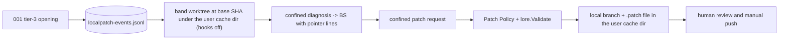

# SPEC-SIGMABAND-002 리서치

## Decision Record

- User decision D3 (2026-10-06, AskUserQuestion): the 3σ autonomy cap was a draft PR on a separate branch behind a default-OFF flag.
- User decision (2026-10-06, AskUserQuestion): the 3σ path was split from SPEC-SIGMABAND-001, which treats tier 3 as diagnosis-only.
- User decision (2026-10-06, AskUserQuestion): the 3σ cap changed from "draft PR" to "local patch only"; band never pushes, never creates a PR, and never calls a remote write API; the human reviews and pushes manually. D3 now reads "local patch".

## Outcome Lock

- User-visible outcome: with `health_band.allow_local_patch: true`, every SPEC-SIGMABAND-001 episode opened at tier 3 with an ok confined diagnosis gets at most one local patch (exactly one when every guard passes): branch `autopus/band/<key>`, worktree `<lp>/<key>/worktree/`, patch file `<lp>/<key>.patch` with `<lp>` = `<UserCacheDir>/autopus/local-patches/<repo-hash>` outside the repository, a pointer in the 3σ BS, nothing remote, and no repository-selected command run by band.
- Mandatory requirements: REQ-01–REQ-14.
- Explicit non-goals: push, fetch, PR, remote refs, GitHub write APIs, CI, automatic tests or builds, agent write access, patches for episodes that reached tier 3 after a tier-2 BS, reviewer-side execution (warned in the BS), anything SPEC-SIGMABAND-001 owns.
- Completion evidence: S1–S12 pass, Completion Debt CD-1–CD-3 resolved, security-auditor review passed, 0 remote writes in every run, and no file under the repository root outside `.git/` changes except the BS and `.autopus/metrics/` records, with only the REQ-14 changes inside `.git/`.

## Visual Planning Brief

`wireframe intent: not applicable` (CLI only). Decision flow and the step order are in `plan.md`; data flow:

## 설계 결정

- Rescope (user decision 2026-10-06): removing publication removes the remote trust problems (push targets, tags, rollback deletions, CI runs, rulesets, open-PR counting, draft support); the remaining boundary is agent-authored code placed in the user's repository.
- Confinement (F-039): while the flag is true, the diagnosis also runs confined, so neither the BS nor the patch can carry files outside a worktree of tracked content; untracked secrets such as `.env` are absent from that tree, and dotenv and credential paths are denied in patches.
- No repository-selected command (F-043, F-071, F-075): global and system attribute files are disabled, `info/attributes` must be empty, every configured filter, diff, or merge driver outside the exact git-lfs token rule is refused, LFS downloads and extensions are off, and no network command runs.
- Location (F-070): worktree and patch file live in the user cache directory, so a test runner started at the repository root cannot discover agent code; the BS keeps only a pointer.
- Binding (F-049, F-050, F-067, F-073, F-074): the claim depends on the diagnose claim; preparation codes come first; first-match decision order with a default row; only tier-3 openings get a patch.
- Recovery (F-068, F-076, F-079, F-080): every artifact is named by a write-ahead intent record; the claim commit is identified by its parent and message hash; one Cleanup Rules set serves the live run and recovery and keeps anything a user changed; one Recovery State Table maps every crash point to one state; recovery is its own step with its own lock and git timeouts, outside 001's phase A; diagnoses without a claim get claim-unique keys too.
- Ownership (F-072): plan task T8 owns the lease-budget edits in 001's `episode.go` and `catchup.go` after 001 is merged.
- Objects and messages (F-056, F-060): the policy runs before any object is written; the commit object's message is compared with the `-F` bytes.
- Budgets (F-072): diagnose 990 s with the worktree, local_patch 810 s right after it; both count in 001's lease chain, an amendment that changes only claim lease fields.

## Semantic Invariant Inventory

| ID | source clause | invariant type | affected outputs | acceptance IDs |
|----|---------------|----------------|------------------|----------------|
| INV-01 | "3σ (flag default OFF)" | state transition / default | local-patch files, git argv, config text, docs | S1, S10, S11 |
| INV-02 | one local patch per tier-3-opened episode, only after an ok diagnosis, bound to its BS ID | state transition / ordering | decision, claim, result records, leases | S2, S3, S9 |
| INV-03 | checkout, apply, commit, and format-patch run no repository-tracked code | guard / containment | trace2 events, marker files, index hash | S4, S6 |
| INV-04 | never push, fetch, PR, or remote write | containment | git and gh recorders, bare remote | S12 |
| INV-05 | Patch Policy over the raw diff, including dotenv and credential paths | parser / guard | guard codes, object counts | S5 |
| INV-06 | diagnosis and patch providers confined to the band worktree | containment / layer classification | provider argv and cwd, manifest | S7, S8 |
| INV-07 | artifacts stay outside the repository and are pointed to from the BS | location / record | repository file hashes, branch, worktree, patch file, BS lines | S4, S11 |
| INV-08 | the commit message equals the validated `-F` bytes | integrity | commit object message, Lore codes | S4, S5 |
| INV-09 | every failure removes what the claim created; recovery uses only durable records | cleanup / recovery | worktree, branch, patch file, result records | S5, S9 |

## Feature Coverage Map

| Outcome slice | Covered by | Status |
|---------------|------------|--------|
| Flag, migration, 001 amendment | REQ-01 / T1 / S1, S10 | covered |
| Decisions, own WAL, BS binding, leases, recovery | REQ-02, REQ-04, REQ-11, REQ-12 / T2, T8 / S2, S3, S9 | covered |
| Happy path local patch outside the repository | REQ-05, REQ-06, REQ-09, REQ-14 / T7 / S4 | covered |
| Patch Policy and failure cleanup | REQ-08, REQ-11 / T3, T7 / S5 | covered |
| Git Execution Policy | REQ-05 / T4 / S6 | completion-debt (CD-1) |
| Provider confinement and prompt | REQ-03, REQ-07 / T5, T6 / S7, S8 | completion-debt (CD-2) |
| Never publish | REQ-10 / T7, T10 / S12 | covered |
| Docs, BS warning | REQ-13 / T9 / S11 | covered |

## Completion Debt

| Item | Blocks | Required resolution |
|------|--------|---------------------|
| CD-1 | INV-03, S6, approval | run probe A3 against the Git Execution Policy (`info/attributes`, global and system attributes, filter, diff, merge, and LFS settings with a real git-lfs, inherited `GIT_*` variables) and fix every gap it shows |
| CD-2 | INV-06, S7, approval | run probe A1: `--restricted` confinement of the diagnosis and the patch request, no command or network tool, one diff fence |
| CD-3 | approval and sync | security-auditor review of the local boundary |

The earlier CI-scan, pagination, and ruleset items were only about remote publication and were dropped with the rescope.

## Evolution Ideas

These are optional improvements and do not block sync completion.

| Idea | Why not required now | Promotion trigger |
|------|----------------------|-------------------|
| local patches for episodes that escalate from tier 2 to tier 3 | tier-3 openings keep the BS binding simple | operators see escalations that need patches |
| optional publication as a draft PR | the user capped the 3σ path at a local patch | the user lifts the cap |
| running the proposal's tests in a sandbox | no automatic execution is the current boundary | a sandbox with no network and no secrets exists |

## Sibling SPEC Decision

| Decision | Reason | Sibling SPEC IDs |
|----------|--------|------------------|
| this SPEC is the approved sibling of SPEC-SIGMABAND-001 | security boundary: agent-authored code is written into the user's repository; user decisions 2026-10-06 (split, local patch cap) | SPEC-SIGMABAND-001 |

No further sibling; no recursive sibling.

## Reference Discipline

| Reference | Type | Verification |
|-----------|------|--------------|
| `pkg/lore/validator.go:9-11,15,64`; `query.go:87` (`hasField`: Constraint, Rejected, Confidence, Directive, Tested); `writer.go:8,11` | existing | Read 2026-10-06 |
| `pkg/promptlayer/context_scan.go:30-35,112`; `pkg/workflow/drift_gate.go:15,29`; `internal/cli/orchestra_readonly_policy.go:39`; `internal/cli/check_rules_hygiene.go:24` | existing | Read and rg |
| claude 2.1.289 `--restricted` (confines file tools to working directories, removes code-running tools and WebFetch), `--strict-mcp-config`, `--tools`; git 2.50.1 `commit --cleanup` | external CLI | help output, `probe-a8-evidence.txt` |
| Probe values: `probe-a3-evidence.txt` (`user_status_unchanged=yes head_unchanged=yes stash_after=0`), `probe-a6-evidence.txt` (`default_commit hook_child_events=2 markers=2`, `guarded_commit hook_child_events=0 markers=0`) | executed evidence in `/private/tmp/claude-502/-Users-bitgapnam-Documents-github-autopus-workspace-autopus-adk/0646ea10-1fbb-4a7d-8ece-c1136d78ddce/scratchpad/` | file names are SPEC-SIGMABAND-001 rev 2 probe IDs, not 001's current plan rows |
| Worktree-safety rule (`git -c gc.auto=0`, no `git gc`/`git prune` while worktrees run) | existing harness rule | hook context 2026-10-06 |
| gitattributes(5): attribute sources (`.gitattributes`, `$GIT_COMMON_DIR/info/attributes`, `core.attributesFile`, system file, `GIT_ATTR_NOSYSTEM`); git-lfs-config(5): `lfs.extension`, `lfs.customtransfer`, `GIT_LFS_SKIP_SMUDGE`; Go `os.UserCacheDir` | external docs | cited by the rev 2 review; to be verified by probe A3, which is not-run (CD-1) |
| `pkg/config/schema_health_band.go`, `internal/cli/react_band.go`, `react_band_diagnose.go`, `react_band_help.go`, `pkg/brainstorm/render.go`, `docs/health-band.md` | [PLANNED by SIGMABAND-001] | `../SPEC-SIGMABAND-001/spec.md` 생성 파일 상세 |
| `pkg/healthband/localpatch_decision.go`, `localpatch_wal.go`, `localpatch_recovery.go`, `patchpolicy.go`, `patchprompt.go`, `commitmsg.go`, `gitpolicy.go`, `internal/cli/react_band_localpatch.go`, integration test | [NEW] planned addition | n/a |

## Reviewer Brief

- Intended scope: D3 as a local patch for SPEC-SIGMABAND-001's tier-3 openings via REQ-01–REQ-14; draft status; Completion Debt CD-1–CD-3 blocks sync.
- Explicit non-goals: any remote write, automatic tests, agent write access, escalated episodes, reviewer-side execution, anything 001 owns.
- Self-verified: Traceability Matrix, Semantic Invariant Inventory, `ParseEARS` types for all 14 requirements, help-text and probe evidence, strict validate.
- Reviewer should focus on: artifact location outside the repository, attribute and driver sources, LFS, durable recovery, the prep-code order, and Completion Debt only.

## Self-Verify Summary

- Q-CORR-01 | status: PASS | attempt: 4 | files: spec.md, research.md | reason: existing paths, symbols, and help texts re-read
- Q-CORR-02 | status: PASS | attempt: 4 | files: spec.md, research.md, plan.md | reason: [NEW] and [PLANNED by SIGMABAND-001] labels kept, recovery file added as [NEW]
- Q-CORR-03 | status: PASS | attempt: 4 | files: spec.md | reason: ParseEARS recognizes all 14 requirements; trailer support matches `hasField`
- Q-CORR-04 | status: PASS | attempt: 5 | files: research.md | reason: references classified; external docs are marked as awaiting probe A3, not as verified
- Q-COMP-01 | status: PASS | attempt: 1 | files: all | reason: each document keeps its role
- Q-COMP-02 | status: PASS | attempt: 6 | files: spec.md, plan.md, acceptance.md | reason: every REQ maps to an owning task and a scenario; T8 owns the lease table; S9 checks a five-claim chain
- Q-COMP-03 | status: PASS | attempt: 6 | files: spec.md | reason: the Recovery State Table maps every last durable record, including HEAD on an unrecorded commit and staged-only states, to one state
- Q-COMP-04 | status: PASS | attempt: 5 | files: spec.md, research.md | reason: byte-exact lfs allowlist, artifacts outside the repository, claim-unique keys, conditional cleanup; remaining work is blocking Completion Debt
- Q-COMP-05 | status: PASS | attempt: 6 | files: research.md, acceptance.md | reason: S9 follows the table row by row, S5 gives one reason per state, S2 checks lease values instead of hiding them
- Q-COMP-06 | status: PASS | attempt: 2 | files: spec.md, research.md | reason: Traceability Matrix and Reviewer Brief bound the scope
- Q-COMP-07 | status: PASS | attempt: 4 | files: research.md | reason: CD-1–CD-3 block sync; Evolution Ideas carry no IDs
- Q-COMP-08 | status: PASS | attempt: 5 | files: plan.md, research.md | reason: A2 PASS cites existing evidence; A1 and A3 not-run with reasons, and no document cites A3 as evidence
- Q-FEAS-01 | status: PASS | attempt: 2 | files: plan.md | reason: runtime changes, including owned edits to 001 files
- Q-FEAS-02 | status: PASS | attempt: 4 | files: plan.md, spec.md | reason: recovery runs in its own step with its own lock and timeouts, leaving 001's phase A as local file IO only
- Q-FEAS-03 | status: PASS | attempt: 6 | files: acceptance.md | reason: each S9 expectation matches one row of the Recovery State Table
- Q-STYLE-01 | status: PASS | attempt: 1 | files: spec.md | reason: no ambiguous words in requirements
- Q-STYLE-02 | status: PASS | attempt: 1 | files: spec.md, acceptance.md | reason: Priority uses Must only
- Q-STYLE-03 | status: PASS | attempt: 1 | files: acceptance.md | reason: bare Given/When/Then/And steps
- Q-SEC-01 | status: PASS | attempt: 5 | files: spec.md, acceptance.md | reason: both providers confined; untrusted input nonce-fenced; attribute, driver, LFS, and shell-interpreted values refused; confinement proof pending as CD-2
- Q-SEC-02 | status: PASS | attempt: 4 | files: spec.md | reason: untracked secrets are outside the worktree; dotenv and credential paths denied; LFS downloads and extensions off
- Q-SEC-03 | status: PASS | attempt: 6 | files: spec.md | reason: intent records, claim-commit identification, and one Cleanup Rules set that keeps user changes protect the user's data in the live run and in recovery
- Q-COH-01 | status: PASS | attempt: 1 | files: spec.md | reason: one story: the 3σ local patch
- Q-COH-02 | status: PASS | attempt: 2 | files: research.md | reason: the boundary work sits in requirements or blocking Completion Debt
- Q-COH-03 | status: PASS | attempt: 1 | files: research.md | reason: one approved sibling, no recursion
