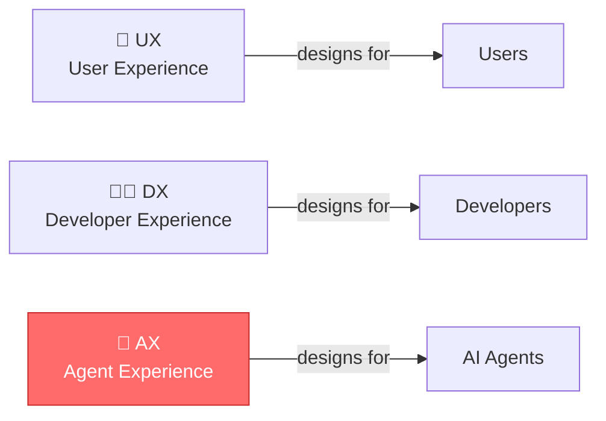
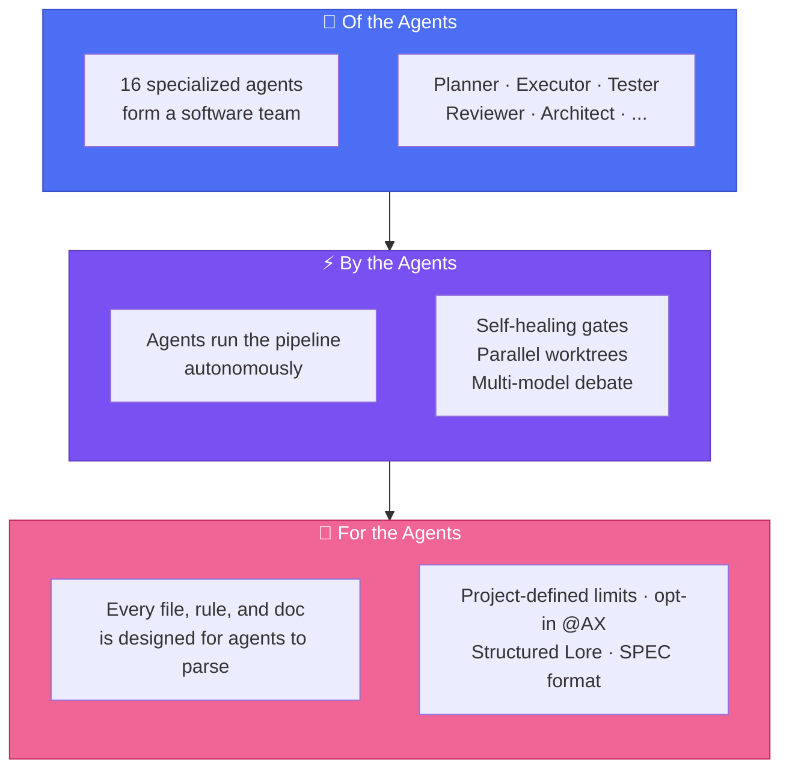
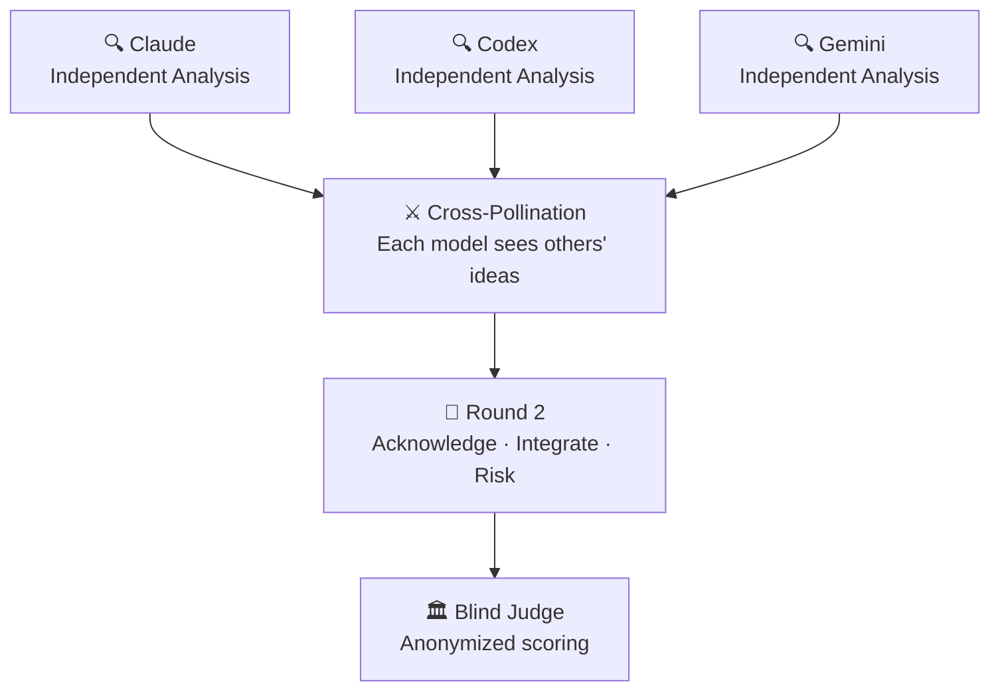
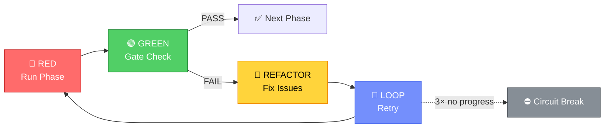
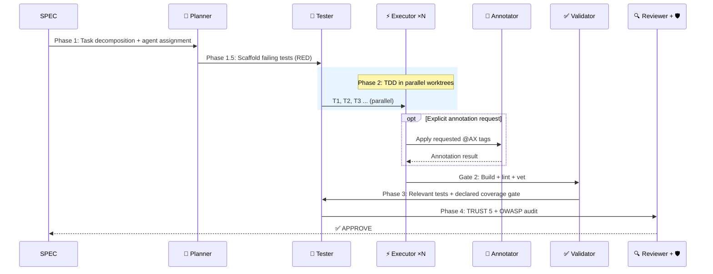
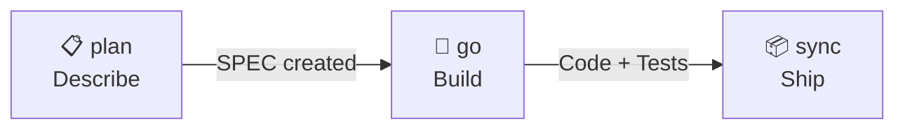

<div align="center">

# 🐙 Autopus-ADK

### A harness *of* the agents, *by* the agents, *for* the agents.

Make your AI coding tools (Claude Code, Codex, Antigravity CLI, OpenCode, Oh My Pi) work like a real engineering team — with planning, testing, code review, and security audits built in.

**16 agents. 53 skills in the library, a compact default catalog. One config across platforms.**

[](https://github.com/Insajin/autopus-adk/stargazers)
[](https://opensource.org/licenses/MIT)
[](https://golang.org)
[](#-one-config-five-platforms)
[](#-16-specialized-agents)
[](#-all-commands)

**Paste this command into your AI coding agent's chat (Claude Code, Codex, OpenCode, etc.) — the agent will run it and set up everything automatically. Or run it directly in your terminal.**

```bash
# macOS / Linux
curl -sSfL https://raw.githubusercontent.com/Insajin/autopus-adk/main/install.sh | sh

# Windows (CMD or PowerShell)
powershell -c "irm https://raw.githubusercontent.com/Insajin/autopus-adk/main/install.ps1 | iex"
```

[Why Autopus](#-the-problem) · [**Core Workflow**](#-the-workflow-three-commands-to-ship) · [Features](#-what-makes-autopus-different) · [Pipeline](#-the-pipeline) · [Security](#-security) · [Docs](#-all-commands)

[🇰🇷 한국어](docs/README.ko.md)

</div>

---

## 🎬 See It In Action

<p align="center"></p>

```bash
# Brainstorm with 3 AI models debating each other
/auto idea "Add OAuth2 with Google and GitHub providers" --multi --ultrathink

# One command does the rest — plan, build with 16 agents, ship with docs
/auto dev "Add OAuth2 with Google and GitHub providers"
```

Or if you prefer step-by-step control:

```bash
/auto plan "Add OAuth2 with Google and GitHub providers" --auto --multi --ultrathink
/auto go SPEC-AUTH-001 --auto --loop --team
/auto sync SPEC-AUTH-001
```

```
🐙 Pipeline ─────────────────────────────────────────────
  ✓ Phase 1:   Planning         planner decomposed 5 tasks
  ✓ Phase 1.5: Test Scaffold    12 failing tests created (RED)
  ✓ Phase 2:   Implementation   3 executors in parallel worktrees
  ✓ Phase 3:   Testing          coverage: 62% → 91%
  ✓ Phase 4:   Review           TRUST 5: APPROVE | Security: PASS
  ───────────────────────────────────────────────────────
  ✅ 5/5 tasks │ 91% coverage │ 0 security issues │ 4m 32s
```

> 💡 One command. Production-ready code with tests, security audit, documentation, and decision history.

---

## ⭐ Star History

<p align="center">
  <a href="https://www.star-history.com/#Insajin/autopus-adk&Date">
    
  </a>
</p>

---

## 😤 The Problem

You're using AI coding tools. They're powerful. But...

- 🔄 **Platform lock-in** — Switch from Claude to Codex? Rewrite all your rules and prompts from scratch.
- 🎲 **Hope-driven development** — "Add auth" → AI writes code, skips tests, ignores security, forgets docs. *Maybe* it works.
- 🧠 **Amnesia** — Next session, the AI forgets every decision. "Why did we use this pattern?" → silence.
- 👤 **Solo agent** — One model, one context, one shot. Multi-file refactoring? Good luck.

---

## 🧠 The Philosophy: AX — Agent Experience

> **AX** is not "AI Transformation." AX is **Agent Experience** — how AI agents perceive, navigate, and operate within your codebase. Just as UX designs for users and DX designs for developers, **AX designs for agents.**



Most AI coding tools are designed around a simple model: **you prompt, it responds.**

Autopus starts from a different question: *What if the agent is the primary audience of your project's documentation?*

Think about onboarding a new engineer. You wouldn't hand them a blank editor and say "build the auth system." You'd give them:
- An architecture overview so they understand the system
- Coding conventions so their code fits in
- Decision history so they don't repeat past mistakes
- A review process so mistakes get caught before shipping

**AI agents need the same things.** The difference is that every session is their first day.

Autopus is a **harness** — a structured environment that gives agents the context, constraints, and workflows they need to produce code that a senior engineer would approve. Not through hope. Through design.

### Of the agents. By the agents. For the agents.



| Principle | What It Means |
|-----------|--------------|
| **Of the Agents** | 16 specialized agents form a real engineering team — planner, executor, tester, reviewer, security auditor, and more. Not one chatbot. A team. |
| **By the Agents** | Agents run the pipeline autonomously — self-healing quality gates, parallel worktrees, multi-model debate. Humans set the goal; agents handle the rest. |
| **For the Agents** | Every file, rule, and document is designed to be parsed by agents, not just read by humans. Structure over prose. That's AX. |
| **Every Session is Day One** | Agents lose all context between sessions. The harness provides institutional memory — architecture, decisions, conventions — so they start informed, not blank. |

> 🐙 **Autopus doesn't make agents smarter. It makes them informed. That's AX.**

---

## 🔥 What Makes Autopus Different

### 📏 Code That Agents Can Actually Read

File size alone does not establish cohesion or correctness. Autopus reports large source files, but enforces a ceiling only when the project sets a positive `architecture.max_file_lines`. Absent or `0` is advisory; keep cohesive code together and split by real responsibility. Repository-specific CI limits remain authoritative.

```
❌ Traditional:
   service.go (1,200 lines) → Agent loses context halfway through

✅ Autopus:
   service.go       (180 lines)  Handler logic
   service_auth.go  (120 lines)  Auth middleware
   service_repo.go  (150 lines)  Data access
   → Every file fits in one context window. Every file has one job.
```

This isn't just about file size. The entire harness is **agent-readable by design:**

| Layer | How It's Agent-Friendly |
|-------|------------------------|
| **Rules** | Structured markdown with IMPORTANT markers — agents parse, not skim |
| **Skills** | YAML frontmatter with triggers — agents auto-activate the right skill |
| **Docs** | Tables over paragraphs, checklists over prose — parseable, not readable |
| **Code** | Clear responsibilities and explicit project limits; no universal line-count ceiling |

> 🐙 **Human-readable is a bonus. Agent-readable is the requirement.**

### 🤖 AI Agents That Form a Team, Not a Chatbot

Autopus doesn't give you one AI assistant — it gives you a **software engineering team of 16 specialized agents** with defined roles, quality gates, and retry logic.

```
🧠 Planner        →  Decomposes requirements into tasks
⚡ Executor ×N    →  Implements code in parallel worktrees
🧪 Tester         →  Writes tests BEFORE code (TDD enforced)
✅ Validator       →  Checks build, lint, vet
🔍 Reviewer       →  TRUST 5 code review
🛡️ Security       →  OWASP Top 10 audit
📝 Annotator      →  Documents code with @AX tags
🏗️ Architect      →  System design decisions
🔬 Deep Worker    →  Long-running autonomous exploration + implementation
... and 7 more
```

### ⚔️ AI Models That Debate Each Other (`--multi`)

One model has blind spots. **Three models catch each other's mistakes.**

Every AI model has its own strengths and biases — Claude is thorough but verbose, Codex is fast but sometimes shallow, Gemini brings a different perspective entirely. When you use `--multi`, they don't just work in parallel — they **review, challenge, and build on each other's ideas.**

```bash
# Add --multi to any command for multi-model intelligence
/auto idea "new feature" --multi          # 3 models brainstorm → cross-pollinate → ICE score
/auto plan "new feature" --multi          # 3-model read-only planning advisory → one SPEC writer → independent review
/auto go SPEC-ID --multi                  # 3 models debate your code review
```



**Why this matters:**
- A bug that Claude misses, Codex catches. An edge case Codex ignores, Gemini flags.
- Ideas that one model would never generate emerge from cross-pollination.
- The blind judge scores anonymized results — no model favoritism.
- Research shows multi-agent debate produces higher-quality outputs than any single model alone.

> 💡 **`/auto dev` enables `--multi` by default.** Every plan gets multi-model review. Every code review gets cross-checked. You don't have to think about it.

4 strategies: **Consensus** (merge agreements) · **Debate** (adversarial review + judge) · **Pipeline** (chain outputs) · **Fastest** (first wins)

### 🔁 Self-Healing Pipeline (RALF Loop)

Quality gates don't just fail — they **fix themselves and retry.**



```bash
/auto go SPEC-AUTH-001 --auto --loop
```

```
🐙 RALF [Gate 2] ──────────────────
  Iteration: 1/5 │ Issues: 3
  → spawning executor to fix golangci-lint warnings...

🐙 RALF [Gate 2] ──────────────────
  Iteration: 2/5 │ Issues: 3 → 0
  Status: PASS ✅
```

**RALF = RED → GREEN → REFACTOR → LOOP** — TDD principles applied to the pipeline itself. Built-in circuit breaker prevents infinite loops.

### 🌳 Parallel Agents in Isolated Worktrees

Multiple executors work **simultaneously** — each in its own git worktree. No conflicts. No corruption.

```
Phase 2: Implementation
  ├── ⚡ Executor 1 (worktree/T1) → pkg/auth/provider.go     ✓
  ├── ⚡ Executor 2 (worktree/T2) → pkg/auth/handler.go      ✓
  └── ⚡ Executor 3 (worktree/T3) → pkg/auth/middleware.go    ✓

Phase 2.1: Merge (task-ID order)
  ✓ T1 merged → T2 merged → T3 merged → working branch
```

File ownership prevents conflicts. GC suppression prevents corruption. Up to **5 concurrent worktrees.**

### 📜 Lore: Your Codebase Never Forgets

Every commit captures the **why**, not just the what. Queryable forever.

```
feat(auth): add OAuth2 provider abstraction

Why: Need Google + GitHub support, extensible for future providers
Decision: Interface-based abstraction over direct SDK usage
Alternatives: Direct SDK calls (rejected: too coupled)
Ref: SPEC-AUTH-001

🐙 Autopus <noreply@autopus.co>
```

9 structured trailers. Query with `auto lore query "why interface?"`. Stale decisions auto-detected after 90 days.

### 🧪 Autonomous Experiment Loop

Let AI iterate autonomously — measure, keep or discard, repeat.

```bash
/auto experiment --metric "go test -bench=BenchmarkProcess" --direction lower --max-iter 5
```

```
🐙 Experiment ───────────────────────
  Iter 1: baseline  │ 1200 ns/op
  Iter 2: optimize  │  850 ns/op  ✓ keep (29% improvement)
  Iter 3: refactor  │  900 ns/op  ✗ discard (regression)
  Iter 4: cache     │  620 ns/op  ✓ keep (27% improvement)
  ─────────────────────────────────────
  Result: 1200 → 620 ns/op (48% improvement)
```

Built-in **circuit breaker** prevents runaway iterations. **Simplicity scoring** penalizes over-complex solutions. Each iteration is a git commit — easy to review or revert.

> ⚠️ **Status: Experimental** — CLI commands (`auto experiment`) are available but skill-level integration is in progress. Core iteration loop works; full pipeline integration is coming.

### 🧠 Pipeline That Learns From Failures

Autopus pipelines don't just fail — they **remember why** and prevent the same mistake next time.

```
Gate 2 FAIL: golangci-lint — unused variable in pkg/auth/
→ Auto-recorded to .autopus/learnings/pipeline.jsonl
→ Next /auto go: learning injected into executor prompt
→ Same mistake never repeated
```

Every pipeline failure is captured as a structured learning entry. On the next run, relevant learnings are automatically injected into agent prompts — giving your pipeline **institutional memory** across sessions.

### 🏥 Post-Deploy Health Check

Deploy first, verify immediately. `canary` runs build verification, E2E tests, and browser health checks against your live deployment.

```bash
/auto canary                          # Build + E2E + browser auto-verification
/auto canary --url https://myapp.com  # Target a specific deployment URL
/auto canary --watch 5m               # Repeat every 5 minutes
/auto canary --compare                # Compare against previous canary report
```

Generates `canary.md` with full diagnostics — build status, test results, accessibility scores, and screenshot diffs.

### 🔀 Smart Model Routing

Not every task needs Opus. Autopus analyzes message complexity and routes to the right model automatically.

```
Simple query     → Haiku  (fast, cheap)
Code review      → Sonnet (balanced)
Architecture     → Opus   (deep reasoning)
```

No configuration needed — the router evaluates token count, code complexity, and domain signals to pick the optimal model. Override anytime with `--quality ultra`.

### 🔌 Provider Connection Wizard

Setting up AI providers shouldn't require reading docs. `auto connect` walks you through a 3-step guided setup.

```bash
auto connect         # Interactive wizard: server auth → workspace → OpenAI OAuth
auto connect status  # Deterministic local verify/readiness summary
```

The current release authenticates with the Autopus server, saves the selected workspace, and completes the OpenAI OAuth handoff. Use `auto connect status` or `auto desktop status --json` to verify the saved local state.

Desktop runtime ownership note:
- The packaged `autopus-desktop-runtime` source/build/release provenance now lives in `autopus-desktop/runtime-helper/`.
- ADK keeps `auto connect`, `auto desktop ...`, and `auto worker ...` as harness or compatibility surfaces, but normal desktop runtime shipping no longer depends on an `autopus-adk` checkout.

### 🤖 ADK Worker — Local Agent Execution

ADK Worker runs A2A + MCP hybrid tasks locally with browser login, JWT refresh, and direct platform connectivity.
No separate bridge daemon or worker API key exchange is required for the default production path.

What it is for:
- Connecting a local workspace to the Autopus platform worker loop
- Receiving platform-dispatched tasks and executing them with local tools
- Reusing the same security, budget, and audit rails as the main harness

What to do today:
- If you're here for `auto init`, Codex `@auto ...`, or OpenCode `/auto ...`, you can ignore Worker for now
- `auto worker ...` is an optional advanced surface that is still being rolled out and documented

### 💰 Iteration Budget Management

Workers don't run forever. Each executor gets a tool-call budget — preventing runaway agents while ensuring enough room to complete complex tasks.

### 📦 Context Compression

As pipelines progress through phases, earlier context gets compacted automatically into a fixed schema: Goal, Constraints, Progress, Decisions, Relevant Files, Next Steps, and Critical Context. Tool calls and results are pruned as pairs, unsafe provider payload bodies are omitted, and every applied compaction emits metadata with summary ids, source refs, reason codes, and budget/blocker state.

### 🔄 Pipeline That Never Dies

Crash mid-pipeline? Resume exactly where you left off.

```bash
/auto go SPEC-AUTH-001 --continue    # Resume from last checkpoint
```

YAML-based checkpoints save pipeline state after every phase. Stale detection prevents resuming outdated sessions. Combined with `--auto --loop`, you get a **fully resilient autonomous pipeline.**

### 🧪 E2E Scenarios from Your Code

Auto-generate and execute E2E test scenarios — no manual test writing needed.

```bash
auto test run                    # Run all scenarios
auto test run -s init --verbose  # Run a specific scenario
```

Autopus analyzes your codebase (Cobra commands, API routes, frontend pages) and generates typed scenarios with **verification primitives** (`exit_code`, `stdout_contains`, `status_code`, `json_path`, etc.). Incremental sync keeps scenarios up-to-date as code evolves.

### 🌐 Browser Automation — AI Agents That See and Click

AI agents can directly interact with web pages — open URLs, read accessibility trees, click elements, fill forms, and capture screenshots.

```bash
/auto browse --url https://example.com/settings
```

```
- @e1 heading "AI Settings"
- @e2 button "Provider Mode"
- @e3 switch "Auto Fallback" [checked]
- @e7 button "Save"
```

Terminal-aware: automatically selects `cmux browser` (in cmux) or `agent-browser` (fallback). Snapshot → Act → Verify loop — agents see the page as an accessibility tree and interact by reference.

### 📺 Live Agent Dashboard

On pane-capable team runtimes, each team member can get a terminal pane with real-time log streaming.

```
┌─ lead ──────────┬─ builder-1 ───────┐
│ Phase 1: Plan   │ T1: auth.go       │
│ 5 tasks created │ implementing...   │
├─ tester ────────┼─ guardian ────────┤
│ scaffold: 12    │ waiting...        │
│ RED state ✓     │                   │
└─────────────────┴───────────────────┘
```

Works in cmux and tmux. Plain terminals degrade gracefully to log-only output.

### 📚 Auto-Documentation with Context7

Before implementation, Autopus fetches latest library docs automatically — so agents never work with stale API knowledge.

```
Phase 1.8: Doc Fetch
  → Detected: cobra v1.9, testify v1.11
  → Fetched: 2 libraries (6000 tokens)
  → Injected into executor + tester prompts
```

Context7 MCP → WebSearch fallback → skip (never blocks pipeline). Adaptive token budget: 1 lib → 5000 tokens, 5 libs → 2000 tokens each.

### 🔌 Hook-Based Result Collection

Instead of scraping terminal output, Autopus uses each provider's native hook system to collect structured JSON results.

| Provider | Hook Type | How |
|----------|-----------|-----|
| Claude Code | Stop hook | Extracts `last_assistant_message` |
| Antigravity CLI | AfterAgent hook | Extracts `prompt_response` |
| OpenCode | Plugin | Extracts `text` field |

Fallback: providers without hooks use ReadScreen + idle detection (SPEC-ORCH-006).

### 🔧 More Power Tools

| Feature | Command | What It Does |
|---------|---------|-------------|
| **Reaction Engine** | `auto react check/apply` | Detects CI failures, analyzes logs, generates fix reports automatically |
| **Meta-Agent Builder** | `auto agent create` / `auto skill create` | Scaffold custom agents and skills from patterns |
| **Hard Gate** | `auto check --gate` | Enforce mandatory pipeline gates (mandatory/advisory modes) |
| **Self-Update** | `auto update --self` | Verified binary update — atomic exchange on Darwin/Linux, `.old` recovery on Windows |
| **Cost Tracking** | `auto telemetry cost` | Token-based pipeline cost estimation per model |
| **Issue Reporter** | `auto issue report` | Auto-collect error context, sanitize secrets, create GitHub issues |
| **Signature Map** | `auto setup` | Extract exported API signatures (Go + TypeScript) via AST analysis |
| **Test Runner Detection** | `auto init` | Auto-detect jest, vitest, pytest, cargo test frameworks |

### 🌐 One Config, Five Platforms

```bash
auto init   # auto-detects supported installed AI coding CLIs
```

One `autopus.yaml` generates **native configuration** for every detected supported platform.

| Platform | What Gets Generated |
|----------|-------------------|
| **Claude Code** | `.claude/rules/`, `.claude/skills/<name>/SKILL.md`, `.claude/agents/`, `.claude/workflows/`, `.claude/settings.json`, `CLAUDE.md` |
| **Codex** | `.codex/skills/codex-<name>/SKILL.md`, `.codex/agents/`, `.codex/hooks.json`, `.codex/config.toml`, `.agents/plugins/marketplace.json`, `.autopus/plugins/auto/`, `AGENTS.md` |
| **Antigravity CLI** | `.agents/plugins/autopus/`, `.agents/hooks.json`, plus retained `.gemini/` / `GEMINI.md` compatibility surfaces |
| **OpenCode** | `.opencode/rules/`, `.opencode/agents/`, `.opencode/commands/`, `.opencode/plugins/`, `.agents/skills/`, `AGENTS.md`, `opencode.json` |
| **Oh My Pi (OMP)** | `.omp/rules/autopus-*.md`, `.omp/skills/<name>/SKILL.md`, `.omp/commands/`, optional `.omp/extensions/` |

Antigravity discovers the workspace plugin directly. `auto init` and `auto update`
do not import a project-rendered bundle globally, and no longer emit the unused
`.agents/commands/` mirror. Inspect the generated bundle with
`agy plugin validate .agents/plugins/autopus`; this checks structure, not whether
runtime permissions or hooks have executed. Native user permission settings are preserved.

The 2026-09-13 compatibility checks used Claude Code 2.1.263, Codex CLI 0.153.4, Antigravity CLI 1.1.26, OpenCode 1.18.7, and OMP 18.1.19. These are observed test versions, not a claim that every newer release or feature is verified. [Codex 0.154.0 worktree support](https://github.com/openai/codex/releases/tag/rust-v0.154.0) remains experimental; the harness does not silently enable experimental topology or replace user permission settings.

Codex note:
- Use `$codex-auto-plan ...`, `$codex-auto-go ...`, or another `$codex-auto-<route>` skill immediately after `auto init` or `auto update`
- Install the generated local plugin from `.agents/plugins/marketplace.json` (`.autopus/plugins/auto`) to enable the friendlier `@auto ...` syntax
- The plugin provides the `@auto ...` router. Detailed workflows are unique native skills under `.codex/skills/codex-<name>/SKILL.md`; Autopus does not generate repository `.codex/prompts/` or markdown `.codex/rules/`
- Multi-agent mode uses `[features.multi_agent_v2]` with the six current collaboration tools and a shared cwd/filesystem; it does not use legacy `send_input`, `resume_agent`, or `close_agent`
- The requested spawned-worker ceiling is `codex.agents.max_concurrent_threads` in `autopus.yaml` (default 4, range 1–64); the coordinator is not included. `auto update` writes the requested value to `.codex/config.toml`. Namespace selection must be backed by CLI compatibility evidence; an unverified version uses the documented `[agents] max_concurrent_threads_per_session` with the assumption stated. Explicit harness settings survive regeneration. Host and account limits still take precedence.
- `auto doctor` separates the requested count and the value inspected on disk from the loaded-session and effective limits. Reading a project or user config file does not prove that an active session loaded it. Unobservable session limits remain `unknown`, with the inspection limitation reported. Start a new session after changing configuration; Autopus never interrupts active agents or equates this setting with local build/test concurrency.
- `.codex/hooks.json` is generated by default, while structural TOML merging preserves unrelated user config
- `features.multi_agent` is still a live native switch. Explicit `true` and `false` values, including user comments, survive regeneration and cleanup; equality with a current default is not ownership evidence.

OpenCode note:
- `/auto ...` and direct aliases like `/auto-plan ...` are generated under `.opencode/commands/`
- Native rule/agent/plugin files live under `.opencode/`, while reusable skills are published under `.agents/skills/`
- The default `skills.compiler.mode: split` publishes core skills and their required references. Opted-in long-tail bundles use `.opencode/skills/`; workflow-only rules remain readable without loading into every initial prompt.
- Helper workflows like `/auto status`, `/auto map`, `/auto why`, `/auto verify`, `/auto secure`, `/auto test`, `/auto dev`, and `/auto doctor` are generated as OpenCode-native command wrappers
- `opencode.json` now registers the managed hook plugin automatically, so `.opencode/plugins/autopus-hooks.js` is live immediately after `auto init` or `auto update`

Oh My Pi note:
- Rules are written flat as `.omp/rules/autopus-<name>.md`. OMP scans each rule root non-recursively, so a nested `rules/autopus/` directory would never reach the session; the `autopus-` filename prefix is the namespace instead
- Only the manifest-recorded `autopus-` files are ADK-owned. Your own rules in the same directory (`.omp/rules/mine.md`) are left untouched by `auto update` and `auto platform remove omp`
- `auto init` ignores `.omp/rules/` as a directory pattern. A filename glob such as `.omp/rules/autopus-*.md` would silently remove every generated rule from OMP discovery, which is why the directory form is used. To track your own rule despite the ignore, run `git add -f .omp/rules/mine.md` (gitignore negation does not work inside an ignored directory) or keep it outside `.omp/rules/`
- OMP uses its priority-100 native `.omp/skills/<name>/SKILL.md` and `.omp/commands/*.md` roots. It does not register `.agents/skills` as a custom directory and does not create a base `.omp/config.yml` unless project-managed settings require one
- `auto doctor` verifies OMP 18.0.5 through version/help/config metadata and a provider-free RPC handshake. The handshake selects a bootstrap model locally but sends no prompt and performs no provider request

### OMP role routing and context optimization (opt-in)

For everyday model setup, run:

```bash
auto quality
```

`auto quality` first asks which surface to configure: the shared quality mode or one coding tool's agent models. Only tools whose generated agents carry a model are offered — Claude Code, Codex, and OMP; Antigravity CLI and OpenCode inherit the session model and are named as such instead of being silently omitted.

**Claude Code / Codex**: the wizard prints every agent with its relative tier and the concrete model that tier becomes on that tool, takes `agent=tier` edits (`fable`, `opus`, `sonnet`, `haiku`), previews the result, and on `y` stores the edits as a `quality.presets.<name>` entry bound through `quality.providers.<tool>`. Each tool keeps its own preset, so moving Claude Code's executor to `fable` leaves Codex where it was. `quality.default` never changes. Run `auto update` (or `auto quality --apply`) to regenerate the agent files.

**OMP**: choose **balanced/ultra → GPT/Claude**, or **custom** to pick an installed model per bundled agent. The custom path still anchors a family for the agents you do not pin, lists the installed catalog with each model's thinking levels, and labels every prompt with the capability that agent's route requires. A model the catalog says cannot serve that capability is refused at the prompt with the models that can. Review the compact agent/model/thinking table and type `y` to apply.

Enter, `n`, or EOF at confirmation cancels without changes; `--apply` is not required.
Existing agent overrides and multi-provider review settings are preserved.
An explicitly defined custom profile keeps its own model families.
Start a new OMP session after applying.

Advanced and automation commands remain available:

```bash
auto platform omp models                 # installed model catalog
auto platform omp profile apply balanced --family gpt --plan
auto platform omp profile apply balanced --family gpt
auto platform omp explain
auto status --platform omp
```

When the installed OMP catalog lacks family, capability, or authorization metadata, `models` still returns exact native selectors and thinking support as a `degraded` display-only result. Automatic profile generation and strict routing remain blocked with `catalog_metadata_insufficient`; Autopus does not infer those fields or inspect credentials. A pre-existing explicit profile may instead select `catalog_trust: operator-attested`: Autopus first runs the same bounded strict probe, then uses only the exact intersection of native selectors and operator declarations while keeping auth/keyless unobserved.

Activation verifies every projected `@role` through an OMP RPC `get_state` session loaded with the generated overlay. It sends no prompt and makes no model-provider request; the resulting provider/model/thinking map is bound into the receipt and independently rechecked by `explain`/doctor.

`auto init` writes no agent definition for OMP. OMP registers its own bundled agents (`task`, `scout`, `reviewer`, `security-reviewer`, `sonic`) and resolves a task agent by exact name, so a generated `.omp/agents/<name>.md` would only shadow the bundled one. A role profile binds models through `task.agentModelOverrides` instead, and the 16 ADK work roles collapse onto those five agents. `auto platform omp explain` and `auto status --platform omp` show one row per bundled agent with its role/capability provenance and effective selector; a project file at `.omp/agents/<bundled name>.md` is reported as `native_agent_shadowed`.

Several role keys can land on one bundled agent. The representative role decides — `task` follows `planner`, `scout` follows `explorer`, `sonic` follows `validator` — and every plan row, explain row, and receipt entry reports the governing key, so a pre-cutover policy that names all 16 roles keeps working and the applied entry stays visible. A set with no representative row has nothing to rank it and is refused with `omp_native_agent_conflict` naming the entries to reconcile.

#### OMP balanced: GPT or Claude family

Select the OMP mode and family together with `profile apply balanced --family gpt|claude`.
The stored family names are `openai` and `anthropic`; both canonical names are also accepted.
`--plan` previews the bundled agents, their requested/effective model and thinking, candidate order,
fallback attempts, and blockers without writing configuration or activating a profile.
Apply verifies the same routes through the installed OMP catalog and provider-free RPC readback.

| Bundled agent (representative role) | GPT balanced | Claude balanced |
|---|---|---|
| `task` (planner), `reviewer`, `security-reviewer` (security-auditor) | GPT-6 Astra `max` | Claude Fable 5.1 `max` |
| `scout` (explorer), `sonic` (validator) | GPT-5.6 Luna `max` | Claude Sonnet 5 `high` |

Ordinary reviewers follow the selected family. Multi-provider review remains a separate
`orchestra.providers` policy: changing this profile preserves its models and judge.
For top-model review, keep Fable `max`, Astra `max`, and the selected Gemini model's highest
supported thinking level (`high` for Gemini 3.1 Pro; it does not expose `max`).

Balanced has no implicit lower-model fallback. Missing models or unsupported thinking block
apply before writes, and a blocked preview returns nonzero with per-agent reasons.
Native `retry.modelFallback` is false when the profile has no explicit fallback chains.

Override one agent without copying the full profile:

```bash
auto platform omp profile apply balanced --family gpt --agent executor=openai-codex/gpt-6-astra:max --plan
auto platform omp profile apply balanced --family gpt --agent executor=openai-codex/gpt-6-astra:max
auto platform omp profile apply balanced --agent executor=inherit
```

Repeat `--agent` for multiple agents. Pins are stored in `role_model_policy.agents.<name>.candidates`
and remain explicit overrides across profile/family changes until cleared with `=inherit`.
On a native catalog without semantic metadata, a pin must have an exact family declaration
in the shipped built-in profiles or the selected custom profile; arbitrary unknown models are rejected.

This standard matrix is shared with native Claude Code and Codex. OMP's built-in routes remain
independent of custom `quality.presets.balanced.agents` tiers; OMP overrides use `role_model_policy.agents`.
Ultra and custom OMP profile definitions retain their existing behavior.
An explicit `role_model_policy.profiles.balanced` definition still wins over the built-in;
`--family` is rejected for such a custom definition instead of silently ignoring it.
OMP profile selection does not change `quality.default`, standalone Claude/Codex settings,
or the supervisor's native model roles. `auto quality show` reports OMP's independent selection.

OMP policies are provider-neutral and inactive until a named profile is selected. Prefer the non-destructive `overlay` mode. The built-in profiles use shipped operator-attested declarations intersected with the installed catalog. For a custom profile, use strict mode when semantic catalog metadata is available; otherwise use operator-attested mode only after reviewing its exact selectors, families, capabilities, and thinking levels. Custom profile example:

```yaml
role_model_policy:
  version: v1
  profile: omp-balanced
  profiles:
    omp-balanced:
      config_mode: overlay
      catalog_trust: operator-attested
      capabilities:
        deep_reasoning:
          required: true
          candidates:
            - selector: provider-a/reasoner
              family: family-a
              thinking: high
        coding_tool_use:
          required: true
          candidates:
            - selector: provider-a/coder
              family: family-a
              thinking: medium
        fast_validation:
          required: true
          candidates:
            - selector: provider-b/fast
              family: family-b
              thinking: medium
        vision_design:
          required: true
          candidates:
            - selector: provider-b/vision
              family: family-b
              thinking: high
        independent_dissent:
          required: true
          candidates:
            - selector: provider-b/reviewer
              family: family-b
              thinking: high
        deterministic_transform:
          required: true
          candidates:
            - selector: provider-a/transform
              family: family-a
              thinking: medium
      family_diversity:
        enabled: true
        roles: [autopus_reviewer, autopus_security_auditor]
```

- Candidate order is the fallback order. In strict mode, `selector`, `family`, and `thinking` must match observed semantic catalog metadata. In operator-attested mode, selectors must exist in the bounded native catalog and family/capability/thinking come only from the explicit profile; this does not claim that authentication will succeed. The placeholders above are not model recommendations.
- `safety` is optional. Add explicit `approval_mode` or `isolation_mode` values only after the installed-version capability probe reports support; omission leaves those keys unclaimed.
- Use `project-managed` only when the project intentionally owns the target OMP keys. Every claimed key needs the observed `prior_fingerprint` and `complete: true`; an array claim such as `retry.fallbackChains` also needs `full_array_ownership: true`.

Context optimization is separately opt-in. The selected profile below keeps history in `shadow` and memory `off`; the active profile is defined but not selected.

```yaml
omp_context_policy:
  profile: omp-safe-shadow
  profiles:
    omp-safe-shadow:
      history_mode: shadow
      memory_mode: off
      history_target_tokens: 1000
      fallback: canonical_full
      capability_policy: probe_required
      runtime_root_policy: isolated_task_owned
      mutation_scope: session_overlay
    omp-active-probed:
      history_mode: active
      memory_mode: off
      history_target_tokens: 1000
      fallback: canonical_full
      capability_policy: probe_required
      runtime_root_policy: isolated_task_owned
      mutation_scope: session_overlay
```

- Select `omp-active-probed` only when an exact capability probe succeeds, the runtime is task-owned (`isolated_task_owned`), and a fresh promotion attestation has been recomputed from at least 20 complete balanced AB/BA raw pairs and bound to the exact policy, session/binding, and canary digest. A missing, stale, mismatched, duplicate, or aggregate-only claim remains in `shadow` or is blocked. Use `no_session` only when no session runtime exists.
- The managed OMP bridge supports long-lived supervisor ACKs, exact canonical reinjection, and same-session compaction/rehydration through the current `compaction.methodOrder` contract. Generation alone still does not activate optimization: `omp-active-probed` remains fail-closed until a fresh task-owned runtime receipt proves the installed lifecycle and cleanup.
- Memory supports `off` or observation-only `shadow`. Shadow memory requires a `memory_namespace`; memory is never actively injected, and active receipts cannot claim memory injections or document omissions.
- Model resolution evidence is written to the gitignored runtime artifact `.autopus/omp-model-resolution-v1.json`. Task-scoped context evidence uses `.autopus/runtime/omp-context/<task-id>/<session-id>/receipt.json`.
- Run `auto doctor` (or `auto doctor --json`) to re-probe the installed CLI and configuration. Receipts must contain neither credentials, prompt bodies, nor absolute paths. Live provider transport checks can incur cost and run only with explicit `auto doctor --provider-smoke` opt-in; a stale receipt is not proof that a current canary passed.

### Codex vs OpenCode

| Topic | Codex | OpenCode |
|-------|-------|----------|
| Primary command syntax | `@auto <subcommand> ...` | `/auto <subcommand> ...` |
| Works immediately after `auto init` | `$codex-auto-<route> ...` native skills | `/auto ...` and `/auto-<subcommand> ...` wrappers |
| Extra install step | Install the generated local plugin from `.agents/plugins/marketplace.json` only when you want `@auto ...`; native `$codex-auto-<route>` skills need no extra step | No extra router install step. `opencode.json` wires the managed plugin automatically |
| Generated surface | `.codex/skills/codex-*/`, `.codex/agents/`, `.codex/hooks.json`, `.codex/config.toml`, `.agents/plugins/marketplace.json`, `.autopus/plugins/auto/`, `AGENTS.md` | `.opencode/commands/`, `.opencode/agents/`, `.opencode/rules/`, `.opencode/plugins/`, `.agents/skills/`, `AGENTS.md`, `opencode.json` |
| What works well today | Native skills, local plugin routing, and Multi-Agent V2 Lead/Builder/Guardian coordination | Native command wrappers, task-based workers, and managed hook plugin wiring |
| Current boundary | Multi-Agent V2 workers share one cwd/filesystem; parallel writers need disjoint ownership | Claude-style Agent Teams and Workflow primitives are not claimed |
| Worker surface | `spawn_agent`, `send_message`, `followup_task`, targetless `wait_agent`, `interrupt_agent`, `list_agents` | OpenCode `task(...)` workers |

Split compiler note:
- `skills.compiler.mode: split` is the default. It publishes the core/dependency set and all `/auto` routes; optional recipes remain available through `auto skill list` and `auto skill info <name>`.
- Select `skills.compiler.mode: full` to publish the complete compatible library, or choose `bundles` / `explicit_skills`. In split mode, opted-in long-tail skills use `.opencode/skills/` or `.autopus/plugins/auto/skills/`; `opencode_long_tail_target: shared` and `codex_long_tail_target: repo` select native visible locations.

Pipeline entrypoints load their `references/` details only when needed. Ordinary work stays
inline; independent work, specialist review, or context isolation justifies delegation.
`auto pipeline run` uses `implement → validate → review` only after one compact contract
and the actual change set validate as low risk. Missing, ambiguous, malformed, or
contradicted authorization retains all five phases. Resume requires the same authorized
route. Annotation is opt-in through `auto spec gates --annotation`; validation, security,
data-loss, and deterministic-oracle gates remain active.

The default `workflow.coverage_threshold` is `0`: no universal percentage floor.
Explicit project or retained workflow thresholds are still enforced. Ordinary
`auto workflow context` selects architecture through `--conditional-profile architecture`
or `--required-document`; required core/SPEC bodies remain complete and verified.
The signed OMP canonical-context and release-evidence paths are unchanged.

---

## 🚀 Quick Start Guide

Get from zero to your first AI-powered feature in under 5 minutes.

### Step 1 · Install (one line)

> **Paste this command into your AI coding agent's chat** (Claude Code, Codex, OpenCode, etc.) — the agent will run it for you. Or run it directly in your terminal.

```bash
# macOS / Linux — installs the binary and checks required tools
cd your-project    # go to your project folder (e.g., cd ~/my-app)
curl -sSfL https://raw.githubusercontent.com/Insajin/autopus-adk/main/install.sh | sh

# Windows (CMD or PowerShell)
cd your-project
powershell -c "irm https://raw.githubusercontent.com/Insajin/autopus-adk/main/install.ps1 | iex"
```

**That's it.** The installer installs the `auto` CLI plus an `autopus` alias, checks required tools, skips anything already present, and auto-installs missing essentials like `git`, GitHub CLI, and Antigravity CLI. It does **not** run `auto init` for you.

Platform command syntax:
- Codex: install the generated local plugin to use `@auto ...`; otherwise invoke `$codex-auto-<route> ...`
- OpenCode: use `/auto ...` or `/auto-<subcommand> ...`
- Claude Code / Antigravity CLI / Oh My Pi: use `/auto ...`

> Note: If you run the Windows installer from Git Bash via `powershell -c ...`, restart Git Bash after install so it reloads the updated user `PATH`. The installer prints the exact install directory and a one-line `export PATH=...` fallback for that case.

<details>
<summary>Other install methods</summary>

```bash
# Homebrew (macOS) — canonical new install
brew install --cask Insajin/autopus/auto

# go install (requires Go 1.26+)
go install github.com/Insajin/autopus-adk/cmd/auto@latest

# Build from source
git clone https://github.com/Insajin/autopus-adk.git
cd autopus-adk && make build && make install

# After manual install, initialize:
cd your-project && auto init
```

Homebrew Cask is the canonical Homebrew distribution. If you previously installed the legacy
Formula, remove it before installing the Cask:

```bash
brew uninstall --formula auto
brew install --cask Insajin/autopus/auto
```

#### Existing installs on Homebrew 6 or later

Homebrew 6 requires explicit trust for non-official taps. A new install using the
fully qualified command above trusts the ADK cask. An existing installation may
still lack that trust after upgrading Homebrew. This can interrupt `brew upgrade`
or automatic `brew cleanup`, even when you are updating another tool. A retained
ADK tap and old download cache can trigger this after the ADK cask is uninstalled.

Run `auto doctor` from an initialized project to inspect the read-only Homebrew
trust check (`doctor.homebrew.tap_trust` in `auto doctor --json`). The check reports
missing cask trust and probe failures separately; `--fix` does not grant trust.

If Homebrew reports `Refusing to load cask insajin/autopus/auto from untrusted tap`,
trust just the ADK cask, then check cleanup without deleting anything:

```bash
brew trust --cask insajin/autopus/auto
brew cleanup --dry-run
```

For the legacy Formula, use `brew trust --formula insajin/autopus/auto` before the
uninstall-and-install migration above. These commands grant trust only to the
named package; there is no need to trust the entire tap or disable Homebrew's
trust checks. See [Homebrew's Tap Trust documentation](https://docs.brew.sh/Tap-Trust).

If the error follows an upgrade, check the installed version with
`brew list --versions <package>` before retrying: installation may have succeeded
before cleanup failed. `HOMEBREW_NO_ENV_HINTS=1` only hides hints and does not fix
missing trust.

</details>

<details>
<summary>Installer options (environment variables)</summary>

| Variable | Default | Description |
|----------|---------|-------------|
| `INSTALL_DIR` | `/usr/local/bin` | Binary install path |
| `VERSION` | latest | Specific version to install |

</details>

After install, the script explains these commands:

- `auto init`: initialize the current project and generate `autopus.yaml` plus platform files
- `auto update --self`: update only the `auto` CLI binary
- `auto update`: refresh the current project's generated rules, skills, agents, and platform files

### Step 2 · Initialize the Project

```bash
cd your-project
auto init
```

`auto init` scans your machine for supported installed AI coding CLIs (Claude Code, Codex, Antigravity CLI, OpenCode, Oh My Pi) and generates **native configuration** for each one — rules, skills, agents, commands, and platform-specific settings — all from a single `autopus.yaml`.

Claude Code statusline note:
- If `.claude/settings.json` already has a `statusLine.command`, `auto init` / `auto update` now lets you choose `keep`, `merge`, or `replace` in interactive mode.
- You can force the same behavior non-interactively with `--statusline-mode keep|merge|replace`.

```
✓ Detected: claude-code, codex, antigravity-cli, opencode, omp
✓ Generated: .claude/rules/, .claude/skills/, .claude/agents/, .claude/workflows/, CLAUDE.md
✓ Generated: .codex/skills/, .codex/agents/, .codex/hooks.json, .codex/config.toml, AGENTS.md
✓ Generated: .gemini/, GEMINI.md
✓ Generated: .opencode/, .agents/skills/, AGENTS.md, opencode.json
✓ Generated: .omp/rules/, .omp/skills/, .omp/commands/, optional .omp/extensions/
✓ Created: autopus.yaml
```

### Step 3 · Set Up Project Context (`/auto setup`)

This is the most important step. **AI agents lose all memory between sessions** — every conversation is their first day on the job. `/auto setup` creates the "onboarding documents" that let agents understand your project instantly.

```bash
/auto setup     # Claude Code, Antigravity CLI, OpenCode, Oh My Pi
@auto setup     # Codex after local plugin install
$codex-auto-setup  # Codex native skill before plugin install
```

This analyzes your codebase and generates 5 context documents:

```
ARCHITECTURE.md                    # Domains, layers, dependency map
.autopus/project/product.md       # What this project does, core features
.autopus/project/structure.md     # Directory layout, package roles, entry points
.autopus/project/tech.md          # Tech stack, build system, testing strategy
.autopus/project/scenarios.md     # E2E test scenarios extracted from code
```

> 💡 **Why this matters:** Without these documents, an AI agent looking at your project is like a new hire with no onboarding — they'll guess at architecture, miss conventions, and reinvent patterns that already exist. With `/auto setup`, every agent session starts informed.

### Optional `DESIGN.md` for UI Work

Frontend verification and review can use a project-local `DESIGN.md` as lightweight design context. `auto init` creates a starter `DESIGN.md` next to `autopus.yaml` without overwriting an existing one, and `auto update` backfills the starter plus the `design:` config block for older harness installs. Keep it short and include the source of truth, palette roles, typography hierarchy, component guardrails, layout/responsive rules, and agent guidance. If a project has no `DESIGN.md` or configured design baseline, `/auto verify`, Phase 3.5, `/auto review`, and `auto orchestra review` continue normally and report `Design context: skipped (not configured)` as a non-error condition.

Design context is only injected for UI-related diffs such as `.tsx`, `.jsx`, CSS-family files, theme/token files, or design-system paths. UI findings check palette-role drift, typography hierarchy drift, component guardrail violations, layout/responsive regressions, and source-of-truth mismatch. Review surfaces remain read-only; they report issues and delegate fixes instead of editing files directly.

Generated platform surfaces are not canonical. Update `autopus-adk` content/templates and run `auto update` to refresh `.claude/*`, `.codex/*`, `.gemini/*`, `.opencode/*`, `.omp/*`, OpenCode-owned `.agents/skills/*`, and plugin surfaces in a target project.

External design references are untrusted until explicitly promoted. `auto design import` stores sanitized artifacts under `.autopus/design/imports/<import-id>/`; it must not replace a human-maintained `DESIGN.md` by default. URL imports are public-HTTPS-only and SSRF-guarded: they reject local/private/metadata targets and unsafe redirects, cap redirects, timeout, and response size, and persist only redacted diagnostics when rejected.

### Step 4 · Build Your First Feature

Now you're ready. Describe what you want in plain language:

```bash
# 1. Plan — AI creates a full SPEC (requirements, tasks, acceptance criteria)
/auto plan "Add a health check endpoint at GET /healthz"

# 2. Build — 16 agents handle implementation, testing, and review
/auto go SPEC-HEALTH-001 --auto

# 3. Ship — Sync docs, update SPEC status, commit with decision history
/auto sync SPEC-HEALTH-001
```

```
╭────────────────────────────────────╮
│ 🐙 Pipeline Complete!              │
│ SPEC-HEALTH-001: Health Check      │
│ Tasks: 3/3 │ Coverage: 92%         │
│ Review: APPROVE                    │
╰────────────────────────────────────╯
```

That's it — production-ready code with tests, security audit, and full documentation.

### Quick Reference

| What you want | Command |
|--------------|---------|
| **Brainstorm an idea** | `/auto idea "description" --multi --ultrathink` |
| **Full cycle (recommended)** | `/auto dev "description"` |
| Plan a new feature | `/auto plan "description"` |
| Implement a SPEC | `/auto go SPEC-ID --auto --loop --team` |
| Fix a bug (no SPEC needed) | `/auto fix "description"` |
| Just describe in plain language | `/auto Add 2FA to login page` |
| Post-deploy health check | `/auto canary` |
| Code review | `/auto review` |
| Security audit | `/auto secure` |
| Resume interrupted pipeline | `/auto go SPEC-ID --continue` |
| Update docs after changes | `/auto sync SPEC-ID` |

### Keeping Autopus Up to Date

Autopus has two separate update steps. When adopting a new release, run them in order from the
project you want to refresh.

**1. Binary update** — update the `auto` CLI itself:

```bash
auto update --self
```

Downloads the latest release from GitHub and replaces only the CLI binary. The updater included in
v0.50.73 and later first authenticates `checksums.txt` with the ECDSA P-256 publisher envelope
`checksums.txt.signatures`, then verifies the archive's SHA256 checksum before extraction. Missing,
malformed, untrusted, or expired signing data fails closed. This command does not refresh generated
project files. Check your current version with `auto version`. On macOS, the updater included in
v0.50.72 and later also preserves the downloaded release bytes and Developer ID signature.

Darwin and Linux stage the new binary on the target filesystem and commit it with an atomic
exchange. If the kernel or filesystem does not support atomic exchange, the update fails before
changing the installed binary; use the package manager or reinstall the release manually instead.

Windows preserves the installed binary beside the target as `<binary>.old` while placing the new
binary. A forced process or power interruption between those two moves can leave the target path
temporarily absent. Restore it from PowerShell, using the actual installation path, and then rerun
the update:

```powershell
Move-Item -LiteralPath "C:\path\to\auto.exe.old" -Destination "C:\path\to\auto.exe"
auto update --self
```

If both `auto.exe` and `auto.exe.old` exist, the updater removes `.old` automatically only when its
own `<binary>.old.autopus-complete` marker proves that the prior installation finished. An unmarked
or invalid recovery file is never deleted automatically: confirm which binary you want to keep,
then restore or remove `.old` manually.

> **One-time macOS migration from v0.50.71 or earlier:** Do not use the one-line shortcut below for
> this migration. Run these commands separately and in order:
>
> ```bash
> auto update --self
> auto update --self --force
> auto update
> ```
>
> The first command is still executed by the legacy updater. It verifies the SHA256 checksum
> without authenticating the publisher envelope and may replace the downloaded Developer ID
> signature with an ad hoc signature. After that first hop
> installs v0.50.72 or later, the second command is executed by the fixed updater now on disk and
> reinstalls the exact release bytes, restoring the Developer ID signature and
> `TeamIdentifier=GP2PFA2PUV`. The final `auto update` refreshes the current project's generated
> files. If the installed CLI is
> already v0.50.72 or later, future binary self-updates need only one `auto update --self`; run
> `auto update` afterward when you also need to refresh a project. A fresh Cask install, including a
> migration from the legacy Formula to the Cask, installs the signed release artifact directly and
> does not require the two self-update commands.

**2. Harness update** — apply the installed CLI's templates to the current project:

```bash
auto update
```

Regenerates rules, skills, agents, and platform-specific files such as `.claude/*`, `.codex/*`,
`.gemini/*`, `.opencode/*`, `.omp/*`, and OpenCode-owned `.agents/skills/*` from the templates in the installed CLI.
With `skills.compiler.mode: split`, the update preview/apply flow also manages `.opencode/skills/*`
and `.autopus/plugins/auto/skills/*`, including stale artifact pruning. Your custom edits outside
`AUTOPUS:BEGIN`~`AUTOPUS:END` markers are preserved. Newly installed platforms are auto-detected.

If Claude Code already has a user-managed `statusLine.command`, the update flow defaults to preserving it, can merge it with the managed Autopus statusline, or replace it entirely via `--statusline-mode keep|merge|replace`.

**Both at once (when the installed CLI is v0.50.72 or later):**

```bash
auto update --self && auto update
```

> **When to update:** `auto update --self` installs the new binary. The release is reflected in the
> current project's generated surfaces only after the following `auto update` succeeds.

### Autopus Desktop managed launcher

On machines with Autopus Desktop installed, the app owns the `auto` entry on your PATH
(usually `~/.local/bin/auto`) and replaces it with a small launcher script that brokers every call
into the Desktop-managed CLI slot. When the app rejects the brokered call, `auto` exits with code
126 and prints:

```text
Autopus Desktop managed ADK broker: managed_adk_broker_current_slot_rejected
```

The CLI itself is still installed. Invoke the managed binary directly — quote the path, it contains
spaces — or alias it for the session:

```bash
"$HOME/Library/Application Support/co.autopus.desktop/managed-adk/current/auto" doctor
alias auto="$HOME/Library/Application Support/co.autopus.desktop/managed-adk/current/auto"
```

Then run `auto update` from that managed binary, or reinstall Autopus Desktop, so the launcher and
the managed slot agree again. `auto doctor` reports the launcher as the
`doctor.launcher.desktop_shim` check — it names the launcher path, the managed slot, and whether the
managed binary is present.

### Common Scenarios

<details>
<summary><strong>"I want to fix a bug"</strong></summary>

```bash
/auto fix "500 error on login page"
```

The agent automatically:
1. Writes a reproduction test (confirms failure)
2. Analyzes root cause
3. Applies minimal fix
4. Verifies all tests pass

No SPEC needed — runs immediately.
</details>

<details>
<summary><strong>"I want to add a new feature"</strong></summary>

```bash
# Small feature — SPEC only, skip PRD
/auto plan "Add GET /healthz health check endpoint" --skip-prd

# Large feature — full PRD + SPEC
/auto plan "OAuth2 Google + GitHub provider support"

# Exploring an idea first — multi-provider brainstorm
/auto idea "Should we migrate to microservices?" --multi
```

`/auto idea` runs multi-provider brainstorming with ICE scoring (Impact, Confidence, Ease), generates a BS file, and can chain directly into `/auto plan`.
</details>

<details>
<summary><strong>"I want a code review"</strong></summary>

```bash
/auto review                    # TRUST 5 review of current changes
/auto secure                    # OWASP Top 10 security scan
/auto review --multi            # Multi-model cross-review (debate strategy)
```
</details>

<details>
<summary><strong>"I just want to describe what I need in plain language"</strong></summary>

```bash
/auto Add 2FA to the login page
```

Autopus Triage analyzes your request automatically:
- Complexity assessment (LOW / MEDIUM / HIGH)
- Impact scope scan
- Recommended workflow (fix / plan / idea)

```
🐙 Triage ────────────────────────────
  Request: "Add 2FA to the login page"
  Complexity: HIGH → /auto idea --multi (recommended)
```

For Codex, use `@auto ...` after installing the generated local plugin from `.agents/plugins/marketplace.json`, or invoke `$codex-auto-<route> ...` immediately. The plugin adds only the router; detailed workflow instructions live in unique native `.codex/skills/codex-<name>/SKILL.md` resources.
</details>

---

## 🤖 The Pipeline

### Risk-Sized Execution

Ordinary work stays inline; a validated compact contract uses the three-phase runtime route.
This diagram illustrates the responsibilities in a full job, not a mandatory agent per phase:



### 16 Specialized Agents

| Agent | Role | When |
|-------|------|------|
| **Planner** | SPEC decomposition, task assignment, complexity assessment | Phase 1 |
| **Spec Writer** | Generate spec.md, plan.md, acceptance.md, research.md | `/auto plan` |
| **Tester** | Test scaffold (RED) + coverage boost (GREEN) | Phase 1.5, 3 |
| **Executor** | Implementation; native isolation when supported and needed | When delegated |
| **Annotator** | @AX tag lifecycle management | Explicit request only |
| **Validator** | Build, vet, lint, file size checks | Gate 2 |
| **Reviewer** | TRUST 5 code review | Phase 4 |
| **Security Auditor** | OWASP Top 10 vulnerability scan | Phase 4 |
| **Architect** | System design, architecture decisions | on-demand |
| **Debugger** | Reproduction-first bug fixing | `/auto fix` |
| **DevOps** | CI/CD, Docker, infrastructure | on-demand |
| **Frontend Specialist** | Playwright E2E + VLM visual regression | Phase 3.5 |
| **UX Validator** | Frontend component visual validation | Phase 3.5 |
| **Perf Engineer** | Benchmark, pprof, regression detection | on-demand |
| **Deep Worker** | Long-running autonomous exploration + implementation | on-demand |
| **Explorer** | Codebase structure analysis | `/auto map` |

### Quality Modes

```bash
/auto go SPEC-ID --quality ultra      # Premium path for every role; Codex effort varies by role
/auto go SPEC-ID --quality balanced   # Top-model planning/review/debugging; lighter implementation

auto quality ultra --apply            # Persist Ultra and refresh this project's managed agents
auto quality balanced --apply         # Persist Balanced and refresh this project's managed agents
auto quality provider claude ultra --apply   # Claude only (claude-code is also accepted)
auto quality provider codex balanced --apply # Codex only
auto quality provider claude inherit --apply # Remove the Claude override
auto quality supervisor inherit --apply  # Use the user's Codex model for the primary session
auto quality show                     # Show the persisted mode and supervisor policy
```

Projects using both Claude Code and Codex can select their modes independently:

```yaml
quality:
  default: balanced
  providers:
    claude: ultra
    codex: balanced
```

`quality.providers` accepts the canonical keys `claude` and `codex`.
Custom preset names must be 1–64 ASCII characters, start with a letter or digit,
and then contain only letters, digits, hyphens, or underscores.
`quality.default` remains the fallback for providers without an override, so existing
configuration files keep their behavior. A per-run `--quality` flag is an explicit global
override and temporarily wins over both persisted provider values without rewriting YAML.
Provider-specific `--apply` refreshes only that configured platform; the existing global
`auto quality <mode> --apply` still refreshes every configured platform.

New projects default to `supervisor_model_policy: inherit`, so Autopus does not override the
user's Codex model for the primary session. Quality mode still controls managed agents and
quality-managed orchestra providers. Existing projects without this policy keep the legacy
quality interpretation, while ambiguous markerless root assignments are preserved during migration.
Run `auto quality supervisor inherit --apply` to explicitly remove a known generated root profile, or
`auto quality supervisor quality --apply` to opt an unchanged Autopus-managed primary config into the
Astra profile for the selected quality mode. User-owned project model or effort assignments remain
preserved and take precedence. Start a new Codex session after applying changes so managed agent
definitions are reloaded.

GPT/Codex Ultra support in the CLI and Ultra activation in a project are separate. Installing a
new binary does not enable Ultra. Run `auto update` to refresh the project's generated files, then
opt in with `auto quality ultra --apply` and start a new Codex session. Any Ultra compact rollout or
promotion remains separate and is not activated by these update commands.

Claude Code and Codex share the standard balanced role matrix with OMP:

| Native agent group | Claude Code balanced | Codex balanced |
|---|---|---|
| planner, architect, spec-writer, reviewer, security-auditor, debugger, deep-worker | `claude-fable-5-1` / `max` | `gpt-6-astra` / `max` |
| executor, tester, devops, frontend-specialist, perf-engineer | `claude-sonnet-5` / `max` | `gpt-5.6-luna` / `max` |
| explorer, annotator, validator, ux-validator | `claude-sonnet-5` / `high` | `gpt-5.6-luna` / `max` |

The native files are `.claude/agents/autopus/*.md` (`model`, `effort`) and
`.codex/agents/*.toml` (`model`, `model_reasoning_effort`).
Apply both through `auto quality balanced --apply`, or use the provider-specific commands above.
Complete historical default layouts receive the standard placement without rewriting their YAML;
an explicit different agent tier or a custom quality preset keeps its existing interpretation.
One custom agent does not change its siblings.

Codex retains the exact standard profile with an unverified diagnostic when its native catalog
cannot be read. If an observed catalog rejects the requested model or effort, generation stops
before writing files instead of substituting an older model or lower effort.

Ultra is unchanged: its seven-role core uses Fable/Astra, and remaining roles use Opus/Sol.
Claude Ultra emits max for its Fable/Opus agents; Codex Ultra uses Astra/max and Sol/xhigh.
Supervisors still inherit by default; quality-managed Codex supervisors use Astra/ultra in Ultra
and Astra/xhigh in Balanced. Native multi-provider review defaults to Fable 5.1/max and Astra/max
in both modes, while explicit provider model/effort pins remain untouched.

### Execution Modes

| Flag | Mode | Description |
|------|------|-------------|
| *(default)* | Inline-first execution | Delegate independent slices or work needing specialist/context isolation |
| `--team` | Team topology | Platform-native Lead / Builder / Guardian responsibility profile |
| `--solo` | Single session | No subagents, direct TDD |
| `--auto --loop` | Full autonomy | RALF self-healing, no human gates |
| `--multi` | Provider diversity | Provider-diverse planning/review; not execution topology |

OMP keeps these axes separate: `--team` selects the owner-`omp` native `task`/`hub`/`todo` topology, while `--multi` adds provider-diverse planning and review. `--team --multi` composes both.

---

## 📐 The Workflow

### ⚡ The Fast Path — Two Commands

For most features, you only need two commands:

```bash
# 1. Brainstorm — multi-provider debate + deep analysis
/auto idea "Add webhook delivery with retry" --multi --ultrathink

# 2. Build & Ship — full autonomous pipeline
/auto dev "Add webhook delivery with retry"
```

`/auto idea` runs multi-provider brainstorming (Claude × Codex × Gemini debate) with deep sequential thinking, scores ideas with ICE, and saves the result.

`/auto dev` does the rest — **plan → go → sync** in one shot with all the power flags on by default:

| Stage | What Happens | Flags (auto-applied) |
|-------|-------------|---------------------|
| **plan** | PRD + SPEC + multi-provider review | `--auto --multi --ultrathink` |
| **go** | 16 agents in Agent Teams + self-healing | `--auto --loop --team` |
| **sync** | Docs + changelog + Lore commit | — |

> 💡 **Don't want the full power?** Use `--solo` for single-session mode, `--no-multi` to skip multi-provider review, or call `plan` / `go` / `sync` individually for fine-grained control.

### 📋 The Manual Path — Three Commands

For more control, run each stage separately:



### 📋 Step 1 · `/auto plan` — Describe What You Want

Turn a plain-English description into a full **SPEC** — requirements, tasks, acceptance criteria, and risk analysis.

```bash
/auto plan "Add webhook delivery with retry and dead letter queue"
```

The spec-writer agent produces 5 documents:

```
.autopus/specs/SPEC-HOOK-001/
├── prd.md          # Product Requirements Document
├── spec.md         # EARS-format requirements
├── plan.md         # Task breakdown + agent assignments
├── acceptance.md   # Given-When-Then criteria
└── research.md     # Technical research + risks
```

Options: `--multi` for a read-only multi-provider planning advisory plus final SPEC review · `--prd-mode minimal` for lightweight PRDs · `--skip-prd` to go straight to SPEC

### 🚀 Step 2 · `/auto go` — Build It

Feed the SPEC to **16 agents** that plan, scaffold tests, implement in parallel, validate, annotate, test, and review — all automatically.

```bash
/auto go SPEC-HOOK-001 --auto --loop
```

```
Phase 1    │ 🧠 Planner         │ SPEC → tasks + agent assignments
Phase 1.5  │ 🧪 Tester          │ Failing test skeletons (RED)
Phase 2    │ ⚡ Executor ×N      │ TDD in parallel worktrees
Optional   │ 📝 Annotator       │ @AX tags only when explicitly requested
Gate  2    │ ✅ Validator        │ Build + lint + vet
Phase 3    │ 🧪 Tester          │ Relevant tests + declared coverage gate
Phase 4    │ 🔍 Reviewer + 🛡️    │ TRUST 5 + OWASP audit
```

Options: `--team` for Agent Teams · `--solo` for single-session TDD · `--quality ultra` for the premium execution path · `--multi` for multi-model review

### 📦 Step 3 · `/auto sync` — Ship and Document

Update SPEC status, regenerate project docs, manage @AX tag lifecycle, and commit with structured Lore history.

```bash
/auto sync SPEC-HOOK-001
auto sync verify --spec SPEC-HOOK-001 --strict
```

Before committing, `auto sync verify` creates a read-only staging plan and prints the topology it detected: a multi-repo workspace splits into Phase A (module) and Phase B (meta), while a single Git repository holding `autopus.yaml` — including a linked worktree — yields one commit group. Both topologies exclude generated/runtime, tracked-but-ignored, unclassified, and shell-unsafe paths; a location that is neither fails with an `unsupported topology:` diagnostic under its own exit code. `--spec` limits the plan to workspace-relative files owned by exactly one SPEC host, and `--strict` fails on anything excluded or unrelated.

```
╭────────────────────────────────────╮
│ 🐙 Pipeline Complete!              │
│ SPEC-HOOK-001: Webhook Delivery    │
│ Tasks: 5/5 │ Coverage: 91%         │
│ Review: APPROVE                    │
╰────────────────────────────────────╯
```

**That's it.** Three commands: describe → build → ship. Every decision recorded. Every test enforced.

---

## 🎯 TRUST 5 Code Review

Every review scores across 5 dimensions:

| | Dimension | What It Checks |
|---|-----------|----------------|
| **T** | Tested | Relevant behavior, edge cases, race checks, and declared coverage gates |
| **R** | Readable | Clear naming, cohesive responsibilities, explicit project limits |
| **U** | Unified | gofmt, goimports, golangci-lint, consistent patterns |
| **S** | Secured | OWASP Top 10, no injection, no hardcoded secrets |
| **T** | Trackable | Meaningful logs, error context, SPEC/Lore references |

---

## 📊 Multi-Model Orchestration

| Strategy | How It Works | Best For |
|----------|-------------|----------|
| **🤝 Consensus** | Independent answers merged by key agreement | Planning, code review |
| **⚔️ Debate** | 2-phase adversarial review + judge verdict | Critical decisions, security |
| **🔗 Pipeline** | Provider N's output → Provider N+1's input | Iterative refinement |
| **⚡ Fastest** | First completed response wins | Quick queries |

Providers: **Claude** · **Codex** · **Gemini** · **OpenCode** — with graceful degradation.

**Interactive debate** with real-time pane visualization (cmux/tmux). **Hook-based result collection** for structured JSON output. **WebSearch fallback** when Context7 docs are unavailable.

---

## 📖 All Commands

<details>
<summary><strong>CLI Commands</strong> (28 root commands, 110+ total with subcommands)</summary>

| Command | Description |
|---------|-------------|
| `auto init` | Initialize harness — detect platforms, generate files |
| `auto update` | Update harness (preserves user edits via markers) |
| `auto quality` | Persist/show quality mode, apply managed profiles, or choose supervisor model ownership |
| `auto doctor` | Health diagnostics |
| `auto platform` | Manage platforms (list / add / remove) |
| `auto arch` | Architecture analysis (generate / enforce) |
| `auto spec` | SPEC management (new / validate / review / gates — gate applicability receipt with exact-input evidence reuse) |
| `auto lore` | Decision tracking (context / commit / validate / stale) |
| `auto orchestra` | Multi-model orchestration (review / plan / secure / brainstorm / job-status / job-wait / job-result) |
| `auto setup` | Project context documents (generate / update / validate / status) |
| `auto status` | SPEC dashboard (done / in-progress / draft) |
| `auto telemetry` | Pipeline telemetry (record / summary / cost / compare / leadtime — first-slice and critical-path lead time with baseline regression gate) |
| `auto skill` | Skill management (list / info / create) |
| `auto search` | Knowledge search (Exa) |
| `auto docs` | Library documentation lookup (Context7) |
| `auto design` | Design context and provider docs (context / import / pack / docs / figma) |
| `auto lsp` | LSP integration (diagnostics / refs / rename / symbols / definition) |
| `auto verify` | Frontend UX verification (Playwright + VLM) |
| `auto check` | Harness rule checks (anti-pattern scanning) |
| `auto hash` | File hashing (xxhash) |
| `auto issue` | Auto issue reporter (report / list / search) |
| `auto experiment` | Autonomous experiment loop (init / metric / record / commit / reset / summary / status) |
| `auto test` | E2E scenario runner (run) |
| `auto react` | Reaction engine (check / apply) |
| `auto agent` | Agent management (create / run) |
| `auto terminal` | Terminal multiplexer management (detect / workspace / split / send / notify) |
| `auto pipeline` | Pipeline state management and monitoring |
| `auto permission` | Permission mode detection (bypass / safe) |
| `auto browse` | Browser automation (cmux browser / agent-browser) |
| `auto canary` | Post-deploy health check (build + E2E + browser) |
| `auto connect` | Provider connection wizard (server auth → workspace → OpenAI OAuth) |
| `auto connect status` | Local verify/readiness summary for saved connect state |
| `auto update --self` | CLI binary self-update (publisher signature + SHA256) |

</details>

<details>
<summary><strong>Slash Commands</strong> (inside AI Coding CLI)</summary>

| Command | Description |
|---------|-------------|
| `/auto plan "description"` | Create a SPEC for a new feature |
| `/auto go SPEC-ID` | Implement with full pipeline |
| `/auto go SPEC-ID --auto --loop` | Fully autonomous + self-healing |
| `/auto go SPEC-ID --team` | Agent Teams (Lead/Builder/Guardian) |
| `/auto go SPEC-ID --multi` | Multi-provider orchestration |
| `/auto fix "bug"` | Reproduction-first bug fix |
| `/auto review` | TRUST 5 code review |
| `/auto secure` | OWASP Top 10 security audit |
| `/auto map` | Codebase structure analysis |
| `/auto sync SPEC-ID` | Sync docs after implementation |
| `auto sync verify [--spec SPEC-ID] [--strict]` | Read-only, fail-closed commit plan: one group in a single repo, Phase A/B in a multi-repo workspace |
| `auto spec change SPEC-ID --class small_ui --ac AC-001 --surface path` | Compact change contract for low-risk work; high-risk classes escalate to a full SPEC |
| `auto spec gates SPEC-ID --change-class small_ui --json` | Per-gate `required/not_applicable/blocked` applicability with reasons |
| `auto spec review SPEC-ID --single-pass` | One provider round; receipt carries `loop_status` and `blocking_reasons` |
| `/auto dev "description"` | Full power: plan(--multi --ultrathink) → go(--team --loop) → sync |
| `/auto setup` | Generate/update project context docs |
| `/auto stale` | Detect stale decisions and patterns |
| `/auto why "question"` | Query decision rationale |
| `/auto experiment` | Autonomous experiment loop (metric-driven iteration) |
| `/auto test` | Run E2E scenarios against your project |
| `/auto go SPEC-ID --continue` | Resume interrupted pipeline from checkpoint |
| `/auto browse` | Browser automation — open, snapshot, click, verify |
| `/auto idea "description"` | Multi-provider brainstorm with ICE scoring |
| `/auto canary` | Post-deploy health check (build + E2E + browser) |

</details>

---

## ⚙️ Configuration

<details>
<summary><strong><code>autopus.yaml</code></strong> — single config for everything</summary>

```yaml
mode: full                    # full or lite
project_name: my-project
platforms:
  - claude-code

architecture:
  auto_generate: true
  enforce: true

lore:
  enabled: true
  required_trailers: [Why, Decision]
  stale_threshold_days: 90

spec:
  review_gate:
    enabled: true
    strategy: debate
    providers: [claude, gemini]
    judge: claude

methodology:
  mode: tdd
  enforce: true

orchestra:
  enabled: true
  default_strategy: consensus
  providers:
    claude:
      binary: claude
    codex:
      binary: codex
    gemini:
      binary: agy
    opencode:
      binary: opencode
```

</details>

---

## 🏗️ Architecture

```
autopus-adk/
├── cmd/auto/           # Entry point
├── internal/cli/       # 28 Cobra commands (110+ total with subcommands)
├── pkg/
│   ├── adapter/        # 4 platform adapters (Claude, Codex, Gemini, OpenCode)
│   ├── arch/           # Architecture analysis + rule enforcement
│   ├── browse/         # Browser automation backend (cmux/agent-browser routing)
│   ├── config/         # Configuration schema + YAML loading
│   ├── constraint/     # Anti-pattern scanning
│   ├── content/        # Agent/skill/hook/profile generation + skill activator
│   ├── cost/           # Token-based cost estimator
│   ├── detect/         # Platform/framework/permission detection
│   ├── e2e/            # E2E scenario generation, execution, verification
│   ├── experiment/     # Autonomous experiment loop (metric, circuit breaker)
│   ├── issue/          # Auto issue reporter (context collection, sanitization)
│   ├── lore/           # Decision tracking (9-trailer protocol)
│   ├── lsp/            # LSP integration
│   ├── orchestra/      # Multi-model orchestration (4 strategies + brainstorm + interactive debate + hooks)
│   ├── pipeline/       # Pipeline state persistence + checkpoint + team monitor
│   ├── search/         # Knowledge search (Context7/Exa) + hash-based search
│   ├── selfupdate/     # CLI binary self-update (publisher signature, SHA256, transactional replace)
│   ├── setup/          # Project doc generation + validation
│   ├── sigmap/         # AST-based API signature extraction (Go + TypeScript)
│   ├── spec/           # EARS requirement parsing/validation
│   ├── telemetry/      # Pipeline telemetry (JSONL event recording)
│   ├── template/       # Go template rendering
│   ├── terminal/       # Terminal multiplexer adapters (cmux, tmux, plain)
│   └── version/        # Build metadata
├── templates/          # Platform-specific templates
├── content/            # Embedded content (16 agents, 53 skills)
└── configs/            # Default configuration
```

---

## 🔒 Security

### 🛡️ Supply Chain Attack Protection

> *"A popular Python package with tens of millions of monthly downloads was injected with malicious code. A simple `pip install` could steal SSH keys, AWS credentials, and DB passwords — not from the package you installed, but from somewhere deep in its dependency tree."* — [Andrej Karpathy](https://x.com/karpathy)

AI coding environments make this worse: agents auto-install packages, expand dependency trees, and execute code — all without human review. **Autopus builds defense into the pipeline itself.**

#### How Autopus Protects Your Development Workflow

| Layer | Protection | How |
|-------|-----------|-----|
| **Pipeline Gate** | Dependency vulnerability scan at every `/auto go` | Security Auditor agent runs `govulncheck ./...` in Phase 4 |
| **Secret Detection** | Hardcoded credentials caught before commit | `gitleaks detect` scans all changed files |
| **Dependency Audit** | Known CVE detection in dependency tree | `go list -m -json all \| nancy sleuth` for Go projects |
| **Lock File Integrity** | Checksum-verified dependencies | Go's `go.sum` ensures reproducible, tamper-proof builds |
| **OWASP Top 10** | Injection, auth bypass, SSRF — all checked | Security Auditor covers A01–A10 systematically |
| **AI Agent Guardrails** | Agents can't blindly install packages | Harness rules constrain agent actions; security gate blocks deploy on FAIL |

#### For Non-Go Projects

The same principles apply when Autopus manages Python, Node.js, or other ecosystems:

```yaml
# autopus.yaml — configure per-ecosystem security scans
security:
  scanners:
    go: "govulncheck ./..."
    python: "pip-audit && safety check"
    node: "npm audit --audit-level=high"
```

**Best practices enforced by the harness:**
- **Version pinning** — Lock all dependencies to exact versions (`go.sum`, `package-lock.json`, `requirements.txt`)
- **Minimal dependencies** — Reuse existing code and native capabilities before adding dependencies or abstractions
- **Isolation** — Use native isolation when available; shared-workspace writers require disjoint ownership. Conversation forks alone do not isolate files.
- **No blind installs** — Security Auditor agent flags unknown or unvetted packages before they enter the codebase

### Binary Distribution Safety

Every binary release from v0.50.73 includes **SHA256 checksums** (`checksums.txt`) and an ECDSA
P-256 publisher envelope (`checksums.txt.signatures`). The current POSIX installer, Windows
installer, and the self-updater shipped in v0.50.73 or later authenticate the checksum manifest
before downloading or extracting an archive, then verify the archive checksum. They do not fall
back to checksum-only installation. The installers reject unsigned v0.50.72-or-earlier releases.

The POSIX path requires OpenSSL plus `sha256sum` or `shasum`; missing verification tools fail
closed. The Windows path uses the platform CNG implementation and `Get-FileHash`.

**Recommended: Inspect before you install**

```bash
# 1. Download the script first — review it before running
curl -sSfL https://raw.githubusercontent.com/Insajin/autopus-adk/main/install.sh -o install.sh
less install.sh          # Read what it does
sh install.sh            # Run only after review
```

**Or verify manually:**

```bash
# Download binary + checksums separately
VERSION=$(curl -s https://api.github.com/repos/Insajin/autopus-adk/releases/latest | grep tag_name | sed 's/.*"v\(.*\)".*/\1/')
curl -LO "https://github.com/Insajin/autopus-adk/releases/download/v${VERSION}/autopus-adk_${VERSION}_$(uname -s | tr A-Z a-z)_$(uname -m | sed 's/x86_64/amd64/;s/aarch64/arm64/').tar.gz"
curl -LO "https://github.com/Insajin/autopus-adk/releases/download/v${VERSION}/checksums.txt"

# Verify SHA256 integrity only (this does not authenticate the publisher)
shasum -a 256 -c checksums.txt --ignore-missing
```

For an authenticated install, use the inspected current installer or the updater shipped in
v0.50.73 or later; both require a trusted publisher signature before accepting `checksums.txt`.

Trust boundary: the one-line installers are served from the repository's `main` branch. Given
trusted installer or updater bytes, publisher verification protects release assets delivered by
GitHub and its CDN. It does not authenticate the installer bootstrap itself. A compromise of
repository `main` or raw-main delivery can replace the verifier, pins, or download target without
also compromising the release assets. An independently pinned installer origin is not provided yet.

### What We Don't Do

- No telemetry or analytics collection
- No network calls except explicit commands (`orchestra`, `search`, `update --self`)
- No access to your AI provider API keys — Autopus orchestrates CLI tools, not API calls

---

## 🤝 Contributing

Autopus-ADK is open source under the MIT license. PRs welcome!

```bash
make test       # Run tests with race detection
make lint       # Run go vet
make coverage   # Generate coverage report
```

---

<div align="center">

**🐙 Autopus** — Of the agents. By the agents. For the agents.

</div>
